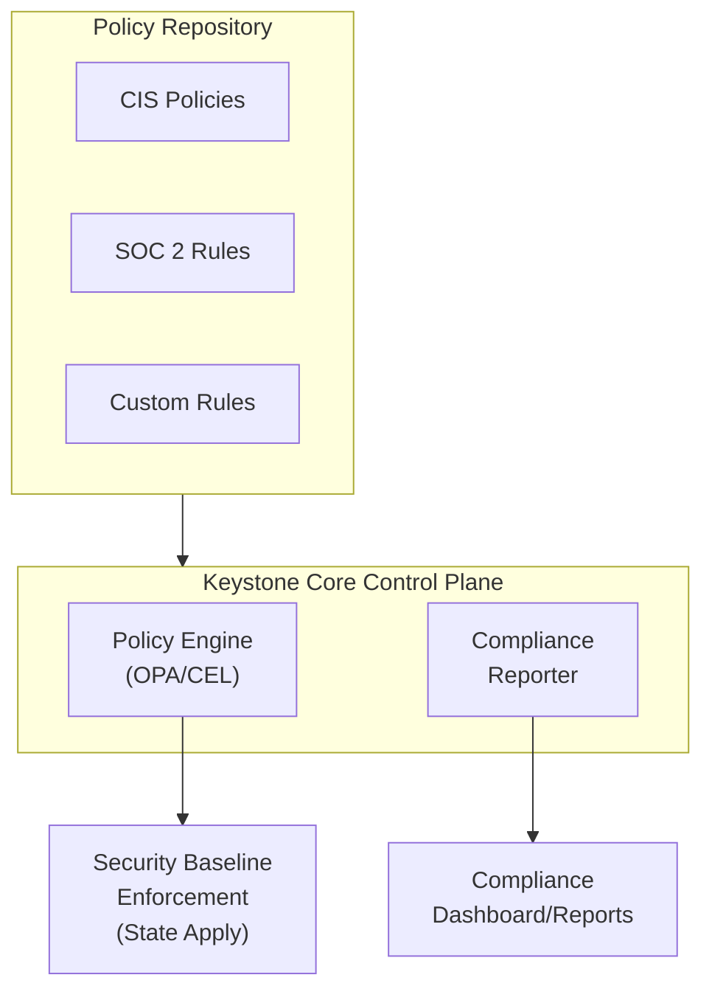

## Overview

This scenario implements automated compliance management:

- **Security Baselines**: Enforce CIS benchmarks and custom standards
- **Policy Enforcement**: Use OPA/CEL policies to prevent misconfigurations
- **Continuous Auditing**: Real-time compliance monitoring
- **Reporting**: Generate audit-ready compliance reports

### Business Context

Organizations need to:

- Meet regulatory requirements (SOC 2, PCI-DSS, HIPAA, FedRAMP)
- Pass security audits with minimal effort
- Prevent compliance drift
- Provide evidence for auditors

## Architecture



## Implementation

### Step 1: CIS Benchmark Policies

Create OPA policies for CIS Linux benchmarks:

```rego
# policies/cis/linux-level1.rego
package cis.linux.level1

import future.keywords.in

# 1.1.1.1 - Ensure mounting of cramfs filesystems is disabled
deny[msg] {
    input.type == "kernel_module"
    input.name == "cramfs"
    not input.disabled
    msg := {
        "id": "CIS-1.1.1.1",
        "severity": "medium",
        "message": "cramfs kernel module must be disabled",
        "remediation": "Add 'install cramfs /bin/true' to /etc/modprobe.d/"
    }
}

# 1.4.1 - Ensure permissions on bootloader config are configured
deny[msg] {
    input.type == "file"
    input.path == "/boot/grub/grub.cfg"
    input.mode != "0600"
    msg := {
        "id": "CIS-1.4.1",
        "severity": "high",
        "message": sprintf("Bootloader config has incorrect permissions: %s (should be 0600)", [input.mode]),
        "remediation": "Run: chmod 600 /boot/grub/grub.cfg"
    }
}

# 5.2.1 - Ensure permissions on /etc/ssh/sshd_config are configured
deny[msg] {
    input.type == "file"
    input.path == "/etc/ssh/sshd_config"
    not valid_ssh_permissions(input)
    msg := {
        "id": "CIS-5.2.1",
        "severity": "high",
        "message": sprintf("SSH config has incorrect permissions: owner=%s, mode=%s", [input.owner, input.mode]),
        "remediation": "Run: chown root:root /etc/ssh/sshd_config && chmod 600 /etc/ssh/sshd_config"
    }
}

valid_ssh_permissions(file) {
    file.owner == "root"
    file.group == "root"
    file.mode == "0600"
}

# 5.2.2 - Ensure SSH Protocol is set to 2
deny[msg] {
    input.type == "ssh_config"
    not input.protocol == 2
    msg := {
        "id": "CIS-5.2.2",
        "severity": "critical",
        "message": "SSH Protocol must be set to 2",
        "remediation": "Set 'Protocol 2' in /etc/ssh/sshd_config"
    }
}

# 5.2.5 - Ensure SSH MaxAuthTries is set to 4 or less
deny[msg] {
    input.type == "ssh_config"
    input.max_auth_tries > 4
    msg := {
        "id": "CIS-5.2.5",
        "severity": "medium",
        "message": sprintf("SSH MaxAuthTries is %d (should be 4 or less)", [input.max_auth_tries]),
        "remediation": "Set 'MaxAuthTries 4' in /etc/ssh/sshd_config"
    }
}

# 5.2.8 - Ensure SSH root login is disabled
deny[msg] {
    input.type == "ssh_config"
    input.permit_root_login != "no"
    msg := {
        "id": "CIS-5.2.8",
        "severity": "critical",
        "message": "SSH PermitRootLogin must be set to 'no'",
        "remediation": "Set 'PermitRootLogin no' in /etc/ssh/sshd_config"
    }
}

# 5.4.1.1 - Ensure password expiration is 365 days or less
deny[msg] {
    input.type == "login_defs"
    input.pass_max_days > 365
    msg := {
        "id": "CIS-5.4.1.1",
        "severity": "medium",
        "message": sprintf("Password expiration is %d days (should be 365 or less)", [input.pass_max_days]),
        "remediation": "Set PASS_MAX_DAYS 365 in /etc/login.defs"
    }
}
```

### Step 2: Security Baseline State

Create a security baseline state that remediates CIS violations:

```yaml
# states/security/cis-baseline.yaml
metadata:
  name: cis-level1-baseline
  description: CIS Level 1 security baseline for Linux
  compliance:
    - CIS Linux Benchmark v1.0.0 Level 1

# 1.1.1 - Disable unused filesystems
kernel_module_cramfs:
  module: kernel_module
  state: disabled
  name: cramfs
  cis_id: "CIS-1.1.1.1"

kernel_module_freevxfs:
  module: kernel_module
  state: disabled
  name: freevxfs
  cis_id: "CIS-1.1.1.2"

kernel_module_jffs2:
  module: kernel_module
  state: disabled
  name: jffs2
  cis_id: "CIS-1.1.1.3"

kernel_module_hfs:
  module: kernel_module
  state: disabled
  name: hfs
  cis_id: "CIS-1.1.1.4"

kernel_module_hfsplus:
  module: kernel_module
  state: disabled
  name: hfsplus
  cis_id: "CIS-1.1.1.5"

kernel_module_udf:
  module: kernel_module
  state: disabled
  name: udf
  cis_id: "CIS-1.1.1.6"

# 1.4.1 - Bootloader permissions
grub_config_permissions:
  module: file
  state: present
  path: /boot/grub/grub.cfg
  owner: root
  group: root
  mode: "0600"
  cis_id: "CIS-1.4.1"

# 1.5.1 - Ensure core dumps are restricted
core_dumps_sysctl:
  module: sysctl
  state: present
  name: fs.suid_dumpable
  value: 0
  cis_id: "CIS-1.5.1"

core_dumps_limits:
  module: file
  state: present
  path: /etc/security/limits.d/core.conf
  contents: "* hard core 0"
  cis_id: "CIS-1.5.1"

# 3.1.1 - Ensure IP forwarding is disabled
ipv4_forwarding:
  module: sysctl
  state: present
  name: net.ipv4.ip_forward
  value: 0
  cis_id: "CIS-3.1.1"

ipv6_forwarding:
  module: sysctl
  state: present
  name: net.ipv6.conf.all.forwarding
  value: 0
  cis_id: "CIS-3.1.1"

# 3.2.1 - Ensure source routed packets are not accepted
source_route_ipv4:
  module: sysctl
  state: present
  name: net.ipv4.conf.all.accept_source_route
  value: 0
  cis_id: "CIS-3.2.1"

source_route_ipv6:
  module: sysctl
  state: present
  name: net.ipv6.conf.all.accept_source_route
  value: 0
  cis_id: "CIS-3.2.1"

# 3.2.2 - Ensure ICMP redirects are not accepted
icmp_redirects_ipv4:
  module: sysctl
  state: present
  name: net.ipv4.conf.all.accept_redirects
  value: 0
  cis_id: "CIS-3.2.2"

icmp_redirects_ipv6:
  module: sysctl
  state: present
  name: net.ipv6.conf.all.accept_redirects
  value: 0
  cis_id: "CIS-3.2.2"

# 5.2 - SSH Server Configuration
sshd_config:
  module: file
  state: present
  path: /etc/ssh/sshd_config
  owner: root
  group: root
  mode: "0600"
  contents: |
    # CIS Benchmark Compliant SSH Configuration
    Protocol 2
    LogLevel VERBOSE
    X11Forwarding no
    MaxAuthTries 4
    IgnoreRhosts yes
    HostbasedAuthentication no
    PermitRootLogin no
    PermitEmptyPasswords no
    PermitUserEnvironment no
    Ciphers aes256-ctr,aes192-ctr,aes128-ctr
    MACs hmac-sha2-512,hmac-sha2-256
    KexAlgorithms ecdh-sha2-nistp256,ecdh-sha2-nistp384,ecdh-sha2-nistp521,diffie-hellman-group14-sha1,diffie-hellman-group-exchange-sha256
    ClientAliveInterval 300
    ClientAliveCountMax 0
    LoginGraceTime 60
    Banner /etc/issue.net
    AllowTcpForwarding no
    MaxStartups 10:30:60
    MaxSessions 4
  cis_id: "CIS-5.2.*"

sshd_service:
  module: service
  state: running
  name: sshd
  enable: true
  reload: true
  watch:
    - sshd_config

# 5.3 - PAM Configuration
password_quality:
  module: file
  state: present
  path: /etc/security/pwquality.conf
  contents: |
    # CIS Password Quality Requirements
    minlen = 14
    dcredit = -1
    ucredit = -1
    ocredit = -1
    lcredit = -1
  cis_id: "CIS-5.3.1"

# 5.4 - User Accounts and Environment
login_defs:
  module: file
  state: present
  path: /etc/login.defs
  template: login.defs.tmpl
  vars:
    pass_max_days: 365
    pass_min_days: 7
    pass_warn_age: 7
  cis_id: "CIS-5.4.*"

# 6.1 - System File Permissions
etc_passwd_permissions:
  module: file
  state: present
  path: /etc/passwd
  owner: root
  group: root
  mode: "0644"
  cis_id: "CIS-6.1.2"

etc_shadow_permissions:
  module: file
  state: present
  path: /etc/shadow
  owner: root
  group: shadow
  mode: "0640"
  cis_id: "CIS-6.1.3"

etc_group_permissions:
  module: file
  state: present
  path: /etc/group
  owner: root
  group: root
  mode: "0644"
  cis_id: "CIS-6.1.4"
```

### Step 3: Compliance Audit Policy

Create a policy for continuous compliance auditing:

```yaml
# config/compliance-audit.yaml
compliance:
  frameworks:
    - name: cis-level1
      policies:
        - policies/cis/linux-level1.rego
      schedule: "0 */4 * * *"  # Every 4 hours

    - name: soc2
      policies:
        - policies/soc2/access-control.rego
        - policies/soc2/monitoring.rego
        - policies/soc2/encryption.rego
      schedule: "0 0 * * *"  # Daily

    - name: pci-dss
      policies:
        - policies/pci/network-segmentation.rego
        - policies/pci/encryption.rego
        - policies/pci/access-control.rego
      schedule: "0 0 * * *"  # Daily

  reporting:
    format: json
    output:
      - type: file
        path: /var/log/keystone-core/compliance/
        retention: 90d
      - type: webhook
        url: https://compliance-dashboard.example.com/api/reports
      - type: s3
        bucket: compliance-reports
        prefix: kscore/

  alerts:
    - name: critical-violations
      condition: "violation.severity == 'critical'"
      actions:
        - type: pagerduty
          integration_key: ${PD_KEY}
        - type: slack
          channel: "#security-alerts"

    - name: high-violations
      condition: "violation.severity == 'high'"
      actions:
        - type: slack
          channel: "#compliance"
```

### Step 4: Compliance Reactor

Create a reactor to auto-remediate violations:

```yaml
# reactors/compliance-remediation.yaml
metadata:
  name: compliance-auto-remediation
  description: Automatically remediate compliance violations

trigger:
  event_type: compliance.violation
  filter: |
    event.data.severity in ["critical", "high"] &&
    event.data.auto_remediate == true

actions:
  - name: remediate
    type: state_apply
    state: states/security/cis-baseline.yaml
    target: "{{ .event.data.agent_id }}"
    only_states:
      - "{{ .event.data.remediation_state }}"

  - name: re_evaluate
    type: command
    wait: 60s
    target: "role:control-plane"
    command: |
      kscorectl policy eval \
        {{ .event.data.framework }} \
        {{ .event.data.agent_id }}

  - name: notify_success
    type: event
    condition: "actions.re_evaluate.violations == 0"
    event:
      type: compliance.remediated
      data:
        violation_id: "{{ .event.data.id }}"
        agent_id: "{{ .event.data.agent_id }}"

  - name: notify_failure
    type: slack
    condition: "actions.re_evaluate.violations > 0"
    channel: "#compliance"
    message: |
      :warning: Auto-remediation failed for {{ .event.data.id }}
      Agent: {{ .event.data.agent_id }}
      Violation: {{ .event.data.message }}
      Manual intervention required.
```

### Step 5: Compliance Report Generation

```bash
# Generate compliance report for CIS framework
kscorectl policy compliance report \
  --framework cis \
  --format html \
  --output compliance-report.html

# Generate SOC2 compliance report as JSON
kscorectl policy compliance report \
  --framework soc2 \
  --format json \
  --output compliance-report.json
```

### Step 6: Compliance Dashboard Integration

```yaml
# states/compliance/dashboard.yaml
grafana_dashboard:
  module: file
  state: present
  path: /var/lib/grafana/dashboards/compliance.json
  template: compliance-dashboard.json.tmpl
  vars:
    refresh_interval: "5m"
    frameworks:
      - cis-level1
      - soc2
      - pci-dss

prometheus_alerts:
  module: file
  state: present
  path: /etc/prometheus/rules/compliance.yml
  contents: |
    groups:
      - name: compliance
        rules:
          - alert: CriticalComplianceViolation
            expr: kscore_compliance_violations{severity="critical"} > 0
            for: 5m
            labels:
              severity: critical
            annotations:
              summary: "Critical compliance violation detected"
              description: "{{ $labels.framework }}: {{ $labels.rule_id }}"

          - alert: ComplianceScoreDrop
            expr: |
              (kscore_compliance_score - kscore_compliance_score offset 1h)
              / kscore_compliance_score offset 1h < -0.05
            for: 15m
            labels:
              severity: warning
            annotations:
              summary: "Compliance score dropped more than 5%"
```

## Usage Examples

### Run Compliance Scan

```bash
# Evaluate CIS baseline policy against production servers
kscorectl policy eval cis-level1-baseline "environment:production"

# Output:
# Evaluating policy 'cis-level1-baseline' against target 'environment:production'
#
# RULE                                RESULT   DETAILS
# --------------------------------------------------------------------------------
# no-privileged-containers            PASS     No privileged containers found
# ssh-root-login-disabled             FAIL     Container 'web-01' permits root login
# password-expiration                 FAIL     12 agents exceed 365-day limit
# source-routed-packets               PASS     All agents compliant
#
# Result: FAIL (2/4 rules passed, 2 failed)

# View current violations
kscorectl policy violations --limit 50
```

### Apply Security Baseline

```bash
# Preview changes
kscorectl state apply states/security/cis-baseline.yaml \
  --target "environment:production" \
  --check-only

# Apply baseline
kscorectl state apply states/security/cis-baseline.yaml \
  --target "environment:production" \
  --batch-size 10 \
  --batch-delay 30s
```

### Generate Audit Report

```bash
# Generate SOC2 compliance report
kscorectl policy compliance report \
  --framework soc2 \
  --format json \
  --output soc2-report.json

# Generate a compliance summary for the last 30 days
kscorectl policy compliance --days 30 --output json
```

## Verification

### Check Compliance Status

```bash
# Overall compliance status
kscorectl policy compliance

# Per-framework report
kscorectl policy compliance report --framework cis

# Evaluate a specific policy against an agent
kscorectl policy eval cis-level1-baseline web-01 --verbose
```

### Verify Remediation

```bash
# Check a specific policy against an agent
kscorectl policy check policies/cis/linux-level1.yaml \
  --policy CIS-5.2.8 \
  --input-file web-01-state.json

# Output:
# Policy: CIS-5.2.8 (CIS-5.2.8)
# Type:   opa
#
# Result: ✓ ALLOWED
#
# Duration: 2.1ms
```

## Troubleshooting

### Policy Evaluation Errors

```bash
# Test policy syntax and structure
kscorectl policy test policies/cis/linux-level1.yaml \
  --test-data test-data.json

# Evaluate a policy against a target with verbose output
kscorectl policy eval cis-level1-baseline web-01 --verbose
```

### Auto-Remediation Failures

```bash
# Check recent policy violations for an agent
kscorectl policy violations --limit 50

# Check recent reactor events
kscorectl events list --type "reactor.*" --limit 100
```
