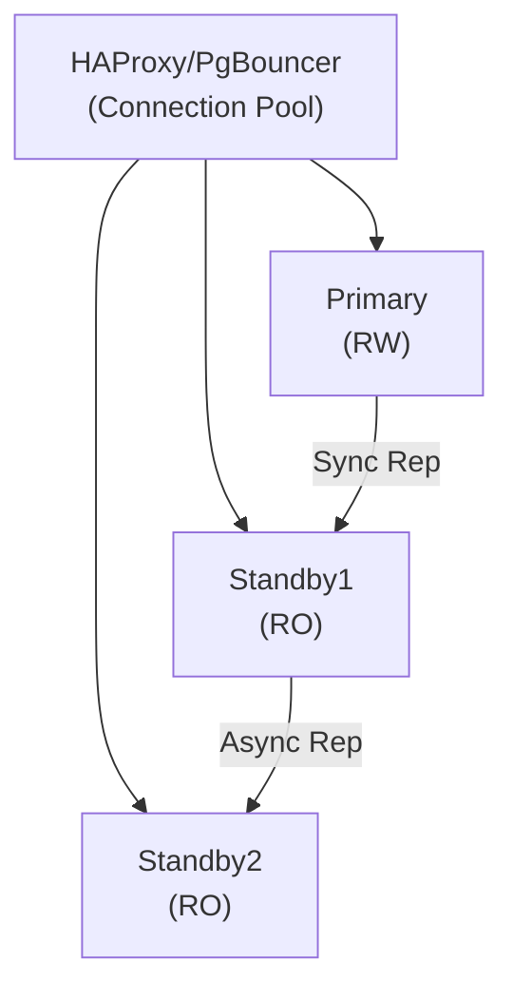

## Overview

This scenario deploys production-ready database clusters:
- **PostgreSQL HA**: Streaming replication with automatic failover
- **MySQL HA**: Group replication cluster
- **Backup & Recovery**: Automated backups with point-in-time recovery
- **Monitoring**: Database-specific metrics and alerting

## PostgreSQL HA Cluster

### Architecture



### Implementation

```yaml
# blueprints/postgresql-ha/blueprint.yaml
name: postgresql-ha
version: "1.0.0"
description: Highly available PostgreSQL cluster

parameters:
  cluster_name:
    type: string
    required: true
  pg_version:
    type: string
    default: "15"
  primary_host:
    type: string
    required: true
  standby_hosts:
    type: array
    required: true
  shared_buffers:
    type: string
    default: "256MB"
  max_connections:
    type: integer
    default: 200

states:
  # Primary configuration
  pg_primary:
    target: "hostname:{{ .parameters.primary_host }}"
    module: postgresql
    role: primary
    version: "{{ .parameters.pg_version }}"
    config:
      listen_addresses: "*"
      max_connections: "{{ .parameters.max_connections }}"
      shared_buffers: "{{ .parameters.shared_buffers }}"
      wal_level: replica
      max_wal_senders: 5
      synchronous_commit: "on"
      synchronous_standby_names: "standby1"

  # Standby configurations
  pg_standby:
    for_each: "{{ .parameters.standby_hosts }}"
    target: "hostname:{{ .each.value }}"
    module: postgresql
    role: standby
    version: "{{ .parameters.pg_version }}"
    primary_conninfo: "host={{ .parameters.primary_host }} port=5432"
    config:
      hot_standby: "on"
      max_standby_streaming_delay: "30s"

  # PgBouncer connection pooler
  pgbouncer:
    target: "role:pgbouncer"
    module: pgbouncer
    config:
      databases:
        "*": "host={{ .parameters.primary_host }} port=5432"
      pool_mode: transaction
      max_client_conn: 1000
      default_pool_size: 20

  # Patroni for automatic failover
  patroni:
    target: "role:postgresql"
    module: patroni
    cluster_name: "{{ .parameters.cluster_name }}"
    etcd_hosts: "{{ .pillar.etcd_hosts }}"
    config:
      bootstrap:
        dcs:
          ttl: 30
          loop_wait: 10
          maximum_lag_on_failover: 1048576
```

### Deploy PostgreSQL HA

```bash
# Deploy cluster
kscorectl blueprint apply postgresql-ha \
  --var cluster_name=webapp-db \
  --var primary_host=db-01 \
  --var standby_hosts='["db-02", "db-03"]' \
  --target "role:postgresql"

# Verify replication
kscorectl exec "role:postgresql and role:primary" --cmd \
  "sudo -u postgres psql -c 'SELECT client_addr, state, sync_state FROM pg_stat_replication;'"

# Test failover
kscorectl exec "role:postgresql and role:primary" --cmd \
  "patronictl switchover --master db-01 --candidate db-02"
```

## MySQL HA Cluster

### Group Replication Setup

```yaml
# blueprints/mysql-ha/blueprint.yaml
name: mysql-ha
version: "1.0.0"
description: MySQL Group Replication cluster

parameters:
  cluster_name:
    type: string
    required: true
  mysql_version:
    type: string
    default: "8.0"
  nodes:
    type: array
    required: true

states:
  mysql_install:
    for_each: "{{ .parameters.nodes }}"
    target: "hostname:{{ .each.value }}"
    module: package
    state: installed
    name: mysql-server
    version: "{{ .parameters.mysql_version }}.*"

  mysql_config:
    for_each: "{{ .parameters.nodes }}"
    target: "hostname:{{ .each.value }}"
    module: file
    state: present
    path: /etc/mysql/mysql.conf.d/group-replication.cnf
    contents: |
      [mysqld]
      server_id={{ .each.index | add 1 }}
      gtid_mode=ON
      enforce_gtid_consistency=ON
      binlog_checksum=NONE

      # Group Replication
      plugin_load_add='group_replication.so'
      group_replication_group_name="{{ .parameters.cluster_name | sha256 | slice 0 36 }}"
      group_replication_start_on_boot=OFF
      group_replication_local_address="{{ .each.value }}:33061"
      group_replication_group_seeds="{{ .parameters.nodes | join \":33061,\" }}:33061"
      group_replication_bootstrap_group=OFF
      group_replication_single_primary_mode=ON

  mysql_service:
    for_each: "{{ .parameters.nodes }}"
    target: "hostname:{{ .each.value }}"
    module: service
    state: running
    name: mysql
    enable: true
    watch:
      - mysql_config
```

## Backup Configuration

```yaml
# states/database/backup.yaml
pg_backup_script:
  module: file
  state: present
  path: /opt/scripts/pg-backup.sh
  mode: "0755"
  contents: |
    #!/bin/bash
    set -euo pipefail

    BACKUP_DIR="/var/backups/postgresql"
    S3_BUCKET="{{ .pillar.backup_bucket }}"
    TIMESTAMP=$(date +%Y%m%d-%H%M%S)

    # Base backup
    pg_basebackup -D ${BACKUP_DIR}/base-${TIMESTAMP} \
      -Ft -z -Xs -P \
      -U replicator

    # Upload to S3
    aws s3 cp ${BACKUP_DIR}/base-${TIMESTAMP} \
      s3://${S3_BUCKET}/postgresql/base-${TIMESTAMP}/ \
      --recursive --sse aws:kms

    # WAL archiving handled separately via archive_command

pg_wal_archive:
  module: file
  state: present
  path: /opt/scripts/wal-archive.sh
  mode: "0755"
  contents: |
    #!/bin/bash
    aws s3 cp $1 s3://{{ .pillar.backup_bucket }}/postgresql/wal/$2 --sse aws:kms
```

## Monitoring & Alerting

```yaml
# Prometheus alerts for database clusters
prometheus_db_alerts:
  module: file
  state: present
  path: /etc/prometheus/rules/database.yml
  contents: |
    groups:
      - name: postgresql
        rules:
          - alert: PostgreSQLReplicationLag
            expr: pg_replication_lag_seconds > 30
            for: 5m
            labels:
              severity: warning
            annotations:
              summary: "Replication lag on {{ $labels.instance }}"

          - alert: PostgreSQLDown
            expr: pg_up == 0
            for: 1m
            labels:
              severity: critical
            annotations:
              summary: "PostgreSQL down on {{ $labels.instance }}"

          - alert: PostgreSQLConnectionsHigh
            expr: pg_stat_activity_count / pg_settings_max_connections > 0.8
            for: 5m
            labels:
              severity: warning
            annotations:
              summary: "High connection usage on {{ $labels.instance }}"
```

## Verification

```bash
# Check cluster health
kscorectl exec "role:postgresql" --cmd "patronictl list"

# Check replication status
kscorectl exec "hostname:db-01" --cmd \
  "sudo -u postgres psql -c 'SELECT * FROM pg_stat_replication;'"

# Test failover
kscorectl exec "role:postgresql" --cmd \
  "patronictl switchover --master db-01 --candidate db-02 --force"
```
