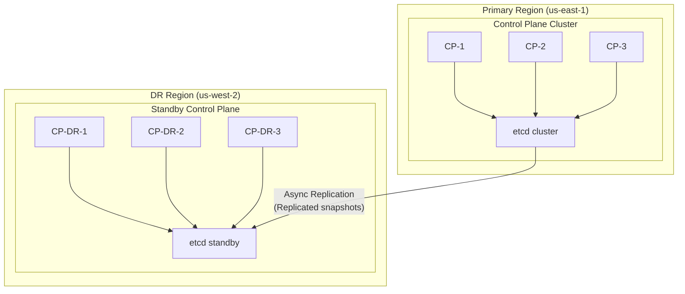

## Overview

This scenario implements comprehensive disaster recovery:
- **Backup Strategy**: Automated backups of configuration and state
- **Recovery Procedures**: Step-by-step recovery runbooks
- **Failover Testing**: Regular DR drills
- **Cross-Region Replication**: Multi-site redundancy

### Business Context

Disaster recovery ensures:
- Business continuity during outages
- Compliance with data retention requirements
- Reduced recovery time objective (RTO)
- Reduced recovery point objective (RPO)

## Architecture



## Implementation

### Step 1: Backup Configuration

```yaml
# config/backup.yaml
backup:
  schedule: "0 */6 * * *"  # Every 6 hours
  retention:
    daily: 7
    weekly: 4
    monthly: 12

  targets:
    - name: etcd
      type: etcd_snapshot
      destination:
        type: s3
        bucket: kscore-backups
        prefix: etcd/
        region: us-east-1
      encryption:
        enabled: true
        kms_key_id: alias/kscore-cluster-backup

    - name: state-files
      type: files
      paths:
        - /var/lib/keystone-core/states/
        - /etc/keystone-core/
      destination:
        type: s3
        bucket: kscore-backups
        prefix: config/
        region: us-east-1

    - name: secrets
      type: vault_export
      vault_path: secret/kscore/
      destination:
        type: s3
        bucket: kscore-backups
        prefix: secrets/
        region: us-east-1
      encryption:
        enabled: true
        kms_key_id: alias/kscore-cluster-backup

  replication:
    enabled: true
    destination_region: us-west-2
    destination_bucket: kscore-backups-dr
```

### Step 2: Backup State File

```yaml
# states/backup/automated-backup.yaml
etcd_backup_script:
  module: file
  state: present
  path: /opt/kscore/scripts/backup-etcd.sh
  mode: "0755"
  contents: |
    #!/bin/bash
    set -euo pipefail

    TIMESTAMP=$(date +%Y%m%d-%H%M%S)
    BACKUP_DIR="/var/lib/keystone-core/backups/etcd"
    S3_BUCKET="{{ .pillar.backup_bucket }}"
    S3_PREFIX="etcd"

    # Create backup directory
    mkdir -p ${BACKUP_DIR}

    # Create etcd snapshot
    etcdctl snapshot save ${BACKUP_DIR}/snapshot-${TIMESTAMP}.db \
      --endpoints={{ .pillar.etcd_endpoints }} \
      --cacert=/etc/keystone-core/pki/etcd/ca.crt \
      --cert=/etc/keystone-core/pki/etcd/server.crt \
      --key=/etc/keystone-core/pki/etcd/server.key

    # Verify snapshot
    etcdctl snapshot status ${BACKUP_DIR}/snapshot-${TIMESTAMP}.db

    # Compress
    gzip ${BACKUP_DIR}/snapshot-${TIMESTAMP}.db

    # Upload to S3
    aws s3 cp ${BACKUP_DIR}/snapshot-${TIMESTAMP}.db.gz \
      s3://${S3_BUCKET}/${S3_PREFIX}/snapshot-${TIMESTAMP}.db.gz \
      --sse aws:kms \
      --sse-kms-key-id {{ .pillar.kms_key_id }}

    # Clean up local backups older than 24 hours
    find ${BACKUP_DIR} -name "snapshot-*.db.gz" -mtime +1 -delete

    # Clean up old S3 backups (keep 7 days)
    aws s3 ls s3://${S3_BUCKET}/${S3_PREFIX}/ | \
      while read -r line; do
        create_date=$(echo $line | awk '{print $1}')
        if [[ $(date -d "$create_date" +%s) -lt $(date -d "7 days ago" +%s) ]]; then
          file_name=$(echo $line | awk '{print $4}')
          aws s3 rm s3://${S3_BUCKET}/${S3_PREFIX}/${file_name}
        fi
      done

    echo "Backup completed: snapshot-${TIMESTAMP}.db.gz"

backup_cron:
  module: cron
  state: present
  name: kscore-etcd-backup
  user: root
  minute: "0"
  hour: "*/6"
  job: /opt/kscore/scripts/backup-etcd.sh >> /var/log/keystone-core/backup.log 2>&1

config_backup_script:
  module: file
  state: present
  path: /opt/kscore/scripts/backup-config.sh
  mode: "0755"
  contents: |
    #!/bin/bash
    set -euo pipefail

    TIMESTAMP=$(date +%Y%m%d-%H%M%S)
    BACKUP_DIR="/var/lib/keystone-core/backups/config"
    S3_BUCKET="{{ .pillar.backup_bucket }}"

    mkdir -p ${BACKUP_DIR}

    # Create config archive
    tar -czf ${BACKUP_DIR}/config-${TIMESTAMP}.tar.gz \
      /etc/keystone-core/ \
      /var/lib/keystone-core/states/ \
      --exclude='*.key' \
      --exclude='*.pem'

    # Upload to S3
    aws s3 cp ${BACKUP_DIR}/config-${TIMESTAMP}.tar.gz \
      s3://${S3_BUCKET}/config/config-${TIMESTAMP}.tar.gz \
      --sse aws:kms \
      --sse-kms-key-id {{ .pillar.kms_key_id }}

    # Clean up
    find ${BACKUP_DIR} -name "config-*.tar.gz" -mtime +1 -delete

config_backup_cron:
  module: cron
  state: present
  name: kscore-config-backup
  user: root
  minute: "0"
  hour: "*/6"
  job: /opt/kscore/scripts/backup-config.sh >> /var/log/keystone-core/backup.log 2>&1
```

### Step 3: Recovery Runbook

```yaml
# runbooks/disaster-recovery.yaml
runbook:
  name: disaster-recovery
  version: "1.0"
  last_tested: "2024-01-15"
  rto_target: "4 hours"
  rpo_target: "6 hours"

  prerequisites:
    - Access to AWS console with appropriate permissions
    - SSH access to DR region instances
    - Backup encryption keys available
    - DNS management access

  scenarios:
    - name: complete-region-failure
      description: Primary region is completely unavailable
      steps:
        - name: assess-situation
          description: Verify primary region is actually down
          commands:
            - "aws ec2 describe-instance-status --region us-east-1 --filters Name=instance-state-name,Values=running"
            - "curl -s --max-time 30 https://cp.us-east-1.example.com/health || echo 'Unreachable'"
          expected_duration: "5 minutes"

        - name: activate-dr-region
          description: Bring up DR control plane
          commands:
            - "aws autoscaling set-desired-capacity --auto-scaling-group-name kscore-cp-dr --desired-capacity 3 --region us-west-2"
          expected_duration: "10 minutes"

        - name: restore-etcd-from-backup
          description: Restore etcd from latest S3 backup
          commands:
            - |
              # Find latest backup
              LATEST=$(aws s3 ls s3://kscore-backups-dr/etcd/ --region us-west-2 | sort | tail -1 | awk '{print $4}')

              # Download
              aws s3 cp s3://kscore-backups-dr/etcd/${LATEST} /tmp/snapshot.db.gz --region us-west-2

              # Decompress
              gunzip /tmp/snapshot.db.gz

              # Restore to each etcd node
              for node in cp-dr-1 cp-dr-2 cp-dr-3; do
                ssh ${node} 'etcdctl snapshot restore /tmp/snapshot.db --data-dir=/var/lib/etcd-restored'
              done
          expected_duration: "15 minutes"

        - name: update-dns
          description: Point DNS to DR region
          commands:
            - |
              aws route53 change-resource-record-sets --hosted-zone-id Z123456 --change-batch '{
                "Changes": [{
                  "Action": "UPSERT",
                  "ResourceRecordSet": {
                    "Name": "api.kscore.example.com",
                    "Type": "A",
                    "AliasTarget": {
                      "HostedZoneId": "Z654321",
                      "DNSName": "alb-dr.us-west-2.elb.amazonaws.com",
                      "EvaluateTargetHealth": true
                    }
                  }
                }]
              }'
          expected_duration: "5 minutes"

        - name: verify-connectivity
          description: Verify agents can connect
          commands:
            - "kscorectl cluster status"
            - "kscorectl agents list --limit 10"
          expected_duration: "10 minutes"

        - name: notify-stakeholders
          description: Send notification of failover
          commands:
            - |
              kscorectl event emit dr.failover.completed \
                --data region=us-west-2 \
                --data reason="Primary region failure" \
                --data timestamp="$(date -u +%Y-%m-%dT%H:%M:%SZ)"
          expected_duration: "2 minutes"

    - name: data-corruption
      description: etcd data corruption requiring restore from backup
      steps:
        - name: identify-corruption
          description: Diagnose etcd health issues
          commands:
            - "etcdctl endpoint health --cluster"
            - "etcdctl endpoint status --cluster"

        - name: take-snapshot
          description: Take snapshot of current (corrupted) state for analysis
          commands:
            - "etcdctl snapshot save /tmp/corrupted-snapshot.db"

        - name: stop-control-plane
          description: Stop control plane services
          commands:
            - "systemctl stop kscore-server"
            - "systemctl stop etcd"

        - name: restore-from-backup
          description: Restore from last known good backup
          commands:
            - |
              # List available backups
              aws s3 ls s3://kscore-backups/etcd/ | sort

              # Choose and download appropriate backup
              aws s3 cp s3://kscore-backups/etcd/snapshot-YYYYMMDD-HHMMSS.db.gz /tmp/

              # Restore
              etcdctl snapshot restore /tmp/snapshot.db --data-dir=/var/lib/etcd

        - name: start-services
          description: Start services and verify
          commands:
            - "systemctl start etcd"
            - "sleep 30"
            - "etcdctl endpoint health --cluster"
            - "systemctl start kscore-server"
```

### Step 4: DR Testing Reactor

```yaml
# reactors/dr-testing.yaml
metadata:
  name: dr-testing
  description: Automated DR drill execution

trigger:
  schedule: "0 2 1 * *"  # First day of each month at 2 AM
  timezone: UTC

actions:
  - name: pre_check
    type: command
    target: "role:control-plane"
    command: |
      # Verify DR region is ready
      aws ec2 describe-instances \
        --region us-west-2 \
        --filters "Name=tag:Role,Values=kscore-cp-dr" \
        --query 'Reservations[].Instances[].State.Name'

  - name: simulate_backup_restore
    type: command
    target: "role:control-plane"
    command: |
      # Get latest backup
      LATEST=$(aws s3 ls s3://kscore-backups/etcd/ | sort | tail -1 | awk '{print $4}')

      # Download to test node
      aws s3 cp s3://kscore-backups/etcd/${LATEST} /tmp/dr-test-snapshot.db.gz

      # Verify backup integrity
      gunzip -t /tmp/dr-test-snapshot.db.gz

      # Restore to isolated test environment
      gunzip /tmp/dr-test-snapshot.db.gz
      etcdctl snapshot status /tmp/dr-test-snapshot.db

      echo "Backup verification passed"

  - name: test_dr_connectivity
    type: command
    target: "role:control-plane"
    command: |
      # Test connectivity to DR region
      curl -s --max-time 30 https://cp-dr.us-west-2.internal/health

  - name: generate_report
    type: command
    target: "role:control-plane"
    command: |
      cat > /tmp/dr-test-report.json << EOF
      {
        "test_date": "$(date -u +%Y-%m-%dT%H:%M:%SZ)",
        "backup_age_hours": $(echo "scale=2; ($(date +%s) - $(aws s3 ls s3://kscore-backups/etcd/ | sort | tail -1 | awk '{print $1" "$2}' | xargs -I {} date -d {} +%s)) / 3600" | bc),
        "dr_region_status": "healthy",
        "backup_integrity": "verified",
        "rpo_achieved": "< 6 hours",
        "estimated_rto": "< 4 hours"
      }
      EOF

      cat /tmp/dr-test-report.json

  - name: notify
    type: slack
    channel: "#dr-testing"
    message: |
      :white_check_mark: Monthly DR Test Completed

      *Date*: {{ now | date "2006-01-02" }}
      *Backup Age*: {{ .actions.generate_report.stdout | fromJSON | .backup_age_hours }} hours
      *DR Region*: {{ .actions.generate_report.stdout | fromJSON | .dr_region_status }}
      *RPO Achieved*: {{ .actions.generate_report.stdout | fromJSON | .rpo_achieved }}
      *Estimated RTO*: {{ .actions.generate_report.stdout | fromJSON | .estimated_rto }}
```

## Recovery Procedures

### Restore etcd from Backup

```bash
# 1. Stop control plane services
sudo systemctl stop kscore-server
sudo systemctl stop etcd

# 2. List available backups
aws s3 ls s3://kscore-backups/etcd/ | sort | tail -10

# 3. Download selected backup
aws s3 cp s3://kscore-backups/etcd/snapshot-20240115-060000.db.gz /tmp/

# 4. Decompress
gunzip /tmp/snapshot-20240115-060000.db.gz

# 5. Verify backup integrity
etcdctl snapshot status /tmp/snapshot-20240115-060000.db

# 6. Backup current data (just in case)
mv /var/lib/etcd /var/lib/etcd.corrupted

# 7. Restore
etcdctl snapshot restore /tmp/snapshot-20240115-060000.db \
  --data-dir=/var/lib/etcd \
  --name=etcd-1 \
  --initial-cluster=etcd-1=https://10.0.1.10:2380,etcd-2=https://10.0.1.11:2380,etcd-3=https://10.0.1.12:2380 \
  --initial-advertise-peer-urls=https://10.0.1.10:2380

# 8. Fix permissions
chown -R etcd:etcd /var/lib/etcd

# 9. Start services
sudo systemctl start etcd
sudo systemctl start kscore-server

# 10. Verify
kscorectl cluster status
```

### Region Failover

```bash
# 1. Assess primary region status
aws ec2 describe-instance-status --region us-east-1

# 2. Activate DR control plane
aws autoscaling set-desired-capacity \
  --auto-scaling-group-name kscore-cp-dr \
  --desired-capacity 3 \
  --region us-west-2

# 3. Wait for instances
aws ec2 wait instance-running \
  --instance-ids $(aws ec2 describe-instances --region us-west-2 \
    --filters "Name=tag:Role,Values=kscore-cp" \
    --query 'Reservations[].Instances[].InstanceId' --output text) \
  --region us-west-2

# 4. Restore latest etcd backup to DR region
# (Run on DR control plane node)
ssh cp-dr-1.us-west-2.internal "$(cat << 'EOF'
  LATEST=$(aws s3 ls s3://kscore-backups-dr/etcd/ | sort | tail -1 | awk '{print $4}')
  aws s3 cp s3://kscore-backups-dr/etcd/${LATEST} /tmp/snapshot.db.gz
  gunzip /tmp/snapshot.db.gz
  systemctl stop etcd
  etcdctl snapshot restore /tmp/snapshot.db --data-dir=/var/lib/etcd
  systemctl start etcd
EOF
)"

# 5. Update DNS
aws route53 change-resource-record-sets \
  --hosted-zone-id Z123456 \
  --change-batch file://dns-failover.json

# 6. Verify
kscorectl cluster status --endpoint https://cp-dr.us-west-2.example.com
```

## Verification

### Check Backup Status

```bash
# List recent backups
kscorectl backup list --last 24h

# Verify backup integrity
kscorectl backup verify --id backup-20240115-060000

# Check replication status
kscorectl backup replication-status
```

### Test Recovery

```bash
# Dry-run restore
kscorectl backup restore --id backup-20240115-060000 --dry-run

# Restore to isolated environment
kscorectl backup restore --id backup-20240115-060000 --target test-cluster
```

## Troubleshooting

### Backup Failures

```bash
# Check backup logs
tail -100 /var/log/keystone-core/backup.log

# Verify S3 permissions
aws s3 cp /tmp/test.txt s3://kscore-backups/test.txt

# Check KMS key access
aws kms describe-key --key-id alias/kscore-cluster-backup
```

### Restore Failures

```bash
# Verify etcd snapshot
etcdctl snapshot status /tmp/snapshot.db --write-out=table

# Check etcd cluster state
etcdctl endpoint health --cluster
etcdctl member list

# Verify data directory permissions
ls -la /var/lib/etcd/
```
