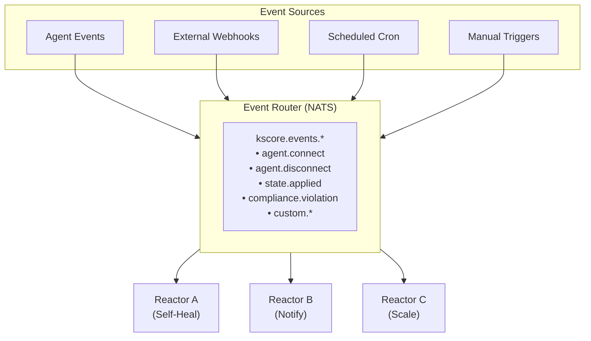

> **Note**: This scenario document describes a conceptual event-driven automation workflow.
> Many of the CLI commands shown (e.g., `kscorectl reactor`, `kscorectl events watch --filter`,
> `kscorectl compliance scan`) are planned but not yet implemented. The event system and
> reactor configurations shown are functional, but the CLI management commands are still
> in development. Use `kscorectl events emit/list/show` for basic event operations.

## Overview

This scenario demonstrates event-driven infrastructure automation:

- **Event Sources**: Agent events, external webhooks, scheduled triggers
- **Reactors**: Automated responses to events
- **Workflows**: Complex multi-step automation
- **Notifications**: Alert routing and escalation

### Business Context

Event-driven automation enables:

- Immediate response to infrastructure changes
- Self-healing infrastructure
- Automated incident response
- Reduced operational toil

## Architecture



## Implementation

### Step 1: Define Event Types

Create custom event schemas:

```yaml
# config/events/custom-events.yaml
events:
  - name: deployment.started
    schema:
      type: object
      required: [app, version, environment]
      properties:
        app:
          type: string
        version:
          type: string
        environment:
          type: string
        deployer:
          type: string
        commit_sha:
          type: string

  - name: deployment.completed
    schema:
      type: object
      required: [app, version, status]
      properties:
        app:
          type: string
        version:
          type: string
        status:
          type: string
          enum: [success, failed, rolled_back]
        duration_seconds:
          type: integer

  - name: alert.triggered
    schema:
      type: object
      required: [alert_name, severity]
      properties:
        alert_name:
          type: string
        severity:
          type: string
          enum: [critical, high, medium, low]
        source:
          type: string
        message:
          type: string
        labels:
          type: object

  - name: scale.request
    schema:
      type: object
      required: [service, direction]
      properties:
        service:
          type: string
        direction:
          type: string
          enum: [up, down]
        count:
          type: integer
          default: 1
        reason:
          type: string
```

### Step 2: Self-Healing Reactor

Create a reactor for automatic remediation:

```yaml
# reactors/self-healing.yaml
metadata:
  name: self-healing
  description: Automatically remediate common issues

# Reactor 1: Service Restart
---
metadata:
  name: service-restart
  description: Restart failed services

trigger:
  event_type: agent.service.failed
  filter: |
    event.data.restart_count < 3 &&
    event.data.service in ["nginx", "postgresql", "webapp"]

rate_limit:
  max_executions: 3
  period: 15m
  per: agent_id

actions:
  - name: restart_service
    type: command
    target: "{{ .event.data.agent_id }}"
    command: systemctl restart {{ .event.data.service }}
    timeout: 60s

  - name: wait_for_healthy
    type: command
    wait: 30s
    target: "{{ .event.data.agent_id }}"
    command: systemctl is-active {{ .event.data.service }}
    retries: 3
    retry_interval: 10s

  - name: emit_success
    type: event
    condition: "actions.wait_for_healthy.exit_code == 0"
    event:
      type: service.remediated
      data:
        agent_id: "{{ .event.data.agent_id }}"
        service: "{{ .event.data.service }}"
        action: restart

  - name: escalate
    type: pagerduty
    condition: "actions.wait_for_healthy.exit_code != 0"
    severity: high
    summary: "Service {{ .event.data.service }} failed to restart on {{ .event.data.agent_id }}"

# Reactor 2: Disk Cleanup
---
metadata:
  name: disk-cleanup
  description: Clean up disk space when threshold exceeded

trigger:
  event_type: agent.disk.threshold
  filter: "event.data.usage_percent > 85"

actions:
  - name: clean_apt_cache
    type: command
    target: "{{ .event.data.agent_id }}"
    command: apt-get clean

  - name: clean_journal
    type: command
    target: "{{ .event.data.agent_id }}"
    command: journalctl --vacuum-time=7d

  - name: clean_docker
    type: command
    target: "{{ .event.data.agent_id }}"
    condition: "event.data.has_docker == true"
    command: docker system prune -af --volumes

  - name: check_space
    type: command
    wait: 10s
    target: "{{ .event.data.agent_id }}"
    command: df -h {{ .event.data.mount_point }} | awk 'NR==2 {print $5}' | tr -d '%'

  - name: emit_result
    type: event
    event:
      type: disk.cleanup.completed
      data:
        agent_id: "{{ .event.data.agent_id }}"
        mount_point: "{{ .event.data.mount_point }}"
        before_percent: "{{ .event.data.usage_percent }}"
        after_percent: "{{ .actions.check_space.stdout }}"

# Reactor 3: Certificate Renewal
---
metadata:
  name: certificate-renewal
  description: Automatically renew expiring certificates

trigger:
  event_type: certificate.expiring
  filter: "event.data.days_until_expiry < 30"

actions:
  - name: renew_cert
    type: command
    target: "{{ .event.data.agent_id }}"
    command: certbot renew --cert-name {{ .event.data.domain }}

  - name: reload_nginx
    type: command
    condition: "actions.renew_cert.exit_code == 0 && event.data.service == 'nginx'"
    target: "{{ .event.data.agent_id }}"
    command: systemctl reload nginx

  - name: notify
    type: slack
    channel: "#ops"
    message: |
      :lock: Certificate renewed for {{ .event.data.domain }}
      Agent: {{ .event.data.agent_id }}
      New expiry: {{ .actions.renew_cert.new_expiry }}
```

### Step 3: Auto-Scaling Reactor

```yaml
# reactors/auto-scaling.yaml
metadata:
  name: auto-scaling
  description: Scale services based on metrics

trigger:
  event_type: scale.request

rate_limit:
  max_executions: 5
  period: 30m
  per: service

actions:
  - name: get_current_count
    type: command
    target: "role:control-plane"
    command: |
      kscorectl agents list \
        --filter "role:{{ .event.data.service }}" \
        --format json | jq '. | length'

  - name: calculate_target
    type: script
    language: cel
    script: |
      current = int(actions.get_current_count.stdout)
      if event.data.direction == "up"
        min(current + event.data.count, 10)  // Max 10 instances
      else
        max(current - event.data.count, 2)   // Min 2 instances

  - name: scale_up
    type: blueprint_apply
    condition: |
      event.data.direction == "up" &&
      int(actions.get_current_count.stdout) < actions.calculate_target.result
    blueprint: service-instance
    parameters:
      role: "{{ .event.data.service }}"
      count: "{{ .actions.calculate_target.result }}"
      environment: "{{ .event.data.environment }}"

  - name: scale_down
    type: command
    condition: |
      event.data.direction == "down" &&
      int(actions.get_current_count.stdout) > actions.calculate_target.result
    target: "role:control-plane"
    command: |
      # Get oldest instances to remove
      kscorectl agents list \
        --filter "role:{{ .event.data.service }}" \
        --sort created_at \
        --limit {{ sub (actions.get_current_count.stdout | int) (actions.calculate_target.result | int) }} \
        --format json | \
      jq -r '.[].id' | \
      while read agent_id; do
        kscorectl agent drain $agent_id --timeout 5m
        kscorectl agent decommission $agent_id
      done

  - name: notify
    type: slack
    channel: "#scaling"
    message: |
      :chart_with_upwards_trend: Scaled {{ .event.data.service }}
      Direction: {{ .event.data.direction }}
      Reason: {{ .event.data.reason }}
      Before: {{ .actions.get_current_count.stdout }}
      After: {{ .actions.calculate_target.result }}
```

### Step 4: Incident Response Workflow

```yaml
# reactors/incident-response.yaml
metadata:
  name: incident-response
  description: Automated incident response workflow

# High severity alert handling
trigger:
  event_type: alert.triggered
  filter: "event.data.severity in ['critical', 'high']"

actions:
  # Step 1: Create incident ticket
  - name: create_ticket
    type: webhook
    url: https://jira.example.com/rest/api/2/issue
    method: POST
    headers:
      Authorization: "Bearer {{ vault('jira/token') }}"
    body:
      fields:
        project:
          key: OPS
        summary: "[{{ .event.data.severity | upper }}] {{ .event.data.alert_name }}"
        description: |
          Alert triggered from Keystone Core

          **Source**: {{ .event.data.source }}
          **Message**: {{ .event.data.message }}
          **Time**: {{ .event.timestamp }}

          Labels:
          {{ range $k, $v := .event.data.labels }}
          - {{ $k }}: {{ $v }}
          {{ end }}
        issuetype:
          name: Incident
        priority:
          name: "{{ if eq .event.data.severity \"critical\" }}Highest{{ else }}High{{ end }}"

  # Step 2: Page on-call
  - name: page_oncall
    type: pagerduty
    condition: "event.data.severity == 'critical'"
    routing_key: "{{ vault('pagerduty/routing_key') }}"
    event_action: trigger
    dedup_key: "{{ .event.data.alert_name }}-{{ .event.data.source }}"
    payload:
      summary: "{{ .event.data.alert_name }}: {{ .event.data.message }}"
      severity: critical
      source: "{{ .event.data.source }}"
      custom_details:
        jira_ticket: "{{ .actions.create_ticket.response.key }}"

  # Step 3: Gather diagnostics
  - name: gather_diagnostics
    type: command
    target: "{{ .event.data.source }}"
    timeout: 120s
    command: |
      echo "=== System Info ==="
      uname -a
      echo ""
      echo "=== Memory ==="
      free -m
      echo ""
      echo "=== Disk ==="
      df -h
      echo ""
      echo "=== Top Processes ==="
      ps aux --sort=-%cpu | head -10
      echo ""
      echo "=== Recent Logs ==="
      journalctl -n 100 --no-pager
      echo ""
      echo "=== Network ==="
      ss -tlnp

  # Step 4: Upload diagnostics
  - name: upload_diagnostics
    type: webhook
    url: https://jira.example.com/rest/api/2/issue/{{ .actions.create_ticket.response.key }}/attachments
    method: POST
    headers:
      Authorization: "Bearer {{ vault('jira/token') }}"
      X-Atlassian-Token: no-check
    multipart:
      file:
        filename: diagnostics.txt
        content: "{{ .actions.gather_diagnostics.stdout }}"

  # Step 5: Notify Slack
  - name: notify_slack
    type: slack
    channel: "#incidents"
    blocks:
      - type: header
        text:
          type: plain_text
          text: ":rotating_light: {{ .event.data.severity | upper }} Incident"
      - type: section
        fields:
          - type: mrkdwn
            text: "*Alert:* {{ .event.data.alert_name }}"
          - type: mrkdwn
            text: "*Source:* {{ .event.data.source }}"
          - type: mrkdwn
            text: "*Ticket:* <https://jira.example.com/browse/{{ .actions.create_ticket.response.key }}|{{ .actions.create_ticket.response.key }}>"
          - type: mrkdwn
            text: "*Message:* {{ .event.data.message }}"
      - type: actions
        elements:
          - type: button
            text:
              type: plain_text
              text: View Ticket
            url: "https://jira.example.com/browse/{{ .actions.create_ticket.response.key }}"
          - type: button
            text:
              type: plain_text
              text: Acknowledge
            action_id: ack_incident
            value: "{{ .event.id }}"

  # Step 6: Attempt auto-remediation
  - name: auto_remediate
    type: reactor_invoke
    condition: |
      event.data.labels.auto_remediate == "true" &&
      event.data.labels.remediation_reactor != ""
    reactor: "{{ .event.data.labels.remediation_reactor }}"
    input:
      source_event: "{{ .event }}"
      ticket_key: "{{ .actions.create_ticket.response.key }}"
```

### Step 5: Scheduled Tasks

```yaml
# reactors/scheduled-tasks.yaml
metadata:
  name: scheduled-maintenance

# Daily maintenance window
---
trigger:
  schedule: "0 3 * * *"  # 3 AM daily
  timezone: America/New_York

actions:
  - name: run_security_scan
    type: state_apply
    state: states/security/daily-scan.yaml
    target: "environment:production"
    batch_size: 20
    batch_delay: 30s

  - name: rotate_logs
    type: command
    target: "environment:production"
    command: logrotate -f /etc/logrotate.conf

  - name: cleanup_temp
    type: command
    target: "environment:production"
    command: find /tmp -type f -mtime +7 -delete

  - name: send_report
    type: email
    to: ops@example.com
    subject: "Daily Maintenance Report - {{ now | date \"2006-01-02\" }}"
    template: maintenance-report.html.tmpl
    vars:
      security_scan: "{{ .actions.run_security_scan }}"
      log_rotation: "{{ .actions.rotate_logs }}"

# Weekly compliance check
---
trigger:
  schedule: "0 6 * * 0"  # Sunday 6 AM
  timezone: UTC

actions:
  - name: compliance_scan
    type: command
    target: "role:control-plane"
    command: |
      kscorectl compliance scan \
        --framework cis-level1,soc2 \
        --target "environment:production" \
        --format json > /tmp/compliance-report.json

  - name: generate_report
    type: command
    target: "role:control-plane"
    command: |
      kscorectl compliance report \
        --input /tmp/compliance-report.json \
        --format pdf \
        --output /reports/weekly-compliance-{{ now | date "2006-01-02" }}.pdf
```

## Usage Examples

### Emit Custom Events

```bash
# Emit deployment started event
kscorectl event emit deployment.started \
  --data app=webapp \
  --data version=1.5.0 \
  --data environment=production \
  --data deployer=ci-system

# Emit scale request
kscorectl event emit scale.request \
  --data service=webapp \
  --data direction=up \
  --data count=2 \
  --data reason="High CPU utilization"
```

### Monitor Event Stream

```bash
# Watch all events
kscorectl events watch

# Filter events
kscorectl events watch --filter "type:deployment.*"

# Output as JSON for processing
kscorectl events watch --format json | jq '.data'
```

### Manage Reactors

```bash
# List reactors
kscorectl reactors list

# View reactor status
kscorectl reactor status self-healing

# Disable reactor temporarily
kscorectl reactor disable self-healing --duration 1h --reason "Maintenance window"

# View reactor execution history
kscorectl reactor history self-healing --limit 50
```

## Verification

### Test Reactor Triggers

```bash
# Simulate event to test reactor
kscorectl reactor test self-healing \
  --event-type agent.service.failed \
  --data agent_id=web-01 \
  --data service=nginx \
  --data restart_count=0 \
  --dry-run

# Output:
# Reactor: self-healing (service-restart)
# Trigger: MATCHED
# Actions that would execute:
#   1. restart_service: systemctl restart nginx
#   2. wait_for_healthy: systemctl is-active nginx
#   3. emit_success (conditional)
```

### Check Event Flow

```bash
# View event routing
kscorectl events trace --event-id evt-abc123

# Output:
# Event: evt-abc123 (agent.service.failed)
# Received: 2024-01-15T10:30:00Z
#
# Routing:
#   → Reactor: self-healing (matched)
#   → Reactor: notification (matched)
#   → Reactor: logging (matched)
#
# Execution:
#   self-healing:
#     Status: completed
#     Duration: 45s
#     Actions: 3/3 successful
```

## Troubleshooting

### Reactor Not Triggering

```bash
# Check reactor filter
kscorectl reactor debug self-healing --filter

# Test filter against event
kscorectl policy test \
  --filter "event.data.restart_count < 3" \
  --input '{"restart_count": 2}'

# Check rate limits
kscorectl reactor rate-limit-status self-healing
```

### Event Delivery Issues

```bash
# Check event queue status
kscorectl events queue-status

# Check dead letter queue
kscorectl events dlq list

# Replay failed events
kscorectl events dlq replay --event-id evt-xyz789
```
