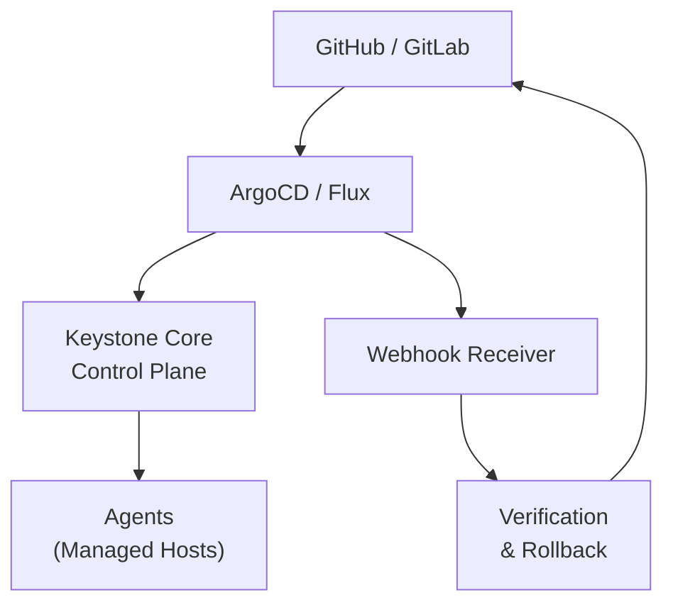

> **Note**: This scenario shows a complete GitOps workflow. The `kscore-gitops` CLI provides:
> `verify`, `rollback`, `promote`, `status`, `webhook list/test`, `repo list/add/remove/sync`,
> and `deploy list/show/rollback/approve`. Some commands shown with flags like `--deployment`
> or `--environment` may differ from the actual implementation. Run `kscorectl gitops --help`
> for current syntax.

## Overview

This scenario implements a complete GitOps workflow where:

- Infrastructure configuration lives in Git
- Changes trigger automatic deployments
- Deployments are verified before being marked complete
- Failed deployments automatically roll back

### Business Context

GitOps provides:

- **Auditability**: All changes tracked in Git history
- **Reproducibility**: Any state can be recreated from Git
- **Self-healing**: Drift automatically corrected
- **Collaboration**: Standard PR/review workflow for infrastructure

## Architecture



## Implementation

### Step 1: Repository Structure

Set up your GitOps repository:

```
infrastructure-repo/
├── environments/
│   ├── dev/
│   │   ├── apps/
│   │   │   ├── webapp.yaml
│   │   │   └── api.yaml
│   │   └── base/
│   │       ├── monitoring.yaml
│   │       └── security.yaml
│   ├── staging/
│   │   └── ...
│   └── production/
│       └── ...
├── blueprints/
│   ├── webapp/
│   │   ├── blueprint.yaml
│   │   └── templates/
│   └── api/
│       └── ...
└── policies/
    ├── security.rego
    └── compliance.rego
```

### Step 2: Configure Webhook Receiver

Enable the webhook receiver in Keystone Core. The `webhook:` section is a top-level config block in `server.yaml`:

```yaml
# /etc/keystone-core/server.yaml
webhook:
  enabled: true
  port: 8082
  path: /webhooks
  auth_type: hmac
  hmac_secret: ${WEBHOOK_SECRET}
  handlers:
    - github
    - gitlab
    - argocd
    - flux
```

> **Planned:** Repository sync scheduling (`sync:` config) and deployment verification strategies (`verification:` config) are not yet configurable via `server.yaml`. Repository management and verification are performed through the `kscorectl gitops repo` and `kscorectl gitops deploy` CLI commands respectively.

### Step 3: ArgoCD Integration

Configure ArgoCD to sync with Keystone Core:

```yaml
# argocd/application.yaml
apiVersion: argoproj.io/v1alpha1
kind: Application
metadata:
  name: infrastructure-production
  namespace: argocd
spec:
  project: default
  source:
    repoURL: git@github.com:myorg/infrastructure.git
    targetRevision: main
    path: environments/production
  destination:
    server: https://kubernetes.default.svc
    namespace: kscore
  syncPolicy:
    automated:
      prune: true
      selfHeal: true
    syncOptions:
      - CreateNamespace=true
  # Hook for Keystone Core notification
  hooks:
    - name: notify-kscore
      type: PostSync
      spec:
        containers:
          - name: notify
            image: curlimages/curl
            command:
              - curl
              - -X POST
              - -H "Authorization: Bearer ${KSCORE_TOKEN}"
              - -H "Content-Type: application/json"
              - -d '{"source": "argocd", "revision": "{{ .app.status.sync.revision }}"}'
              - https://kscore.example.com/webhooks
```

### Step 4: Flux Integration

Configure Flux for GitOps:

```yaml
# flux/gitrepository.yaml
apiVersion: source.toolkit.fluxcd.io/v1
kind: GitRepository
metadata:
  name: infrastructure
  namespace: flux-system
spec:
  interval: 1m
  url: ssh://git@github.com/myorg/infrastructure.git
  ref:
    branch: main
  secretRef:
    name: flux-ssh-credentials

---
# flux/kustomization.yaml
apiVersion: kustomize.toolkit.fluxcd.io/v1
kind: Kustomization
metadata:
  name: infrastructure-production
  namespace: flux-system
spec:
  interval: 10m
  sourceRef:
    kind: GitRepository
    name: infrastructure
  path: ./environments/production
  prune: true
  healthChecks:
    - apiVersion: apps/v1
      kind: Deployment
      name: webapp
      namespace: production
  postBuild:
    substitute:
      ENVIRONMENT: production
```

### Step 5: Deployment State File

Define your application deployment:

```yaml
# environments/production/apps/webapp.yaml
metadata:
  name: webapp-production
  version: "2024.01.15"
  gitops:
    enabled: true
    repository: infrastructure
    path: environments/production/apps/webapp.yaml
    verification:
      required: true
      timeout: 5m

variables:
  app_version: "1.5.2"
  replicas: 3
  domain: webapp.example.com

blueprint:
  webapp_deployment:
    name: webapp
    parameters:
      version: "{{ .vars.app_version }}"
      replicas: "{{ .vars.replicas }}"
      domain: "{{ .vars.domain }}"
      environment: production

verification:
  - name: http_health
    type: http
    url: "https://{{ .parameters.domain }}/health"
    expected_status: 200
    retries: 30
    interval: 10s

  - name: error_rate
    type: prometheus
    query: |
      sum(rate(http_requests_total{app="webapp",status=~"5.."}[2m]))
      /
      sum(rate(http_requests_total{app="webapp"}[2m]))
    threshold: 0.01
    comparison: "<"
    wait: 2m

  - name: latency
    type: prometheus
    query: |
      histogram_quantile(0.95,
        sum(rate(http_request_duration_seconds_bucket{app="webapp"}[2m])) by (le)
      )
    threshold: 0.5
    comparison: "<"
    wait: 2m

rollback:
  enabled: true
  automatic: true
  on_verification_failure: true
  strategy: previous
  notification:
    slack:
      channel: "#deployments"
      message: "Deployment of webapp {{ .parameters.app_version }} failed, rolling back"
```

### Step 6: Verification Reactors

Create reactors to handle deployment verification:

```yaml
# reactors/deployment-verification.yaml
metadata:
  name: deployment-verification
  description: Verify deployments and trigger rollback on failure

trigger:
  event_type: deployment.completed
  filter: "event.data.gitops == true"

actions:
  - name: run_verification
    type: command
    target: "role:control-plane"
    command: |
      kscorectl gitops verify \
        --deployment {{ .event.data.deployment_id }} \
        --timeout 10m

  - name: on_success
    type: event
    condition: "actions.run_verification.exit_code == 0"
    event:
      type: deployment.verified
      data:
        deployment_id: "{{ .event.data.deployment_id }}"
        verified_at: "{{ now }}"

  - name: on_failure
    type: command
    condition: "actions.run_verification.exit_code != 0"
    target: "role:control-plane"
    command: |
      kscorectl gitops rollback \
        --deployment {{ .event.data.deployment_id }} \
        --strategy previous \
        --reason "Verification failed: {{ .actions.run_verification.stderr }}"
```

### Step 7: Rollback Configuration

```yaml
# config/rollback-policy.yaml
rollback:
  strategies:
    previous:
      description: "Roll back to the previous successful deployment"
      action: restore_previous_state

    specific_version:
      description: "Roll back to a specific version"
      action: restore_version
      parameters:
        - name: version
          required: true

    blue_green:
      description: "Switch traffic back to previous environment"
      action: switch_traffic
      parameters:
        - name: target_color
          required: true

  triggers:
    - name: verification_failure
      condition: "verification.status == 'failed'"
      strategy: previous
      notification: true

    - name: error_rate_spike
      condition: "metrics.error_rate > 0.05"
      strategy: previous
      notification: true
      cooldown: 15m

    - name: manual
      condition: "event.type == 'rollback.requested'"
      strategy: "{{ event.data.strategy }}"
      notification: true
```

## Workflow Examples

### Standard Deployment Flow

```bash
# 1. Create a feature branch
git checkout -b feature/update-webapp-version

# 2. Update the deployment file
cat > environments/production/apps/webapp.yaml << 'EOF'
# ... (updated version)
EOF

# 3. Commit and push
git add .
git commit -m "chore: update webapp to v1.6.0"
git push origin feature/update-webapp-version

# 4. Create PR - triggers CI checks
# 5. Merge to main - triggers deployment

# 6. Monitor deployment
kscorectl gitops status --deployment webapp-production
```

### Manual Verification Check

```bash
# Check verification status
kscorectl gitops verify --deployment webapp-production --dry-run

# Output:
# Verification Steps:
#   ✓ http_health: PASSED (200 OK in 145ms)
#   ✓ error_rate: PASSED (0.001 < 0.01)
#   ✓ latency: PASSED (0.23s < 0.5s)
#
# Overall: PASSED
```

### Manual Rollback

```bash
# List deployment history
kscorectl gitops history --app webapp --environment production

# Output:
# DEPLOYMENT           VERSION    STATUS      DEPLOYED AT           VERIFIED
# webapp-2024.01.15    1.6.0      failed      2024-01-15 10:30:00   false
# webapp-2024.01.14    1.5.2      verified    2024-01-14 14:00:00   true
# webapp-2024.01.10    1.5.1      verified    2024-01-10 09:00:00   true

# Roll back to previous version
kscorectl gitops rollback \
  --deployment webapp-production \
  --to-version 1.5.2 \
  --reason "Manual rollback due to performance issues"

# Or roll back to previous state
kscorectl gitops rollback \
  --deployment webapp-production \
  --strategy previous
```

### Canary Deployment

```yaml
# environments/production/apps/webapp.yaml
deployment:
  strategy: canary
  canary:
    steps:
      - weight: 10
        pause: 5m
        verification:
          - error_rate
          - latency
      - weight: 30
        pause: 10m
        verification:
          - error_rate
          - latency
      - weight: 100

  rollback:
    on_failure: true
    threshold:
      error_rate: 0.02
      latency_p95: 1.0
```

## Verification

### Check GitOps Status

```bash
# Overall GitOps status
kscorectl gitops status

# Output:
# REPOSITORY        BRANCH   LAST SYNC          STATUS    DRIFT
# infrastructure    main     2024-01-15 10:30   synced    none

# Specific environment
kscorectl gitops status --environment production

# Output:
# APP       VERSION   DEPLOYED AT           STATUS      VERIFICATION
# webapp    1.5.2     2024-01-14 14:00:00   deployed    verified
# api       2.1.0     2024-01-13 09:00:00   deployed    verified
```

### Check Drift

```bash
# Check for configuration drift
kscorectl gitops drift --environment production

# Output:
# RESOURCE                    DRIFT DETECTED    DETAILS
# webapp/nginx.conf           yes              File modified outside GitOps
# api/config.yaml             no               -
#
# Run 'kscorectl gitops sync --environment production' to remediate drift
```

## Troubleshooting

### Webhook Not Triggering

```bash
# Check webhook receiver logs
kscorectl logs --component webhook-receiver --tail 100

# Verify webhook configuration
curl -X POST \
  -H "X-Hub-Signature-256: sha256=..." \
  -H "Content-Type: application/json" \
  -d '{"action": "ping"}' \
  https://kscore.example.com/webhooks

# Check webhook stats
kscorectl gitops webhook-stats
```

### Verification Failing

```bash
# Check verification details
kscorectl gitops verify --deployment webapp-production --verbose

# Check metrics
kscorectl exec run "role:control-plane" -- \
  curl -s "localhost:9090/api/v1/query?query=rate(http_requests_total{status=~'5..'}[5m])"
```

### Rollback Not Working

```bash
# Check rollback history
kscorectl gitops rollback-history --app webapp

# Check previous state availability
kscorectl state history --target "app:webapp" --limit 10

# Manual state restore
kscorectl state restore --id state-abc123 --target "app:webapp"
```
