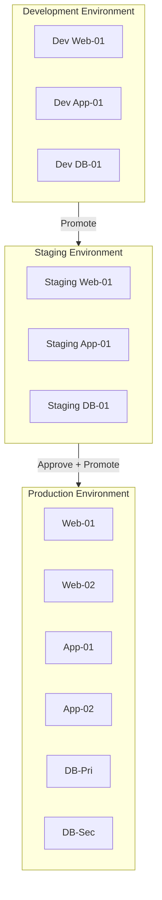

> **Note**: This scenario document describes a conceptual multi-environment workflow.
> Many of the CLI commands shown (e.g., `kscorectl environment`, `kscorectl promote`,
> `kscorectl approve`) are planned but not yet implemented. The workflows can currently
> be achieved through a combination of shell scripts, event reactors, and the
> GitOps integration (`kscorectl gitops`). See the [GitOps Workflow](../gitops-workflow/)
> scenario for currently available promotion capabilities.

## Overview

This scenario implements a multi-environment workflow:
- **Environment Isolation**: Separate configurations per environment
- **Promotion Pipelines**: Controlled promotion from dev → staging → production
- **Approval Gates**: Required approvals for production changes
- **Configuration Drift Detection**: Ensure environments stay consistent

### Business Context

Multi-environment management ensures:
- Changes are tested before production
- Audit trail for all promotions
- Rollback capability at each stage
- Compliance with change management policies

## Architecture



## Implementation

### Step 1: Environment Configuration

Define environment-specific configurations:

```yaml
# config/environments.yaml
environments:
  dev:
    display_name: Development
    short_name: dev
    auto_promote: true  # Auto-promote to staging after tests pass
    retention_days: 7
    approval_required: false
    agents:
      filter: "environment:dev"
    resources:
      scale: 1
    features:
      debug_mode: true
      mock_external_services: true

  staging:
    display_name: Staging
    short_name: stg
    auto_promote: false
    retention_days: 30
    approval_required: false
    agents:
      filter: "environment:staging"
    resources:
      scale: 1
    features:
      debug_mode: false
      mock_external_services: false
    promotion:
      requires_tests: true
      test_timeout: 30m

  production:
    display_name: Production
    short_name: prod
    auto_promote: false
    retention_days: 365
    approval_required: true
    approvers:
      - group: sre-team
      - group: release-managers
    approval_timeout: 24h
    agents:
      filter: "environment:production"
    resources:
      scale: 3
    features:
      debug_mode: false
      mock_external_services: false
    promotion:
      requires_tests: true
      requires_staging_soak: true
      soak_duration: 24h
      canary:
        enabled: true
        initial_percent: 10
        increment: 20
        interval: 15m
```

### Step 2: Environment-Specific State Files

```yaml
# states/webapp/webapp.yaml
# Base configuration - applies to all environments
metadata:
  name: webapp
  version: "1.5.0"

# Variables with environment-specific defaults loaded from vars/
variables:
  replicas: 1
  memory: 512Mi
  cpu: "0.5"
  logging_level: info
  feature_flags:
    new_checkout: false
    beta_features: false

file:
  webapp_config:
    state: present
    name: /opt/webapp/config.yaml
    contents: |
      environment: {{ .facts.environment }}
      replicas: {{ .vars.replicas }}
      resources:
        memory: {{ .vars.memory }}
        cpu: {{ .vars.cpu }}
      logging:
        level: {{ .vars.logging_level }}
      features:
        {{ range $key, $value := .vars.feature_flags }}
        {{ $key }}: {{ $value }}
        {{ end }}

container:
  webapp_deploy:
    state: running
    name: webapp
    image: "myregistry.example.com/webapp:{{ .metadata.version }}"
    replicas: "{{ .vars.replicas }}"
    resources:
      limits:
        memory: "{{ .vars.memory }}"
        cpu: "{{ .vars.cpu }}"
    env:
      - name: ENVIRONMENT
        value: "{{ .facts.environment }}"
```

### Step 3: Promotion Workflow

```yaml
# workflows/promotion.yaml
metadata:
  name: environment-promotion
  description: Promote changes between environments

workflows:
  # Dev → Staging promotion
  - name: promote-to-staging
    trigger:
      event_type: promotion.request
      filter: "event.data.target_environment == 'staging'"

    steps:
      - name: validate_source
        description: Verify dev environment is healthy
        action:
          type: command
          target: "role:control-plane"
          command: |
            kscorectl environment status --env dev --format json | \
            jq -e '.healthy == true'

      - name: run_tests
        description: Run integration tests against staging
        action:
          type: command
          target: "role:control-plane"
          command: |
            kscorectl test run \
              --suite integration \
              --target "environment:staging" \
              --timeout 30m

      - name: promote
        description: Apply configuration to staging
        condition: "steps.run_tests.status == 'success'"
        action:
          type: state_apply
          state: "{{ event.data.state_file }}"
          target: "environment:staging"
          pillar:
            version: "{{ event.data.version }}"

      - name: verify
        description: Verify staging deployment
        action:
          type: verification
          checks:
            - name: health_check
              type: http
              url: "https://staging.example.com/health"
              expected_status: 200
            - name: smoke_test
              type: command
              command: |
                curl -s https://staging.example.com/api/v1/status | \
                jq -e '.version == "{{ event.data.version }}"'

      - name: notify
        description: Notify team of promotion
        action:
          type: slack
          channel: "#deployments"
          message: |
            :rocket: Promoted to staging
            *State*: {{ event.data.state_file }}
            *Version*: {{ event.data.version }}
            *Status*: {{ steps.verify.status }}

  # Staging → Production promotion
  - name: promote-to-production
    trigger:
      event_type: promotion.request
      filter: "event.data.target_environment == 'production'"

    steps:
      - name: check_soak_time
        description: Verify staging soak period
        action:
          type: script
          language: cel
          script: |
            staging_deploy_time = getDeployTime("staging", event.data.version)
            duration.hours(24) <= (now() - staging_deploy_time)

      - name: request_approval
        description: Request production approval
        condition: "steps.check_soak_time.result == true"
        action:
          type: approval
          approvers:
            - group: sre-team
            - group: release-managers
          timeout: 24h
          message: |
            Production promotion requested for {{ event.data.state_file }}
            Version: {{ event.data.version }}
            Staging soak time: {{ steps.check_soak_time.soak_duration }}

            Please review staging metrics before approving.

      - name: run_prod_tests
        description: Run production smoke tests
        condition: "steps.request_approval.approved == true"
        action:
          type: command
          target: "role:control-plane"
          command: |
            kscorectl test run \
              --suite production-smoke \
              --target "environment:production" \
              --timeout 10m

      - name: canary_deploy
        description: Deploy to canary instances
        condition: "steps.run_prod_tests.status == 'success'"
        action:
          type: state_apply
          state: "{{ event.data.state_file }}"
          target: "environment:production and role:canary"
          pillar:
            version: "{{ event.data.version }}"

      - name: monitor_canary
        description: Monitor canary metrics
        action:
          type: monitor
          duration: 15m
          metrics:
            - name: error_rate
              query: "rate(http_requests_total{status=~'5..', canary='true'}[5m])"
              threshold: 0.01
              operator: "<"
            - name: latency_p99
              query: "histogram_quantile(0.99, rate(http_request_duration_seconds_bucket{canary='true'}[5m]))"
              threshold: 1.0
              operator: "<"

      - name: full_rollout
        description: Roll out to all production
        condition: "steps.monitor_canary.status == 'success'"
        action:
          type: state_apply
          state: "{{ event.data.state_file }}"
          target: "environment:production"
          pillar:
            version: "{{ event.data.version }}"
          batch_size: 1
          batch_delay: 5m

      - name: notify_success
        description: Notify successful deployment
        action:
          type: slack
          channel: "#deployments"
          message: |
            :white_check_mark: Production deployment complete
            *State*: {{ event.data.state_file }}
            *Version*: {{ event.data.version }}
            *Approved by*: {{ steps.request_approval.approver }}

      - name: notify_failure
        description: Notify deployment failure
        condition: "workflow.status == 'failed'"
        action:
          type: pagerduty
          severity: high
          summary: "Production promotion failed"
          details:
            state: "{{ event.data.state_file }}"
            version: "{{ event.data.version }}"
            failed_step: "{{ workflow.failed_step }}"
```

### Step 4: Drift Detection

```yaml
# reactors/drift-detection.yaml
metadata:
  name: environment-drift-detection
  description: Detect configuration drift between environments

trigger:
  schedule: "0 */4 * * *"  # Every 4 hours

actions:
  - name: collect_configs
    type: command
    target: "role:control-plane"
    command: |
      # Collect configuration from each environment
      for env in dev staging production; do
        kscorectl state export \
          --target "environment:${env}" \
          --output /tmp/state-${env}.yaml
      done

  - name: compare_staging_prod
    type: command
    target: "role:control-plane"
    command: |
      # Compare staging and production (excluding expected differences)
      kscorectl state diff \
        /tmp/state-staging.yaml \
        /tmp/state-production.yaml \
        --ignore-paths '.parameters.replicas,.parameters.resources' \
        --format json > /tmp/drift-report.json

      # Check if drift detected
      if [ $(jq '.differences | length' /tmp/drift-report.json) -gt 0 ]; then
        echo "DRIFT_DETECTED=true"
        cat /tmp/drift-report.json
        exit 1
      fi

  - name: notify_drift
    type: slack
    condition: "actions.compare_staging_prod.exit_code != 0"
    channel: "#ops"
    message: |
      :warning: Configuration drift detected between staging and production

      ```
      {{ .actions.compare_staging_prod.stdout }}
      ```

      Run `kscorectl environment sync --from staging --to production` to remediate.
```

## Usage Examples

### Promote to Staging

```bash
# Request promotion
kscorectl promote \
  --from dev \
  --to staging \
  --state states/webapp/webapp.yaml \
  --version 1.5.0

# Output:
# Promotion request created: promo-abc123
# Status: running
#
# Steps:
#   ✓ validate_source: dev environment healthy
#   ● run_tests: running integration tests...
```

### Promote to Production

```bash
# Request production promotion
kscorectl promote \
  --from staging \
  --to production \
  --state states/webapp/webapp.yaml \
  --version 1.5.0

# Output:
# Promotion request created: promo-def456
# Status: pending_approval
#
# Approval requested from: sre-team, release-managers
# Approval link: https://kscore.example.com/approvals/promo-def456
```

### Check Environment Status

```bash
# Compare environments
kscorectl environment compare --env1 staging --env2 production

# Output:
# Environment Comparison: staging vs production
#
# Configuration Differences:
#   webapp:
#     parameters.replicas: 1 -> 3
#     parameters.resources.memory: 1Gi -> 2Gi
#
# Version Differences:
#   webapp: 1.5.0 (staging) vs 1.4.2 (production)
#
# Drift Status: EXPECTED (environment-specific)
```

### Sync Environments

```bash
# Sync configuration from staging to production
kscorectl environment sync \
  --from staging \
  --to production \
  --dry-run

# Apply sync
kscorectl environment sync \
  --from staging \
  --to production \
  --approval-required
```

## Verification

### Check Promotion Status

```bash
# List recent promotions
kscorectl promote list --last 7d

# Get promotion details
kscorectl promote status promo-abc123
```

### Verify Environment Health

```bash
# Check environment health
kscorectl environment status --env production

# Output:
# Environment: production
# Status: healthy
#
# Agents:
#   Total: 15
#   Connected: 15
#   Healthy: 15
#
# Deployments:
#   webapp: v1.5.0 (deployed 2024-01-15)
#   api: v2.1.0 (deployed 2024-01-14)
#
# Last Promotion: 2024-01-15 10:30:00 (success)
```

## Troubleshooting

### Promotion Stuck in Approval

```bash
# Check pending approvals
kscorectl approve list --pending

# Check approval details
kscorectl approve status promo-def456

# Remind approvers
kscorectl approve remind promo-def456
```

### Canary Rollback

```bash
# Check canary metrics
kscorectl metrics query \
  --query "rate(http_requests_total{canary='true',status=~'5..'}[5m])" \
  --duration 30m

# Rollback canary
kscorectl rollback \
  --deployment promo-def456 \
  --target "environment:production and role:canary"
```
