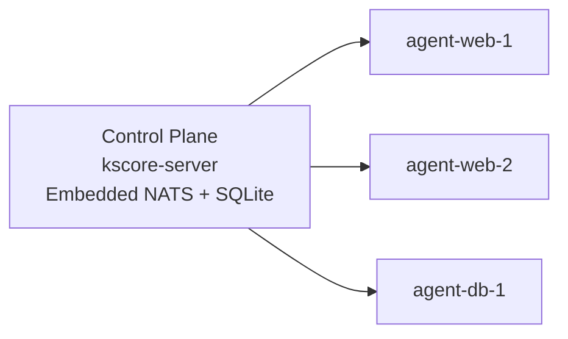
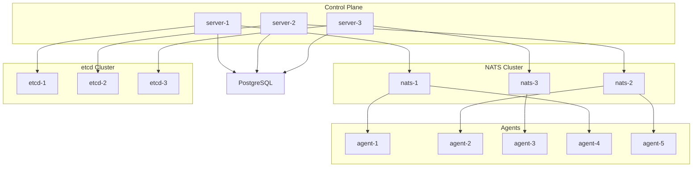

# E2E VM Testing Plan

## Summary of current E2E coverage

The existing E2E suite is container-first and assumes Docker or Podman:

- `test/e2e/containers/docker-compose.yml` runs an all-in-one topology (embedded NATS + SQLite + 3 agents).
- `test/e2e/topologies/ha-cluster/` runs an HA topology (3 control planes + 3 NATS + 3 etcd + PostgreSQL + 5 agents).
- `test/e2e/topologies/ipv6/` and `test/e2e/topologies/ha-cluster-ipv6/` validate IPv6-only and HA+IPv6.
- `test/e2e/scenarios/` validates agent lifecycle, remote exec, state ops, events, policy, GitOps webhooks.
- `test/e2e/performance/` provides scale + throughput baselines.
- `test/bootstrap/vm/` provides VM plumbing (SSH provider, config loading), but only a smoke test.

The VM plan below mirrors these topologies while replacing the container harness with VM-aware setup and health checks.

## VM topology plan

### Topology A: All-in-one (embedded NATS + SQLite)

Purpose: validate scenario tests end-to-end on real VMs.



VMs (minimum 4):

- 1x control plane (kscore-server, embedded NATS, SQLite)
- 3x agents (agent-web-1, agent-web-2, agent-db-1)

Recommended OS mix for agents:

- Ubuntu 22.04 (agent-web-1)
- Debian 12 (agent-web-2)
- Rocky 9 (agent-db-1)

### Topology B: HA cluster (external NATS + PostgreSQL + etcd)

Purpose: validate HA topology tests and clustering behavior.



VMs (full fidelity 15):

- 3x control plane nodes (server-1, server-2, server-3)
- 3x NATS nodes (nats-1, nats-2, nats-3)
- 3x etcd nodes (etcd-1, etcd-2, etcd-3)
- 1x PostgreSQL node
- 5x agents (agent-1..agent-5, OS mix below)

VMs (compact 9):

- 3x control plane nodes (co-locate NATS + etcd on control plane VMs)
- 1x PostgreSQL node
- 5x agents

Recommended OS mix for agents:

- Ubuntu 22.04, Debian 12, Rocky 9, Fedora 40, Alpine 3.20

HA failover tests expect control plane nodes to run `kscore-server` under systemd
and allow `systemctl`/`pkill` over SSH.

### Topology C: IPv6

Purpose: validate IPv6-only and HA+IPv6 paths.

VMs:

- Reuse Topology A or B VM counts, but deploy on an IPv6-only or dual-stack subnet.
- Assign static IPv6 addresses and ensure DNS/hosts entries include IPv6.

### Topology D: Performance/scale

Purpose: validate `test/e2e/performance` on VM hardware.

VMs:

- Start from Topology A or B.
- Add 10-50 additional agent VMs (same agent config, unique IDs).

## Infrastructure requirements

- SSH access to all VMs (passwordless key or dedicated test key).
- Static IPs or stable DNS names for all nodes.
- NTP enabled on all nodes (clock skew breaks cluster/agent behaviors).
- Firewall ports open:
  - gRPC/HTTP: 8080/8081 (control plane)
  - Webhook receiver: 8082 (control plane)
  - NATS: 4222 (client), 6222 (cluster), 8222 (monitoring)
  - etcd: 2379 (client), 2380 (peer)
  - PostgreSQL: 5432
- IPv6 test networks must allow inbound/outbound IPv6 on the same ports.

## Installation process (manual commands)

### Build artifacts on a control host

```
make build
```

Artifacts live under `build/bin/linux/amd64/` (or `arm64`).

### Common node setup (all nodes)

```
sudo useradd -r -s /usr/sbin/nologin kscore || true
sudo mkdir -p /etc/keystone-core /var/lib/keystone-core /var/log/keystone-core
sudo chown -R kscore:kscore /etc/keystone-core /var/lib/keystone-core /var/log/keystone-core
```

### Control plane (all-in-one)

```
scp build/bin/linux/amd64/kscore-server cp1:/usr/bin/kscore-server
scp test/e2e/containers/config/server.yaml cp1:/etc/keystone-core/server.yaml
scp deploy/systemd/kscore-server.service cp1:/etc/systemd/system/kscore-server.service
sudo systemctl daemon-reload
sudo systemctl enable --now kscore-server
```

Notes:

- Adjust `server.yaml` listen address + ports for non-localhost access.
- Keep `allowinsecurenonloopback: true` for test envs.
- Update storage paths in `server.yaml` to `/var/lib/keystone-core` (or edit the unit file to match).

### Agent nodes

```
scp build/bin/linux/amd64/kscore-agent agent1:/usr/bin/kscore-agent
scp test/e2e/containers/config/agent-web-1.yaml agent1:/etc/keystone-core/agent.yaml
scp deploy/systemd/kscore-agent.service agent1:/etc/systemd/system/kscore-agent.service
sudo systemctl daemon-reload
sudo systemctl enable --now kscore-agent
```

Notes:

- Set unique `agent.id` in each agent config (`agent-web-1`, `agent-web-2`, `agent-db-1`).
- Point agent NATS URL to control plane (embedded) or NATS cluster (HA).

### NATS cluster (HA)

```
curl -L https://github.com/nats-io/nats-server/releases/download/<VERSION>/nats-server-<VERSION>-linux-amd64.tar.gz \
  | tar -xz
sudo install -m 0755 nats-server-<VERSION>-linux-amd64/nats-server /usr/bin/nats-server
scp test/e2e/topologies/ha-cluster/config/nats.conf nats1:/etc/nats/nats.conf
sudo systemctl enable --now nats-server
```

Notes:

- Update `routes` in `nats.conf` for the real VM IPs/hostnames.
- Ensure ports 4222/6222/8222 are open between NATS nodes.
- If the package does not ship a unit file, create a minimal `nats-server.service`.

### etcd cluster (HA)

```
curl -L https://github.com/etcd-io/etcd/releases/download/v3.5.17/etcd-v3.5.17-linux-amd64.tar.gz \
  | tar -xz
sudo install -m 0755 etcd-v3.5.17-linux-amd64/etcd /usr/bin/etcd
sudo install -m 0755 etcd-v3.5.17-linux-amd64/etcdctl /usr/bin/etcdctl
sudo systemctl enable --now etcd
```

Notes:

- Use the env layout from `test/e2e/topologies/ha-cluster/docker-compose.yml`.
- Set `ETCD_INITIAL_CLUSTER` to the real VM hostnames/IPs.
- If the package does not ship a unit file, create a minimal `etcd.service`.

### PostgreSQL (HA)

```
sudo apt-get update && sudo apt-get install -y postgresql
sudo -u postgres psql -c "CREATE USER kscore WITH PASSWORD 'kscore_e2e_password';"
sudo -u postgres psql -c "CREATE DATABASE kscore OWNER kscore;"
```

Notes:

- Use the DSN in `test/e2e/topologies/ha-cluster/config/server-*.yaml`.
- Ensure `pg_hba.conf` allows the control planes to connect.
- Adjust package install commands for non-Debian distros.

## VM test execution plan

1. Extend `test/bootstrap/vm` to manage VM lifecycle and SSH actions for E2E nodes.
2. Add a VM-aware E2E harness (parallel to `test/e2e/harness`) that:
   - Reads a VM config file (similar to `test/bootstrap/vm/config.yaml`).
   - Waits for SSH/health endpoints instead of docker-compose.
   - Uses configured gRPC/HTTP endpoints.
3. Add environment controls:
   - `KSCORE_E2E_MODE=vm` to select the VM harness.
   - `KSCORE_E2E_CONFIG=...` for VM node inventory.
4. Update `test/e2e` TestMain functions to:
   - Skip docker-compose if `KSCORE_E2E_MODE=vm`.
   - Use the VM harness to connect to remote servers.
5. Run the same E2E suites against VM topologies:

```
KSCORE_E2E_TESTS=1 KSCORE_E2E_MODE=vm KSCORE_E2E_CONFIG=./test/bootstrap/vm/config.yaml \
  go test -v ./test/e2e/topology/... -run TestAllInOne
```

```
KSCORE_E2E_TESTS=1 KSCORE_E2E_MODE=vm KSCORE_E2E_CONFIG=./test/bootstrap/vm/ha-config.yaml \
  KSCORE_TOPOLOGY=ha-cluster go test -v ./test/e2e/topology/... -run HACluster
```

```
KSCORE_E2E_TESTS=1 KSCORE_E2E_MODE=vm KSCORE_E2E_CONFIG=./test/bootstrap/vm/ipv6-config.yaml \
  KSCORE_TOPOLOGY=ipv6 go test -v ./test/e2e/topology/... -run IPv6
```

## VM configuration files

Use the VM config schema in `test/bootstrap/vm/config.yaml` and create:

- `test/bootstrap/vm/allinone-config.yaml`
- `test/bootstrap/vm/ha-config.yaml`
- `test/bootstrap/vm/ipv6-config.yaml`

Each config should list VM IPs, SSH user/key, role, OS, and any service-specific endpoints.
For HA tests, ensure control plane node names match `server-1`, `server-2`, `server-3`
so failover tests can start/stop services via SSH.

## Output collection

- Capture logs from control plane + agents after each test suite.
- Persist `test/e2e/performance/baselines/*.json` from VM runs.
- Archive service logs under `/var/log/keystone-core/` and OS journal outputs.
