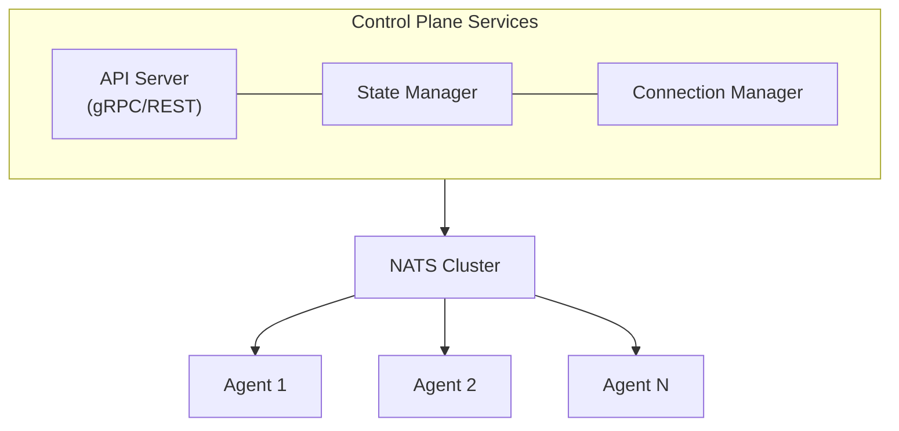

# Epic 1: Core Infrastructure

## Overview

Build the foundational infrastructure for Keystone Core including NATS message bus integration, agent architecture, control plane services, and core state management.

**Goal**: Create a robust foundation that can execute commands on distributed agents via NATS with secure authentication and basic state persistence.

## Success Criteria

- [ ] **NATS**: Can be deployed in embedded, external cluster, and hybrid modes
- [ ] **Embedded NATS mode works with zero external dependencies**
- [ ] **Agents can run with embedded NATS as leaf nodes**
- [ ] **SQLite**: Embedded state storage works with zero configuration
- [ ] **PostgreSQL**: Production state storage works with HA support
- [ ] **Migration**: SQLite → PostgreSQL migration tool works without data loss
- [ ] Agents successfully connect and maintain heartbeat with control plane
- [ ] Mutual TLS authentication between all components
- [ ] Remote command execution with response collection
- [ ] Basic state storage and retrieval (both SQLite and PostgreSQL)
- [ ] Health monitoring and auto-reconnection
- [ ] Support for 1000+ concurrent agents
- [ ] **Zero dependencies getting started**: Embedded NATS + SQLite work out of box

## Architecture Components

## User Stories

### US1.1: NATS Message Bus Setup
**As a** platform operator
**I want to** deploy NATS in various configurations
**So that** I can choose the right topology for my environment

**Acceptance Criteria**:
- **Support embedded NATS mode** (in-process with control plane/agent)
  - Zero external dependencies for initial setup
  - Automatic start/stop with parent process
  - Embedded JetStream for local persistence
  - Configuration via simple flags (--embedded-nats)
- Support connecting to external NATS cluster
- Support NATS JetStream for persistence (both embedded and external)
- Support NATS leaf nodes for edge scenarios
- Configuration via environment variables and config file
- Health checks for NATS connectivity
- Migration tooling from embedded to external cluster

### US1.2: Agent Installation and Registration
**As a** platform operator
**I want to** install lightweight agents on managed nodes
**So that** Keystone Core can execute commands on those nodes

**Acceptance Criteria**:
- Single static binary with no dependencies
- Support Linux (amd64, arm64), macOS, Windows
- Automatic registration with control plane on first start
- Support for pre-shared key or certificate-based enrollment
- Agent generates unique ID (or accepts provided ID)
- Agent reports system metadata (OS, arch, hostname, IP)

### US1.2a: Edge Agents with Embedded NATS
**As a** platform operator
**I want to** deploy agents with embedded NATS in edge/disconnected scenarios
**So that** agents can operate independently and sync when connectivity is available

**Acceptance Criteria**:
- Agents can run with embedded NATS as leaf nodes
- Local command queuing during network partitions
- Automatic sync with control plane when connectivity restored
- Local event persistence using embedded JetStream
- Minimal memory footprint for embedded mode (<50MB)
- Configuration option to enable/disable embedded mode per agent
- Support agent-to-agent communication via embedded NATS mesh

### US1.3: Secure Communication
**As a** security engineer
**I want to** ensure all communication is encrypted and authenticated
**So that** the system meets security compliance requirements

**Acceptance Criteria**:
- Mutual TLS between agents and NATS
- Certificate rotation support
- RBAC for control plane API
- Audit logging for all commands
- Encryption at rest for state data
- Support for external CA (Vault, cert-manager)

### US1.4: Agent Heartbeat and Health
**As a** platform operator
**I want to** know which agents are online and healthy
**So that** I can monitor infrastructure availability

**Acceptance Criteria**:
- Agents send heartbeat every 30s (configurable)
- Control plane tracks agent status (online, offline, stale)
- API endpoint to query agent status
- Automatic reconnection on network failure
- Configurable heartbeat timeout
- Metrics for agent connectivity

### US1.5: Command Execution Protocol
**As a** developer
**I want to** define a robust command execution protocol
**So that** commands can be reliably sent and responses collected

**Acceptance Criteria**:
- Request/response pattern over NATS
- Support for streaming output (stdout/stderr)
- Command timeout support
- Exit code and error reporting
- Concurrent execution support
- Command queuing when agent offline

### US1.6: State Storage Backend
**As a** platform operator
**I want to** persist system state reliably
**So that** configuration and history are maintained across restarts

**Acceptance Criteria**:
- **Support SQLite as embedded backend** (zero dependencies)
  - Perfect for dev, testing, home labs, small deployments
  - Single file database, easy backups (just copy the file)
  - No external dependencies or configuration
  - Suitable for <100 nodes, single server deployments
- **Support PostgreSQL for production**
  - Scalable, high availability support
  - Suitable for 100+ nodes, multi-server deployments
  - Connection pooling, replication support
- **Automated migration from SQLite → PostgreSQL**
  - Export/import tooling
  - Schema compatibility
  - Minimal downtime migration path
- Store agent metadata and status
- Store execution history
- Store configuration data
- Automatic backup and restore capability for both backends

## Technical Tasks

### Phase 1: NATS Integration (Week 1-2)

**T1.1: NATS Client Library Integration**
- Add NATS Go client dependency (`github.com/nats-io/nats.go`)
- Add NATS server library dependency (`github.com/nats-io/nats-server/v2`)
- Create NATS connection manager with mode selection
- **Implement embedded NATS mode**:
  - In-process NATS server initialization
  - Automatic port allocation or configuration
  - Embedded JetStream configuration
  - Graceful shutdown handling
  - Resource limits (memory, connections)
- Implement external cluster connection mode
- Implement connection pooling and retry logic
- Add configuration parsing for NATS settings (embedded vs. external)
- Create migration utility to export embedded NATS state to external cluster

**T1.2: NATS Security Setup**
- Implement mTLS certificate generation
- Create certificate distribution mechanism
- Add support for NATS authentication tokens
- Implement certificate rotation handler
- Add NATS credential management

**T1.3: Message Protocol Design**
- Define protobuf schemas for messages
- Implement message serialization/deserialization
- Create message routing logic
- Add message versioning support
- Document protocol specification

### Phase 2: Agent Development (Week 3-4)

**T2.1: Agent Core**
- Create agent binary structure
- Implement NATS connection handling
- Add heartbeat mechanism
- Create system metadata collection
- Implement graceful shutdown

**T2.2: Command Execution Engine**
- Create command execution handler
- Implement stdout/stderr streaming
- Add timeout and cancellation support
- Create process management (tracking, cleanup)
- Add security restrictions (user, cgroup limits)

**T2.3: Agent Configuration**
- Define agent configuration schema
- Support config file (YAML/JSON)
- Support environment variables
- Add configuration validation
- Create default configuration

**T2.4: Cross-Platform Build**
- Set up Go cross-compilation
- Create build scripts for all platforms
- Package binaries for distribution (`kscore-agent` binary name)
- Add version information to binary
- Create installation scripts
- **Note**: Binary naming uses `kscore-*` prefix for all server/daemon binaries

### Phase 3: Control Plane Services (Week 5-6)

**T3.1: API Server (part of kscore-server binary)**
- Define gRPC service definitions
- Implement gRPC server
- Add gRPC-gateway for REST API
- Create API authentication middleware
- Add request validation
- **Note**: API Server, State Manager, Connection Manager are all part of `kscore-server` binary

**T3.2: Connection Manager**
- Track connected agents
- Maintain agent registry
- Handle agent registration
- Process heartbeat messages
- Detect and handle disconnections

**T3.3: State Manager**
- Define state storage interface (database-agnostic)
- **Implement SQLite backend**:
  - Embedded database (single file)
  - Schema initialization
  - Connection management (single writer, multiple readers)
  - Write-ahead logging (WAL mode for better concurrency)
  - Automatic file-based backups
- **Implement PostgreSQL backend**:
  - Connection pooling
  - Schema migrations
  - Transaction handling
  - Replication support (read replicas)
- Add state caching layer (shared for both backends)
- **Create migration utilities**:
  - SQLite → PostgreSQL migration tool
  - Schema compatibility layer
  - Data export/import with validation

**T3.4: Command Dispatcher**
- Route commands to target agents
- Collect and aggregate responses
- Handle timeouts and failures
- Implement retry logic
- Add command history tracking

### Phase 4: Testing & Reliability (Week 7-8)

**T4.1: Unit Tests**
- Test coverage >80% for core packages
- Test message serialization
- Test connection handling
- Test command execution
- Test state operations

**T4.2: Integration Tests**
- Test agent-to-control-plane communication
- Test multi-agent scenarios
- Test network failure recovery
- Test state persistence and recovery
- Test concurrent operations

**T4.3: Performance Testing**
- Benchmark command execution latency
- Load test with 1000+ agents
- Test message throughput
- Profile memory usage
- Identify and fix bottlenecks

**T4.4: Chaos Testing**
- Test NATS server failures
- Test network partitions
- Test agent crashes and recovery
- Test control plane restarts
- Test data corruption scenarios

## Dependencies

- **External**:
  - NATS server 2.10+ (optional, can use embedded mode)
  - PostgreSQL 14+ (optional, can use SQLite)
  - Go 1.25+
  - Protocol Buffers compiler

- **Go Libraries**:
  - `github.com/nats-io/nats.go` - NATS client
  - `github.com/nats-io/nats-server/v2` - NATS server (for embedded mode)
  - `google.golang.org/grpc` - gRPC framework
  - `google.golang.org/protobuf` - Protocol buffers
  - `github.com/mattn/go-sqlite3` - SQLite driver (CGO-based)
  - `modernc.org/sqlite` - Pure Go SQLite (alternative, no CGO)
  - `github.com/lib/pq` - PostgreSQL driver
  - `github.com/spf13/cobra` - CLI framework
  - `github.com/spf13/viper` - Configuration management

## Risks & Mitigations

| Risk | Impact | Probability | Mitigation |
|------|--------|-------------|------------|
| NATS scalability limits | High | Low | Load test early, implement backpressure |
| Embedded NATS memory usage | Medium | Medium | Set resource limits, monitor metrics, document sizing |
| Embedded binary size increase | Medium | High | Optional embedded mode via build tags, separate binaries |
| Migration complexity (embedded→external) | Medium | Medium | Automated migration tooling, clear documentation |
| SQLite write concurrency | Medium | Medium | WAL mode, connection pooling, document limitations (<100 nodes) |
| SQLite → PostgreSQL migration | Medium | Medium | Automated tooling, schema compatibility, testing |
| Database backend abstraction leaks | Medium | Low | Well-defined interface, comprehensive test suite for both backends |
| Agent binary size | Medium | Medium | Use build optimizations, strip symbols |
| Cross-platform compatibility | High | Medium | Test on all platforms, use CI/CD |
| State backend performance | High | Medium | Implement caching, benchmark early (both SQLite and PostgreSQL) |
| Security vulnerabilities | Critical | Medium | Security audit, penetration testing |

## Metrics & Monitoring

### Key Metrics
- Agent connection count (gauge)
- Agent heartbeat success rate (%)
- Command execution latency (p50, p95, p99)
- Message throughput (msgs/sec)
- State operation latency (ms)
- Control plane CPU/memory usage

### Alerts
- Agent disconnect rate >10% over 5min
- Command execution failure rate >5%
- NATS connection errors
- State backend unavailable
- Control plane memory usage >80%

## Documentation Requirements

- [ ] Architecture documentation with diagrams
- [ ] **Quick Start Guide** (5 minutes, zero dependencies):
  - [ ] Install kscore-server with embedded NATS + SQLite
  - [ ] Install kscore-agent
  - [ ] Execute first remote command
- [ ] **NATS deployment guide** (all modes):
  - [ ] Embedded mode quick start (5-minute setup)
  - [ ] External cluster setup for production
  - [ ] Hybrid mode for edge deployments
  - [ ] Migration guide: embedded → external cluster
  - [ ] Performance tuning for each mode
- [ ] **State storage guide**:
  - [ ] SQLite setup (embedded, zero config)
  - [ ] PostgreSQL setup (production)
  - [ ] Migration guide: SQLite → PostgreSQL
  - [ ] Backup and restore for both backends
  - [ ] Performance tuning and optimization
- [ ] Agent installation guide (all platforms)
- [ ] Agent configuration guide:
  - [ ] Embedded NATS configuration for edge agents
  - [ ] Leaf node setup for disconnected scenarios
- [ ] API reference documentation
- [ ] Protocol specification
- [ ] Configuration reference
- [ ] Troubleshooting guide
- [ ] Security best practices

## Definition of Done

- [ ] All user stories completed and accepted
- [ ] Unit test coverage >80%
- [ ] Integration tests passing
- [ ] Performance benchmarks met (1000+ agents, <100ms latency)
- [ ] Documentation complete
- [ ] Security review completed
- [ ] Demo video created
- [ ] Ready for Phase 2 development
