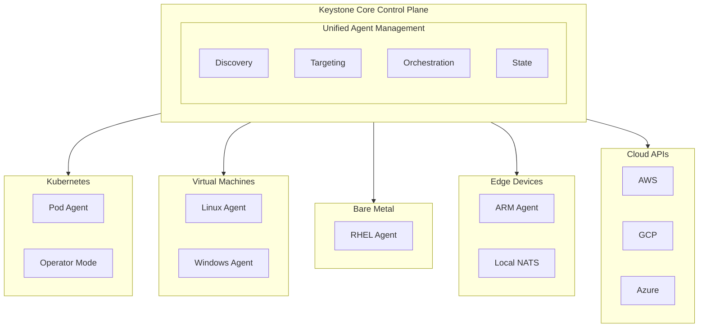

# Epic 8: Multi-Environment Support

## Overview

Implement comprehensive support for managing diverse infrastructure environments including Kubernetes clusters, virtual machines, bare metal servers, edge devices, and cloud resources through a unified control plane.

**Goal**: Enable Keystone Core to be the single operational control plane for all infrastructure types, providing consistent management regardless of the underlying platform.

## Success Criteria

- [ ] Kubernetes native integration (operator, CRDs, pod exec)
- [ ] VM management (Linux, Windows, macOS)
- [ ] Bare metal server support
- [ ] Edge device support (ARM, disconnected scenarios)
- [ ] Cloud resource management (AWS, GCP, Azure)
- [ ] Container runtime support (Docker, containerd, Podman)
- [ ] Service mesh integration (Istio, Linkerd, Consul)
- [ ] Unified targeting across all environment types
- [ ] Environment-specific optimizations
- [ ] Cross-environment orchestration

## Architecture



## User Stories

### US8.1: Kubernetes Native Integration
**As a** platform engineer
**I want to** manage Kubernetes workloads natively
**So that** I can leverage Kubernetes-specific features

**Acceptance Criteria**:
- Deploy Keystone Core as Kubernetes operator
- Define Keystone Core resources as CRDs
- Execute commands in pods (like `kubectl exec`)
- Manage Kubernetes resources (deployments, services, etc.)
- Watch Kubernetes events
- Integration with Kubernetes RBAC
- Support for multiple clusters

**Kubernetes Operator Mode**:
```yaml
# Deploy as operator
kubectl apply -f https://keystonecore.io/operator.yaml

# CRD for remote execution
apiVersion: keystonecore.io/v1
kind: RemoteExecution
metadata:
  name: restart-pods
spec:
  target:
    selector:
      matchLabels:
        app: nginx
  command: "nginx -s reload"
  schedule: "0 2 * * *"  # Daily at 2am

# CRD for state management
apiVersion: keystonecore.io/v1
kind: StateConfig
metadata:
  name: web-app-config
spec:
  target:
    selector:
      matchLabels:
        role: web
  states:
    - name: nginx-config
      module: file
      path: /etc/nginx/nginx.conf
      source: configmap://nginx-config
```

**Pod Exec Support**:
```bash
# Execute in pods directly
kscorectl exec "ls -la /app" --target "k8s:app=nginx"

# Execute in specific container
kscorectl exec "ps aux" --target "k8s:app=nginx" --container sidecar

# Execute across multiple clusters
kscorectl exec "kubectl version" --target "k8s-cluster:*"
```

### US8.2: VM Management
**As a** platform engineer
**I want to** manage virtual machines
**So that** I can operate hybrid infrastructure

**Acceptance Criteria**:
- Agent support for Linux VMs (all major distros)
- Agent support for Windows VMs
- Agent support for macOS VMs
- VM discovery and registration
- OS-specific module implementations
- Package manager support (apt, yum, dnf, zypper, chocolatey)
- Service manager support (systemd, init.d, Windows services)

**Cross-Platform Examples**:
```bash
# Install packages across different OS
kscorectl state apply webserver --target "role:web"

# State automatically adapts to OS:
# - Ubuntu: apt install nginx
# - CentOS: yum install nginx
# - Windows: choco install nginx

# Service management
kscorectl exec "restart nginx" --target "os:linux"
kscorectl exec "Restart-Service nginx" --target "os:windows" --shell powershell

# File management with platform awareness
kscorectl state apply file-config --target "all"
# Linux: /etc/nginx/nginx.conf
# Windows: C:\nginx\conf\nginx.conf
```

**OS Detection and Adaptation**:
```yaml
# states/multi-os.yaml
packages:
  nginx:
    state: installed
    platform_specific:
      linux:
        name: nginx
        package_manager: auto  # Detect apt/yum/dnf
      windows:
        name: nginx
        package_manager: chocolatey
      macos:
        name: nginx
        package_manager: brew

services:
  nginx:
    state: running
    platform_specific:
      linux:
        manager: systemd
      windows:
        manager: windows_service
      macos:
        manager: launchd
```

### US8.3: Bare Metal Management
**As a** infrastructure engineer
**I want to** manage bare metal servers
**So that** I can maintain physical infrastructure

**Acceptance Criteria**:
- Agent installation on bare metal
- Hardware inventory collection
- BIOS/firmware management integration
- IPMI/BMC integration for out-of-band management
- Network configuration (bonding, VLANs)
- Disk management and RAID configuration
- Performance tuning for bare metal

**Hardware Inventory**:
```bash
kscorectl agents list --labels "type=baremetal" --format yaml

Agent: bare-01
  Hardware:
    Manufacturer: Dell
    Model: PowerEdge R740
    Serial: ABC123456
    CPU: 2x Intel Xeon Gold 6230 (40 cores)
    Memory: 384GB DDR4
    Disks:
      - /dev/sda: 480GB SSD (RAID1)
      - /dev/sdb: 480GB SSD (RAID1)
      - /dev/sdc: 2TB NVMe
    Network:
      - eno1: 10Gbps (bonded)
      - eno2: 10Gbps (bonded)
    BMC: 192.168.1.100
```

**Bare Metal Specific Operations**:
```yaml
# states/baremetal-config.yaml
network:
  bond0:
    interfaces: [eno1, eno2]
    mode: 802.3ad
    mtu: 9000
  vlan100:
    parent: bond0
    vlan_id: 100
    ip: 10.0.100.10/24

storage:
  raid1:
    level: 1
    devices: [/dev/sda, /dev/sdb]
    mount: /
  nvme:
    device: /dev/sdc
    filesystem: xfs
    mount: /data

performance:
  cpu_governor: performance
  hugepages: 8192
  kernel_params:
    - "intel_iommu=on"
    - "transparent_hugepage=never"
```

### US8.4: Edge Device Support
**As a** platform engineer
**I want to** manage edge devices
**So that** I can operate distributed infrastructure

**Acceptance Criteria**:
- ARM architecture support (arm64, armv7)
- Minimal agent footprint (<50MB memory)
- Offline operation with local NATS
- Intermittent connectivity handling
- Eventual consistency for edge devices
- Edge-specific optimizations
- Support for resource-constrained devices

**Edge Deployment**:
```yaml
# Edge agent configuration
agent:
  mode: edge
  resources:
    cpu_limit: 100m
    memory_limit: 50Mi

  # Local NATS for offline operation
  nats:
    mode: local
    storage: /var/lib/keystone-core/nats
    sync_interval: 5m  # Sync when connected

  # Retry and buffering
  offline:
    buffer_commands: true
    buffer_size: 1000
    retry_interval: 30s

  # Edge-specific features
  edge:
    low_power_mode: true
    telemetry_sampling: 0.1  # 10% sampling
```

**Edge Scenarios**:
```bash
# Deploy to edge devices
kscorectl state apply edge-config --target "location:edge"

# Handle intermittent connectivity
# - Commands buffered locally when offline
# - Executed when connectivity restored
# - Results synced back to control plane

# Edge-specific targeting
kscorectl exec "collect-sensor-data" --target "device-type:iot-sensor"

# Regional edge management
kscorectl exec "update-ml-model" --target "edge-region:us-west"
```

### US8.5: Cloud Resource Management
**As a** platform engineer
**I want to** manage cloud resources
**So that** I can operate multi-cloud infrastructure

**Acceptance Criteria**:
- AWS resource management (EC2, S3, RDS, etc.)
- GCP resource management (Compute, Storage, CloudSQL, etc.)
- Azure resource management (VMs, Storage, SQL, etc.)
- Cloud-native SDK integration
- Cloud resource discovery
- Cross-cloud operations
- Cost optimization integration

**Cloud Operations**:
```yaml
# states/cloud-resources.yaml
aws:
  s3_buckets:
    my-app-data:
      state: present
      region: us-east-1
      versioning: true
      encryption: AES256

  rds_instances:
    my-app-db:
      state: present
      engine: postgres
      version: "14"
      instance_class: db.t3.medium
      storage: 100GB

gcp:
  storage_buckets:
    my-app-data:
      state: present
      location: us-central1
      storage_class: STANDARD

azure:
  storage_accounts:
    myappdata:
      state: present
      location: eastus
      sku: Standard_LRS
```

**Cloud Discovery**:
```bash
# Discover network devices on a subnet
kscorectl proxy discover scan --network 10.0.0.0/24

# Cloud resources are managed by deploying agents to instances;
# agents self-register with the control plane on startup.
# Use state modules to enforce cloud resource configuration:
kscorectl state apply cloud-resources.yaml --target "role:web"
```

### US8.6: Container Runtime Support
**As a** platform engineer
**I want to** manage containers directly
**So that** I can operate containerized workloads

**Acceptance Criteria**:
- Docker integration
- containerd integration
- Podman integration
- Container lifecycle management
- Image management
- Network and volume management
- Container exec support

**Container Operations**:
```bash
# Execute in containers via remote exec
kscorectl exec run "docker exec nginx ls /app" --target "role:web"

# Container lifecycle via remote exec
kscorectl exec run "docker restart nginx" --target "role:web"
kscorectl exec run "docker logs --tail 100 abc123" --target "role:web"

# Image management via remote exec
kscorectl exec run "docker pull nginx:latest" --target "role:web"
kscorectl exec run "docker system prune -f" --target "all"
```

**Container State Management**:
```yaml
# states/containers.yaml
containers:
  nginx:
    state: running
    image: nginx:1.20
    ports:
      - "80:80"
    volumes:
      - "/data:/usr/share/nginx/html:ro"
    environment:
      - "ENV=production"
    restart_policy: unless-stopped

  redis:
    state: running
    image: redis:7-alpine
    command: ["redis-server", "--appendonly", "yes"]
```

### US8.7: Service Mesh Integration
**As a** platform engineer
**I want to** integrate with service meshes
**So that** I can manage mesh-enabled workloads

**Acceptance Criteria**:
- Istio integration
- Linkerd integration
- Consul service mesh integration
- Mesh-aware targeting
- Traffic management
- mTLS certificate management
- Service mesh observability integration

**Service Mesh Operations**:
```bash
# Target by mesh metadata labels
kscorectl exec run "curl internal-service" --target "role:istio-v2"

# Mesh operations via remote exec (uses istioctl on target)
kscorectl exec run "istioctl kube-inject -f deployment.yaml | kubectl apply -f -" --target "role:k8s-control"
kscorectl exec run "istioctl experimental traffic-shift reviews --v2 50" --target "role:k8s-control"

# Certificate rotation
kscorectl exec run "rotate-certs" --target "role:linkerd"
```

### US8.8: Unified Targeting
**As a** platform engineer
**I want to** target resources across all environments
**So that** I can execute cross-platform operations

**Acceptance Criteria**:
- Unified targeting syntax
- Environment type as target criteria
- Cross-environment queries
- Hierarchical targeting
- Complex target expressions

**Unified Targeting Examples**:
```bash
# Target by environment type
kscorectl exec "uptime" --target "type:vm"
kscorectl exec "uptime" --target "type:k8s"
kscorectl exec "uptime" --target "type:baremetal"

# Cross-environment targeting
kscorectl exec "check-network" --target "datacenter:us-east-1"
# Executes on VMs, K8s pods, bare metal in that datacenter

# Complex expressions
kscorectl exec "deploy" --target "(type:k8s OR type:vm) AND env:prod AND region:us-*"

# Hierarchical targeting
kscorectl exec "update" --target "cloud:aws/region:us-east-1/role:web"
```

## Technical Tasks

### Phase 1: Kubernetes Integration (Week 1-2)

**T1.1: Kubernetes Operator**
- Implement operator using operator-sdk
- Define CRDs for Keystone Core resources
- Controller reconciliation loops
- Watch Kubernetes resources
- RBAC configuration

**T1.2: Pod Execution**
- Kubernetes client integration
- Pod exec implementation
- Multi-cluster support
- Container targeting within pods

**T1.3: Kubernetes State Modules**
- k8s_deployment module
- k8s_service module
- k8s_configmap module
- k8s_secret module
- k8s_namespace module

### Phase 2: VM Support (Week 3-4)

**T2.1: Cross-Platform Agent**
- Linux agent (all architectures)
- Windows agent
- macOS agent
- Auto-detect OS and architecture
- Platform-specific optimizations

**T2.2: OS-Specific Modules**
- Package module with multi-OS support
- Service module with multi-init support
- File module with path normalization
- User module with OS differences
- Network module per platform

**T2.3: Platform Detection**
- OS detection (Linux, Windows, macOS, BSD)
- Distribution detection (Ubuntu, CentOS, etc.)
- Version detection
- Package manager detection
- Init system detection

### Phase 3: Bare Metal (Week 5)

**T3.1: Hardware Discovery**
- CPU information collection
- Memory information
- Disk information
- Network interface information
- BMC/IPMI detection

**T3.2: Bare Metal Modules**
- RAID configuration module
- Network bonding module
- VLAN configuration module
- Performance tuning module
- Firmware management module

**T3.3: Out-of-Band Management**
- IPMI integration
- BMC API integration
- Power management
- Console access
- Hardware monitoring

### Phase 4: Edge Support (Week 6)

**T4.1: ARM Support**
- Cross-compile for ARM64
- Cross-compile for ARMv7
- ARM-specific optimizations
- Reduced binary size

**T4.2: Offline Operation**
- Local NATS leaf node
- Command buffering
- State caching
- Eventual consistency
- Sync protocol

**T4.3: Resource Optimization**
- Reduce memory footprint
- Reduce CPU usage
- Reduce network bandwidth
- Power management
- Telemetry sampling

### Phase 5: Cloud Integration (Week 7)

**T5.1: Cloud SDKs**
- AWS SDK integration
- GCP SDK integration
- Azure SDK integration
- Cloud resource discovery
- Cloud authentication

**T5.2: Cloud State Modules**
- AWS modules (EC2, S3, RDS, etc.)
- GCP modules (Compute, Storage, SQL, etc.)
- Azure modules (VMs, Storage, SQL, etc.)
- Multi-cloud abstractions

**T5.3: Cloud Operations**
- Resource lifecycle management
- Tag management
- Cost tracking integration
- Cloud-native monitoring

### Phase 6: Container & Service Mesh (Week 8)

**T6.1: Container Runtimes**
- Docker API integration
- containerd API integration
- Podman integration
- Container exec
- Image management

**T6.2: Service Mesh Integration**
- Istio API integration
- Linkerd integration
- Consul integration
- Mesh-aware targeting
- Traffic management

**T6.3: Unified Targeting**
- Cross-environment target resolver
- Hierarchical targeting
- Complex expression parsing
- Target validation
- Performance optimization

## Dependencies

- **Epic 1**: Core Infrastructure
- **Epic 2**: Remote Execution
- **Epic 3**: State Management
- **Go Libraries**:
  - `k8s.io/client-go` - Kubernetes client
  - `sigs.k8s.io/controller-runtime` - Operator framework
  - `github.com/aws/aws-sdk-go-v2` - AWS SDK
  - `cloud.google.com/go` - GCP SDK
  - `github.com/Azure/azure-sdk-for-go` - Azure SDK
  - `github.com/docker/docker` - Docker client
  - `github.com/containerd/containerd` - containerd client

## Risks & Mitigations

| Risk | Impact | Probability | Mitigation |
|------|--------|-------------|------------|
| Platform-specific bugs | High | High | Extensive cross-platform testing, CI/CD matrix |
| Cloud API changes | Medium | Medium | Version pinning, compatibility testing |
| Edge connectivity issues | High | High | Robust offline mode, buffering, retry logic |
| Performance on resource-constrained devices | Medium | Medium | Profiling, optimization, resource limits |
| Kubernetes RBAC complexity | Medium | Medium | Clear documentation, examples, rbac-gen tools |

## Metrics & Monitoring

### Key Metrics
- Agents by environment type (k8s, vm, bare metal, edge)
- Platform distribution (Linux, Windows, macOS)
- Cloud resource count by provider
- Edge device connectivity ratio
- Cross-environment operation latency

### Alerts
- Edge device offline >1 hour
- Cloud API errors
- Kubernetes operator errors
- Platform-specific failures
- Resource constraints on edge

## Testing Strategy

### Unit Tests
- Platform detection logic
- OS-specific module implementations
- Cloud SDK interactions
- Targeting expressions

### Integration Tests
- Kubernetes operator functionality
- VM management across platforms
- Edge offline scenarios
- Cloud resource operations
- Container runtime integration

### Platform Tests
- Ubuntu 20.04, 22.04, 24.04
- CentOS 7, 8, 9
- Windows Server 2019, 2022
- macOS (Intel and Apple Silicon)
- ARM devices (Raspberry Pi, etc.)

## Documentation Requirements

- [ ] Kubernetes operator guide
- [ ] VM agent installation (all platforms)
- [ ] Bare metal setup guide
- [ ] Edge device deployment
- [ ] Cloud integration guide
- [ ] Container runtime guide
- [ ] Service mesh integration
- [ ] Unified targeting reference
- [ ] Platform-specific notes

## Definition of Done

- [ ] All user stories implemented
- [ ] Kubernetes operator functional
- [ ] Multi-platform VM support tested
- [ ] Bare metal management working
- [ ] Edge device support validated
- [ ] Cloud integrations operational
- [ ] Container runtime support complete
- [ ] Documentation complete
- [ ] Cross-platform testing passed
- [ ] All tests passing
