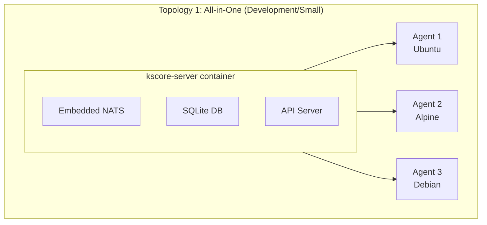
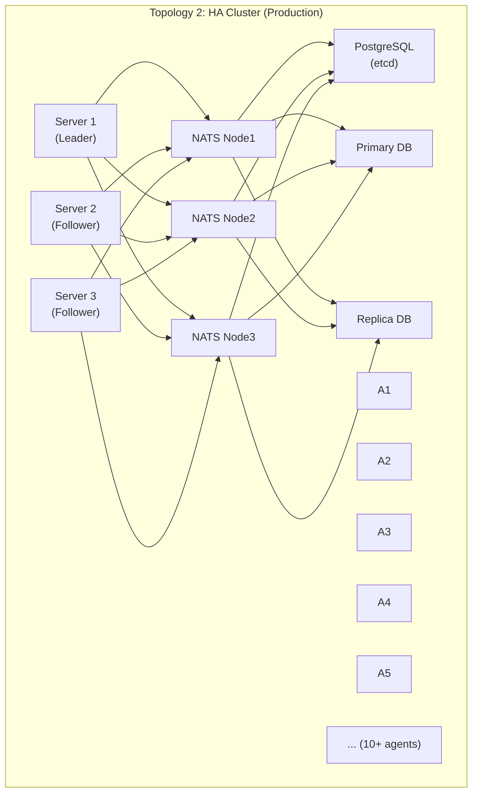
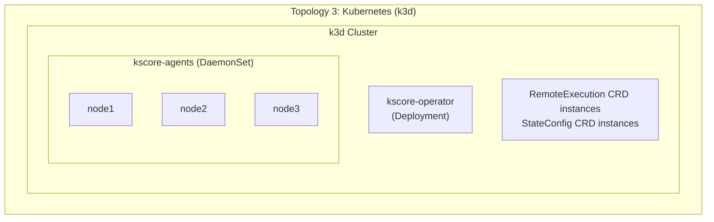

# Epic 12: End-to-End & Performance Testing

## Overview

Build a comprehensive end-to-end testing framework using containers (Docker/Podman) to validate all Keystone Core capabilities across multiple deployment topologies. This epic ensures that every feature claimed in the documentation actually works in realistic scenarios before any v1.0 release.

**Goal**: Prove that Keystone Core works as documented across all deployment modes, scales to claimed capacity, and handles failure scenarios gracefully.

**Philosophy**: "If we claim it, we test it."

## Success Criteria

- [ ] All-in-one deployment (embedded NATS + SQLite + agents) works end-to-end
- [ ] HA cluster deployment (external NATS + PostgreSQL + 10+ agents) works end-to-end
- [ ] Kubernetes deployment (k3d + operator + DaemonSet) works end-to-end
- [ ] All 6 state modules validated on multiple Linux distributions
- [ ] Remote execution works across 100+ concurrent agents
- [ ] Event system handles 1,000+ events/sec
- [ ] Policy enforcement blocks violations as documented
- [ ] GitOps webhooks trigger verification and rollback
- [ ] Clustering failover completes in <5 seconds
- [ ] Performance benchmarks documented with reproducible results
- [ ] Multi-platform validation (Linux distros, ARM64)
- [ ] Chaos testing passes (network partitions, node failures)
- [ ] All tests runnable in CI/CD pipeline
- [ ] Tests runnable locally with `make test-e2e`

## Problem Statement

**Current State:**
- Unit tests validate individual components in isolation
- Integration tests cover some component interactions
- No validation of complete deployment topologies
- No proof that documentation claims are accurate
- No performance baselines or regression detection
- No chaos/resilience testing at system level
- Manual testing required for release validation

**Target State:**
- Automated validation of all deployment topologies
- Every documented capability has a passing E2E test
- Performance benchmarks tracked over time
- Chaos testing validates fault tolerance claims
- Release confidence based on automated test suite
- Contributors can run full test suite locally

## Architecture

### Test Infrastructure

```
tests/
├── e2e/
│   ├── Makefile                    # Test orchestration
│   ├── docker-compose.base.yml     # Shared services
│   ├── topologies/
│   │   ├── all-in-one/
│   │   │   ├── docker-compose.yml
│   │   │   └── config/
│   │   ├── ha-cluster/
│   │   │   ├── docker-compose.yml
│   │   │   └── config/
│   │   ├── kubernetes/
│   │   │   ├── k3d-config.yaml
│   │   │   └── manifests/
│   │   └── hybrid/
│   │       ├── docker-compose.yml
│   │       └── config/
│   ├── images/
│   │   ├── control-plane/
│   │   │   └── Dockerfile
│   │   ├── agent-ubuntu/
│   │   │   └── Dockerfile
│   │   ├── agent-alpine/
│   │   │   └── Dockerfile
│   │   ├── agent-debian/
│   │   │   └── Dockerfile
│   │   └── agent-centos/
│   │       └── Dockerfile
│   ├── scenarios/
│   │   ├── agent_lifecycle_test.go
│   │   ├── remote_exec_test.go
│   │   ├── state_management_test.go
│   │   ├── event_system_test.go
│   │   ├── policy_enforcement_test.go
│   │   ├── gitops_webhook_test.go
│   │   ├── clustering_failover_test.go
│   │   └── multi_platform_test.go
│   ├── harness/
│   │   ├── cluster.go          # Test cluster management
│   │   ├── agents.go           # Agent container lifecycle
│   │   ├── assertions.go       # E2E assertion helpers
│   │   ├── wait.go             # Wait/retry utilities
│   │   └── cleanup.go          # Resource cleanup
│   └── mocks/
│       ├── gitops/             # Mock ArgoCD/Flux endpoints
│       ├── cloud/              # Mock AWS/GCP/Azure IMDS
│       └── webhooks/           # Webhook receivers
├── performance/
│   ├── scenarios/
│   │   ├── agent_scale_test.go
│   │   ├── command_throughput_test.go
│   │   ├── event_throughput_test.go
│   │   ├── state_application_test.go
│   │   └── concurrent_operations_test.go
│   ├── reports/
│   │   └── .gitkeep
│   └── baselines/
│       └── baseline.json       # Performance baselines
├── chaos/
│   ├── scenarios/
│   │   ├── network_partition_test.go
│   │   ├── control_plane_failover_test.go
│   │   ├── nats_cluster_failure_test.go
│   │   ├── postgres_failover_test.go
│   │   ├── agent_reconnection_storm_test.go
│   │   └── split_brain_test.go
│   └── pumba/                  # Pumba chaos configs
│       ├── network-delay.yml
│       ├── network-partition.yml
│       └── container-kill.yml
└── matrix/
    ├── platforms.yml           # Platform test matrix
    └── versions.yml            # Version compatibility matrix
```

### Deployment Topologies







## User Stories

### US12.1: Deployment Topology Validation
**As a** release engineer
**I want to** validate all documented deployment topologies
**So that** users can trust the deployment guides work

**Acceptance Criteria**:
- All-in-one deployment starts and passes health checks
- HA cluster forms correctly with leader election
- Kubernetes deployment with CRDs works end-to-end
- Hybrid mode (external NATS, embedded agents) works
- All topologies documented in Getting Started are tested

### US12.2: Feature Coverage Testing
**As a** product owner
**I want to** every documented feature tested end-to-end
**So that** we don't ship broken features

**Acceptance Criteria**:
- Remote execution with targeting works
- All 6 state modules apply and detect drift
- Event system routes and stores events
- Reactors execute on matching events
- Policy enforcement blocks violations
- GitOps webhooks trigger workflows
- Clustering failover happens correctly
- Plugin system loads and executes modules

### US12.3: Performance Baseline
**As a** performance engineer
**I want to** establish and track performance baselines
**So that** we detect regressions before release

**Acceptance Criteria**:
- Agent scale tests (10, 50, 100, 500 agents)
- Command throughput measured (commands/sec)
- Event throughput measured (events/sec)
- State application latency measured
- Clustering failover time measured
- Baselines stored and compared in CI

### US12.4: Chaos/Resilience Testing
**As a** SRE
**I want to** validate fault tolerance claims
**So that** production deployments are reliable

**Acceptance Criteria**:
- Network partition handling tested
- Control plane failover tested
- NATS cluster node failures tested
- PostgreSQL failover tested
- Agent disconnection storms handled
- Split-brain prevention verified

### US12.5: Multi-Platform Validation
**As a** user with mixed infrastructure
**I want to** agents work on all documented platforms
**So that** I can deploy across my environment

**Acceptance Criteria**:
- Ubuntu 20.04, 22.04, 24.04 agents tested
- Debian 11, 12 agents tested
- Alpine 3.18, 3.19 agents tested
- CentOS Stream 9 / Rocky Linux 9 agents tested
- ARM64 agents tested (via QEMU or native)
- State modules work correctly on each platform

### US12.6: CI/CD Integration
**As a** developer
**I want to** run E2E tests in CI
**So that** PRs don't break functionality

**Acceptance Criteria**:
- Tests runnable in GitHub Actions
- Parallel execution for speed
- Clear failure reporting
- Artifacts saved on failure (logs, screenshots)
- Tests also runnable locally with same commands

## Technical Tasks

### Phase 1: Test Infrastructure (Week 1-2)

**T1.1: Docker/Podman Base Setup**
- Create base Dockerfiles for control plane and agents
- Multi-stage builds for minimal image size
- Support both Docker and Podman (rootless)
- Image tagging and versioning strategy
- Local registry for faster iteration

**T1.2: Test Harness Framework**
- Create Go test harness package (tests/e2e/harness/)
- Cluster lifecycle management (create, destroy, wait)
- Agent container management (add, remove, restart)
- API client wrapper for test assertions
- NATS client for event verification
- Database client for state verification
- Cleanup handlers (defer-based resource cleanup)

**T1.3: Assertion Library**
- WaitForAgentOnline(agentID, timeout)
- WaitForJobComplete(jobID, timeout)
- AssertStateApplied(stateID, expected)
- AssertEventReceived(filter, timeout)
- AssertPolicyViolation(policyID, resource)
- AssertNoErrors(logs)

**T1.4: Mock Services**
- Mock ArgoCD API for webhook testing
- Mock Flux API for webhook testing
- Mock GitHub/GitLab for webhook testing
- Mock cloud IMDS (AWS, GCP, Azure) for metadata testing
- Webhook receiver for outbound webhook testing

### Phase 2: Deployment Topology Tests (Week 3-4)

**T2.1: All-in-One Topology**
- Docker Compose for single-server deployment
- Embedded NATS + SQLite configuration
- 2-3 agent containers (mixed distros)
- Validate agent registration
- Validate command execution
- Validate state application
- Validate event flow

**T2.2: HA Cluster Topology**
- Docker Compose for 3-node control plane
- External 3-node NATS cluster
- PostgreSQL primary + replica
- etcd cluster (3 nodes)
- 10+ agent containers
- Validate cluster formation
- Validate leader election
- Validate work distribution

**T2.3: Kubernetes Topology**
- k3d cluster creation (3 nodes)
- Deploy kscore-operator
- Deploy kscore-agents as DaemonSet
- Apply RemoteExecution CRDs
- Apply StateConfig CRDs
- Validate CRD reconciliation
- Validate agent pod lifecycle

**T2.4: Hybrid Topology**
- External NATS cluster
- Agents with embedded NATS (leaf nodes)
- Test offline operation
- Test sync on reconnection
- Validate event persistence during partition

### Phase 3: Functional E2E Tests (Week 5-7)

**T3.1: Agent Lifecycle Tests**
- Agent registration on startup
- Heartbeat verification
- Graceful shutdown
- Crash and reconnection
- Agent metadata accuracy
- Agent facts collection

**T3.2: Remote Execution Tests**
- Simple command execution
- Command with streaming output
- Command timeout handling
- Targeting by glob pattern
- Targeting by expression
- Batch execution across multiple agents
- Parallel vs sequential execution
- Cross-platform shell commands

**T3.3: State Management Tests**
- File module (create, modify, delete, permissions)
- Package module (install, remove) - mock or real depending on isolation
- Service module (start, stop, enable) - requires systemd in container
- User/Group modules (create, modify, delete)
- Cmd module (run, wait)
- Requisites (require, watch, prereq, onchanges)
- Template rendering with vars and facts
- Drift detection and reporting
- Idempotency verification (apply twice, second is no-op)

**T3.4: Event System Tests**
- Event emission from operations
- Event filtering and routing
- Event storage and query
- Reactor triggering
- Reactor actions execution
- Event correlation tracking
- CloudEvents format validation

**T3.5: Policy Enforcement Tests**
- OPA policy evaluation
- CEL policy evaluation
- Enforcement mode (enforce vs audit)
- Violation blocking
- Audit logging
- Compliance reporting

**T3.6: GitOps Integration Tests**
- ArgoCD webhook reception
- Flux webhook reception
- Verification workflow triggering
- Rollback automation
- Promotion pipeline execution

**T3.7: Clustering Tests** (requires Epic 11 completion)
- Cluster formation
- Leader election
- Agent failover on server death
- Job redistribution
- Zero-downtime rolling update
- Split-brain prevention

### Phase 4: Performance Tests (Week 8-9)

**T4.1: Agent Scale Tests**
```
Scale Levels:
- 10 agents (baseline)
- 50 agents (small deployment)
- 100 agents (medium deployment)
- 500 agents (large deployment)

Metrics:
- Time to all agents registered
- Heartbeat success rate under load
- Memory usage on control plane
- CPU usage on control plane
```

**T4.2: Command Throughput Tests**
```
Scenarios:
- Sequential commands to single agent
- Parallel commands to 100 agents
- Sustained throughput (5 min run)

Metrics:
- Commands per second
- Latency percentiles (P50, P95, P99)
- Error rate under load
```

**T4.3: Event Throughput Tests**
```
Scenarios:
- Event emission rate (events/sec)
- Event storage write rate
- Event query latency under load
- Reactor processing rate

Metrics:
- Events per second (target: 1000+)
- Event-to-reactor latency
- Storage query latency
```

**T4.4: State Application Tests**
```
Scenarios:
- Apply 100 state declarations
- Apply to 10 agents simultaneously
- Drift detection across 100 resources

Metrics:
- States per second
- Time to full convergence
- Drift detection latency
```

**T4.5: Baseline Management**
- Store baseline results in JSON
- Compare current run to baseline
- Alert on >10% regression
- Generate performance trend reports

### Phase 5: Chaos Tests (Week 10-11)

**T5.1: Network Partition Tests**
- Use Pumba or tc for network manipulation
- Partition control plane from NATS
- Partition agents from control plane
- Partition etcd nodes
- Verify recovery after partition heals
- Verify no data corruption

**T5.2: Control Plane Failover Tests**
- Kill leader server container
- Verify new leader election (<3 sec)
- Verify agent reconnection
- Verify in-flight jobs complete
- Verify no duplicate job execution

**T5.3: NATS Cluster Failure Tests**
- Kill one NATS node
- Kill two NATS nodes (quorum loss)
- Verify message durability
- Verify client reconnection
- Verify JetStream stream recovery

**T5.4: PostgreSQL Failover Tests**
- Kill primary database
- Verify promotion of replica
- Verify control plane reconnection
- Verify no data loss
- Verify transaction rollback handling

**T5.5: Agent Reconnection Storm Tests**
- Disconnect all agents simultaneously
- Reconnect all agents simultaneously
- Verify no thundering herd problems
- Verify backoff/jitter working
- Verify all agents recover

**T5.6: Split-Brain Tests**
- Create network partition (minority/majority)
- Verify minority stops serving writes
- Verify majority continues operating
- Heal partition
- Verify automatic recovery

### Phase 6: Multi-Platform Validation (Week 12)

**T6.1: Linux Distribution Matrix**
```yaml
distributions:
  - name: ubuntu
    versions: ["20.04", "22.04", "24.04"]
    arch: [amd64, arm64]
  - name: debian
    versions: ["11", "12"]
    arch: [amd64, arm64]
  - name: alpine
    versions: ["3.18", "3.19", "3.20"]
    arch: [amd64, arm64]
  - name: rockylinux
    versions: ["9"]
    arch: [amd64, arm64]
```

**T6.2: Platform-Specific Module Tests**
- Package module with apt (Ubuntu/Debian)
- Package module with apk (Alpine)
- Package module with dnf (Rocky)
- Service module with systemd
- Service module with OpenRC (Alpine)
- User/Group module (platform differences)

**T6.3: ARM64 Testing**
- QEMU-based ARM64 emulation (slower but works anywhere)
- Native ARM64 runners (GitHub Actions has them)
- Cross-compilation verification
- Performance comparison (ARM vs x86)

**T6.4: Windows/macOS Validation** (Non-Container)
- GitHub Actions Windows runner
- GitHub Actions macOS runner
- Agent build and basic execution
- Shell abstraction verification
- Document as "validated in CI" with limitations

### Phase 7: CI/CD Integration (Week 13)

**T7.1: GitHub Actions Workflow**
```yaml
# .github/workflows/e2e-tests.yml
name: E2E Tests

on:
  push:
    branches: [main]
  pull_request:
    branches: [main]

jobs:
  e2e-quick:
    # All-in-one topology, basic tests
    # Runs on every PR

  e2e-full:
    # All topologies, full test suite
    # Runs on main branch or manual trigger

  e2e-performance:
    # Performance tests with baseline comparison
    # Runs on main branch

  e2e-chaos:
    # Chaos tests
    # Runs on main branch or manual trigger
```

**T7.2: Test Parallelization**
- Identify independent test suites
- Run topology tests in parallel
- Run platform matrix in parallel
- Aggregate results for reporting

**T7.3: Artifact Collection**
- Collect container logs on failure
- Collect Prometheus metrics snapshot
- Collect database state dump
- Collect NATS JetStream state
- Upload as GitHub Actions artifacts

**T7.4: Local Development Experience**
```makefile
# Makefile targets

test-e2e-quick:        # Fast smoke test (5 min)
test-e2e-full:         # Full suite (30 min)
test-e2e-topology-X:   # Specific topology
test-e2e-scenario-X:   # Specific scenario
test-performance:      # Performance tests
test-chaos:            # Chaos tests
test-matrix:           # Platform matrix
```

### Phase 8: Documentation & Reporting (Week 14)

**T8.1: Test Documentation**
- Document test architecture
- Document how to add new tests
- Document how to run tests locally
- Document CI/CD pipeline

**T8.2: Coverage Report**
- Map tests to documented features
- Identify coverage gaps
- Generate feature coverage matrix
- Track coverage over time

**T8.3: Performance Reports**
- Historical performance trends
- Baseline comparison reports
- Regression detection alerts
- Capacity planning recommendations

**T8.4: Release Validation Checklist**
- Pre-release test requirements
- Manual testing procedures (if any)
- Sign-off criteria
- Release confidence metrics

## Container Image Strategy

### Control Plane Image
```dockerfile
# tests/e2e/images/control-plane/Dockerfile
FROM golang:1.21-alpine AS builder
# Build kscore-server with all features

FROM alpine:3.19
COPY --from=builder /app/kscore-server /usr/local/bin/
COPY --from=builder /app/kscorectl /usr/local/bin/
# Include all CLI plugins
ENTRYPOINT ["kscore-server"]
```

### Agent Images
```dockerfile
# tests/e2e/images/agent-ubuntu/Dockerfile
FROM ubuntu:22.04
RUN apt-get update && apt-get install -y \
    systemd \
    openssh-client \
    curl \
    && rm -rf /var/lib/apt/lists/*
COPY kscore-agent /usr/local/bin/
ENTRYPOINT ["kscore-agent"]
```

### Image Variants
- `kscore-e2e-server:latest` - Control plane
- `kscore-e2e-agent-ubuntu:22.04` - Ubuntu agent
- `kscore-e2e-agent-alpine:3.19` - Alpine agent (minimal)
- `kscore-e2e-agent-debian:12` - Debian agent
- `kscore-e2e-agent-rocky:9` - Rocky Linux agent

## Dependencies

- **Container Runtime**: Docker 24+ or Podman 4+
- **Compose**: Docker Compose v2 or Podman Compose
- **Kubernetes**: k3d 5+ (for Kubernetes topology)
- **Chaos Tools**: Pumba (optional, for chaos testing)
- **Go**: 1.25+ (for test code)
- **testcontainers-go**: Programmatic container management
- **Completed Epics**: Epics 1-11 (tests validate all features)

## Risks & Mitigations

| Risk | Impact | Probability | Mitigation |
|------|--------|-------------|------------|
| Container resource exhaustion | High | Medium | Resource limits, cleanup automation |
| Flaky tests | High | High | Retry logic, wait utilities, deterministic assertions |
| Slow test execution | Medium | High | Parallelization, test selection |
| Platform-specific failures | Medium | Medium | Matrix testing, clear documentation |
| CI environment differences | Medium | Medium | Containerized tests, minimal host deps |
| State leakage between tests | High | Medium | Strict cleanup, fresh containers per test |
| Chaos tests causing host issues | High | Low | Isolated networks, resource limits |

## Metrics & Monitoring (Test Suite)

### Test Suite Metrics
- Total test count
- Pass/fail/skip counts
- Test execution time
- Flakiness rate (fails then passes on retry)
- Coverage by feature area

### Performance Tracking
- Commands/sec over time
- Events/sec over time
- Agent registration time
- Failover time
- Latency percentiles

### CI Metrics
- CI run duration
- CI success rate
- Time to feedback (PR to results)
- Resource usage in CI

## Definition of Done

- [ ] All deployment topologies have passing tests
- [ ] Every documented feature has at least one E2E test
- [ ] Performance baselines established and tracked
- [ ] Chaos tests pass for all failure scenarios
- [ ] Multi-platform matrix tested (5+ Linux distros)
- [ ] ARM64 validated
- [ ] Tests run in GitHub Actions CI
- [ ] Tests runnable locally with `make test-e2e`
- [ ] Test documentation complete
- [ ] Release validation checklist created
- [ ] <30 min for full E2E suite in CI
- [ ] <5 min for quick smoke test

## Timeline

Total: **14 weeks**

- **Weeks 1-2**: Test infrastructure and harness
- **Weeks 3-4**: Deployment topology tests
- **Weeks 5-7**: Functional E2E tests (all features)
- **Weeks 8-9**: Performance tests
- **Weeks 10-11**: Chaos tests
- **Week 12**: Multi-platform validation
- **Week 13**: CI/CD integration
- **Week 14**: Documentation and reporting

## Test Naming Convention

```
Test<Topology>_<Feature>_<Scenario>

Examples:
TestAllInOne_AgentLifecycle_Registration
TestHACluster_RemoteExec_BatchExecution
TestKubernetes_StateManagement_DriftDetection
TestAllInOne_Events_ReactorTriggering
TestHACluster_Clustering_LeaderFailover
```

## Quick Start (for developers)

```bash
# Prerequisites
docker --version  # or podman --version
go version

# Build test images
make e2e-images

# Run quick smoke test (all-in-one, basic scenarios)
make test-e2e-quick

# Run full test suite
make test-e2e-full

# Run specific topology
make test-e2e-topology TOPOLOGY=ha-cluster

# Run specific scenario
make test-e2e-scenario SCENARIO=remote_exec

# Run performance tests
make test-performance

# Run chaos tests (requires more resources)
make test-chaos

# Clean up all test resources
make test-clean
```

## Future Enhancements (Post-Epic)

- Browser-based test result dashboard
- Automated nightly test runs with reports
- Fuzz testing for API endpoints
- Security scanning integration (Trivy, Grype)
- Comparative testing against Salt/Ansible
- Geographic distribution testing (multi-region)
- Long-running soak tests (24+ hours)
