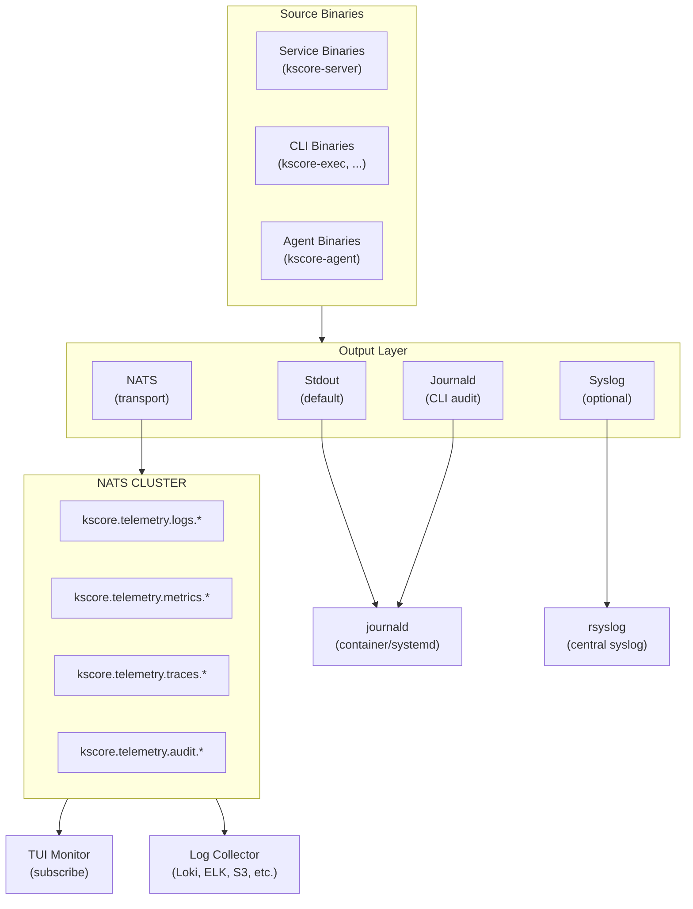

# Epic 15: Observability Enhancements

## Overview

Enhance Keystone Core's observability infrastructure to use NATS as the primary transport for all telemetry data (logs, metrics, traces, audit), implement proper OS-native logging (stdout for journald, syslog), and add comprehensive audit logging for CLI tools. This epic builds on Epic 7 (Observability) and requires Epic 14 (NATS Mesh Communication) for transport.

**Goal**: Create a unified observability architecture where all telemetry flows through NATS, services log to stdout by default (for journald/container log capture), and all user actions are audited through standard OS logging facilities.

## Success Criteria

- [ ] All observability data transportable over NATS (logs, metrics, traces, audit)
- [ ] Services (kscore-server, kscore-agent) log to stdout by default
- [ ] Optional syslog output for services (RFC 5424 compliant)
- [ ] No direct file logging by default (removed from config)
- [ ] CLI tools (kscore-exec, kscore-state, etc.) audit to syslog/journald
- [ ] NATS-based log aggregation from distributed agents
- [ ] NATS-based metrics push (in addition to Prometheus pull)
- [ ] NATS-based trace export (in addition to OTLP)
- [ ] Centralized audit log with tamper-evident properties
- [ ] TUI monitor receives telemetry via NATS (not polling)
- [ ] Works across all Epic 14 topologies (supercluster, leaf nodes, etc.)

## Problem Statement

**Current State (Epic 7 Implementation):**
- Logs go to stdout (JSON) - good for containers, but no syslog option
- CLI tools use printf() - no structured logging or audit trail
- Metrics are Prometheus pull-only - no push, no NATS transport
- Traces use OTLP - no NATS transport option
- TUI monitor polls gRPC API - no real-time push
- No unified audit logging for user actions
- File logging option exists but violates best practices

**Target State:**
- Services: stdout by default (journald captures), optional syslog
- CLI tools: audit to syslog/journald with structured data
- All telemetry: transportable over NATS for distributed collection
- TUI monitor: subscribes to NATS streams for real-time updates
- Audit: centralized, immutable audit log for compliance
- No file logging: logs managed by OS (journald, syslog)

## Architecture

### Telemetry Flow Architecture



### Logging Output Matrix

| Binary Type | Primary Output | Secondary Output | Audit Output |
|-------------|----------------|------------------|--------------|
| kscore-server | stdout (JSON) | syslog (optional) | NATS audit stream |
| kscore-agent | stdout (JSON) | syslog (optional) | NATS audit stream |
| kscore-exec | stderr (human) | - | syslog/journald |
| kscore-state | stderr (human) | - | syslog/journald |
| kscore-module | stderr (human) | - | syslog/journald |
| kscore-monitor | stderr (human) | - | syslog/journald |
| kscore-cluster | stderr (human) | - | syslog/journald |
| kscore-migrate | stderr (human) | - | syslog/journald |

### NATS Telemetry Subjects

```
kscore.telemetry.logs.{cluster}.{source}.{level}
  Example: kscore.telemetry.logs.prod.server-01.error

kscore.telemetry.metrics.{cluster}.{source}
  Example: kscore.telemetry.metrics.prod.agent-web-01

kscore.telemetry.traces.{cluster}.{source}
  Example: kscore.telemetry.traces.prod.server-01

kscore.telemetry.audit.{cluster}.{action_type}
  Example: kscore.telemetry.audit.prod.command_executed

kscore.telemetry.health.{cluster}.{source}
  Example: kscore.telemetry.health.prod.agent-web-01
```

## User Stories

### US15.1: Stdout-First Logging for Services
**As a** platform operator
**I want** services to log to stdout by default
**So that** journald/container runtimes capture logs automatically

**Acceptance Criteria**:
- kscore-server logs to stdout by default (no config needed)
- kscore-agent logs to stdout by default
- Logs are JSON formatted for structured parsing
- Works with systemd journald (`journalctl -u kscore-server`)
- Works with Docker/Kubernetes log drivers
- No file logging option in default config
- Log level configurable via environment variable

**Configuration**:
```yaml
# kscore-server.yaml
logging:
  level: info                    # debug, info, warn, error
  format: json                   # json (default), logfmt, text
  output: stdout                 # stdout (default), syslog
  # NO file output option - use journald/syslog
```

### US15.2: Syslog Output Option
**As a** platform operator
**I want** optional syslog output for services
**So that** I can integrate with traditional log management

**Acceptance Criteria**:
- RFC 5424 compliant syslog output
- Support for local socket (`/dev/log`, `/var/run/syslog`)
- Support for remote syslog (UDP/TCP)
- Support for TLS-encrypted syslog (RFC 5425)
- Configurable facility and severity mapping
- Structured data (SD-ELEMENT) support
- Fallback to stdout if syslog unavailable

**Configuration**:
```yaml
logging:
  output: syslog
  syslog:
    network: udp                 # unix, udp, tcp, tcp+tls
    address: localhost:514       # or /dev/log for local
    facility: local0             # local0-local7, daemon, user
    app_name: kscore-server
    tls:
      enabled: false
      ca_cert: /path/to/ca.pem
      cert: /path/to/cert.pem
      key: /path/to/key.pem
```

### US15.3: CLI Audit Logging
**As a** security administrator
**I want** all CLI tool actions audited to OS logging
**So that** I have an audit trail for compliance

**Acceptance Criteria**:
- All CLI tools log to syslog/journald
- Audit entries include: user, command, target, timestamp, result
- Uses LOG_AUTH facility (security/authorization messages)
- Structured data in syslog entries
- Works on Linux (journald), macOS (ASL), Windows (Event Log)
- Configurable audit level (all commands, errors only, none)
- Audit entries are append-only (immutable once written)

**Audit Entry Format**:
```json
{
  "timestamp": "2024-01-15T10:30:45.123Z",
  "audit_type": "command_executed",
  "user": "admin",
  "uid": 1000,
  "tty": "/dev/pts/1",
  "pid": 12345,
  "tool": "kscore-exec",
  "command": "run",
  "args": ["--target", "role:web", "uptime"],
  "target": "role:web",
  "agents_matched": 10,
  "result": "success",
  "exit_code": 0,
  "duration_ms": 2345,
  "correlation_id": "exec-abc123"
}
```

**Syslog Entry Example**:
```
Jan 15 10:30:45 workstation kscore-exec[12345]: AUDIT user=admin action=command_executed target="role:web" result=success
```

### US15.4: NATS Log Transport
**As a** platform operator
**I want** logs transported over NATS
**So that** distributed logs can be centrally collected

**Acceptance Criteria**:
- Logs published to NATS subject hierarchy
- Works across all Epic 14 topologies (supercluster, leaf)
- Buffering when NATS unavailable (with limits)
- Configurable log levels for NATS transport
- JetStream for log persistence (optional)
- Log deduplication support
- Backpressure handling

**Configuration**:
```yaml
logging:
  nats:
    enabled: true
    subject_prefix: kscore.telemetry.logs
    buffer_size: 10000           # max buffered logs
    buffer_overflow: drop_oldest # drop_oldest, drop_newest, block
    min_level: info              # minimum level for NATS
    jetstream:
      enabled: true
      stream: KSCORE_LOGS
      max_age: 7d
      max_bytes: 10GB
```

### US15.5: NATS Metrics Push
**As a** platform operator
**I want** metrics pushed over NATS
**So that** I can collect metrics without Prometheus scraping

**Acceptance Criteria**:
- Metrics published to NATS at configurable interval
- Prometheus exposition format over NATS
- OpenMetrics format support
- Works alongside Prometheus pull (/metrics endpoint)
- Aggregation at collector for high-cardinality reduction
- Per-agent metrics visible in central location
- JetStream for metrics persistence (optional)

**Configuration**:
```yaml
metrics:
  prometheus:
    enabled: true                # Keep /metrics endpoint
    path: /metrics
    port: 9090
  nats:
    enabled: true
    subject_prefix: kscore.telemetry.metrics
    push_interval: 15s
    format: prometheus           # prometheus, openmetrics, json
    include_labels:
      - cluster
      - datacenter
      - role
```

### US15.6: NATS Trace Export
**As a** platform operator
**I want** traces exported over NATS
**So that** distributed traces flow through NATS mesh

**Acceptance Criteria**:
- Trace spans published to NATS
- OTLP format over NATS (JSON-encoded)
- Works alongside OTLP HTTP/gRPC export
- Trace context propagation in NATS messages (already exists)
- Sampling respects existing configuration
- JetStream for trace persistence (optional)

**Configuration**:
```yaml
tracing:
  enabled: true
  sampling:
    rate: 0.1
  exporters:
    otlp:
      enabled: true
      endpoint: tempo:4317
    nats:
      enabled: true
      subject_prefix: kscore.telemetry.traces
      batch_size: 100
      flush_interval: 5s
```

### US15.7: Real-Time TUI Monitor via NATS
**As an** operator
**I want** the TUI monitor to receive updates via NATS
**So that** I get real-time telemetry without polling

**Acceptance Criteria**:
- TUI subscribes to NATS telemetry subjects
- Real-time log streaming (replaces polling)
- Real-time event streaming (already via NATS)
- Real-time metrics updates
- Works across Epic 14 topologies
- Graceful fallback to gRPC polling if NATS unavailable
- Configurable subscription scope (all, filtered)

**Configuration**:
```yaml
# ~/.kscore/monitor.yaml
monitor:
  data_source: nats              # nats (preferred), grpc (fallback)
  nats:
    url: nats://localhost:4222
    subscriptions:
      logs: kscore.telemetry.logs.>
      metrics: kscore.telemetry.metrics.>
      traces: kscore.telemetry.traces.>
      events: kscore.events.>
  grpc:
    endpoint: localhost:8080     # fallback
```

### US15.8: Centralized Audit Log
**As a** security administrator
**I want** a centralized, tamper-evident audit log
**So that** I can meet compliance requirements

**Acceptance Criteria**:
- All audit entries flow through NATS to central store
- JetStream with write-once semantics
- Audit entries include digital signatures (optional)
- Query API for audit log search
- Retention policies (time-based, size-based)
- Export to compliance formats (CEF, LEEF)
- Integration with SIEM systems

**Audit Event Types**:
```
Authentication:
  - user.login
  - user.logout
  - user.auth_failed
  - api_key.created
  - api_key.revoked

Authorization:
  - permission.granted
  - permission.denied
  - role.assigned
  - role.revoked

Operations:
  - command.executed
  - command.failed
  - state.applied
  - state.failed
  - policy.evaluated
  - policy.violated

Administration:
  - agent.registered
  - agent.deregistered
  - config.changed
  - cluster.joined
  - cluster.left
```

### US15.9: Cross-Platform OS Logging
**As a** platform operator
**I want** OS-native logging on all platforms
**So that** audit works consistently everywhere

**Acceptance Criteria**:
- Linux: systemd journald via `sd_journal_send()`
- Linux (legacy): syslog via `/dev/log`
- macOS: Apple System Log (ASL) / os_log
- Windows: Windows Event Log
- Fallback: stderr with structured format
- Platform auto-detection
- Consistent audit format across platforms

## Technical Tasks

### Phase 1: Stdout-First Logging Refactor (Week 1-2)

**T1.1: Remove File Output from Logger**
- Remove file output option from logging config
- Remove file rotation code
- Update config schema (remove file-related fields)
- Update documentation to reflect stdout-first approach
- Migration guide for users with file logging

**T1.2: Enhance Stdout Output**
- Ensure JSON format is complete and well-structured
- Add log entry metadata (host, pid, version)
- Add structured error formatting
- Optimize for journald field extraction
- Add optional color output for interactive terminals

**T1.3: Update Service Logging**
- Refactor kscore-server to use stdout logger
- Refactor kscore-agent to use stdout logger
- Remove any fmt.Printf/log.Printf calls
- Consistent logger usage across all packages
- Add context propagation for correlation IDs

**T1.4: Environment Variable Configuration**
- KSCORE_LOG_LEVEL - set log level
- KSCORE_LOG_FORMAT - set format (json, logfmt, text)
- KSCORE_LOG_OUTPUT - set output (stdout, syslog)
- Environment variables override config file
- Document all environment variables

### Phase 2: Syslog Integration (Week 3-4)

**T2.1: Syslog Output Implementation**
- Implement SyslogOutput (pkg/logging/syslog.go)
- RFC 5424 message formatting
- Facility/severity mapping from log levels
- Structured data (SD-ELEMENT) support
- Message ID generation

**T2.2: Syslog Transport Options**
- Unix socket transport (/dev/log)
- UDP transport (RFC 5426)
- TCP transport (RFC 6587)
- TLS transport (RFC 5425)
- Connection retry and failover

**T2.3: Syslog Configuration**
- Config schema for syslog options
- Validation for syslog settings
- Default syslog configuration
- Fallback behavior on syslog failure
- Health check for syslog connectivity

**T2.4: Cross-Platform Syslog**
- Linux syslog support (local and remote)
- macOS syslog support (ASL compatibility)
- Windows Event Log wrapper (maps to syslog calls)
- Platform detection and auto-configuration
- Unified API across platforms

### Phase 3: CLI Audit Logging (Week 5-6)

**T3.1: Audit Logger Interface**
- Define AuditLogger interface (pkg/audit/audit.go)
- AuditEntry structure with all required fields
- AuditLevel configuration (all, errors, none)
- Correlation ID generation
- User/UID/TTY detection

**T3.2: OS-Native Audit Backends**
- Linux journald backend (sd_journal_send via cgo-free)
- Linux syslog backend (LOG_AUTH facility)
- macOS os_log backend
- Windows Event Log backend
- Stderr fallback backend

**T3.3: CLI Tool Integration**
- Add audit logging to kscore-exec
- Add audit logging to kscore-state
- Add audit logging to kscore-module
- Add audit logging to kscore-cluster
- Add audit logging to kscore-monitor
- Add audit logging to kscore-migrate

**T3.4: Audit Entry Enrichment**
- Capture command-line arguments
- Capture target information
- Capture result/exit code
- Capture duration
- Capture user context (SSH_CLIENT, etc.)
- Redact sensitive data (passwords, tokens)

### Phase 4: NATS Log Transport (Week 7-8)

**T4.1: NATS Log Output**
- Implement NATSOutput (pkg/logging/nats.go)
- Subject hierarchy design
- Cluster/source metadata injection
- Async publishing (non-blocking)
- Configurable log level filtering

**T4.2: Log Buffering**
- In-memory buffer for NATS unavailability
- Configurable buffer size
- Overflow policies (drop_oldest, drop_newest, block)
- Buffer drain on reconnection
- Buffer metrics

**T4.3: JetStream Log Persistence**
- JetStream stream creation for logs
- Retention policies (time, size)
- Consumer creation for log readers
- Replay from offset
- Log deduplication via message ID

**T4.4: Log Collection Service**
- Log collector subscribes to NATS
- Forward to Loki, Elasticsearch, S3
- Configurable output backends
- Batching and compression
- Error handling and retry

### Phase 5: NATS Metrics Push (Week 9-10)

**T5.1: Metrics Publisher**
- Implement NATSMetricsPublisher (pkg/metrics/nats.go)
- Prometheus exposition format serialization
- OpenMetrics format support
- JSON format support
- Configurable push interval

**T5.2: Metrics Aggregation**
- Agent-side metric collection
- Control plane aggregation
- Cardinality reduction at aggregator
- Label filtering/transformation
- Histogram/summary aggregation

**T5.3: Metrics Stream**
- JetStream for metrics persistence (optional)
- Time-series storage via NATS
- Query API for historical metrics
- Downsampling for long-term storage
- Metrics retention policies

**T5.4: Integration with Prometheus**
- Continue supporting /metrics endpoint
- Remote write via NATS (to Prometheus)
- Prometheus federation support
- Grafana NATS datasource (future)
- Backwards compatibility

### Phase 6: NATS Trace Export (Week 11-12)

**T6.1: NATS Trace Exporter**
- Implement NATSTraceExporter (pkg/tracing/nats.go)
- OTLP JSON format over NATS
- Batch span export
- Configurable flush interval
- Sampling integration

**T6.2: Trace Collection**
- Trace collector subscribes to NATS
- Forward to Jaeger, Tempo, Zipkin
- Trace storage via JetStream (optional)
- Trace query API
- Trace retention policies

**T6.3: Distributed Trace Correlation**
- Trace ID propagation across NATS subjects
- Parent span correlation
- Service map generation from traces
- Latency analysis per hop
- Error tracking across services

### Phase 7: TUI Monitor NATS Integration (Week 13-14)

**T7.1: NATS Subscription Handler**
- Subscribe to telemetry subjects
- Parse log, metric, trace messages
- Update TUI views in real-time
- Filter subscriptions by scope
- Handle backpressure

**T7.2: Real-Time Log View**
- Subscribe to kscore.telemetry.logs.>
- Stream logs to Logs view
- Level filtering
- Source filtering
- Search/highlight

**T7.3: Real-Time Metrics View**
- Subscribe to kscore.telemetry.metrics.>
- Update sparklines in real-time
- Calculate rates from counter deltas
- Gauge visualization updates
- Histogram percentile calculations

**T7.4: Fallback to gRPC**
- Detect NATS unavailability
- Graceful fallback to gRPC polling
- Indicator showing data source
- Automatic reconnection to NATS
- Configuration for preferred source

### Phase 8: Centralized Audit System (Week 15-16)

**T8.1: Audit Event Schema**
- Define audit event protobuf/JSON schema
- Event type enumeration
- Required vs optional fields
- Extensible metadata
- Versioning for schema evolution

**T8.2: Audit Stream**
- NATS JetStream stream for audit
- Write-once semantics (no delete)
- Long retention (configurable, default 1 year)
- Replication for durability
- Backup and restore

**T8.3: Audit Signatures (Optional)**
- Sign audit entries with server key
- Chain hashing for tamper evidence
- Signature verification
- Key rotation support
- HSM integration (optional)

**T8.4: Audit Query API**
- REST API for audit log queries
- Filter by time, user, action, resource
- Pagination support
- Export to CEF/LEEF formats
- SIEM webhook integration

### Phase 9: Testing & Documentation (Week 17-18)

**T9.1: Unit Tests**
- Syslog output tests
- Audit logger tests
- NATS output tests
- Platform-specific tests (Linux, macOS, Windows)
- Format tests (JSON, logfmt, syslog)

**T9.2: Integration Tests**
- End-to-end log flow (stdout → journald)
- End-to-end log flow (stdout → NATS → collector)
- Audit logging from CLI tools
- TUI monitor NATS subscription
- Cross-platform audit tests

**T9.3: Performance Tests**
- High-volume log throughput
- NATS transport overhead
- Buffer behavior under load
- Syslog performance
- Audit logging overhead

**T9.4: Documentation**
- Logging configuration guide
- Syslog integration guide
- Audit logging guide
- NATS telemetry architecture
- Migration guide from file logging
- Compliance guide (audit for SOC2, HIPAA)

## Configuration Reference

### Service Logging (kscore-server, kscore-agent)

```yaml
# /etc/kscore/kscore-server.yaml
logging:
  # Log level: debug, info, warn, error
  level: info

  # Output format: json (default), logfmt, text
  format: json

  # Primary output: stdout (default), syslog
  output: stdout

  # Include caller information (file:line)
  include_caller: false

  # Include stack traces for errors
  include_stacktrace: true

  # Syslog configuration (when output: syslog)
  syslog:
    network: udp                 # unix, udp, tcp, tcp+tls
    address: localhost:514       # or /dev/log
    facility: daemon             # daemon, local0-7
    app_name: kscore-server
    tls:
      enabled: false
      ca_cert: ""
      cert: ""
      key: ""
      skip_verify: false

  # NATS transport (always enabled when NATS available)
  nats:
    enabled: true
    subject_prefix: kscore.telemetry.logs
    min_level: info              # Minimum level for NATS
    buffer_size: 10000
    buffer_overflow: drop_oldest
    include_metadata: true
    jetstream:
      enabled: false
      stream: KSCORE_LOGS
      max_age: 168h              # 7 days
      max_bytes: 10737418240     # 10GB
```

### CLI Audit Logging

```yaml
# ~/.kscore/cli.yaml (or /etc/kscore/cli.yaml)
audit:
  # Audit level: all, errors, none
  level: all

  # Output: auto (detect OS), journald, syslog, eventlog, stderr
  output: auto

  # Syslog configuration (when output: syslog)
  syslog:
    network: unix
    address: /dev/log
    facility: auth               # LOG_AUTH for security

  # Fields to include
  include:
    user: true
    uid: true
    tty: true
    ssh_client: true
    command_args: true
    duration: true
    exit_code: true

  # Sensitive data handling
  redact:
    - password
    - token
    - secret
    - key
```

### NATS Telemetry Configuration

```yaml
# Telemetry settings for NATS transport
telemetry:
  cluster_name: production       # Included in subject hierarchy
  source_name: ""                # Auto-detected from hostname

  logs:
    nats:
      enabled: true
      subject_prefix: kscore.telemetry.logs

  metrics:
    prometheus:
      enabled: true
      port: 9090
      path: /metrics
    nats:
      enabled: true
      subject_prefix: kscore.telemetry.metrics
      push_interval: 15s
      format: prometheus

  traces:
    otlp:
      enabled: true
      endpoint: tempo:4317
    nats:
      enabled: true
      subject_prefix: kscore.telemetry.traces
      batch_size: 100
      flush_interval: 5s

  audit:
    nats:
      enabled: true
      subject: kscore.telemetry.audit
      jetstream:
        enabled: true
        stream: KSCORE_AUDIT
        max_age: 8760h           # 1 year
        replicas: 3
```

## Dependencies

- **Epic 14** (NATS Mesh Communication) - Required for NATS transport
- **Epic 7** (Observability) - Foundation for metrics, logging, tracing
- **Go Libraries**:
  - `log/syslog` (stdlib) - Syslog client
  - `github.com/coreos/go-systemd/v22/journal` - journald integration
  - `golang.org/x/sys/windows/svc/eventlog` - Windows Event Log
  - Existing: prometheus, otel, nats

## Risks & Mitigations

| Risk | Impact | Probability | Mitigation |
|------|--------|-------------|------------|
| NATS transport overhead | Medium | Medium | Async publishing, batching, sampling |
| Log loss during NATS outage | High | Low | Buffer with overflow policies, fallback to stdout |
| Syslog compatibility issues | Medium | Medium | RFC compliance testing, multiple transport options |
| Audit log tampering | High | Low | JetStream write-once, optional signatures |
| Performance impact on CLI tools | Medium | Low | Async audit logging, configurable level |
| Cross-platform complexity | Medium | High | Comprehensive testing, platform abstraction |
| Migration from file logging | Low | High | Clear documentation, deprecation warnings |

## Metrics (Epic 15 Self-Monitoring)

```
kscore_logging_entries_total{output,level}
kscore_logging_errors_total{output,error}
kscore_logging_buffer_size{output}
kscore_logging_buffer_overflow_total{output,policy}
kscore_audit_entries_total{action_type,result}
kscore_audit_errors_total{backend,error}
kscore_telemetry_nats_publish_total{type}
kscore_telemetry_nats_publish_errors_total{type,error}
kscore_telemetry_nats_latency_seconds{type}
```

## Testing Strategy

### Unit Tests
- Syslog formatter tests
- Audit entry creation tests
- NATS publisher tests
- Buffer behavior tests
- Platform detection tests
- Configuration validation tests

### Integration Tests
- Stdout → journald capture
- Stdout → Docker log driver
- Syslog → rsyslog
- CLI → journald audit
- NATS log transport end-to-end
- TUI NATS subscription

### Platform Tests
- Linux (systemd, sysvinit)
- macOS (launchd)
- Windows (Service Control Manager)
- Docker/Kubernetes
- Embedded (no journald)

### Compliance Tests
- Audit log completeness
- Audit log integrity
- Retention policy enforcement
- Export format validation (CEF, LEEF)

## Documentation Requirements

- [ ] Logging configuration guide (stdout, syslog)
- [ ] Syslog integration guide (rsyslog, syslog-ng)
- [ ] CLI audit logging guide
- [ ] NATS telemetry architecture
- [ ] TUI monitor data sources
- [ ] Compliance guide (audit for regulations)
- [ ] Migration guide (from file logging)
- [ ] Troubleshooting guide

## Definition of Done

- [ ] Services log to stdout by default
- [ ] Syslog output option working (RFC 5424)
- [ ] CLI tools audit to OS logging
- [ ] NATS log transport working
- [ ] NATS metrics push working
- [ ] NATS trace export working
- [ ] TUI monitor receives data via NATS
- [ ] Centralized audit log operational
- [ ] Cross-platform audit working (Linux, macOS, Windows)
- [ ] No file logging in default configuration
- [ ] All tests passing
- [ ] Documentation complete
- [ ] Works across all Epic 14 topologies

## Timeline

Total: **18 weeks** (4.5 months)

- **Weeks 1-2**: Stdout-first logging refactor
- **Weeks 3-4**: Syslog integration
- **Weeks 5-6**: CLI audit logging
- **Weeks 7-8**: NATS log transport
- **Weeks 9-10**: NATS metrics push
- **Weeks 11-12**: NATS trace export
- **Weeks 13-14**: TUI monitor NATS integration
- **Weeks 15-16**: Centralized audit system
- **Weeks 17-18**: Testing & documentation

## Future Enhancements (Post-Epic)

- **OpenTelemetry Logs**: OTLP log export when stable
- **Log Analytics**: Built-in log analysis and alerting
- **Audit Blockchain**: Blockchain-backed audit immutability
- **Multi-Tenant Audit**: Per-tenant audit isolation
- **Real-Time Dashboards**: Grafana Live via NATS
- **AI-Powered Analysis**: Anomaly detection in logs
