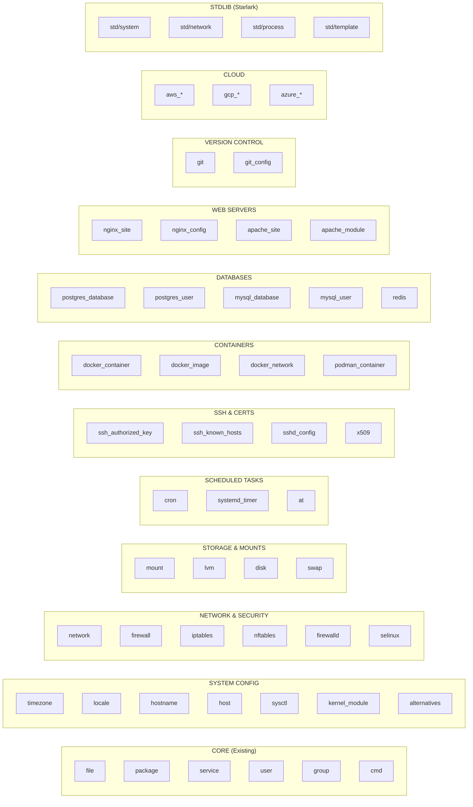
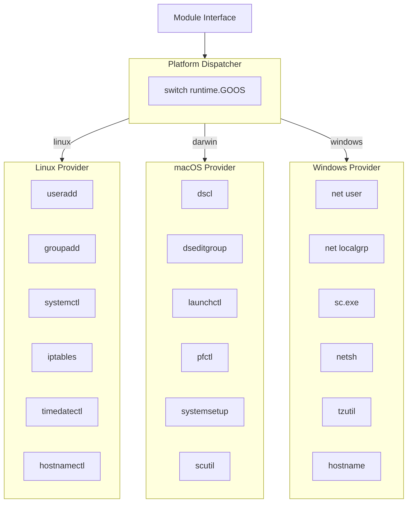

# Epic 16: Standard Library System Modules

## Overview

Expand Keystone Core's standard library with comprehensive system management modules that cover everyday infrastructure administration tasks. This epic adds cross-platform primitives for network configuration, firewall management, scheduled tasks, mount points, SSH management, security contexts, and more. The goal is to provide out-of-the-box coverage for common system administration needs across Linux, macOS, and Windows.

**Goal**: Provide a comprehensive, cross-platform standard library that enables operators to manage 90% of common infrastructure tasks without writing custom modules. Inspired by [Salt Project's state modules](https://docs.saltproject.io/en/latest/ref/states/all/index.html).

## Success Criteria

- [ ] Cross-platform user/group management (Linux, macOS, Windows)
- [ ] Network interface configuration (IP, routes, DNS)
- [ ] Firewall management (iptables, nftables, firewalld, pf, Windows Firewall)
- [ ] Cron/scheduled tasks (cron, systemd timers, launchd, Task Scheduler)
- [ ] Mount point management (fstab, autofs)
- [ ] SSH management (authorized_keys, known_hosts, sshd_config)
- [ ] Timezone and locale configuration
- [ ] Hostname and hosts file management
- [ ] Security contexts (SELinux, AppArmor)
- [ ] Sysctl kernel parameters
- [ ] Kernel module management
- [ ] System alternatives (update-alternatives)
- [ ] LVM and disk management
- [ ] Container management (Docker, Podman)
- [ ] Database primitives (PostgreSQL, MySQL, Redis)
- [ ] Web server configuration (Nginx, Apache)
- [ ] Git repository management
- [ ] Certificate/PKI management
- [ ] All modules have >80% test coverage
- [ ] All modules documented with examples

## Current State

### Existing State Modules (pkg/statemgmt/)

| Module | States | Linux | macOS | Windows |
|--------|--------|-------|-------|---------|
| file | present, absent, directory, symlink | ✅ | ✅ | ⚠️ |
| package | installed, removed, latest, purged | ✅ | ✅ | ✅ |
| service | running, stopped, enabled, disabled | ✅ | ✅ | ✅ |
| user | present, absent | ✅ | ❌ | ❌ |
| group | present, absent | ✅ | ❌ | ❌ |
| cmd | run, wait | ✅ | ✅ | ✅ |
| k8s_namespace | present, absent | ✅ | ✅ | ✅ |
| k8s_deployment | deployed, scaled | ✅ | ✅ | ✅ |

### Existing Stdlib Modules (modules/stdlib/)

| Module | Capabilities | Purpose |
|--------|--------------|---------|
| std/files | fs.read, fs.write | File operations |
| std/exec | exec | Command execution |
| std/http | http.get, http.post | HTTP client |
| std/strings | (none) | String utilities |
| std/json | (none) | JSON encode/decode |
| std/crypto | exec, fs.write | Hashing |

### Gaps Identified

1. **Cross-platform user/group**: macOS and Windows not implemented
2. **Network configuration**: Not implemented
3. **Firewall management**: Not implemented
4. **Scheduled tasks**: Not implemented (cron, systemd timers)
5. **Mount management**: Not implemented
6. **SSH management**: Not implemented
7. **Timezone/locale**: Not implemented
8. **Hostname/hosts**: Not implemented
9. **Security contexts**: Not implemented (SELinux, AppArmor)
10. **Sysctl**: Not implemented
11. **Kernel modules**: Not implemented
12. **Container management**: Not implemented
13. **Database primitives**: Not implemented

## Architecture

### Module Categories

### Cross-Platform Strategy

## User Stories

### US16.1: Cross-Platform User Management
**As a** platform operator
**I want** user management to work on Linux, macOS, and Windows
**So that** I can manage users consistently across my fleet

**Acceptance Criteria**:
- Linux: useradd, usermod, userdel (existing)
- macOS: dscl commands for user management
- Windows: net user, PowerShell AD cmdlets
- Consistent parameter names across platforms
- Platform-specific features exposed via metadata

### US16.2: Network Interface Configuration
**As a** platform operator
**I want** to configure network interfaces declaratively
**So that** I can manage IP addresses, routes, and DNS

**Acceptance Criteria**:
- Configure static/DHCP IP addresses
- Manage default routes and static routes
- Configure DNS servers and search domains
- Support for VLANs and bonding (Linux)
- Handle NetworkManager, netplan, ifupdown

### US16.3: Firewall Management
**As a** security administrator
**I want** cross-platform firewall management
**So that** I can enforce network security policies

**Acceptance Criteria**:
- Linux: iptables, nftables, firewalld
- macOS: pf (packet filter)
- Windows: Windows Firewall (netsh advfirewall)
- Abstract rule definition (protocol, port, action)
- Zone/profile management where applicable

### US16.4: Scheduled Tasks
**As a** platform operator
**I want** cross-platform scheduled task management
**So that** I can automate recurring operations

**Acceptance Criteria**:
- Linux: cron, systemd timers
- macOS: launchd (plist generation)
- Windows: Task Scheduler
- Standard schedule syntax (cron-like)
- Job enable/disable/status

### US16.5: Mount Point Management
**As a** platform operator
**I want** to manage filesystem mounts declaratively
**So that** storage is consistently configured

**Acceptance Criteria**:
- Configure fstab entries (Linux)
- Mount/unmount filesystems
- Support for NFS, CIFS, local filesystems
- Handle mount options
- Automount configuration

### US16.6: SSH Configuration
**As a** security administrator
**I want** to manage SSH configuration declaratively
**So that** access is secure and auditable

**Acceptance Criteria**:
- Manage authorized_keys for users
- Manage known_hosts entries
- Configure sshd_config settings
- SSH key generation
- Key rotation support

### US16.7: Timezone and Locale
**As a** platform operator
**I want** to configure timezone and locale
**So that** systems have consistent time and language settings

**Acceptance Criteria**:
- Set system timezone
- Configure locale settings
- Cross-platform support
- Validate timezone/locale names

### US16.8: Hostname and Hosts
**As a** platform operator
**I want** to manage hostname and /etc/hosts
**So that** name resolution is consistent

**Acceptance Criteria**:
- Set system hostname (transient and persistent)
- Manage /etc/hosts entries
- Cross-platform hostname setting
- FQDN support

### US16.9: Security Contexts
**As a** security administrator
**I want** to manage SELinux and AppArmor
**So that** mandatory access control is enforced

**Acceptance Criteria**:
- SELinux: mode, contexts, booleans, policies
- AppArmor: mode, profiles
- Detect which system is in use
- Graceful handling when neither is present

### US16.10: Container Management
**As a** platform operator
**I want** to manage containers declaratively
**So that** container workloads are consistent

**Acceptance Criteria**:
- Docker container state (running, stopped, absent)
- Docker image management (pulled, absent)
- Podman support (same interface)
- Network and volume management
- Registry authentication

### US16.11: Database Primitives
**As a** platform operator
**I want** to manage database resources declaratively
**So that** databases are consistently configured

**Acceptance Criteria**:
- PostgreSQL: databases, users, extensions
- MySQL/MariaDB: databases, users, grants
- Redis: configuration, ACLs
- Connection via socket or TCP
- Credential management

### US16.12: Web Server Configuration
**As a** platform operator
**I want** to manage web server configuration declaratively
**So that** web services are consistent

**Acceptance Criteria**:
- Nginx: sites, upstreams, includes
- Apache: sites, modules, virtual hosts
- Configuration validation before apply
- Graceful reload on changes

## Technical Tasks

### Phase 1: Cross-Platform User/Group (Week 1-2)

**T1.1: macOS User Management**
- Implement dscl-based user operations (pkg/statemgmt/module_user_darwin.go)
- Create user: `dscl . -create /Users/<name>`
- Set properties: uid, gid, home, shell
- Delete user: `dscl . -delete /Users/<name>`
- List users: `dscl . -list /Users`
- Get user info: `dscl . -read /Users/<name>`

**T1.2: macOS Group Management**
- Implement dseditgroup-based group operations
- Create group: `dseditgroup -o create <name>`
- Modify members: `dseditgroup -o edit -a/-d <user> -t user <group>`
- Delete group: `dseditgroup -o delete <name>`
- List groups: `dscl . -list /Groups`

**T1.3: Windows User Management**
- Implement net user/PowerShell operations (pkg/statemgmt/module_user_windows.go)
- Create user: `net user <name> <password> /add`
- Set properties: fullname, comment, homedir
- Delete user: `net user <name> /delete`
- PowerShell fallback for advanced properties
- Local vs domain user detection

**T1.4: Windows Group Management**
- Implement net localgroup operations
- Create group: `net localgroup <name> /add`
- Modify members: `net localgroup <name> <user> /add`
- Delete group: `net localgroup <name> /delete`
- Local vs domain group handling

**T1.5: Platform Dispatcher Pattern**
- Create platform provider interface
- Implement runtime.GOOS dispatch
- Unified error handling
- Platform capability detection

### Phase 2: Network Configuration (Week 3-4)

**T2.1: Network Module Design**
- Define network module interface (pkg/statemgmt/module_network.go)
- States: configured, absent
- Parameters: interface, address, netmask, gateway, dns, mtu

**T2.2: Linux Network Providers**
- NetworkManager provider (nmcli)
- netplan provider (YAML generation)
- ifupdown provider (/etc/network/interfaces)
- systemd-networkd provider
- Auto-detect active network manager

**T2.3: macOS Network Provider**
- networksetup command integration
- Interface configuration
- DNS configuration
- Route management

**T2.4: Windows Network Provider**
- netsh interface ip commands
- PowerShell Set-NetIPAddress
- DNS configuration
- DHCP vs static detection

**T2.5: Route Management**
- Static route module (pkg/statemgmt/module_route.go)
- States: present, absent
- Parameters: destination, gateway, interface, metric
- Cross-platform route commands

### Phase 3: Firewall Management (Week 5-6)

**T3.1: Firewall Abstraction Layer**
- Define firewall module interface (pkg/statemgmt/module_firewall.go)
- Abstract rule definition: protocol, port, source, dest, action
- Zone/profile concept (where applicable)
- Rule ordering

**T3.2: iptables Provider**
- iptables command integration
- Chain management (INPUT, OUTPUT, FORWARD)
- Rule insertion/deletion
- Persistent rules (iptables-save/restore)

**T3.3: nftables Provider**
- nft command integration
- Table/chain/rule management
- Atomic ruleset loading
- Export/import rulesets

**T3.4: firewalld Provider**
- firewall-cmd integration
- Zone management
- Service/port rules
- Rich rules support

**T3.5: pf Provider (macOS/BSD)**
- pfctl integration
- Rule generation
- Anchor management
- Table management

**T3.6: Windows Firewall Provider**
- netsh advfirewall integration
- Rule creation/deletion
- Profile management (domain, private, public)
- PowerShell fallback

### Phase 4: Scheduled Tasks (Week 7-8)

**T4.1: Cron Module**
- Define cron module (pkg/statemgmt/module_cron.go)
- States: present, absent
- Parameters: minute, hour, day, month, weekday, command, user
- Crontab file management
- System vs user crontabs

**T4.2: Systemd Timer Module**
- Define systemd_timer module
- Timer unit file generation
- Service unit file generation
- Enable/disable timers
- OnCalendar syntax support

**T4.3: launchd Module (macOS)**
- Define launchd module
- Plist file generation
- StartInterval, StartCalendarInterval
- Load/unload agents/daemons
- User vs system LaunchAgents

**T4.4: Windows Task Scheduler Module**
- Define scheduled_task module
- schtasks.exe integration
- Trigger configuration (daily, weekly, etc.)
- Action configuration
- PowerShell fallback for complex tasks

**T4.5: At Module (One-Time Tasks)**
- Define at module for one-time execution
- Cross-platform at command
- Time specification parsing

### Phase 5: Mount and Storage (Week 9-10)

**T5.1: Mount Module**
- Define mount module (pkg/statemgmt/module_mount.go)
- States: mounted, unmounted, present, absent
- Parameters: device, path, fstype, opts, dump, pass
- /etc/fstab management
- Active mount management

**T5.2: Swap Module**
- Define swap module
- States: enabled, disabled
- Swap file creation
- Swap partition management
- /etc/fstab swap entries

**T5.3: LVM Module**
- Define lvm_pv, lvm_vg, lvm_lv modules
- Physical volume management
- Volume group management
- Logical volume management
- Resize operations

**T5.4: Disk Module**
- Partition management (parted/fdisk)
- Filesystem creation (mkfs)
- Label management
- UUID handling

### Phase 6: SSH and Security (Week 11-12)

**T6.1: SSH Authorized Keys Module**
- Define ssh_authorized_key module (pkg/statemgmt/module_ssh.go)
- States: present, absent
- Parameters: user, key, type, comment, options
- Key file path detection
- Key validation

**T6.2: SSH Known Hosts Module**
- Define ssh_known_hosts module
- States: present, absent
- Parameters: name, key, hash_known_hosts
- System vs user known_hosts
- ssh-keyscan integration

**T6.3: SSHD Config Module**
- Define sshd_config module
- States: present, absent
- Parameter validation
- Config file backup
- Service reload on change

**T6.4: SELinux Module**
- Define selinux module (pkg/statemgmt/module_selinux.go)
- Mode management (enforcing, permissive, disabled)
- Boolean management (setsebool)
- Context management (semanage, chcon)
- Policy module management

**T6.5: AppArmor Module**
- Define apparmor module
- Mode management (enforce, complain, disable)
- Profile management
- Profile reload

### Phase 7: System Configuration (Week 13-14)

**T7.1: Timezone Module**
- Define timezone module (pkg/statemgmt/module_timezone.go)
- States: present
- Cross-platform timezone setting
- Linux: timedatectl, /etc/localtime
- macOS: systemsetup -settimezone
- Windows: tzutil

**T7.2: Locale Module**
- Define locale module
- States: present
- Linux: localectl, /etc/locale.conf
- Generate locales
- Set LANG, LC_* variables

**T7.3: Hostname Module**
- Define hostname module (pkg/statemgmt/module_hostname.go)
- States: present
- Transient and persistent hostname
- Linux: hostnamectl
- macOS: scutil --set HostName
- Windows: hostname, Rename-Computer

**T7.4: Host Module (hosts file)**
- Define host module
- States: present, absent
- Parameters: name, ip, aliases
- /etc/hosts management
- Windows: C:\Windows\System32\drivers\etc\hosts

**T7.5: Sysctl Module**
- Define sysctl module (pkg/statemgmt/module_sysctl.go)
- States: present, absent
- Parameters: name, value, permanent
- /etc/sysctl.conf management
- Runtime application (sysctl -w)

**T7.6: Kernel Module Management**
- Define kernel_module module
- States: loaded, unloaded, blacklisted
- modprobe/rmmod commands
- /etc/modprobe.d management
- Module parameters

**T7.7: Alternatives Module**
- Define alternatives module
- States: set, auto
- update-alternatives integration
- Priority management

### Phase 8: Container Management (Week 15-16)

**T8.1: Docker Container Module**
- Define docker_container module (pkg/statemgmt/module_docker.go)
- States: running, stopped, absent
- Parameters: image, name, ports, volumes, env, networks
- Container lifecycle management
- Health check support

**T8.2: Docker Image Module**
- Define docker_image module
- States: present, absent
- Parameters: name, tag, force
- Image pull/remove
- Registry authentication

**T8.3: Docker Network Module**
- Define docker_network module
- States: present, absent
- Parameters: name, driver, subnet, gateway
- Network creation/removal

**T8.4: Docker Volume Module**
- Define docker_volume module
- States: present, absent
- Parameters: name, driver, opts
- Volume creation/removal

**T8.5: Podman Support**
- Podman container module (same interface as Docker)
- Podman image/network/volume modules
- Auto-detect Docker vs Podman
- Rootless container support

### Phase 9: Database Primitives (Week 17-18)

**T9.1: PostgreSQL Database Module**
- Define postgres_database module (pkg/statemgmt/module_postgres.go)
- States: present, absent
- Parameters: name, owner, encoding, template
- Connection via socket/TCP
- psql command integration

**T9.2: PostgreSQL User Module**
- Define postgres_user module
- States: present, absent
- Parameters: name, password, roles (SUPERUSER, CREATEDB, etc.)
- Role membership
- Password hashing

**T9.3: PostgreSQL Extension Module**
- Define postgres_extension module
- States: present, absent
- Extension management (CREATE EXTENSION)

**T9.4: MySQL Database Module**
- Define mysql_database module (pkg/statemgmt/module_mysql.go)
- States: present, absent
- Parameters: name, collation, encoding
- mysql command integration

**T9.5: MySQL User Module**
- Define mysql_user module
- States: present, absent
- Parameters: name, host, password, priv
- Grant management

**T9.6: Redis Module**
- Define redis module (pkg/statemgmt/module_redis.go)
- Configuration management
- ACL user management
- redis-cli integration

### Phase 10: Web Server Configuration (Week 19-20)

**T10.1: Nginx Site Module**
- Define nginx_site module (pkg/statemgmt/module_nginx.go)
- States: enabled, disabled, absent
- Site configuration file management
- sites-available/sites-enabled pattern
- Validation (nginx -t)

**T10.2: Nginx Config Module**
- Define nginx_config module
- Snippet management
- Include file management
- Graceful reload

**T10.3: Apache Site Module**
- Define apache_site module (pkg/statemgmt/module_apache.go)
- States: enabled, disabled, absent
- a2ensite/a2dissite integration
- Virtual host configuration

**T10.4: Apache Module Management**
- Define apache_module module
- States: enabled, disabled
- a2enmod/a2dismod integration
- Module configuration

### Phase 11: Version Control (Week 21)

**T11.1: Git Module**
- Define git module (pkg/statemgmt/module_git.go)
- States: present, absent, latest
- Parameters: repo, dest, version, force, depth
- SSH key authentication
- Submodule support

**T11.2: Git Config Module**
- Define git_config module
- States: present, absent
- Parameters: name, value, scope (global, system, local)
- Config file management

### Phase 12: Certificates (Week 22)

**T12.1: X509 Certificate Module**
- Define x509 module (pkg/statemgmt/module_x509.go)
- States: present, absent
- Self-signed certificate generation
- CSR generation
- Private key generation

**T12.2: Certificate Authority Module**
- Define ca module
- CA certificate/key management
- Certificate signing
- CRL management

**T12.3: ACME/Let's Encrypt Module**
- Define acme module
- Certificate request
- Challenge handling (HTTP-01, DNS-01)
- Renewal automation

### Phase 13: Stdlib Modules (Week 23-24)

**T13.1: std/system Module**
- System information (CPU, memory, disk)
- Process management (list, signal)
- Reboot/shutdown
- Uptime, load average

**T13.2: std/network Module**
- Ping/connectivity checks
- DNS resolution
- Port scanning
- IP validation

**T13.3: std/process Module**
- Process listing
- Process signal (kill, HUP)
- Process wait
- pgrep/pkill wrappers

**T13.4: std/template Module**
- Jinja2-like template rendering
- Variable substitution
- Filters and functions
- Template caching

**T13.5: std/archive Module**
- Archive extraction (tar, zip, gzip, bz2)
- Archive creation
- File listing
- Compression level control

**T13.6: std/ini Module**
- INI file parsing
- Section/key/value manipulation
- Write INI files
- Windows registry-style support

**T13.7: std/yaml Module**
- YAML parsing
- YAML generation
- Multi-document support
- Anchor/alias handling

### Phase 14: Testing & Documentation (Week 25-26)

**T14.1: Unit Tests**
- Tests for all new modules
- Platform-specific test mocking
- Edge case coverage
- Target: >80% coverage

**T14.2: Integration Tests**
- Docker-based integration tests
- Multi-platform test matrix (Ubuntu, Alpine, macOS, Windows)
- Real service testing (PostgreSQL, Nginx, etc.)
- E2E workflow tests

**T14.3: Documentation**
- Module reference documentation
- Parameter descriptions
- Example usage for each module
- Cross-platform notes
- Troubleshooting guides

**T14.4: Examples**
- Example state files for common scenarios
- Multi-module workflows
- Cross-platform examples
- Production patterns

## Module Reference Summary

### State Modules (pkg/statemgmt/)

| Category | Module | States | Linux | macOS | Windows |
|----------|--------|--------|-------|-------|---------|
| **Core** | file | present, absent, directory, symlink | ✅ | ✅ | ✅ |
| | package | installed, removed, latest, purged | ✅ | ✅ | ✅ |
| | service | running, stopped, enabled, disabled | ✅ | ✅ | ✅ |
| | user | present, absent | ✅ | ✅ | ✅ |
| | group | present, absent | ✅ | ✅ | ✅ |
| | cmd | run, wait | ✅ | ✅ | ✅ |
| **Network** | network | configured, absent | ✅ | ✅ | ✅ |
| | route | present, absent | ✅ | ✅ | ✅ |
| | firewall | present, absent | ✅ | ✅ | ✅ |
| | iptables | present, absent | ✅ | - | - |
| | nftables | present, absent | ✅ | - | - |
| | firewalld | present, absent | ✅ | - | - |
| **Schedule** | cron | present, absent | ✅ | ✅ | - |
| | systemd_timer | present, absent | ✅ | - | - |
| | launchd | present, absent | - | ✅ | - |
| | scheduled_task | present, absent | - | - | ✅ |
| **Storage** | mount | mounted, unmounted, present, absent | ✅ | ✅ | ✅ |
| | swap | enabled, disabled | ✅ | - | - |
| | lvm_lv | present, absent | ✅ | - | - |
| **SSH** | ssh_authorized_key | present, absent | ✅ | ✅ | ✅ |
| | ssh_known_hosts | present, absent | ✅ | ✅ | ✅ |
| | sshd_config | present, absent | ✅ | ✅ | - |
| **Security** | selinux | enforcing, permissive, disabled | ✅ | - | - |
| | apparmor | enforce, complain, disable | ✅ | - | - |
| **System** | timezone | present | ✅ | ✅ | ✅ |
| | locale | present | ✅ | - | - |
| | hostname | present | ✅ | ✅ | ✅ |
| | host | present, absent | ✅ | ✅ | ✅ |
| | sysctl | present, absent | ✅ | ✅ | - |
| | kernel_module | loaded, unloaded, blacklisted | ✅ | - | - |
| | alternatives | set, auto | ✅ | - | - |
| **Container** | docker_container | running, stopped, absent | ✅ | ✅ | ✅ |
| | docker_image | present, absent | ✅ | ✅ | ✅ |
| | docker_network | present, absent | ✅ | ✅ | ✅ |
| | docker_volume | present, absent | ✅ | ✅ | ✅ |
| **Database** | postgres_database | present, absent | ✅ | ✅ | ✅ |
| | postgres_user | present, absent | ✅ | ✅ | ✅ |
| | postgres_extension | present, absent | ✅ | ✅ | ✅ |
| | mysql_database | present, absent | ✅ | ✅ | ✅ |
| | mysql_user | present, absent | ✅ | ✅ | ✅ |
| | redis | present, absent | ✅ | ✅ | ✅ |
| **Web** | nginx_site | enabled, disabled, absent | ✅ | ✅ | - |
| | apache_site | enabled, disabled, absent | ✅ | ✅ | - |
| | apache_module | enabled, disabled | ✅ | ✅ | - |
| **VCS** | git | present, absent, latest | ✅ | ✅ | ✅ |
| | git_config | present, absent | ✅ | ✅ | ✅ |
| **PKI** | x509 | present, absent | ✅ | ✅ | ✅ |

### Stdlib Modules (modules/stdlib/)

| Module | Capabilities | Purpose |
|--------|--------------|---------|
| std/files | fs.read, fs.write | File operations (existing) |
| std/exec | exec | Command execution (existing) |
| std/http | http.get, http.post | HTTP client (existing) |
| std/strings | (none) | String utilities (existing) |
| std/json | (none) | JSON encode/decode (existing) |
| std/crypto | exec, fs.write | Hashing (existing) |
| std/system | exec | System info, process mgmt (new) |
| std/network | exec | Network utilities (new) |
| std/process | exec | Process management (new) |
| std/template | fs.read, fs.write | Template rendering (new) |
| std/archive | exec, fs.read, fs.write | Archive handling (new) |
| std/ini | fs.read, fs.write | INI file handling (new) |
| std/yaml | (none) | YAML parsing (new) |

## Dependencies

- **Epic 8** (Multi-Environment) - Platform detection infrastructure
- **Go Libraries**:
  - `github.com/shirou/gopsutil/v3` - System info (already used)
  - Existing platform detection (pkg/platform/)

## Risks & Mitigations

| Risk | Impact | Probability | Mitigation |
|------|--------|-------------|------------|
| Platform fragmentation | High | High | Comprehensive testing, platform abstraction |
| Breaking changes to APIs | Medium | Medium | Semantic versioning, deprecation warnings |
| Security vulnerabilities | High | Low | Input validation, privilege checks |
| Performance overhead | Medium | Low | Lazy detection, caching |
| Maintenance burden | Medium | High | Clear ownership, community contributions |
| Edge cases on obscure distros | Low | Medium | Graceful degradation, documentation |

## Testing Strategy

### Unit Tests
- Mock system commands
- Platform-specific test tags
- Parameter validation tests
- State transition tests

### Integration Tests
- Docker containers for Linux variants
- macOS VMs for Darwin testing
- Windows VMs for Windows testing
- Real service testing (PostgreSQL, etc.)

### Platform Matrix

| OS | Variants |
|----|----------|
| Linux | Ubuntu 22.04, Debian 12, CentOS 9, Alpine 3.18, Arch |
| macOS | Ventura (13), Sonoma (14) |
| Windows | Server 2019, Server 2022, 11 |

## Documentation Requirements

- [ ] Module reference for all 40+ modules
- [ ] Cross-platform compatibility matrix
- [ ] Parameter reference with examples
- [ ] Common patterns and recipes
- [ ] Troubleshooting guide per module
- [ ] Migration guide from Salt

## Definition of Done

- [ ] All 40+ state modules implemented
- [ ] All 7 new stdlib modules implemented
- [ ] Cross-platform user/group working (Linux, macOS, Windows)
- [ ] Network configuration working
- [ ] Firewall management working
- [ ] Scheduled tasks working (cron, systemd, launchd, Task Scheduler)
- [ ] Mount management working
- [ ] SSH management working
- [ ] Timezone/locale working
- [ ] Container management working
- [ ] Database primitives working
- [ ] >80% test coverage
- [ ] Documentation complete
- [ ] Integration tests passing

## Timeline

Total: **26 weeks** (6.5 months)

- **Weeks 1-2**: Cross-platform user/group
- **Weeks 3-4**: Network configuration
- **Weeks 5-6**: Firewall management
- **Weeks 7-8**: Scheduled tasks
- **Weeks 9-10**: Mount and storage
- **Weeks 11-12**: SSH and security
- **Weeks 13-14**: System configuration
- **Weeks 15-16**: Container management
- **Weeks 17-18**: Database primitives
- **Weeks 19-20**: Web server configuration
- **Week 21**: Version control
- **Week 22**: Certificates
- **Weeks 23-24**: Stdlib modules
- **Weeks 25-26**: Testing & documentation

## Future Enhancements (Post-Epic)

- **Cloud Provider Modules**: AWS, GCP, Azure resource management
- **Virtualization Modules**: KVM, VirtualBox, VMware
- **Monitoring Modules**: Prometheus, Nagios, Zabbix configuration
- **Message Queue Modules**: RabbitMQ, Kafka configuration
- **Load Balancer Modules**: HAProxy, Traefik configuration
- **DNS Modules**: BIND, PowerDNS, Route53
- **LDAP Modules**: OpenLDAP, Active Directory
- **Backup Modules**: Restic, Borg, Bacula

## References

- [Salt Project State Modules](https://docs.saltproject.io/en/latest/ref/states/all/index.html)
- [Ansible Modules](https://docs.ansible.com/ansible/latest/collections/index_module.html)
- [Puppet Resource Types](https://www.puppet.com/docs/puppet/latest/type.html)
