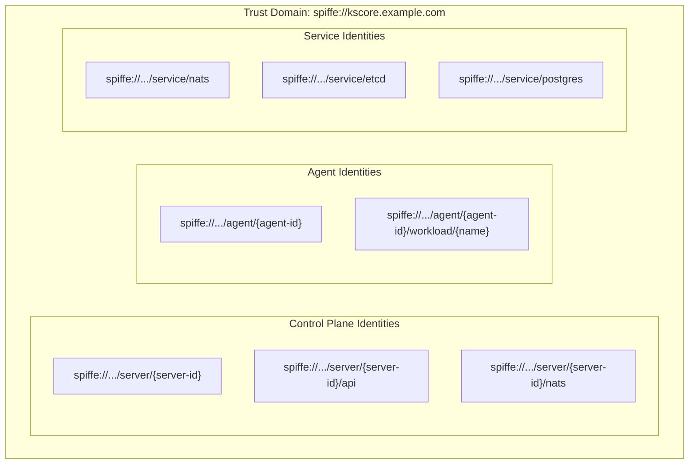
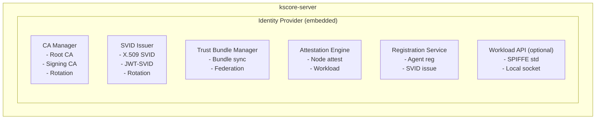
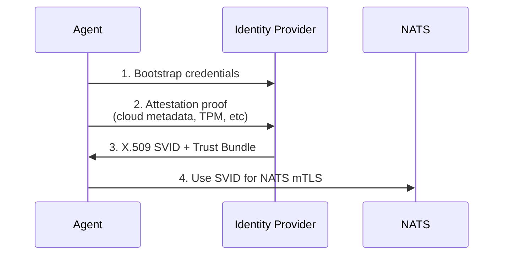
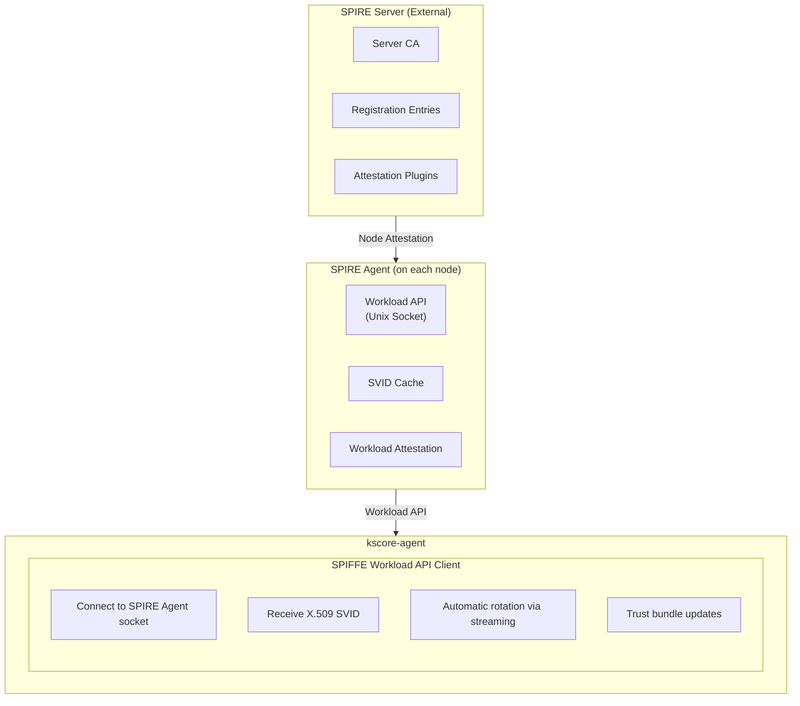
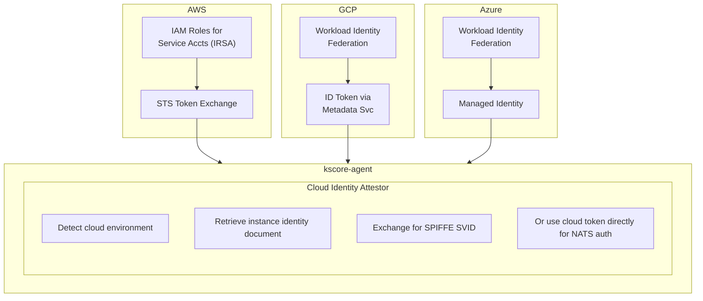

# Epic 17: SPIFFE/SPIRE Identity Framework

## Overview

Implement comprehensive SPIFFE (Secure Production Identity Framework For Everyone) support for Keystone Core, providing cryptographically verifiable workload identity for all agents and servers. This epic delivers both an embedded identity provider (simple to setup, suitable as default) and integration with external SPIFFE-compatible systems (SPIRE, Istio, Consul Connect, cloud provider workload identity).

**Goal**: Replace static credentials with dynamic, automatically-rotated, cryptographically-verifiable identities that work seamlessly across deployment environments. Make secure identity the default experience without requiring external infrastructure.

**Key Principle**: The embedded solution should be simple enough to become the new default for Keystone Core deployments, while external integrations provide enterprise flexibility.

## Success Criteria

- [ ] Embedded SPIFFE identity provider works out-of-the-box with zero configuration
- [ ] Agents automatically receive SVID (SPIFFE Verifiable Identity Document) on registration
- [ ] SVIDs automatically rotate before expiry with zero downtime
- [ ] mTLS between all components using SPIFFE identities
- [ ] NATS authentication uses SPIFFE SVIDs (integrates with Epic 14 bootstrap)
- [ ] External SPIRE server integration fully functional
- [ ] Cloud workload identity integration (AWS, GCP, Azure)
- [ ] Istio/Consul Connect service mesh integration
- [ ] E2E tests cover all identity scenarios
- [ ] Migration path from static credentials to SPIFFE
- [ ] Documentation enables self-service adoption
- [ ] Embedded solution is simple enough to be default (< 5 minutes to understand)

## Problem Statement

**Current State:**
- Agents authenticate with static tokens or pre-shared keys
- Credential rotation requires manual intervention or restarts
- No standardized identity format across deployment environments
- Cloud deployments use cloud-specific identity mechanisms
- Service mesh environments have separate identity systems
- No cryptographic proof of workload identity
- Bootstrap credentials (Epic 14) need secure identity verification

**Target State:**
- All workloads have SPIFFE identities (spiffe://trust-domain/agent/agent-id)
- SVIDs issued automatically, rotated automatically
- Single identity standard works everywhere (cloud, on-prem, edge, mesh)
- Zero-trust security model with cryptographic attestation
- Embedded solution requires no external dependencies
- External SPIRE/mesh integration for enterprise environments
- NATS authentication seamlessly uses SPIFFE SVIDs

## Architecture

### SPIFFE Identity Model

**Trust Domain**: `spiffe://kscore.example.com`



### Embedded Identity Provider Architecture



**Registration Flow:**



### External SPIRE Integration Architecture



### Cloud Workload Identity Integration



## User Stories

### US17.1: Zero-Configuration Embedded Identity
**As a** new Keystone Core user
**I want to** secure identity to work automatically without configuration
**So that** I get secure-by-default behavior without learning SPIFFE

**Acceptance Criteria**:
- `kscore-server` starts with embedded identity provider by default
- Trust domain auto-generated from cluster name (spiffe://kscore-{cluster-id})
- Root CA auto-generated and persisted securely
- Agents automatically receive SVIDs on registration
- mTLS enabled by default for all internal communication
- No manual certificate management required
- Upgrade path from existing deployments
- Setup takes < 5 minutes to understand

### US17.2: Agent SVID Lifecycle
**As a** platform operator
**I want to** agents to automatically receive and rotate SVIDs
**So that** I don't need to manage agent certificates manually

**Acceptance Criteria**:
- Agent receives X.509 SVID during registration
- SVID automatically rotates before expiry (default: 1 hour, configurable)
- Rotation happens without agent restart
- Failed rotation triggers alert but doesn't immediately break connectivity
- Grace period for rotation failures (default: 10 minutes)
- SVID includes agent metadata (labels, roles) in SPIFFE ID path
- Audit log for all SVID issuance and rotation

### US17.3: NATS Authentication with SVID
**As a** platform operator
**I want to** NATS to authenticate agents using their SVIDs
**So that** I have unified identity across all components

**Acceptance Criteria**:
- NATS configured for mTLS with SPIFFE SVIDs
- Agent SVID used for NATS client authentication
- Server SVID used for NATS server authentication
- NATS authorization based on SPIFFE ID (subject mappings)
- Trust bundle automatically distributed to NATS
- Certificate rotation seamless (no disconnection)
- Integrates with Epic 14 bootstrap flow

### US17.4: External SPIRE Server Integration
**As a** enterprise platform operator
**I want to** use my existing SPIRE infrastructure
**So that** I have consistent identity across all workloads

**Acceptance Criteria**:
- Agent can use SPIRE Workload API for SVID
- Configure SPIRE socket path
- Automatic SVID rotation via SPIRE streaming API
- Trust bundle from SPIRE server
- Node attestation via SPIRE (not Keystone Core)
- Workload attestation supports Keystone Core agents
- Fallback to embedded if SPIRE unavailable (configurable)

### US17.5: Cloud Workload Identity
**As a** cloud platform operator
**I want to** agents to use cloud-native identity
**So that** I don't need separate identity infrastructure

**Acceptance Criteria**:
- AWS: IAM Roles for Service Accounts (IRSA) / EC2 instance roles
- GCP: Workload Identity Federation / Instance identity
- Azure: Managed Identity / Workload Identity Federation
- Auto-detect cloud environment
- Exchange cloud token for SVID or use directly
- Support for OIDC token federation
- Works with cloud-managed Kubernetes (EKS, GKE, AKS)

### US17.6: Service Mesh Integration
**As a** platform operator running service mesh
**I want to** Keystone Core to integrate with mesh identity
**So that** I have unified identity across infrastructure and applications

**Acceptance Criteria**:
- Istio: Use Citadel-issued certificates
- Consul Connect: Use Connect certificates
- Linkerd: Use identity certificates
- Auto-detect service mesh environment
- Use mesh-provided SVID for Keystone Core communication
- Trust bundle from mesh control plane
- Support mesh-less and mesh-enabled agents in same cluster

### US17.7: Trust Domain Federation
**As a** multi-cluster operator
**I want to** federate trust between Keystone Core clusters
**So that** agents in different clusters can verify each other

**Acceptance Criteria**:
- Export trust bundle for federation
- Import external trust bundles
- Cross-cluster agent communication with mutual TLS
- Trust bundle rotation without downtime
- Selective federation (not all-or-nothing)
- Works with NATS superclusters (Epic 14)

### US17.8: Certificate Transparency and Auditing
**As a** security engineer
**I want to** audit all certificate issuance
**So that** I can detect unauthorized certificates

**Acceptance Criteria**:
- Log all SVID issuance events
- Log all SVID rotation events
- Log all attestation decisions (accept/reject)
- Log all trust bundle updates
- Exportable to SIEM systems
- Alerting on anomalous patterns (too many certs, unexpected attestation)
- Optional: Certificate Transparency log integration

### US17.9: Migration from Static Credentials
**As a** existing Keystone Core user
**I want to** migrate from static credentials to SPIFFE
**So that** I can upgrade security without downtime

**Acceptance Criteria**:
- Dual-mode operation (accept both static and SVID)
- Gradual migration with per-agent control
- Migration status dashboard
- Automatic fallback if SVID fails
- Deprecation warnings for static credentials
- Hard cutover date configuration
- Rollback capability

## Technical Tasks

### Phase 1: Embedded Identity Provider Foundation (Week 1-4)

**T1.1: Identity Provider Core**
- Create identity provider package (pkg/identity/provider.go)
  - IdentityProvider interface
  - EmbeddedProvider implementation
  - ExternalProvider interface (for SPIRE, cloud, mesh)
- Configuration structures
  - Trust domain configuration
  - CA configuration (auto-generate vs bring-your-own)
  - SVID TTL settings
  - Rotation settings
- Provider lifecycle management
  - Start/Stop/Health
  - Graceful shutdown
  - State persistence

**T1.2: Certificate Authority Manager**
- CA implementation (pkg/identity/ca.go)
  - Root CA generation (ECDSA P-256 or P-384)
  - Signing CA (intermediate) generation
  - CA rotation support
  - CA persistence (encrypted at rest)
- Certificate operations
  - Generate X.509 SVID
  - Generate JWT-SVID (for NATS JWT auth)
  - Certificate signing with proper extensions
  - SPIFFE ID encoding in SAN
- Trust bundle management
  - Bundle generation from CA chain
  - Bundle versioning
  - Bundle distribution endpoints

**T1.3: Attestation Engine**
- Attestation framework (pkg/identity/attestation.go)
  - Attestor interface
  - AttestationContext with evidence
  - AttestationResult with SPIFFE ID
- Built-in attestors
  - JoinTokenAttestor (simple shared secret)
  - NoneAttestor (trust all - dev only)
- Cloud attestors (placeholder for Phase 3)
  - AWSAttestor interface
  - GCPAttestor interface
  - AzureAttestor interface
- Attestation policy
  - SPIFFE ID generation rules
  - Agent metadata to SPIFFE path mapping
  - Deny rules for suspicious attestation
- **Bootstrap credential source with embedded SPIFFE**:
  ```
  ┌─────────────────────────────────────────────────────────────────────┐
  │         Bootstrap Credentials with Embedded SPIFFE                  │
  │                                                                     │
  │  Q: Where do bootstrap credentials come from if SPIFFE is default? │
  │  A: Join tokens (one-time secrets) used for initial attestation    │
  │                                                                     │
  │  ┌─────────────────────────────────────────────────────────────┐   │
  │  │  Option 1: Join Token (Recommended for Simple Deployments)  │   │
  │  │                                                              │   │
  │  │  1. Operator generates join token via CLI/API                │   │
  │  │     $ kscorectl agent token create --ttl 5m                  │   │
  │  │     → Returns: kscore_join_abc123xyz                         │   │
  │  │                                                              │   │
  │  │  2. Operator provisions token to agent (out-of-band)         │   │
  │  │     - Environment variable: KSCORE_JOIN_TOKEN                │   │
  │  │     - Config file: agent.yaml                                │   │
  │  │     - Cloud-init / user-data                                 │   │
  │  │                                                              │   │
  │  │  3. Agent uses token for Epic 14 bootstrap connection        │   │
  │  │     - Token is attestation evidence                          │   │
  │  │     - Server validates token, issues SVID                    │   │
  │  │     - Token consumed (one-time use)                          │   │
  │  └──────────────────────────────────────────────────────────────┘   │
  │                                                                     │
  │  ┌─────────────────────────────────────────────────────────────┐   │
  │  │  Option 2: Cloud Instance Identity (Zero-Touch)              │   │
  │  │                                                              │   │
  │  │  1. Agent auto-detects cloud environment                     │   │
  │  │  2. Agent fetches instance identity document (IMDSv2, etc)   │   │
  │  │  3. Agent uses identity document as attestation evidence     │   │
  │  │  4. Server validates signature, issues SVID                  │   │
  │  │                                                              │   │
  │  │  No bootstrap token needed - cloud identity IS the bootstrap │   │
  │  └──────────────────────────────────────────────────────────────┘   │
  │                                                                     │
  │  ┌─────────────────────────────────────────────────────────────┐   │
  │  │  Option 3: Kubernetes Service Account (Zero-Touch)           │   │
  │  │                                                              │   │
  │  │  1. Agent pod has service account token mounted              │   │
  │  │  2. Agent uses K8s token as attestation evidence             │   │
  │  │  3. Server validates token with K8s API, issues SVID         │   │
  │  └──────────────────────────────────────────────────────────────┘   │
  │                                                                     │
  │  Bootstrap credentials (Epic 14) are still used for NATS access    │
  │  during the attestation phase. The attestation evidence determines │
  │  WHAT the agent gets (SVID), not HOW it connects initially.        │
  └─────────────────────────────────────────────────────────────────────┘
  ```
  - Join token management:
    - Create tokens with TTL (default 5 minutes)
    - Bulk token creation for fleet provisioning
    - Token usage tracking and audit
    - Revoke unused tokens
  - Zero-touch attestation priority:
    1. Cloud instance identity (if detected)
    2. Kubernetes service account (if mounted)
    3. Join token (fallback)
    4. None (dev mode only, disabled by default)

**T1.4: SVID Issuer Service**
- SVID issuance (pkg/identity/issuer.go)
  - Issue X.509 SVID
  - Issue JWT-SVID
  - Batch issuance support
- SVID lifecycle
  - TTL management
  - Rotation scheduling
  - Grace period handling
- Integration with registration
  - Hook into Epic 14 registration flow
  - Replace bootstrap credentials with SVID
  - Atomic credential switch

**T1.5: Agent Identity Client**
- Identity client for agent (pkg/identity/client.go)
  - Connect to identity provider
  - Request SVID
  - Handle rotation notifications
  - Cache SVID locally
- X.509 SVID handling
  - Load SVID into TLS config
  - Watch for rotation
  - Graceful TLS connection migration
- Trust bundle handling
  - Receive trust bundle
  - Update TLS root CAs
  - Handle bundle rotation

**T1.6: NATS mTLS Integration**
- NATS TLS configuration
  - Configure NATS server with SVID
  - Configure NATS client with SVID
  - Trust bundle as root CAs
- SVID-based authorization
  - Map SPIFFE ID to NATS permissions
  - Dynamic permission updates on rotation
  - SPIFFE ID in NATS subject (optional)
- Integration with Epic 14
  - Replace bootstrap JWT with SVID
  - SVID issuance as part of registration
  - Seamless upgrade from bootstrap to full credentials
- **Credential transition mechanism** (addresses Epic 14 integration):
  ```
  ┌─────────────────────────────────────────────────────────────────────┐
  │              SVID Credential Transition Flow                        │
  │                                                                     │
  │  1. Agent connects with bootstrap credentials (Epic 14 T1.7)       │
  │     └── Bootstrap JWT/NKey with minimal permissions                │
  │                                                                     │
  │  2. Agent sends registration request with attestation evidence     │
  │     └── Cloud metadata, join token, or other attestation           │
  │                                                                     │
  │  3. Server validates attestation (IdentityVerifier interface)      │
  │     └── Epic 17 attestation engine implements this                 │
  │                                                                     │
  │  4. Server issues X.509 SVID (CredentialIssuer interface)          │
  │     └── Epic 17 SVID issuer implements this                        │
  │     └── Response includes: SVID cert, private key, trust bundle    │
  │                                                                     │
  │  5. Agent DISCONNECTS from NATS                                    │
  │     └── Clean disconnect, drain in-flight messages                 │
  │                                                                     │
  │  6. Agent RECONNECTS with SVID (mTLS)                              │
  │     └── New TLS connection using X.509 SVID as client cert         │
  │     └── NATS verifies SVID against trust bundle                    │
  │     └── SPIFFE ID extracted from SAN for authorization             │
  │                                                                     │
  │  7. Full agent permissions now available                           │
  │     └── Access to kscore.{cluster}.agent.{agent-id}.*              │
  └─────────────────────────────────────────────────────────────────────┘
  ```
  - Reconnection strategy (NOT TLS renegotiation):
    - NATS doesn't support TLS renegotiation
    - Agent must disconnect and reconnect with new credentials
    - JetStream ensures no message loss during brief disconnect
    - Reconnection typically < 100ms
  - Atomic transition:
    - Old credentials invalidated after SVID issued
    - No window where both credentials are valid
    - Rollback: agent can request new bootstrap credentials if SVID fails
- **SVID rotation without disconnect**:
  - Subsequent rotations use NATS's TLS config reload
  - Agent receives new SVID before old one expires
  - Agent updates TLS config in-place
  - Existing connections continue (session resumption)
  - New connections use new SVID

### Phase 2: Production Hardening (Week 5-8)

**T2.1: CA Security Hardening**
- Key protection
  - Encrypted key storage
  - HSM support (PKCS#11 interface)
  - Key encryption key (KEK) from environment/Vault
- CA rotation
  - Automated CA rotation before expiry
  - Dual-signing during rotation
  - Trust bundle includes old and new CA
- Disaster recovery
  - CA backup procedures
  - CA recovery procedures
  - Split-key recovery (optional)

**T2.2: SVID Rotation Robustness**
- Rotation reliability
  - Exponential backoff on failure
  - Multiple retry strategies
  - Fallback to cached SVID
- Connection continuity
  - TLS renegotiation support
  - Connection draining during rotation
  - No dropped requests during rotation
- Monitoring
  - SVID expiry metrics
  - Rotation success/failure metrics
  - Time until expiry tracking

**T2.3: High Availability**
- Multi-server identity provider
  - Leader election for CA operations
  - Replicated CA state
  - Consistent SVID issuance
- Trust bundle consistency
  - Bundle replication across servers
  - Version consistency checks
  - Eventual consistency guarantees
- Failover handling
  - Agent reconnects to new server
  - SVID remains valid during failover
  - No re-attestation required (within TTL)

**T2.4: Performance Optimization**
- SVID caching
  - Server-side SVID cache
  - Cache invalidation on rotation
  - Cache size limits
- Batch operations
  - Batch SVID issuance
  - Batch attestation
  - Parallel signing
- Connection pooling
  - Reuse TLS connections
  - Connection warm-up
  - Graceful connection cycling

### Phase 3: External Identity Providers (Week 9-14)

**T3.1: SPIRE Workload API Client**
- Workload API implementation (pkg/identity/spire/client.go)
  - Connect to SPIRE Agent socket
  - FetchX509SVID streaming
  - FetchJWTSVID
  - FetchX509Bundles
- SVID lifecycle via SPIRE
  - Streaming updates
  - Automatic rotation
  - Error handling
- Configuration
  - Socket path configuration
  - Fallback configuration
  - Health checks

**T3.2: SPIRE Server Integration**
- Registration entries (pkg/identity/spire/registration.go)
  - Create registration entries for agents
  - Parent/child relationship with SPIRE Agent
  - Selector configuration
- Node attestation support
  - Support SPIRE node attestors
  - Pass-through attestation
  - Custom attestor for Keystone Core
- Admin API integration (optional)
  - Create entries via SPIRE Admin API
  - Manage entries lifecycle
  - Sync with agent registration

**T3.3: AWS Identity Integration**
- EC2 instance identity (pkg/identity/aws/ec2.go)
  - IMDSv2 instance identity document
  - Signature verification
  - Role assumption
- IRSA integration (pkg/identity/aws/irsa.go)
  - Service account token projection
  - STS AssumeRoleWithWebIdentity
  - SVID exchange
- EKS Pod Identity (pkg/identity/aws/eks.go)
  - Pod Identity Agent integration
  - Automatic credential refresh

**T3.4: GCP Identity Integration**
- Instance identity (pkg/identity/gcp/instance.go)
  - Metadata server identity token
  - Instance identity verification
  - Service account impersonation
- Workload Identity Federation (pkg/identity/gcp/workload.go)
  - OIDC token exchange
  - STS token exchange
  - Automatic refresh
- GKE Workload Identity (pkg/identity/gcp/gke.go)
  - Kubernetes service account integration
  - Automatic identity binding

**T3.5: Azure Identity Integration**
- Managed Identity (pkg/identity/azure/managed.go)
  - IMDS token acquisition
  - System-assigned identity
  - User-assigned identity
- Workload Identity Federation (pkg/identity/azure/workload.go)
  - OIDC token exchange
  - Federated credential configuration
- AKS Workload Identity (pkg/identity/azure/aks.go)
  - Azure AD Workload Identity
  - Service account integration

**T3.6: Service Mesh Integration**
- Istio integration (pkg/identity/mesh/istio.go)
  - Citadel certificate detection
  - SDS (Secret Discovery Service) client
  - Pilot integration for identity
- Consul Connect integration (pkg/identity/mesh/consul.go)
  - Connect certificate acquisition
  - Consul Agent API integration
  - Intention-based authorization
- Linkerd integration (pkg/identity/mesh/linkerd.go)
  - Identity controller integration
  - mTLS certificate retrieval

### Phase 4: Trust Federation (Week 15-16)

**T4.1: Trust Bundle Exchange**
- Bundle export (pkg/identity/federation/export.go)
  - Export bundle in SPIFFE bundle format
  - Export bundle in JWK format
  - Export endpoints (HTTPS, well-known)
- Bundle import (pkg/identity/federation/import.go)
  - Import external bundles
  - Bundle validation
  - Bundle freshness checks
- Bundle synchronization
  - Periodic refresh from URLs
  - Push-based updates (webhook)
  - Manual refresh API

**T4.2: Cross-Cluster Identity**
- Federated authentication
  - Verify foreign SVIDs
  - Trust scope configuration
  - Selective trust (per trust domain)
- NATS supercluster integration
  - Cross-cluster SVID verification
  - Gateway authentication
  - Subject mapping across clusters

**T4.3: OIDC Federation**
- OIDC provider endpoint (pkg/identity/oidc/provider.go)
  - Discovery document (/.well-known/openid-configuration)
  - JWKS endpoint
  - Token introspection
- OIDC token issuance
  - JWT-SVID as OIDC token
  - Custom claims configuration
  - Audience configuration
- External OIDC trust
  - Trust external OIDC providers
  - Token exchange
  - Claim mapping

### Phase 5: E2E Testing (Week 17-20)

**T5.1: Embedded Provider E2E Tests**
- Basic functionality tests (test/e2e/identity/embedded_test.go)
  - CA generation and persistence
  - SVID issuance to agents
  - SVID rotation
  - Trust bundle distribution
- Multi-agent tests
  - 100 agents with SVIDs
  - Concurrent SVID requests
  - Rotation under load
- Failure tests
  - Server restart during rotation
  - Network partition during issuance
  - CA expiry handling

**T5.2: NATS Integration E2E Tests**
- mTLS connectivity tests (test/e2e/identity/nats_mtls_test.go)
  - Agent connects with SVID
  - Server authenticates agent
  - Bidirectional authentication
- Authorization tests
  - SPIFFE ID to subject mapping
  - Permission enforcement
  - Dynamic permission updates
- Rotation tests
  - Connection survives rotation
  - No message loss during rotation
  - Graceful degradation on rotation failure

**T5.3: External SPIRE E2E Tests**
- SPIRE integration tests (test/e2e/identity/spire_test.go)
  - Requires SPIRE server (docker-compose)
  - Agent registration in SPIRE
  - SVID via Workload API
  - Rotation via SPIRE
- Mixed mode tests
  - Some agents via embedded, some via SPIRE
  - Trust bundle federation
  - Cross-provider authentication

**T5.4: Cloud Identity E2E Tests**
- AWS tests (test/e2e/identity/aws_test.go)
  - Requires AWS credentials (skip if not available)
  - EC2 instance identity attestation
  - IRSA token exchange
  - Full registration flow
- GCP tests (test/e2e/identity/gcp_test.go)
  - Requires GCP credentials (skip if not available)
  - Instance identity attestation
  - Workload Identity Federation
- Azure tests (test/e2e/identity/azure_test.go)
  - Requires Azure credentials (skip if not available)
  - Managed Identity attestation
  - Workload Identity Federation

**T5.5: Migration E2E Tests**
- Migration tests (test/e2e/identity/migration_test.go)
  - Start with static credentials
  - Enable SPIFFE mode
  - Agents transition to SVID
  - Verify no downtime
  - Rollback to static credentials

**T5.6: Chaos Tests**
- Identity chaos tests (test/e2e/identity/chaos_test.go)
  - CA failure during rotation
  - Network partition during attestation
  - Clock skew scenarios
  - Certificate expiry scenarios
  - Mass agent restart

### Phase 6: Documentation & Migration (Week 21-24)

**T6.1: User Documentation**
- Getting Started guide
  - Zero-config quick start
  - Understanding SPIFFE basics
  - First secure agent
- Configuration reference
  - All identity configuration options
  - Trust domain planning
  - CA configuration
- Operations guide
  - CA rotation procedures
  - Trust bundle management
  - Troubleshooting identity issues

**T6.2: Migration Documentation**
- Migration planning guide
  - Assessment checklist
  - Rollout strategies
  - Rollback procedures
- Step-by-step migration
  - From static tokens
  - From custom PKI
  - From external SPIRE
- Troubleshooting migration
  - Common issues
  - Diagnostic tools
  - Recovery procedures

**T6.3: Integration Documentation**
- SPIRE integration guide
  - SPIRE server setup
  - Agent configuration
  - Registration entries
- Cloud integration guides
  - AWS IRSA setup
  - GCP Workload Identity setup
  - Azure Workload Identity setup
- Service mesh integration
  - Istio integration
  - Consul Connect integration
  - Linkerd integration

## Security Considerations

### Trust Domain Security
- Trust domain is security boundary
- Cross-trust-domain communication requires explicit federation
- Trust domain naming should be globally unique (use DNS names)
- Compromised trust domain affects all identities within

### CA Security
- Root CA private key is highest-value secret
- Signing CA reduces blast radius of key compromise
- CA rotation must be seamless (dual-signing period)
- HSM highly recommended for production root CA
- Key encryption at rest mandatory

### SVID Security
- Short TTL limits blast radius of compromised SVID
- Rotation before expiry prevents outages
- SVID should never be persisted to disk unencrypted
- SVID should be memory-only when possible
- Revocation via short TTL (no CRL/OCSP by default)

### Attestation Security
- Attestation evidence must be unforgeable
- Cloud instance identity is strong evidence
- Join tokens are weak (bootstrap only)
- TPM attestation is strongest (when available)
- Multiple attestation factors recommended

### Network Security
- All SVID issuance over mTLS
- Trust bundle distribution over authenticated channel
- No plaintext transmission of keys or SVIDs
- Rate limiting on attestation endpoints

## Dependencies

- **SPIFFE Specifications**: SPIFFE/SPIRE v1.0+ specification compliance
- **Go Libraries**:
  - `github.com/spiffe/go-spiffe/v2` - SPIFFE Workload API client
  - `github.com/spiffe/spire-api-sdk` - SPIRE Admin API (optional)
- **Completed Epics**:
  - Epic 1 (Core Infrastructure)
  - Epic 11 (Clustering) - for HA identity provider
  - Epic 14 (NATS Mesh) - for SVID-based NATS auth
  - Epic 12 (E2E Testing) - test infrastructure
- **External (Optional)**:
  - SPIRE Server for external mode
  - Cloud credentials for cloud identity testing
  - HSM for production CA

## Risks & Mitigations

| Risk | Impact | Probability | Mitigation |
|------|--------|-------------|------------|
| Complexity overwhelming new users | High | Medium | Zero-config default, excellent docs |
| CA compromise | Critical | Low | HSM support, short-lived signing CA |
| SVID rotation failure causes outage | High | Medium | Grace periods, cached SVIDs, alerts |
| Breaking change for existing deployments | High | High | Dual-mode migration, long deprecation |
| Performance impact of mTLS | Medium | Low | Connection pooling, session resumption |
| Clock skew causes SVID validation failures | Medium | Medium | NTP requirements, grace period |
| SPIRE version incompatibility | Medium | Medium | Version checking, compatibility matrix |
| Cloud identity API changes | Medium | Medium | Abstraction layer, version pinning |

## Metrics & Monitoring

### Identity Provider Metrics
```
kscore_identity_svid_issued_total{type,attestor}
kscore_identity_svid_renewed_total{type}
kscore_identity_svid_failed_total{type,reason}
kscore_identity_attestation_total{attestor,result}
kscore_identity_attestation_duration_seconds{attestor}
kscore_identity_ca_rotation_total{outcome}
kscore_identity_trust_bundle_version
kscore_identity_trust_bundle_size_bytes
```

### Agent Identity Metrics
```
kscore_agent_svid_expiry_seconds
kscore_agent_svid_rotation_total{outcome}
kscore_agent_svid_rotation_duration_seconds
kscore_agent_svid_age_seconds
kscore_agent_trust_bundle_refresh_total{outcome}
```

### NATS mTLS Metrics
```
kscore_nats_mtls_handshake_total{outcome}
kscore_nats_mtls_handshake_duration_seconds
kscore_nats_mtls_cert_verification_total{outcome}
kscore_nats_mtls_connection_reuse_total
```

### External Provider Metrics
```
kscore_identity_external_request_total{provider,operation,outcome}
kscore_identity_external_request_duration_seconds{provider,operation}
kscore_identity_external_available{provider}
```

## Testing Strategy

### Unit Tests
- CA operations (key generation, signing, rotation)
- SVID generation and validation
- Attestation logic
- Trust bundle operations
- SPIFFE ID parsing and generation

### Integration Tests
- Full SVID issuance flow
- NATS mTLS with SVID
- Trust bundle distribution
- Multi-server CA consistency
- External provider clients (mocked)

### E2E Tests
- Complete agent lifecycle with SVID
- NATS communication with mTLS
- SVID rotation under load
- External SPIRE integration
- Cloud identity integration (when credentials available)
- Service mesh integration
- Migration scenarios

### Chaos Tests
- CA failure scenarios
- Network partition during attestation
- Clock skew
- Certificate expiry
- Mass rotation
- Provider unavailability

### Performance Tests
- SVID issuance rate
- Rotation performance
- mTLS handshake overhead
- Connection establishment latency
- Multi-agent scale test

## Definition of Done

- [ ] Embedded identity provider works with zero configuration
- [ ] All agents receive SVIDs automatically
- [ ] SVID rotation works without downtime
- [ ] NATS uses mTLS with SVIDs
- [ ] External SPIRE integration complete
- [ ] AWS/GCP/Azure cloud identity working
- [ ] Service mesh integration working (at least one)
- [ ] Trust federation between clusters working
- [ ] Migration from static credentials documented and tested
- [ ] All E2E tests passing
- [ ] Cloud provider E2E tests passing (with credentials)
- [ ] Performance benchmarks met
- [ ] Security review completed
- [ ] Documentation complete
- [ ] Chaos tests passing

## Timeline

Total: **24 weeks** (6 months)

- **Weeks 1-4**: Embedded identity provider foundation
- **Weeks 5-8**: Production hardening (HA, security, performance)
- **Weeks 9-14**: External providers (SPIRE, cloud, mesh)
- **Weeks 15-16**: Trust federation
- **Weeks 17-20**: E2E testing
- **Weeks 21-24**: Documentation and migration tooling

## Success Metrics

- **Adoption**: 80% of new deployments use embedded identity by default
- **Security**: Zero static credentials in production deployments
- **Reliability**: 99.99% SVID rotation success rate
- **Performance**: < 50ms SVID issuance latency (P99)
- **Simplicity**: New users understand SPIFFE basics in < 5 minutes
- **Compatibility**: Works with all major SPIFFE-compatible systems

## Future Enhancements (Post-Epic)

- **TPM Attestation**: Hardware-backed attestation for highest security
- **Hardware Security Modules**: HSM integration for CA key protection
- **Certificate Transparency**: Optional CT log integration
- **ACME Integration**: Let's Encrypt-style certificate issuance
- **Multi-Region Federation**: Automatic trust federation across regions
- **Identity Analytics**: ML-based anomaly detection for identity operations
