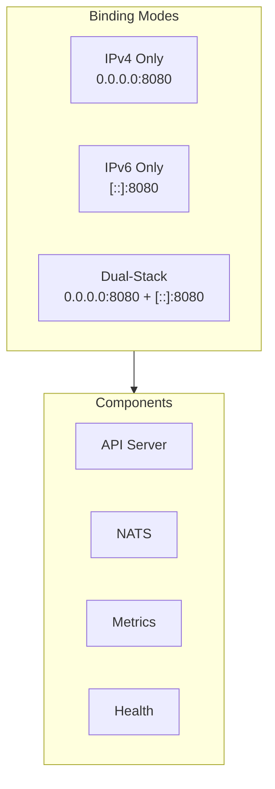
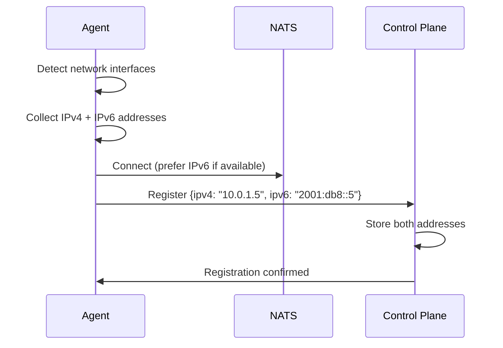

# Epic 18: Full IPv6 Support

## Overview

Enable Keystone Core to operate seamlessly in IPv6-only, IPv4-only, and dual-stack network environments. All components (control plane, agents, NATS, etcd, PostgreSQL connections) must support IPv6 addressing with proper configuration, validation, and testing.

**Goal**: Keystone Core deployments work transparently in any IP addressing scheme, with first-class IPv6 support matching IPv4 capabilities. Organizations with IPv6-only infrastructure or transitioning to IPv6 can deploy Keystone Core without modification.

## Success Criteria

- [x] Control plane binds to IPv6 addresses (gRPC, REST, metrics endpoints)
- [x] Agents connect to control plane over IPv6
- [x] NATS communication works over IPv6 (embedded and external modes)
- [x] etcd cluster coordination works over IPv6
- [x] PostgreSQL connections support IPv6 addresses
- [x] Dual-stack support: simultaneous IPv4 and IPv6 bindings
- [x] IPv6 address validation in all configuration parsing
- [x] Agent targeting supports IPv6-based selectors
- [x] Health checks and metrics work over IPv6
- [x] WebSocket transport works over IPv6
- [x] Documentation covers IPv6 deployment patterns
- [x] E2E tests validate IPv6-only and dual-stack deployments
- [x] No IPv4-dependent code paths or hardcoded assumptions

## Problem Statement

**Current State:**
- Configuration examples use IPv4 addresses (127.0.0.1, 0.0.0.0)
- IPv6 address parsing may not be validated consistently
- Dual-stack binding behavior is undefined
- No testing of IPv6-only deployments
- Agent metadata may assume IPv4 address formats
- URL parsing may not handle IPv6 bracket notation ([::1]:port)

**Target State:**
- All network bindings support IPv6 and dual-stack
- IPv6 addresses parsed and validated correctly everywhere
- Configuration accepts IPv6 in standard notation
- Agents report both IPv4 and IPv6 addresses when available
- Complete feature parity between IPv4 and IPv6 deployments
- Tested in IPv6-only environments

## Architecture

### Address Binding Modes



### Dual-Stack Agent Registration



### IPv6 URL Format

```
# Standard IPv6 URL notation
nats://[2001:db8::1]:4222
grpc://[::1]:8080
https://[2001:db8:85a3::8a2e:370:7334]:443

# Dual-stack configuration
server:
  listen:
    - "[::]:8080"      # IPv6 all interfaces
    - "0.0.0.0:8080"   # IPv4 all interfaces
```

## User Stories

### US18.1: IPv6-Only Control Plane
**As a** platform operator in an IPv6-only data center
**I want** to deploy Keystone Core without IPv4
**So that** I can use my organization's IPv6-only infrastructure

**Acceptance Criteria:**
- Control plane starts with only IPv6 addresses configured
- All endpoints (API, metrics, health) accessible via IPv6
- No fallback to IPv4 or errors when IPv4 unavailable
- Logs show IPv6 addresses in standard notation

### US18.2: Dual-Stack Agent Connectivity
**As a** platform operator with mixed IPv4/IPv6 infrastructure
**I want** agents to connect using available address family
**So that** connectivity works regardless of network path

**Acceptance Criteria:**
- Agent auto-detects available address families
- Agent prefers IPv6 when both available (configurable)
- Failover between address families on connection failure
- Both addresses reported in agent metadata

### US18.3: IPv6 NATS Cluster
**As a** platform operator
**I want** NATS cluster to operate over IPv6
**So that** message bus works in IPv6-only environments

**Acceptance Criteria:**
- Embedded NATS binds to IPv6 addresses
- External NATS connections use IPv6 URLs
- Cluster routing between NATS nodes works over IPv6
- Leaf node connections support IPv6

### US18.4: IPv6 Address Targeting
**As a** operator executing commands
**I want** to target agents by IPv6 address
**So that** I can reach specific agents in IPv6 networks

**Acceptance Criteria:**
- Target expressions support IPv6: `ipv6:2001:db8::*`
- Agent metadata includes `ipv6` field
- Glob patterns work with IPv6 addresses
- CIDR notation supported: `ipv6_cidr:2001:db8::/32`

### US18.5: IPv6 Configuration Validation
**As a** operator
**I want** clear validation errors for invalid IPv6 addresses
**So that** I can fix configuration mistakes quickly

**Acceptance Criteria:**
- Invalid IPv6 addresses rejected with clear error message
- Zone IDs (fe80::1%eth0) handled correctly
- Compressed notation (::1) and full notation both accepted
- Port numbers validated (brackets required for URLs)

### US18.6: Dual-Stack Load Balancing
**As a** platform operator
**I want** control plane HA to work with dual-stack
**So that** clients connect via either address family

**Acceptance Criteria:**
- Multiple control planes bind to both IPv4 and IPv6
- etcd cluster coordination works over IPv6
- Leader election functions with IPv6 addressing
- Health checks work on both address families

## Technical Tasks

### Phase 1: Core Infrastructure (Week 1-2) ✅ COMPLETE

#### T1.1: Address Parsing Library ✅ IMPLEMENTED
- Create `pkg/netutil/address.go` for unified address parsing
- Support IPv4, IPv6, and dual-stack address formats
- Handle URL bracket notation for IPv6 ([::1]:port)
- Validate addresses during configuration loading
- Parse CIDR notation for both families

```go
// pkg/netutil/address.go
type Address struct {
    Host     string
    Port     int
    Family   AddressFamily // IPv4, IPv6, DualStack
    Original string
}

func ParseAddress(addr string) (*Address, error)
func ParseURL(url string) (*Address, error)
func (a *Address) IsIPv6() bool
func (a *Address) String() string // Returns bracketed IPv6
```

#### T1.2: Configuration Updates ✅ IMPLEMENTED
- Update all config structs to use Address type
- Add `address_family` preference option
- Support array of listen addresses for dual-stack
- Validate IPv6 addresses on config load

```yaml
server:
  # Single address (backward compatible)
  listen: "[::]:8080"

  # Multiple addresses (dual-stack)
  listen:
    - "[::]:8080"
    - "0.0.0.0:8080"

  # Address family preference
  address_family: prefer_ipv6  # prefer_ipv4, prefer_ipv6, ipv4_only, ipv6_only

  nats:
    urls:
      - "nats://[2001:db8::1]:4222"
      - "nats://10.0.1.1:4222"
```

#### T1.3: API Server IPv6 Binding ✅ IMPLEMENTED
- Update gRPC server to bind IPv6 addresses
- Update REST gateway for IPv6
- Support multiple listeners for dual-stack
- Update TLS configuration for IPv6

#### T1.4: Metrics and Health Endpoints ✅ IMPLEMENTED
- Metrics server binds to IPv6
- Health check endpoints accessible via IPv6
- Prometheus scraping works over IPv6

### Phase 2: NATS Integration (Week 3) ✅ COMPLETE

#### T2.1: Embedded NATS IPv6 ✅ IMPLEMENTED
- Configure embedded NATS server for IPv6 binding
- Update NATS connection URLs for IPv6 format
- Cluster routes support IPv6 addresses
- JetStream storage paths unaffected

#### T2.2: External NATS IPv6 ✅ IMPLEMENTED
- Parse IPv6 URLs in NATS configuration
- Connection pool handles IPv6 endpoints
- Failover between IPv4 and IPv6 endpoints
- WebSocket over IPv6 (wss://[::1]:443)

#### T2.3: Leaf Node IPv6 ✅ IMPLEMENTED
- Leaf connections support IPv6 hub addresses
- Embedded leaf NATS binds to IPv6
- Hub discovery works with IPv6 DNS records

### Phase 3: Agent Support (Week 4) ✅ COMPLETE

#### T3.1: Agent Network Detection ✅ IMPLEMENTED
- Detect all IPv4 and IPv6 addresses on interfaces
- Filter link-local addresses appropriately
- Report addresses in agent metadata
- Handle interface changes (address added/removed)

```go
type NetworkInfo struct {
    IPv4Addresses []string
    IPv6Addresses []string
    PreferIPv6    bool
}
```

#### T3.2: Agent Connection Strategy ✅ IMPLEMENTED
- Support IPv6 server URLs
- Preference configuration (prefer_ipv4, prefer_ipv6)
- Fallback between address families
- Connection health per address family

#### T3.3: Agent Metadata Updates ✅ IMPLEMENTED
- Include `ipv4` and `ipv6` fields in metadata
- Update targeting expressions for IPv6
- CIDR matching for IPv6 prefixes

### Phase 4: Cluster Coordination (Week 5) ✅ COMPLETE

#### T4.1: etcd IPv6 Support ✅ IMPLEMENTED
- etcd endpoints support IPv6 addresses
- Cluster peer URLs use IPv6
- Client connections over IPv6
- Embedded etcd binds to IPv6

**Implementation:**
- Added `FormatHostPort()` in `pkg/cluster/config.go` for IPv6 bracket handling
- Added `GetAdvertiseAddress()` and `GetGRPCAddress()` with IPv6 support
- Added `AddressFamilyPreference` config option (PreferIPv4, PreferIPv6, IPv4Only, IPv6Only)
- Updated `EtcdEmbeddedConfig` with IPv6-aware URL methods
- Added `isIPv6()` and `formatIPv6Host()` helper functions
- Comprehensive tests in `config_test.go`

#### T4.2: PostgreSQL IPv6 ✅ IMPLEMENTED
- Connection strings support IPv6 hosts
- Validate IPv6 addresses in DSN
- Connection pooling with IPv6

**Implementation:**
- Added `PostgreSQLConfig` struct in `pkg/state/interface.go`
- Added `BuildDSN()` method with automatic IPv6 bracketing
- Added `Validate()` method for config validation
- Added `isIPv6Address()` helper function
- Updated `NewPostgreSQLStore()` to use structured config
- Comprehensive tests for IPv6 DSN building

#### T4.3: Leader Election IPv6 ✅ IMPLEMENTED
- Member IDs can use IPv6 addresses
- Health checks between members over IPv6
- Cluster status reports IPv6 addresses

**Implementation:**
- gRPC natively supports IPv6 via `[ipv6]:port` format
- Membership manager uses IPv6-aware config methods
- Added IPv6 membership tests in `membership_test.go`

### Phase 5: Testing and Validation (Week 6) ✅ COMPLETE

#### T5.1: Unit Tests ✅ COMPLETE
- Address parsing tests (all formats)
- Configuration validation tests
- URL construction tests

#### T5.2: Integration Tests ✅ COMPLETE
- IPv6-only control plane startup
- Dual-stack agent registration
- NATS communication over IPv6
- etcd cluster over IPv6

#### T5.3: E2E Tests ✅ IMPLEMENTED
- IPv6-only topology in Docker
- Dual-stack topology
- Mixed IPv4/IPv6 agent fleet
- Failover between address families

**Implementation:** `test/e2e/topologies/ipv6/`
- Complete Docker Compose topology with IPv6-only network (fd00:kscore::/64)
- Server and 3 agent configurations with IPv6 addresses
- IPv6 test file with 11 tests:
  - Agent registration over IPv6
  - Agent health checks
  - IPv6 network label verification
  - Single agent command execution
  - IPv6 network connectivity tests
  - Batch command execution
  - Role-based targeting
  - Network label targeting
  - Batch job status retrieval
  - Batch job listing
- Makefile targets: test-ipv6, test-ipv6-quick, ipv6-up, ipv6-down, ipv6-logs, ipv6-status

### Phase 6: Documentation (Week 7) ✅ COMPLETE

#### T6.1: Configuration Reference ✅ IMPLEMENTED
- Document IPv6 address formats
- Dual-stack configuration examples
- Address family preferences

**Implementation:** `docs/content/en/docs/reference/ipv6.md`
- Complete configuration reference for all components
- Address format reference with examples
- Agent metadata and targeting expression reference
- Metrics and API reference

#### T6.2: Deployment Guides ✅ IMPLEMENTED
- IPv6-only deployment guide
- Dual-stack deployment guide
- Migration from IPv4-only to dual-stack
- Troubleshooting IPv6 connectivity

**Implementation:** `docs/content/en/docs/operations/ipv6.md`
- IPv6-only and dual-stack deployment patterns
- Component-specific configuration (NATS, etcd, PostgreSQL)
- HA cluster configuration with IPv6
- Migration guide from IPv4 to dual-stack
- Troubleshooting guide with common issues

#### T6.3: Operations Guide ✅ IMPLEMENTED
- Monitoring IPv6 deployments
- Debugging connectivity issues
- Firewall rules for IPv6

**Implementation:** Included in `docs/content/en/docs/operations/ipv6.md`
- Prometheus scraping configuration
- Diagnostic commands
- Firewall rules (iptables, nftables)
- Best practices

## Dependencies

### Required Epics
- **Epic 1** (Core Infrastructure): Base networking code
- **Epic 11** (Clustering): etcd coordination
- **Epic 14** (NATS Mesh): NATS connectivity

### External Dependencies
- Go `net` package (IPv6 support built-in)
- NATS server (supports IPv6)
- etcd (supports IPv6)
- PostgreSQL (supports IPv6)

## Risks and Mitigations

| Risk | Impact | Likelihood | Mitigation |
|------|--------|------------|------------|
| IPv6 not tested in CI environment | High | Medium | Set up IPv6-enabled CI runners or containers |
| Library dependencies assume IPv4 | Medium | Low | Audit dependencies, contribute fixes upstream |
| DNS resolution issues with IPv6 | Medium | Medium | Support explicit address configuration |
| Zone ID handling complexity | Low | Medium | Document supported formats, validate early |
| Performance differences IPv4 vs IPv6 | Low | Low | Benchmark both, optimize if needed |

## Testing Strategy

### Unit Tests
- Address parsing: IPv4, IPv6, dual-stack, invalid
- URL construction with bracketed IPv6
- CIDR matching for both families
- Configuration validation

### Integration Tests
- Control plane starts on IPv6
- Agent registers with IPv6 addresses
- NATS pub/sub over IPv6
- etcd operations over IPv6
- PostgreSQL queries over IPv6

### E2E Tests
- IPv6-only Docker Compose topology
- Dual-stack with mixed agents
- Failover from IPv6 to IPv4
- Cross-family agent targeting

### Manual Testing
- Kubernetes with IPv6 CNI
- Cloud provider IPv6 VPCs
- On-premise dual-stack networks

## Definition of Done

- [x] All components bind to and connect via IPv6
- [x] Dual-stack configuration documented and tested
- [x] No IPv4 assumptions in codebase
- [x] IPv6 address validation in all config parsing
- [x] Agent metadata includes both address families
- [x] Targeting expressions support IPv6
- [x] E2E tests pass for IPv6-only deployment
- [x] Documentation covers all IPv6 scenarios
- [x] Performance benchmarks show no regression
- [x] Security review of IPv6 implementation

## Metrics

| Metric | Type | Labels | Description |
|--------|------|--------|-------------|
| `kscore_connections_total` | Counter | family={ipv4,ipv6} | Connections by address family |
| `kscore_connection_failures_total` | Counter | family={ipv4,ipv6} | Connection failures by family |
| `kscore_agents_by_address_family` | Gauge | family={ipv4,ipv6,dual} | Agent count by addressing |

## Appendix: IPv6 Address Formats

### Supported Formats
```
# Full notation
2001:0db8:85a3:0000:0000:8a2e:0370:7334

# Compressed notation (consecutive zeros)
2001:db8:85a3::8a2e:370:7334

# Loopback
::1

# All interfaces
::

# IPv4-mapped IPv6
::ffff:192.168.1.1

# Link-local with zone ID (informational only)
fe80::1%eth0

# URL format (brackets required)
[2001:db8::1]:8080
nats://[::1]:4222
https://[2001:db8::1]:443/api
```

### Configuration Examples

```yaml
# IPv6-only control plane
server:
  listen: "[::]:8080"
  metrics:
    listen: "[::]:9090"
  nats:
    mode: embedded
    listen: "[::]:4222"
  cluster:
    etcd:
      endpoints:
        - "http://[2001:db8::1]:2379"
        - "http://[2001:db8::2]:2379"
  state:
    driver: postgresql
    url: "postgres://user:pass@[2001:db8::10]:5432/kscore"

# Dual-stack agent
agent:
  nats:
    urls:
      - "nats://[2001:db8::1]:4222"  # IPv6 primary
      - "nats://10.0.1.1:4222"        # IPv4 fallback
    address_family: prefer_ipv6
```
