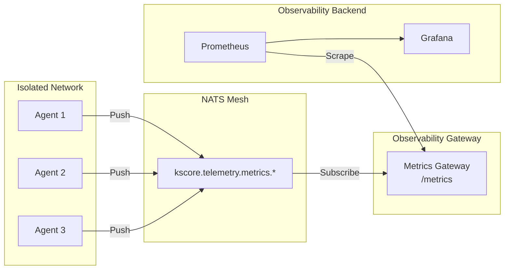
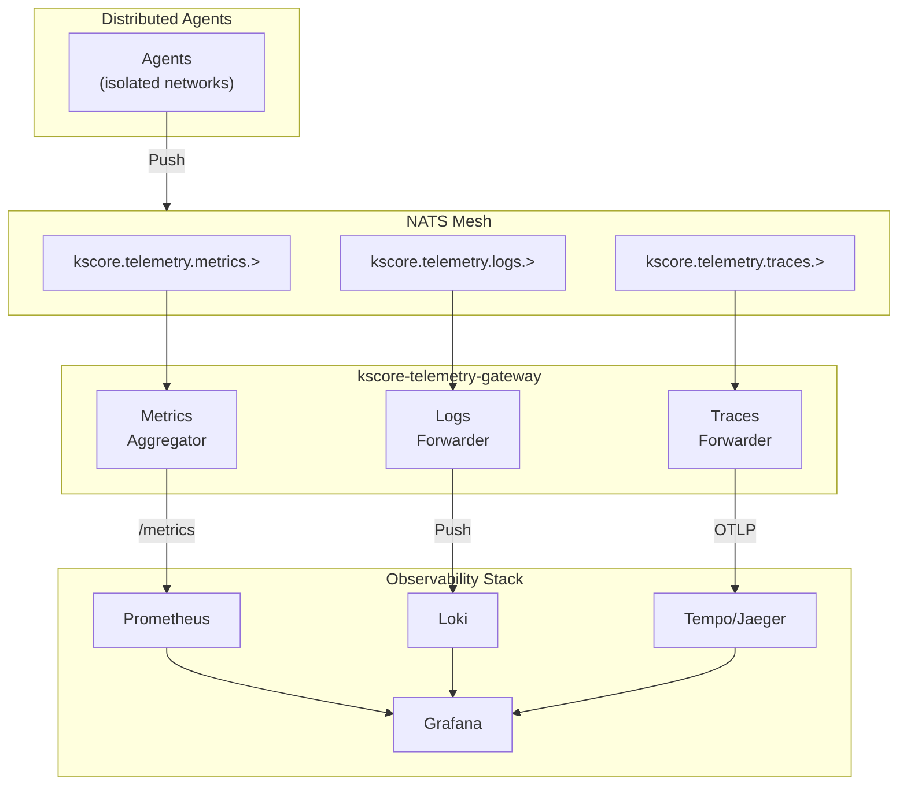
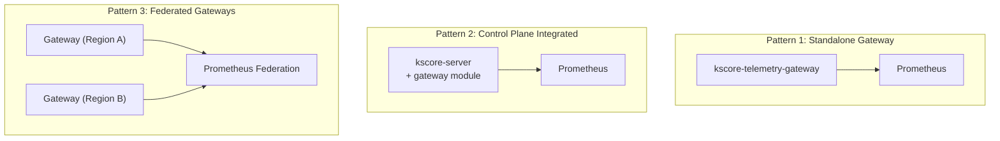

# Epic 19: Observability Gateway

## Overview

Provide gateway/bridge services that aggregate telemetry (metrics, logs, traces) from agents over NATS and expose them to traditional observability backends (Prometheus, Loki, Jaeger/Tempo). This enables agents in isolated networks (behind NAT, firewalls, air-gapped) to be monitored without requiring direct network access from observability infrastructure.

**Goal**: Operators can monitor all agents through standard observability tools (Prometheus, Grafana, Loki, Jaeger) regardless of network topology. Agents only need outbound NATS connectivity; the gateway bridges telemetry to backend systems.

**Relationship to Epic 15**: Epic 15 defines the NATS telemetry transport (agents push to NATS). This epic defines the gateway services that consume from NATS and expose to backends.

## Success Criteria

- [ ] Prometheus can scrape metrics from agents it cannot directly reach
- [ ] Metrics gateway aggregates agent metrics from NATS, exposes /metrics endpoint
- [ ] Logs gateway forwards agent logs from NATS to Loki/Elasticsearch
- [ ] Traces gateway forwards agent traces from NATS to Jaeger/Tempo
- [ ] Control plane optionally acts as metrics aggregation endpoint
- [ ] No direct network path required from Prometheus to agents
- [ ] Works across all Epic 14 topologies (leaf nodes, superclusters)
- [ ] Minimal latency overhead (<1s for metrics freshness)
- [ ] Horizontal scaling for high agent counts
- [ ] Kubernetes-native deployment (Helm charts, operators)

## Problem Statement

**Current State:**
- Prometheus scrapes agents directly via HTTP (/metrics endpoint)
- Requires network path from Prometheus to each agent
- Agents behind NAT/firewalls cannot be scraped
- Air-gapped networks have no observability
- Each agent must expose metrics port (security concern)
- Service discovery required for dynamic agent fleets

**Target State:**
- Agents push metrics to NATS (no inbound connections required)
- Gateway aggregates metrics from NATS
- Prometheus scrapes gateway (single endpoint or federated)
- Same pattern for logs and traces
- Works with any network topology
- Reduced attack surface (agents don't expose ports)

## Architecture

### Metrics Flow



### Complete Telemetry Gateway



### Gateway Deployment Patterns



## User Stories

### US19.1: Metrics Gateway for Isolated Agents
**As a** platform operator with agents behind NAT
**I want** Prometheus to collect metrics from those agents
**So that** I have visibility into all infrastructure regardless of network topology

**Acceptance Criteria:**
- Gateway subscribes to `kscore.telemetry.metrics.>` on NATS
- Gateway exposes `/metrics` endpoint in Prometheus format
- Metrics include agent labels (agent_id, hostname, role, etc.)
- Prometheus can scrape gateway like any other target
- Metrics freshness < 30 seconds (configurable)
- Gateway handles thousands of agents

### US19.2: Prometheus Remote Write
**As a** platform operator
**I want** metrics pushed directly to Prometheus via remote write
**So that** I don't need Prometheus to scrape the gateway

**Acceptance Criteria:**
- Gateway supports Prometheus remote write protocol
- Configurable remote write endpoint
- Batching and compression
- Retry on failure with backoff
- Authentication (basic auth, bearer token)
- TLS support

### US19.3: Logs Gateway to Loki
**As a** platform operator
**I want** agent logs forwarded to Loki
**So that** I can query all logs in Grafana

**Acceptance Criteria:**
- Gateway subscribes to `kscore.telemetry.logs.>` on NATS
- Forwards logs to Loki push API
- Preserves labels (agent, level, source)
- Batching for efficiency
- Handles backpressure from Loki
- Configurable filtering (levels, sources)

### US19.4: Traces Gateway to Tempo/Jaeger
**As a** platform operator
**I want** agent traces forwarded to Tempo or Jaeger
**So that** I have distributed tracing across all agents

**Acceptance Criteria:**
- Gateway subscribes to `kscore.telemetry.traces.>` on NATS
- Forwards traces via OTLP to Tempo/Jaeger
- Preserves trace context and span relationships
- Batching and compression
- Configurable sampling at gateway

### US19.5: Control Plane as Metrics Endpoint
**As a** platform operator with simple deployments
**I want** the control plane to expose aggregated agent metrics
**So that** I don't need a separate gateway service

**Acceptance Criteria:**
- kscore-server exposes `/metrics/agents` endpoint
- Aggregates metrics from connected agents
- Prometheus can scrape control plane
- Works with embedded NATS mode
- Configurable (can be disabled)

### US19.6: Multi-Cluster Metrics Aggregation
**As a** platform operator with multiple Keystone Core clusters
**I want** metrics aggregated across clusters
**So that** I have a unified view in Grafana

**Acceptance Criteria:**
- Gateway supports multiple NATS connections
- Cluster label added to all metrics
- Prometheus federation-compatible output
- Configurable per-cluster filtering
- Works with supercluster topology

### US19.7: High Cardinality Handling
**As a** platform operator with thousands of agents
**I want** the gateway to handle high cardinality metrics
**So that** Prometheus doesn't get overwhelmed

**Acceptance Criteria:**
- Configurable label dropping/rewriting
- Metric filtering (allowlist/denylist)
- Aggregation options (sum, avg, max across agents)
- Cardinality limits per metric
- Metrics about cardinality (for alerting)

### US19.8: Gateway High Availability
**As a** platform operator
**I want** the gateway to be highly available
**So that** telemetry collection continues during failures

**Acceptance Criteria:**
- Multiple gateway instances supported
- NATS queue groups for load balancing
- No duplicate metrics on Prometheus scrape
- Graceful failover
- Health check endpoints

## Technical Tasks

### Phase 1: Metrics Gateway Core (Week 1-3)

#### T1.1: Gateway Service Scaffold
- Create `cmd/kscore-telemetry-gateway/` binary
- Configuration file parsing
- NATS connection management
- Graceful shutdown handling
- Health check endpoints (/health, /ready)

```go
// cmd/kscore-telemetry-gateway/main.go
type GatewayConfig struct {
    NATS     NATSConfig
    Metrics  MetricsGatewayConfig
    Logs     LogsGatewayConfig
    Traces   TracesGatewayConfig
    Server   HTTPServerConfig
}
```

#### T1.2: NATS Metrics Subscriber
- Subscribe to `kscore.telemetry.metrics.>` subject
- Parse Prometheus exposition format from messages
- Handle message batches
- Track per-agent last-seen timestamps
- Remove stale agent metrics (configurable TTL)

```go
// pkg/gateway/metrics/subscriber.go
type MetricsSubscriber struct {
    nc           *nats.Conn
    metricsStore *MetricsStore
    config       SubscriberConfig
}

func (s *MetricsSubscriber) handleMessage(msg *nats.Msg) error
```

#### T1.3: Metrics Store
- In-memory store for latest agent metrics
- Thread-safe concurrent access
- Per-agent metric families
- Timestamp tracking for staleness
- Memory limits with eviction

```go
// pkg/gateway/metrics/store.go
type MetricsStore struct {
    agents  map[string]*AgentMetrics
    mu      sync.RWMutex
    maxAge  time.Duration
    config  StoreConfig
}

func (s *MetricsStore) Update(agentID string, metrics []*dto.MetricFamily)
func (s *MetricsStore) Export() []*dto.MetricFamily
```

#### T1.4: Prometheus Metrics Endpoint
- Expose `/metrics` endpoint
- Aggregate all agent metrics
- Add gateway labels (source=gateway, cluster=X)
- Standard Prometheus text format
- Optional OpenMetrics format

#### T1.5: Agent Label Injection
- Add `agent_id` label to all metrics
- Add `agent_hostname` label
- Add configurable custom labels from agent metadata
- Label rewriting rules
- Label dropping rules

### Phase 2: Prometheus Integration (Week 4-5)

#### T2.1: Remote Write Support
- Implement Prometheus remote write client
- Configurable endpoint and authentication
- Batching with configurable size/interval
- Retry with exponential backoff
- TLS configuration

```yaml
metrics:
  remote_write:
    enabled: true
    url: http://prometheus:9090/api/v1/write
    batch_size: 1000
    flush_interval: 15s
    auth:
      type: bearer  # none, basic, bearer
      token: ${PROMETHEUS_TOKEN}
    tls:
      enabled: false
```

#### T2.2: Federation Support
- `/federate` endpoint for Prometheus federation
- Match[] parameter support
- Efficient metric selection
- Proper honor_labels behavior

#### T2.3: Service Discovery Integration
- Kubernetes service annotations
- Consul service registration
- DNS-SD compatible
- Static target configuration

### Phase 3: Logs Gateway (Week 6-7)

#### T3.1: NATS Logs Subscriber
- Subscribe to `kscore.telemetry.logs.>` subject
- Parse structured log messages
- Extract labels (agent, level, source)
- Buffer for batching

#### T3.2: Loki Push Client
- Implement Loki push API client
- Batch logs by label set
- Compression (snappy, gzip)
- Retry with backoff
- Handle rate limiting

```yaml
logs:
  loki:
    enabled: true
    url: http://loki:3100/loki/api/v1/push
    batch_size: 100
    batch_wait: 1s
    tenant_id: ""  # X-Scope-OrgID header
```

#### T3.3: Elasticsearch Output (Optional)
- Elasticsearch bulk API client
- Index naming (daily, agent-based)
- Document mapping
- ILM policy compatibility

#### T3.4: Log Filtering
- Level filtering (min level)
- Source filtering (allowlist/denylist)
- Content filtering (regex)
- Rate limiting per agent

### Phase 4: Traces Gateway (Week 8-9)

#### T4.1: NATS Traces Subscriber
- Subscribe to `kscore.telemetry.traces.>` subject
- Parse OTLP JSON format
- Batch spans by trace ID
- Handle incomplete traces

#### T4.2: OTLP Exporter
- OTLP gRPC client for Tempo/Jaeger
- OTLP HTTP client option
- Batching and compression
- Retry with backoff

```yaml
traces:
  otlp:
    enabled: true
    endpoint: tempo:4317
    protocol: grpc  # grpc, http
    compression: gzip
    headers:
      X-Custom-Header: value
```

#### T4.3: Trace Sampling at Gateway
- Head-based sampling
- Tail-based sampling (complete traces)
- Priority sampling (errors, slow)
- Configurable sample rate

### Phase 5: Control Plane Integration (Week 10-11)

#### T5.1: Integrated Metrics Aggregator
- Add metrics aggregation to kscore-server
- Subscribe to local agent metrics via NATS
- Expose `/metrics/agents` endpoint
- Configurable enable/disable

```yaml
# kscore-server.yaml
server:
  metrics:
    agents:
      enabled: true
      path: /metrics/agents
      stale_timeout: 60s
```

#### T5.2: Agent Metrics in API
- gRPC/REST API for agent metrics
- Query metrics by agent ID
- Historical metrics via JetStream
- Metric labels in agent list response

#### T5.3: TUI Monitor Integration
- Metrics view uses NATS directly
- Real-time metric updates
- Sparklines from live data
- Alert on metric thresholds

### Phase 6: Scaling and HA (Week 12-13)

#### T6.1: Horizontal Scaling
- NATS queue groups for load distribution
- Consistent hashing for agent-to-gateway assignment
- No duplicate metrics in output
- Graceful rebalancing

#### T6.2: High Availability
- Multiple gateway instances
- Leader election for remote write (avoid duplicates)
- Health check endpoints
- Graceful failover

#### T6.3: Performance Optimization
- Metric caching
- Batch processing
- Memory pooling
- CPU profiling and optimization
- Benchmark suite

### Phase 7: Deployment and Operations (Week 14-15)

#### T7.1: Kubernetes Deployment
- Helm chart for gateway
- Deployment, Service, ConfigMap
- ServiceMonitor for Prometheus Operator
- HPA for autoscaling
- PodDisruptionBudget

#### T7.2: Docker Compose
- docker-compose.yml with gateway
- Integration with observability stack
- Example configurations

#### T7.3: Operational Tooling
- Gateway status CLI command
- Connected agents list
- Metrics cardinality report
- Health diagnostics

### Phase 8: Documentation and Testing (Week 16-17)

#### T8.1: Documentation
- Architecture overview
- Deployment guide (standalone, integrated, HA)
- Configuration reference
- Troubleshooting guide
- Performance tuning

#### T8.2: Unit Tests
- Metrics store tests
- NATS subscriber tests
- Prometheus endpoint tests
- Label manipulation tests

#### T8.3: Integration Tests
- End-to-end metrics flow
- Prometheus scrape verification
- Loki log ingestion
- Trace export verification

#### T8.4: Performance Tests
- High agent count (10,000 agents)
- High metric cardinality
- Throughput benchmarks
- Memory usage under load

## Configuration Reference

```yaml
# kscore-telemetry-gateway.yaml

# NATS connection
nats:
  urls:
    - nats://nats:4222
  cluster: production
  tls:
    enabled: false

# HTTP server for endpoints
server:
  listen: 0.0.0.0:9091
  metrics_path: /metrics
  health_path: /health
  ready_path: /ready

# Metrics gateway
metrics:
  enabled: true
  subject: kscore.telemetry.metrics.>
  stale_timeout: 60s      # Remove agents not seen for this duration

  # Label manipulation
  labels:
    add:
      gateway: "true"
    drop:
      - instance           # Drop instance label (agent-specific)
    rewrite:
      - source: "job"
        target: "kscore_job"

  # Cardinality control
  cardinality:
    max_series: 100000
    max_labels_per_series: 20
    drop_high_cardinality: true

  # Prometheus remote write (optional)
  remote_write:
    enabled: false
    url: http://prometheus:9090/api/v1/write
    batch_size: 1000
    flush_interval: 15s
    retry:
      max_attempts: 3
      backoff: 1s
    auth:
      type: none           # none, basic, bearer
    tls:
      enabled: false

  # Prometheus federation
  federation:
    enabled: true
    path: /federate

# Logs gateway
logs:
  enabled: true
  subject: kscore.telemetry.logs.>

  # Filtering
  min_level: info          # debug, info, warn, error
  sources:
    include: []            # Empty = all
    exclude: []

  # Loki output
  loki:
    enabled: true
    url: http://loki:3100/loki/api/v1/push
    batch_size: 100
    batch_wait: 1s
    tenant_id: ""
    labels:
      - agent_id
      - level
      - source
    retry:
      max_attempts: 3
      backoff: 1s

  # Elasticsearch output (optional)
  elasticsearch:
    enabled: false
    urls:
      - http://elasticsearch:9200
    index: kscore-logs-%Y.%m.%d
    batch_size: 500

# Traces gateway
traces:
  enabled: true
  subject: kscore.telemetry.traces.>

  # Sampling at gateway
  sampling:
    enabled: true
    rate: 1.0              # 1.0 = 100%
    priority_sample:
      errors: true         # Always sample errors
      slow_threshold: 1s   # Sample traces > 1s

  # OTLP output
  otlp:
    enabled: true
    endpoint: tempo:4317
    protocol: grpc         # grpc, http
    compression: gzip
    batch_size: 100
    flush_interval: 5s
    headers: {}
    tls:
      enabled: false

# High availability
ha:
  enabled: false
  # Use NATS queue groups for load distribution
  queue_group: kscore-gateway
  # Leader election for remote write
  leader_election:
    enabled: true
    lease_duration: 15s
    renew_deadline: 10s
```

## Dependencies

### Required Epics
- **Epic 14** (NATS Mesh Communication): NATS transport infrastructure
- **Epic 15** (Observability Enhancements): Agent telemetry push to NATS
- **Epic 7** (Observability): Base metrics/logging/tracing

### External Dependencies
- Prometheus (remote write, scrape target)
- Loki (log aggregation)
- Tempo/Jaeger (trace storage)
- NATS (message transport)

### Go Libraries
- `github.com/prometheus/client_golang` - Prometheus client
- `github.com/prometheus/common/expfmt` - Prometheus format parsing
- `github.com/grafana/loki/pkg/push` - Loki push client
- `go.opentelemetry.io/otel` - OpenTelemetry SDK
- `go.opentelemetry.io/otel/exporters/otlp` - OTLP exporter

## Risks and Mitigations

| Risk | Impact | Likelihood | Mitigation |
|------|--------|------------|------------|
| High cardinality explosion | High | Medium | Cardinality limits, label dropping |
| Memory exhaustion | High | Medium | Memory limits, eviction policies |
| NATS message loss | Medium | Low | JetStream persistence, acknowledgment |
| Prometheus scrape timeout | Medium | Medium | Efficient export, caching |
| Gateway single point of failure | High | Medium | HA deployment, queue groups |
| Duplicate metrics in HA | Medium | Medium | Leader election for remote write |
| Network partition | Medium | Low | Buffering, graceful degradation |

## Metrics (Gateway Self-Monitoring)

```
# Gateway metrics
kscore_gateway_agents_total                    # Connected agents
kscore_gateway_agents_stale_total              # Stale agents removed
kscore_gateway_metrics_received_total          # Metrics received from NATS
kscore_gateway_metrics_exported_total          # Metrics exported to Prometheus
kscore_gateway_metrics_cardinality             # Current series count
kscore_gateway_logs_received_total             # Logs received
kscore_gateway_logs_forwarded_total            # Logs forwarded to backend
kscore_gateway_traces_received_total           # Traces received
kscore_gateway_traces_forwarded_total          # Traces forwarded
kscore_gateway_nats_messages_total             # NATS messages processed
kscore_gateway_nats_errors_total               # NATS errors
kscore_gateway_backend_errors_total{backend}   # Backend push errors
kscore_gateway_scrape_duration_seconds         # Prometheus scrape duration
kscore_gateway_memory_bytes                    # Gateway memory usage
```

## Testing Strategy

### Unit Tests
- Metrics store operations
- Label manipulation
- Prometheus format generation
- NATS message parsing
- Cardinality enforcement

### Integration Tests
- Agent → NATS → Gateway → Prometheus flow
- Multi-agent metrics aggregation
- Loki log ingestion
- Trace export to Tempo
- HA failover

### Performance Tests
- 10,000 agent metrics aggregation
- High cardinality scenarios
- Prometheus scrape under load
- Memory usage limits

### E2E Tests
- Full stack deployment (agents, gateway, Prometheus, Grafana)
- Query agent metrics in Grafana
- Alert on agent metrics

## Definition of Done

- [ ] Metrics gateway aggregates agent metrics from NATS
- [ ] Prometheus successfully scrapes gateway
- [ ] Grafana dashboards work with gateway
- [ ] Logs gateway forwards to Loki
- [ ] Traces gateway forwards to Tempo
- [ ] Control plane integrated mode works
- [ ] HA deployment tested
- [ ] Performance benchmarks pass
- [ ] Kubernetes Helm chart available
- [ ] Documentation complete
- [ ] All tests passing

## Timeline

Total: **17 weeks**

- **Weeks 1-3**: Metrics gateway core
- **Weeks 4-5**: Prometheus integration
- **Weeks 6-7**: Logs gateway
- **Weeks 8-9**: Traces gateway
- **Weeks 10-11**: Control plane integration
- **Weeks 12-13**: Scaling and HA
- **Weeks 14-15**: Deployment and operations
- **Weeks 16-17**: Documentation and testing
