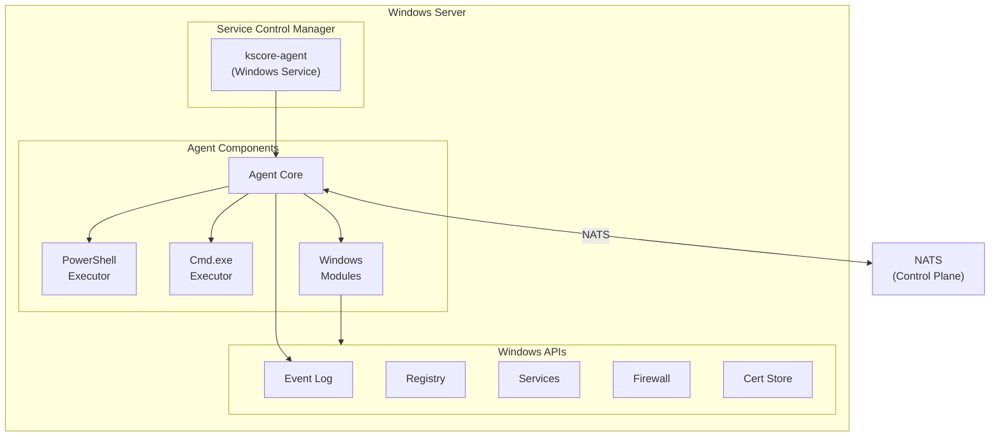

# Epic 20: Windows Support

## Overview

Provide comprehensive Windows support for the Keystone Core agent, enabling management of Windows servers alongside Linux/macOS infrastructure. Development tooling support for Windows is included to enable contributors on Windows, but production deployments of control plane and other services target Linux.

**Goal**: Windows servers can be managed by Keystone Core with the same capabilities as Linux servers. The Windows agent runs as a native Windows service, integrates with Windows Event Log, executes PowerShell commands, and manages Windows-specific resources (services, registry, IIS, etc.).

**Scope**:
- **Production**: `kscore-agent` on Windows Server 2016+, Windows 10/11
- **Development**: Build and test all components on Windows

## Success Criteria

### Production (Windows Agent)
- [ ] Agent runs as Windows service (SCM integration)
- [ ] Agent starts automatically on boot
- [ ] Agent logs to Windows Event Log
- [ ] PowerShell command execution
- [ ] Cmd.exe command execution
- [ ] Windows service management (start, stop, enable, disable)
- [ ] Windows registry management
- [ ] Windows firewall rules
- [ ] Windows user/group management
- [ ] Windows file operations (ACLs, permissions)
- [ ] Windows package management (Chocolatey, winget, MSI)
- [ ] MSI installer for agent deployment
- [ ] Windows certificate store integration
- [ ] Group Policy compatibility
- [ ] Antivirus exclusion documentation

### Development (All Components)
- [ ] All components build on Windows (`go build`)
- [ ] All unit tests pass on Windows
- [ ] Development documentation for Windows
- [ ] CI/CD runs Windows tests

## Problem Statement

**Current State:**
- Agent builds on Windows (CGO-free since Epic 13)
- No Windows service integration
- No Windows Event Log support
- PowerShell execution untested
- No Windows-specific state modules
- No MSI installer
- Windows ACLs not handled
- Registry management not supported

**Target State:**
- First-class Windows agent support
- Native Windows service with SCM
- Windows Event Log integration
- Full PowerShell support
- Windows-specific state modules
- Professional MSI installer
- Proper Windows security (ACLs, tokens)
- Enterprise deployment ready (GPO, SCCM)

## Architecture

### Windows Agent Architecture



### Windows State Modules

```mermaid
flowchart LR
    subgraph Modules["Windows State Modules"]
        win_service["win_service"]
        win_registry["win_registry"]
        win_firewall["win_firewall"]
        win_feature["win_feature"]
        win_package["win_package"]
        win_iis["win_iis"]
        win_scheduled_task["win_scheduled_task"]
        win_certificate["win_certificate"]
        win_dsc["win_dsc"]
    end

    subgraph APIs["Windows APIs"]
        SCM["SCM"]
        REG["Registry"]
        FW["Firewall API"]
        DISM["DISM"]
        PKG["Package Managers"]
        IIS["IIS Admin"]
        TASK["Task Scheduler"]
        CERT["Cert Store"]
        DSC["DSC Engine"]
    end

    Modules --> APIs
```



## User Stories

### US20.1: Windows Service Installation
**As a** Windows administrator
**I want** to install the agent as a Windows service
**So that** it starts automatically and runs reliably

**Acceptance Criteria:**
- MSI installer registers Windows service
- Service starts automatically (Automatic start type)
- Service runs as LocalSystem or configurable account
- Service recovers from failures (restart on failure)
- Service appears in services.msc
- Service can be managed via sc.exe, PowerShell
- Clean uninstall removes service

### US20.2: Windows Event Log Integration
**As a** Windows administrator
**I want** agent logs in Windows Event Log
**So that** I can use standard Windows tools for monitoring

**Acceptance Criteria:**
- Agent logs to Application or custom event log
- Event source registered (Keystone Core)
- Event IDs for different log types
- Severity maps to Windows event levels
- Logs visible in Event Viewer
- Compatible with Windows Event Forwarding

### US20.3: PowerShell Command Execution
**As an** operator
**I want** to execute PowerShell commands on Windows agents
**So that** I can manage Windows servers remotely

**Acceptance Criteria:**
- PowerShell 5.1 and PowerShell 7+ supported
- Script block execution
- Script file execution
- Parameters passed correctly
- Output captured (stdout, stderr)
- Exit codes returned
- Execution policy handling
- RunAs support for different users

### US20.4: Windows Service Management
**As an** operator
**I want** to manage Windows services declaratively
**So that** I can ensure services are in desired state

**Acceptance Criteria:**
- Start, stop, restart services
- Enable, disable services
- Set startup type (Automatic, Manual, Disabled)
- Set recovery options
- Set service account
- Query service status
- Dependencies handled
- Idempotent operations

**State Example:**
```yaml
win_service.running:
  - name: Spooler
  - enable: true
  - start_type: automatic
  - restart_on_failure: true
  - failure_reset_period: 86400
```

### US20.5: Windows Registry Management
**As an** operator
**I want** to manage Windows registry keys
**So that** I can configure Windows settings

**Acceptance Criteria:**
- Create, modify, delete registry keys
- Create, modify, delete registry values
- Support all value types (String, DWord, QWord, Binary, MultiString, ExpandString)
- HKLM, HKCU, HKCR, HKU hives supported
- Backup before modification (optional)
- Registry permissions handled
- Idempotent operations

**State Example:**
```yaml
win_registry.present:
  - name: HKLM\SOFTWARE\MyApp
  - values:
      - name: Setting1
        type: REG_SZ
        data: "value1"
      - name: Setting2
        type: REG_DWORD
        data: 42
```

### US20.6: Windows Firewall Management
**As an** operator
**I want** to manage Windows Firewall rules
**So that** I can control network access

**Acceptance Criteria:**
- Create, modify, delete firewall rules
- Inbound and outbound rules
- Allow and block actions
- Port, program, and service rules
- Profile selection (Domain, Private, Public)
- Idempotent operations

**State Example:**
```yaml
win_firewall.present:
  - name: Allow HTTPS Inbound
  - direction: inbound
  - action: allow
  - protocol: tcp
  - localport: 443
  - profiles:
      - domain
      - private
```

### US20.7: Windows Package Management
**As an** operator
**I want** to install software on Windows
**So that** I can manage applications declaratively

**Acceptance Criteria:**
- Chocolatey package manager support
- winget package manager support
- MSI installer support
- EXE installer support (with silent switches)
- Version pinning
- Package removal
- Source configuration

**State Example:**
```yaml
win_package.installed:
  - name: googlechrome
  - provider: chocolatey
  - version: latest

win_package.installed:
  - name: Microsoft.VisualStudioCode
  - provider: winget
```

### US20.8: Windows Features/Roles
**As an** operator
**I want** to manage Windows features and roles
**So that** I can configure server capabilities

**Acceptance Criteria:**
- Install/remove Windows features
- Install/remove Windows roles
- DISM integration
- Server Manager integration
- Reboot handling (if required)
- Feature dependencies

**State Example:**
```yaml
win_feature.installed:
  - name: IIS-WebServerRole
  - include_management_tools: true

win_feature.installed:
  - name: NetFx4ServerFeatures
```

### US20.9: IIS Management
**As an** operator
**I want** to manage IIS websites and app pools
**So that** I can configure web servers

**Acceptance Criteria:**
- Create/remove websites
- Create/remove application pools
- Configure bindings (HTTP, HTTPS)
- Configure app pool settings
- Deploy web content
- Certificate binding
- Virtual directories

**State Example:**
```yaml
win_iis_website.present:
  - name: MyWebsite
  - physical_path: C:\inetpub\mysite
  - bindings:
      - protocol: https
        port: 443
        hostname: www.example.com
        certificate_hash: ABC123...
  - app_pool: MyAppPool

win_iis_apppool.present:
  - name: MyAppPool
  - managed_runtime: v4.0
  - start_mode: AlwaysRunning
```

### US20.10: Windows Scheduled Tasks
**As an** operator
**I want** to manage Windows scheduled tasks
**So that** I can automate recurring jobs

**Acceptance Criteria:**
- Create/modify/remove scheduled tasks
- Various trigger types (time, event, logon)
- Action configuration
- Run as specific user
- Enable/disable tasks
- Task history enabled

### US20.11: Windows Certificate Management
**As an** operator
**I want** to manage certificates in Windows stores
**So that** I can configure TLS and authentication

**Acceptance Criteria:**
- Import certificates to stores (LocalMachine, CurrentUser)
- Import PFX with private keys
- Remove certificates
- Bind certificates to IIS/services
- Certificate expiration tracking
- Thumbprint-based identification

### US20.12: MSI Installer
**As a** Windows administrator
**I want** a professional MSI installer
**So that** I can deploy agents via standard tools

**Acceptance Criteria:**
- WiX-based MSI installer
- Silent installation support
- Configuration via MSI properties
- Upgrade support (major upgrades)
- Rollback on failure
- Custom actions for service setup
- Compatible with GPO deployment
- Compatible with SCCM/Intune

## Technical Tasks

### Phase 1: Windows Service Foundation (Week 1-3)

#### T1.1: Windows Service Wrapper
- Implement Windows service using `golang.org/x/sys/windows/svc`
- Service start, stop, pause, continue handlers
- Service status reporting
- Graceful shutdown with timeout
- Service recovery configuration

```go
// pkg/agent/service_windows.go
type WindowsService struct {
    agent *Agent
}

func (s *WindowsService) Execute(args []string, r <-chan svc.ChangeRequest, changes chan<- svc.Status) (bool, uint32)
```

#### T1.2: Service Installation
- Install/uninstall service functions
- sc.exe wrapper for service configuration
- Service account configuration
- Recovery options configuration
- Dependency configuration

#### T1.3: Windows Event Log
- Implement Windows Event Log output
- Register event source during install
- Event ID scheme for different events
- Map log levels to Windows event types
- Structured data in event messages

```go
// pkg/logging/eventlog_windows.go
type EventLogOutput struct {
    log *eventlog.Log
}

func (o *EventLogOutput) Write(entry *Entry) error
```

#### T1.4: Agent Startup Refactor
- Platform-specific initialization
- Service mode vs console mode detection
- Interactive debugging support
- Configuration file paths (ProgramData)

### Phase 2: PowerShell Integration (Week 4-5)

#### T2.1: PowerShell Executor
- PowerShell process spawning
- PowerShell Core (pwsh) detection
- Windows PowerShell (powershell.exe) fallback
- Script block execution
- Script file execution
- Execution policy handling

```go
// pkg/execution/shell_windows.go
type PowerShellExecutor struct {
    powershellPath string
    useCore        bool
}

func (e *PowerShellExecutor) Execute(ctx context.Context, script string) (*Result, error)
```

#### T2.2: Cmd.exe Executor
- Cmd.exe process spawning
- Batch file execution
- Environment variable handling
- Working directory support

#### T2.3: Execution Policy Handling
- Check current execution policy
- Bypass for script execution
- Document security implications
- Constrained language mode handling

#### T2.4: Output Encoding
- Handle Windows console encoding
- UTF-8 output support
- PowerShell output formatting
- Error stream handling

### Phase 3: Windows State Modules (Week 6-10)

#### T3.1: win_service Module
- Service management via `golang.org/x/sys/windows/svc/mgr`
- Start type configuration
- Recovery options
- Service account
- Dependencies
- Query and wait for status

#### T3.2: win_registry Module
- Registry access via `golang.org/x/sys/windows/registry`
- All value types supported
- Key creation and deletion
- Value creation, modification, deletion
- Permission handling

#### T3.3: win_firewall Module
- Windows Firewall API via COM/WMI
- Alternatively: netsh advfirewall commands
- Rule creation and deletion
- Profile selection
- Advanced rule properties

#### T3.4: win_feature Module
- DISM via PowerShell/COM
- Feature installation/removal
- Reboot detection
- Dependency handling

#### T3.5: win_package Module
- Chocolatey CLI integration
- winget CLI integration
- MSI installation via msiexec
- Silent installation switches
- Package queries

#### T3.6: win_iis Module (Optional)
- IIS Administration via PowerShell
- WebAdministration module
- Website management
- App pool management
- Binding configuration

#### T3.7: win_scheduled_task Module
- Task Scheduler via COM/schtasks
- Trigger configuration
- Action configuration
- Principal (run as)

#### T3.8: win_certificate Module
- Certificate store access
- PFX import
- Certificate removal
- Thumbprint retrieval
- IIS binding

### Phase 4: Windows File Operations (Week 11-12)

#### T4.1: Windows ACL Support
- NTFS permissions via Go
- ACL reading and writing
- Owner and group
- Inheritance flags
- Security descriptor

```go
// pkg/statemgmt/module_file_windows.go
func setWindowsPermissions(path string, acl *WindowsACL) error
func getWindowsPermissions(path string) (*WindowsACL, error)
```

#### T4.2: Windows Path Handling
- UNC path support (\\server\share)
- Long path support (\\?\)
- Drive letter handling
- Path normalization

#### T4.3: Windows File Attributes
- Hidden, System, ReadOnly attributes
- Archive attribute
- Compressed, Encrypted attributes

### Phase 5: MSI Installer (Week 13-14)

#### T5.1: WiX Installer Project
- WiX toolset project setup
- Product and component structure
- Feature hierarchy
- File installation
- Registry entries

#### T5.2: Service Installation Actions
- Custom action for service install
- Custom action for service start
- Custom action for service stop
- Custom action for service uninstall
- Rollback actions

#### T5.3: Configuration UI
- Optional configuration dialog
- Server URL configuration
- Agent ID configuration
- Credentials/token configuration

#### T5.4: Installation Properties
- SERVERURL property
- AGENTID property
- LOGLEVEL property
- Silent installation testing
- GPO deployment testing

#### T5.5: Upgrade Handling
- Major upgrade configuration
- Preserve configuration on upgrade
- Service restart during upgrade
- Version checking

### Phase 6: Development Environment (Week 15-16)

#### T6.1: Windows Build Verification
- All packages build on Windows
- No Unix-specific dependencies
- Build script for Windows
- VS Code configuration

#### T6.2: Windows Test Execution
- All unit tests pass on Windows
- Integration tests adapted for Windows
- Test helper utilities for Windows
- CI matrix includes Windows

#### T6.3: Developer Documentation
- Windows development setup guide
- Prerequisites (Go, Git, etc.)
- Building from source
- Running tests
- Debugging

### Phase 7: Testing and Documentation (Week 17-18)

#### T7.1: Windows-Specific Tests
- Service installation tests
- Event log tests
- PowerShell execution tests
- State module tests (registry, service, firewall)
- File permission tests

#### T7.2: Integration Tests
- Agent registration from Windows
- Command execution (PowerShell, cmd)
- State application on Windows
- Multi-platform targeting

#### T7.3: Documentation
- Windows installation guide
- Windows state modules reference
- Troubleshooting guide
- Enterprise deployment guide
- Security considerations

#### T7.4: Enterprise Compatibility
- GPO deployment testing
- SCCM deployment testing
- Intune deployment testing
- Antivirus compatibility
- Defender exclusions

## Configuration Reference

### Windows Agent Configuration

```yaml
# C:\ProgramData\kscore\agent.yaml
agent:
  id: ${COMPUTERNAME}

  # NATS connection
  nats:
    urls:
      - nats://nats.example.com:4222
    tls:
      enabled: true
      ca: C:\ProgramData\kscore\ca.crt

  # Windows-specific settings
  windows:
    # Run PowerShell commands with PowerShell Core if available
    prefer_pwsh: true
    # Execution policy for scripts
    execution_policy: RemoteSigned
    # Event log settings
    event_log:
      source: KeystoneCore
      log: Application

  # Logging
  logging:
    level: info
    # Output to Windows Event Log
    output: eventlog
```

### Windows State Examples

```yaml
# Configure Windows service
ensure_iis_running:
  win_service.running:
    - name: W3SVC
    - enable: true
    - start_type: automatic

# Configure registry
configure_app_settings:
  win_registry.present:
    - name: HKLM\SOFTWARE\MyCompany\MyApp
    - values:
        - name: InstallPath
          type: REG_SZ
          data: C:\Program Files\MyApp
        - name: MaxConnections
          type: REG_DWORD
          data: 100

# Configure firewall
allow_app_traffic:
  win_firewall.present:
    - name: Allow MyApp
    - direction: inbound
    - action: allow
    - program: C:\Program Files\MyApp\myapp.exe
    - profiles:
        - domain
        - private

# Install software
install_packages:
  win_package.installed:
    - name: 7zip
    - provider: chocolatey

# Windows feature
enable_iis:
  win_feature.installed:
    - name: IIS-WebServerRole
    - include_management_tools: true
```

### MSI Installation Properties

```batch
:: Silent installation with configuration
msiexec /i kscore-agent.msi /qn ^
  SERVERURL=nats://nats.example.com:4222 ^
  AGENTID=web-server-01 ^
  LOGLEVEL=info

:: Uninstall
msiexec /x kscore-agent.msi /qn
```

## Dependencies

### Required Epics
- **Epic 1** (Core Infrastructure): Base agent architecture
- **Epic 2** (Remote Execution): Command execution framework
- **Epic 3** (State Management): State module framework
- **Epic 13** (CGO Removal): Pure Go for Windows builds

### Go Libraries
- `golang.org/x/sys/windows` - Windows system calls
- `golang.org/x/sys/windows/svc` - Windows service
- `golang.org/x/sys/windows/svc/mgr` - Service manager
- `golang.org/x/sys/windows/registry` - Registry access
- `golang.org/x/sys/windows/svc/eventlog` - Event log

### Build Tools
- WiX Toolset (MSI creation)
- Windows SDK (signing)

## Risks and Mitigations

| Risk | Impact | Likelihood | Mitigation |
|------|--------|------------|------------|
| Windows API complexity | Medium | High | Use established Go libraries, thorough testing |
| PowerShell version fragmentation | Medium | Medium | Support both PS 5.1 and PS 7+, detect version |
| Service account permissions | High | Medium | Document requirements, use LocalSystem by default |
| Antivirus interference | High | Medium | Document exclusions, sign binaries |
| UAC complications | Medium | Medium | Require elevation, document requirements |
| Windows version differences | Medium | High | Test on Server 2016, 2019, 2022, Win 10, Win 11 |
| GPO conflicts | Medium | Low | Document GPO considerations, test compatibility |
| Long path issues | Low | Medium | Enable long paths, use UNC prefix |

## Metrics

```
# Windows-specific metrics
kscore_agent_windows_info{version,build}        # Windows version info
kscore_agent_windows_service_status             # Service status (1=running)
kscore_agent_windows_eventlog_writes_total      # Event log writes
kscore_agent_windows_powershell_executions      # PowerShell command count
kscore_agent_windows_cmd_executions             # Cmd command count
kscore_windows_service_operations_total{op}     # Service operations
kscore_windows_registry_operations_total{op}    # Registry operations
kscore_windows_firewall_operations_total{op}    # Firewall operations
```

## Testing Strategy

### Unit Tests
- Service wrapper tests (mock SCM)
- Event log output tests
- PowerShell executor tests
- Registry module tests
- Firewall module tests
- Path handling tests

### Integration Tests
- Service install/start/stop/uninstall
- PowerShell command execution
- State module operations
- NATS connectivity
- TLS with Windows cert store

### Platform Tests
- Windows Server 2016
- Windows Server 2019
- Windows Server 2022
- Windows 10 (dev only)
- Windows 11 (dev only)

### Enterprise Tests
- GPO deployment
- SCCM deployment
- Intune deployment
- Domain-joined scenarios

## Definition of Done

### Production (Agent)
- [ ] Agent runs as Windows service
- [ ] Agent logs to Windows Event Log
- [ ] PowerShell execution works
- [ ] Cmd.exe execution works
- [ ] win_service module works
- [ ] win_registry module works
- [ ] win_firewall module works
- [ ] win_package module works (Chocolatey, winget)
- [ ] MSI installer available
- [ ] Documentation complete

### Development
- [ ] All components build on Windows
- [ ] Unit tests pass on Windows
- [ ] CI includes Windows
- [ ] Developer docs available

## Timeline

Total: **18 weeks**

- **Weeks 1-3**: Windows service foundation
- **Weeks 4-5**: PowerShell integration
- **Weeks 6-10**: Windows state modules
- **Weeks 11-12**: Windows file operations
- **Weeks 13-14**: MSI installer
- **Weeks 15-16**: Development environment
- **Weeks 17-18**: Testing and documentation

## Future Enhancements (Post-Epic)

- **Active Directory integration**: Domain join, GPO, LDAP
- **Windows DSC integration**: Run DSC configurations
- **Hyper-V management**: VM lifecycle management
- **Windows Containers**: Container management on Windows
- **Windows Admin Center integration**: WAC extension
- **SCOM integration**: System Center integration
- **Windows Update management**: WSUS/Windows Update control
