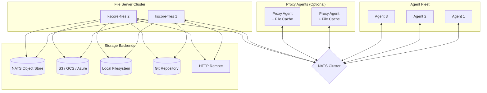
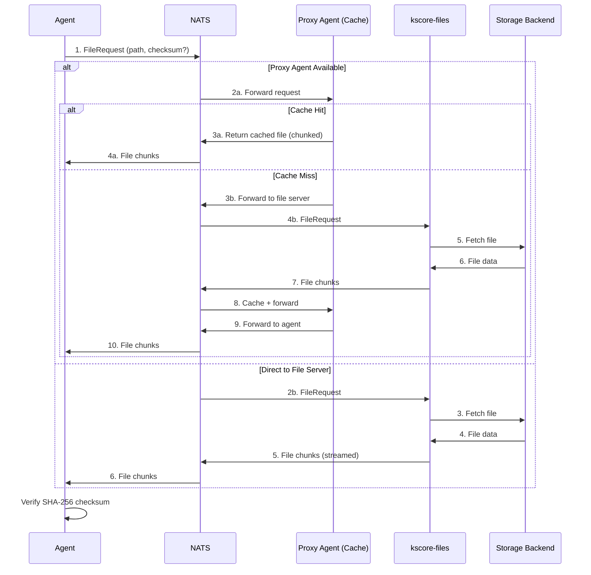
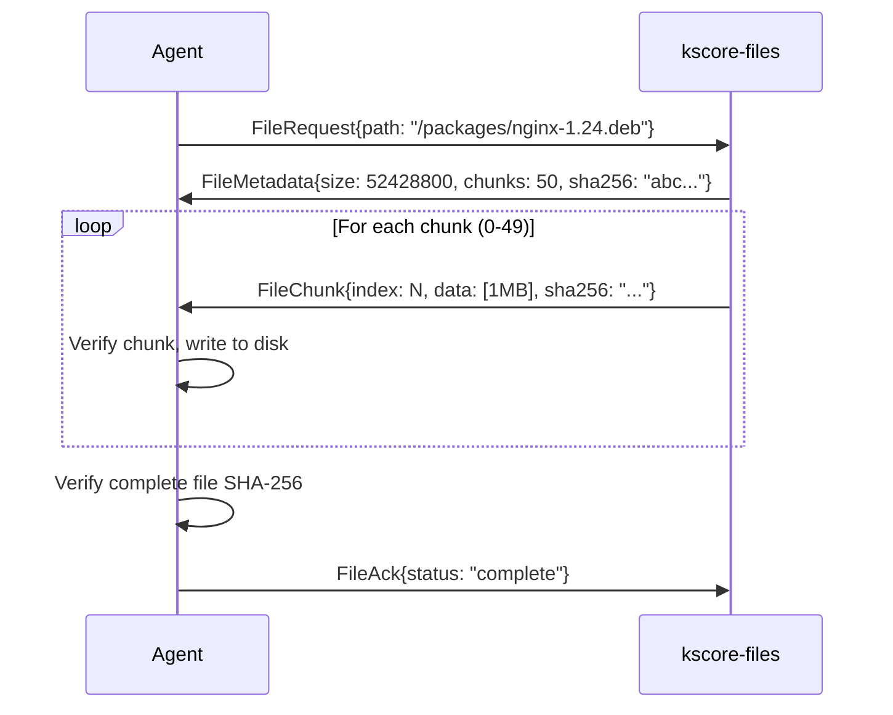
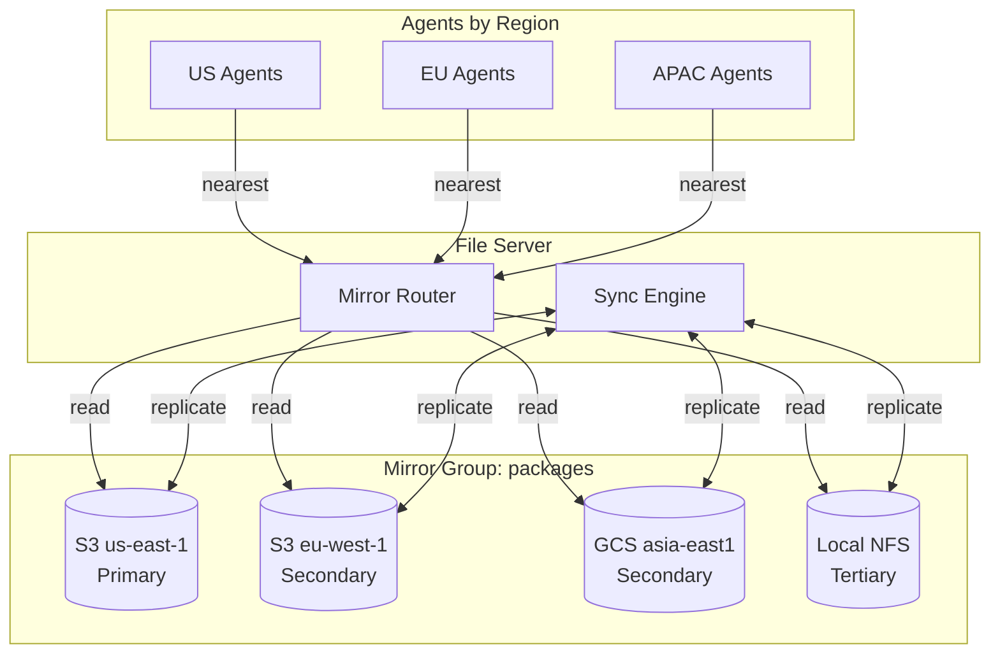

# Epic 22: File Distribution

## Overview

Implement a dedicated file distribution system that enables agents to retrieve packages, configurations, binaries, and other files over NATS without requiring additional network connections. The system uses a dedicated file server (`kscore-files`) that supports multiple storage backends and integrates with proxy agents for edge caching.

**Goal**: Provide a secure, efficient, and scalable file distribution mechanism that works entirely over the existing NATS infrastructure, supporting everything from small config files to large binary packages.

## Success Criteria

- [ ] Agents can request and receive files over NATS (no HTTP/S3 access required)
- [ ] Support files up to 10GB with chunked transfer
- [ ] Multiple storage backends: Local filesystem, S3, GCS, Azure Blob, NATS Object Store, HTTP, Git
- [ ] SHA-256 integrity verification for all transfers
- [ ] Proxy agent caching reduces bandwidth by 80%+ for repeated file requests
- [ ] File metadata and versioning support
- [ ] Access control integrated with agent identity
- [ ] Transfer resume on connection interruption
- [ ] <100ms latency for cached file metadata lookups
- [ ] Support 1000+ concurrent file transfers across fleet
- [ ] Mirror groups with multiple backends for the same content
- [ ] Geographic routing selects lowest-latency mirror automatically
- [ ] Mirror synchronization keeps all replicas consistent within configured bounds
- [ ] Automatic failover when a mirror becomes unhealthy
- [ ] Write policies (all, quorum, primary-only) for consistency vs performance tradeoff
- [ ] Conflict detection and resolution for split-brain scenarios

## Architecture

### High-Level Architecture



### Request Flow



### Chunked Transfer Protocol



## Concepts

### File Server (`kscore-files`)

A dedicated service that:
- Listens for file requests over NATS
- Fetches files from configured storage backends
- Streams files in chunks to requesting agents
- Handles concurrent requests with connection pooling
- Provides file metadata (size, checksum, modified time, version)
- Supports multiple instances for horizontal scaling

### Storage Backends

| Backend | Use Case | Features |
|---------|----------|----------|
| **NATS Object Store** | Small-medium files, built-in replication | Native NATS, automatic chunking, versioning |
| **Local Filesystem** | Air-gapped, simple deployments | Fast, no external deps, manual replication |
| **S3 / GCS / Azure** | Large scale, cloud-native | Virtually unlimited, durable, expensive egress |
| **Git Repository** | Config files, versioned content | Version history, branch support, GitOps friendly |
| **HTTP Remote** | Existing file servers, mirrors | Proxy existing infrastructure |

### File Namespaces

Files are organized into namespaces for access control and organization:

```
/packages/          # OS packages (deb, rpm, msi)
/configs/           # Configuration files
/scripts/           # Automation scripts
/binaries/          # Executable binaries
/certificates/      # TLS certificates, CA bundles
/modules/           # Keystone Core modules
/custom/            # User-defined content
```

### Mirror Groups

Mirror groups enable high availability and geographic distribution by maintaining the same content across multiple storage backends:



**Read Strategies:**

| Strategy | Description | Use Case |
|----------|-------------|----------|
| `nearest` | Route to lowest-latency mirror (periodic probing) | Global deployments |
| `round-robin` | Distribute reads across healthy mirrors | Load balancing |
| `failover` | Use primary, fail to secondaries in order | Simple HA |
| `fastest` | Route to mirror with fastest recent response | Performance optimization |
| `random` | Random selection from healthy mirrors | Even distribution |

**Write Policies:**

| Policy | Description | Consistency | Performance |
|--------|-------------|-------------|-------------|
| `all` | Write succeeds only when all mirrors updated | Strong | Slowest |
| `quorum` | Write succeeds when majority updated | Strong | Medium |
| `primary-only` | Write to primary, async replicate to others | Eventual | Fastest |
| `primary-secondary` | Sync write to primary+one secondary, async to rest | Bounded staleness | Medium |

**Consistency Models:**

| Model | Description | Sync Delay |
|-------|-------------|------------|
| `strong` | All reads see latest write (requires `all` or `quorum` write) | None |
| `eventual` | Mirrors converge over time | Configurable (default 60s) |
| `bounded` | Mirrors within N seconds of primary | Configurable |
| `read-your-writes` | Agent sees its own writes immediately | None for writer |

**Conflict Resolution:**

When mirrors have conflicting versions (e.g., after network partition):
- `newest-wins` - File with latest modification time wins (default)
- `largest-wins` - Larger file wins (useful for append-only logs)
- `primary-wins` - Primary mirror is always authoritative
- `manual` - Flag conflict for operator resolution

### Proxy Agent Caching

Proxy agents (from Epic 21) can act as file caches:

- **Cache Policy**: LRU with configurable max size
- **TTL**: Per-file or namespace-level TTL
- **Invalidation**: Explicit invalidation via NATS message
- **Warm-up**: Pre-populate cache with expected files
- **Bandwidth Saving**: Significant reduction for repeated requests in same location

### File Versioning

Files support versioning for safe updates:

```yaml
# Request specific version
path: /packages/nginx
version: "1.24.0-2"

# Request latest
path: /packages/nginx
version: "latest"

# Request by tag
path: /configs/app-config.yaml
tag: "production"
```

## User Stories

### US22.1: Basic File Retrieval
**As an** agent
**I want to** retrieve files over NATS
**So that** I don't need additional network access

**Acceptance Criteria**:
- Agent can request file by path
- File server streams file in chunks
- Agent verifies SHA-256 checksum
- Failed transfers can be resumed
- Timeout and retry handling

### US22.2: Storage Backend Configuration
**As a** platform operator
**I want to** configure multiple storage backends
**So that** I can use existing infrastructure

**Acceptance Criteria**:
- Support local filesystem backend
- Support S3-compatible storage (AWS, MinIO, GCS, Azure)
- Support NATS JetStream Object Store
- Support Git repositories (clone/pull)
- Support HTTP/HTTPS remote URLs
- Backend selection based on file path patterns
- Fallback backends for redundancy

### US22.3: Large File Transfer
**As an** agent
**I want to** download large files (>1GB) reliably
**So that** I can install large packages or binaries

**Acceptance Criteria**:
- Chunked transfer with configurable chunk size (default 1MB)
- Per-chunk checksum verification
- Resume interrupted transfers from last successful chunk
- Progress reporting via events
- Memory-efficient streaming (no full file buffering)
- Support files up to 10GB

### US22.4: File Metadata and Discovery
**As an** agent or operator
**I want to** query file metadata without downloading
**So that** I can check versions and make conditional requests

**Acceptance Criteria**:
- Query file size, checksum, modified time, version
- List files in namespace/directory
- Conditional GET (if-none-match with checksum)
- Search files by metadata/tags
- File existence check

### US22.5: Proxy Agent File Caching
**As a** platform operator
**I want** proxy agents to cache files
**So that** bandwidth is reduced for agents in the same location

**Acceptance Criteria**:
- Proxy agents can enable file caching
- Configurable cache size (default 10GB)
- LRU eviction when cache full
- TTL-based expiration (configurable per namespace)
- Cache hit/miss metrics
- Manual cache invalidation
- Cache warm-up from file list
- Agents automatically use nearest proxy with cache

### US22.6: Access Control
**As a** security engineer
**I want** file access controlled by agent identity
**So that** agents can only access authorized files

**Acceptance Criteria**:
- Namespace-level permissions (read, write, list)
- Agent identity (SPIFFE) integration
- Policy-based access control (OPA/CEL)
- Audit logging of file access
- Support for file-level ACLs
- Deny by default for undefined permissions

### US22.7: File Upload from Agents
**As an** agent
**I want to** upload files to the file server
**So that** I can store logs, artifacts, or backups

**Acceptance Criteria**:
- Chunked upload protocol
- Server-side checksum verification
- Configurable upload size limits per namespace
- Quota enforcement per agent/namespace
- Temporary upload staging before commit
- Upload progress events

### US22.8: Git Repository Backend
**As a** platform operator
**I want to** serve files from Git repositories
**So that** configuration is versioned and GitOps-friendly

**Acceptance Criteria**:
- Clone Git repository on startup
- Periodic pull for updates (configurable interval)
- Webhook trigger for immediate refresh
- Branch/tag selection per namespace mapping
- Sparse checkout for large repos
- SSH and HTTPS authentication

### US22.9: File Change Notifications
**As an** agent
**I want to** be notified when files change
**So that** I can automatically update configurations

**Acceptance Criteria**:
- Subscribe to file/namespace changes
- Change events include: path, version, checksum, action (created/updated/deleted)
- Debounce rapid changes
- Event filtering by pattern
- Integration with reactor system (Epic 4)

### US22.10: Bandwidth Management
**As a** platform operator
**I want to** control file transfer bandwidth
**So that** file distribution doesn't impact other operations

**Acceptance Criteria**:
- Rate limiting per agent
- Rate limiting per file server instance
- Priority queues (critical files first)
- Concurrent transfer limits
- Bandwidth metrics and monitoring
- Time-based bandwidth policies (full speed during maintenance windows)

### US22.11: File Server High Availability
**As a** platform operator
**I want** file servers to be highly available
**So that** file distribution continues during failures

**Acceptance Criteria**:
- Multiple file server instances
- Automatic request routing to healthy instances
- Shared backend storage (S3, NATS Object Store)
- No single point of failure
- Graceful degradation when backends unavailable
- Health check endpoints

### US22.12: Integration with State Modules
**As a** state module author
**I want** state modules to reference distributed files
**So that** configurations can include managed file content

**Acceptance Criteria**:
- `file` module supports `source: kscore://path/to/file`
- Automatic checksum verification
- Version pinning in state files
- Cached locally after first retrieval
- Template files supported

### US22.13: Multi-Mirror Storage for High Availability
**As a** platform operator
**I want to** configure multiple mirrors of the same storage
**So that** file distribution has geographic redundancy and high availability

**Acceptance Criteria**:
- Support mirror groups with multiple backends containing the same content
- Read routing strategies: nearest (latency-based), round-robin, failover, fastest
- Write policies: all (synchronous), primary-only (async replication), quorum
- Automatic mirror synchronization with configurable consistency
- Agent location hints for optimal mirror selection
- Mirror health monitoring with automatic failover
- Sync status metrics and alerting for drift between mirrors
- Support mixed backend types in a mirror group (e.g., S3 + GCS + local)
- Manual and automatic mirror resync capabilities

### US22.14: Geographic Routing
**As a** platform operator with globally distributed agents
**I want** agents to automatically retrieve files from the nearest mirror
**So that** transfer latency is minimized and regional bandwidth is optimized

**Acceptance Criteria**:
- Latency-based mirror selection using periodic probes
- Agent region/zone hints in configuration
- Proxy agent location awareness
- Fallback to next-nearest on mirror failure
- Metrics for per-region transfer performance
- Override routing for specific agents or namespaces

### US22.15: Mirror Synchronization
**As a** platform operator
**I want** mirrors to stay synchronized automatically
**So that** all regions have consistent file content

**Acceptance Criteria**:
- Background sync process for eventual consistency
- Configurable sync intervals
- Checksum-based change detection
- Conflict resolution (newest wins, or configurable)
- Sync progress and status API
- Alerts for sync failures or excessive drift
- Manual sync trigger via CLI
- Partial sync for large file sets (prioritize recently accessed)

## NATS Subject Namespace

```
# Core file operations
kscore.{cluster}.files.request.{namespace}     # File requests
kscore.{cluster}.files.metadata.{namespace}    # Metadata queries
kscore.{cluster}.files.upload.{namespace}      # File uploads
kscore.{cluster}.files.notify.{namespace}      # Change notifications
kscore.{cluster}.files.cache.invalidate        # Cache invalidation
kscore.{cluster}.files.admin.{operation}       # Admin operations

# Mirror operations
kscore.{cluster}.files.mirror.health.{group}   # Mirror health updates
kscore.{cluster}.files.mirror.sync.{group}     # Sync coordination
kscore.{cluster}.files.mirror.conflict.{group} # Conflict notifications
kscore.{cluster}.files.mirror.latency.{group}  # Latency probe results
kscore.{cluster}.files.mirror.route.{group}    # Routing decisions (debug)
```

## File Request Protocol

### FileRequest Message

```go
type FileRequest struct {
    RequestID     string            `json:"request_id"`
    Path          string            `json:"path"`
    Version       string            `json:"version,omitempty"`       // "latest", semver, or tag
    Checksum      string            `json:"checksum,omitempty"`      // Skip if matches (conditional)
    Range         *ByteRange        `json:"range,omitempty"`         // For resume
    ChunkSize     int               `json:"chunk_size,omitempty"`    // Override default
    Priority      int               `json:"priority,omitempty"`      // 0=normal, 1=high, 2=critical
    AgentID       string            `json:"agent_id"`
    Metadata      map[string]string `json:"metadata,omitempty"`
}

type ByteRange struct {
    Start int64 `json:"start"`
    End   int64 `json:"end,omitempty"`  // 0 = to end of file
}
```

### FileMetadata Response

```go
type FileMetadata struct {
    RequestID    string            `json:"request_id"`
    Path         string            `json:"path"`
    Version      string            `json:"version"`
    Size         int64             `json:"size"`
    Checksum     string            `json:"checksum"`           // SHA-256
    ContentType  string            `json:"content_type"`
    ModifiedTime time.Time         `json:"modified_time"`
    ChunkCount   int               `json:"chunk_count"`
    ChunkSize    int               `json:"chunk_size"`
    Tags         map[string]string `json:"tags,omitempty"`
    NotModified  bool              `json:"not_modified"`       // True if checksum matched
}
```

### FileChunk Message

```go
type FileChunk struct {
    RequestID  string `json:"request_id"`
    Index      int    `json:"index"`
    TotalCount int    `json:"total_count"`
    Data       []byte `json:"data"`            // Base64 encoded in JSON
    Checksum   string `json:"checksum"`        // Chunk checksum
    Final      bool   `json:"final"`
}
```

## Configuration

### File Server Configuration

```yaml
# kscore-files configuration
server:
  nats:
    urls: ["nats://nats:4222"]
    credentials_file: /etc/keystone-core/nats.creds

  cluster_id: "production"
  instance_id: "files-1"

  # Worker settings
  workers: 10                    # Concurrent transfer handlers
  max_chunk_size: 1048576        # 1MB default
  max_file_size: 10737418240     # 10GB max

  # Rate limiting
  rate_limit:
    per_agent: "100MB/s"
    global: "1GB/s"
    concurrent_transfers: 100

# Storage backends
backends:
  # NATS Object Store (recommended for small-medium files)
  - name: nats-objects
    type: nats-object-store
    bucket: kscore-files
    priority: 1
    paths:
      - /configs/**
      - /certificates/**
      - /scripts/**
    max_file_size: 104857600     # 100MB limit for this backend

  # S3-compatible storage (for large files)
  - name: s3-packages
    type: s3
    bucket: kscore-packages
    region: us-east-1
    endpoint: ""                 # Empty for AWS, set for MinIO/GCS
    priority: 2
    paths:
      - /packages/**
      - /binaries/**
    credentials:
      access_key_env: AWS_ACCESS_KEY_ID
      secret_key_env: AWS_SECRET_ACCESS_KEY

  # Git repository (for versioned configs)
  - name: git-configs
    type: git
    url: git@github.com:org/configs.git
    branch: main
    ssh_key_file: /etc/keystone-core/git-deploy-key
    poll_interval: 60s
    priority: 3
    paths:
      - /gitops/**

  # Local filesystem (fallback)
  - name: local
    type: filesystem
    root: /var/lib/keystone-core/files
    priority: 10
    paths:
      - /**                      # Catch-all fallback

# Mirror groups for high availability
mirror_groups:
  # Global packages mirror - same content in multiple regions
  - name: packages-global
    paths:
      - /packages/**
      - /binaries/**

    # Read strategy: how to select a mirror for reads
    read_strategy: nearest       # nearest, round-robin, failover, fastest, random

    # Write policy: how to handle writes
    write_policy: primary-only   # all, quorum, primary-only, primary-secondary

    # Consistency model
    consistency: eventual        # strong, eventual, bounded, read-your-writes
    bounded_staleness: 300s      # For bounded consistency: max lag from primary

    # Conflict resolution
    conflict_resolution: newest-wins  # newest-wins, largest-wins, primary-wins, manual

    # Sync configuration
    sync:
      enabled: true
      interval: 60s              # How often to check for sync
      batch_size: 100            # Files per sync batch
      bandwidth_limit: "100MB/s" # Limit sync bandwidth
      priority_recent: true      # Prioritize recently accessed files

    # Health checking
    health:
      check_interval: 30s
      timeout: 10s
      unhealthy_threshold: 3     # Failures before marking unhealthy
      healthy_threshold: 2       # Successes before marking healthy

    # Individual mirrors in the group
    mirrors:
      - name: us-east
        type: s3
        bucket: kscore-packages
        region: us-east-1
        role: primary            # primary or secondary
        weight: 100              # For weighted routing
        credentials:
          access_key_env: AWS_ACCESS_KEY_ID
          secret_key_env: AWS_SECRET_ACCESS_KEY

      - name: eu-west
        type: s3
        bucket: kscore-packages-eu
        region: eu-west-1
        role: secondary
        weight: 100
        credentials:
          access_key_env: AWS_ACCESS_KEY_ID_EU
          secret_key_env: AWS_SECRET_ACCESS_KEY_EU

      - name: ap-south
        type: gcs
        bucket: kscore-packages-asia
        region: asia-south1
        role: secondary
        weight: 80               # Slightly less preferred
        credentials:
          service_account_file: /etc/keystone-core/gcp-sa.json

      - name: local-backup
        type: filesystem
        root: /mnt/nfs/packages
        role: secondary
        weight: 50               # Fallback option

  # Config files mirror - strong consistency required
  - name: configs-ha
    paths:
      - /configs/critical/**
    read_strategy: failover
    write_policy: all            # All mirrors must confirm write
    consistency: strong
    conflict_resolution: primary-wins

    mirrors:
      - name: primary-nats
        type: nats-object-store
        bucket: kscore-configs
        role: primary

      - name: secondary-nats
        type: nats-object-store
        bucket: kscore-configs-backup
        role: secondary

# Namespace configuration
namespaces:
  packages:
    path: /packages
    permissions:
      - agents: ["*"]
        actions: [read, list]
      - agents: ["admin-*"]
        actions: [read, write, list, delete]
    cache_ttl: 24h

  configs:
    path: /configs
    permissions:
      - agents: ["*"]
        actions: [read]
    cache_ttl: 1h
    notify_on_change: true

  uploads:
    path: /uploads
    permissions:
      - agents: ["*"]
        actions: [read, write, list]
    max_file_size: 1073741824    # 1GB
    quota_per_agent: 10737418240 # 10GB
    retention: 7d
```

### Agent File Client Configuration

```yaml
# Agent configuration for file retrieval
files:
  enabled: true
  cache_dir: /var/cache/keystone-core/files
  cache_size: 1073741824         # 1GB local cache
  chunk_size: 1048576            # 1MB
  retry_attempts: 3
  retry_delay: 5s
  verify_checksums: true

  # Prefer proxy agents for caching
  prefer_proxy: true
  proxy_timeout: 5s              # Fallback to file server if proxy slow

  # Location hints for geographic routing
  location:
    region: us-east-1            # Cloud region or custom identifier
    zone: us-east-1a             # Availability zone
    datacenter: dc-east-1        # Datacenter identifier
    country: US                  # ISO country code
    # Coordinates for distance-based routing (optional)
    latitude: 39.0438
    longitude: -77.4874

  # Mirror preferences (override automatic routing)
  mirror_preferences:
    # Prefer specific mirrors for certain paths
    overrides:
      - paths: ["/packages/internal/**"]
        prefer_mirrors: [local-backup]
      - paths: ["/binaries/large/**"]
        prefer_mirrors: [us-east, local-backup]  # Prefer local for large files

    # Never use certain mirrors (e.g., expensive egress)
    exclude_mirrors: []

    # Minimum mirrors to try before failing
    min_mirrors: 1

    # Maximum latency before trying next mirror
    latency_threshold: 500ms
```

### Proxy Agent Cache Configuration

```yaml
# Proxy agent file cache configuration
file_cache:
  enabled: true
  cache_dir: /var/cache/keystone-core/file-cache
  max_size: 10737418240          # 10GB

  # Eviction policy
  eviction: lru
  min_free_space: 1073741824     # 1GB reserved

  # TTL settings
  default_ttl: 24h
  namespace_ttl:
    /packages: 168h              # 7 days
    /configs: 1h
    /scripts: 4h

  # Pre-warming
  warm_on_start:
    - /packages/common/**
    - /configs/base/**

  # Metrics
  metrics:
    enabled: true
    report_interval: 60s
```

## Technical Tasks

### Phase 1: Core Protocol & Local Backend (Weeks 1-2)

**T1.1: File Protocol Types**
- Define protobuf messages for file operations
- FileRequest, FileMetadata, FileChunk, FileAck
- Error types and status codes

**T1.2: File Server Core**
- Create `cmd/kscore-files/` binary
- NATS connection and subscription handling
- Request routing and worker pool
- Chunked streaming implementation

**T1.3: Local Filesystem Backend**
- Implement filesystem storage backend
- File reading with streaming
- Directory listing
- Checksum calculation (SHA-256)

**T1.4: Agent File Client**
- File request API in agent
- Chunk reassembly and verification
- Local file caching
- Resume support for interrupted transfers

### Phase 2: Cloud Storage Backends (Weeks 3-4)

**T2.1: S3-Compatible Backend**
- AWS S3 client integration
- Support for MinIO, GCS (S3-compatible mode)
- Streaming download (no full buffering)
- Multipart upload support

**T2.2: Azure Blob Backend**
- Azure Blob Storage client
- Block blob streaming
- SAS token support

**T2.3: Google Cloud Storage Backend**
- GCS native client
- Streaming operations
- Service account authentication

**T2.4: Backend Selection Logic**
- Path-based backend routing
- Priority-based fallback
- Health checking for backends

### Phase 3: NATS Object Store Backend (Weeks 5-6)

**T3.1: NATS Object Store Integration**
- JetStream Object Store client
- Put/Get/Delete operations
- Chunking handled by NATS
- Watch for changes

**T3.2: Object Store Optimization**
- Connection pooling
- Batch metadata queries
- Efficient listing

**T3.3: Object Store Replication**
- Multi-replica configuration
- Read from nearest replica
- Write consistency settings

### Phase 4: Git Repository Backend (Weeks 7-8)

**T4.1: Git Clone and Fetch**
- go-git integration
- SSH and HTTPS authentication
- Sparse checkout support

**T4.2: Branch and Tag Support**
- Map namespaces to branches
- Tag-based versioning
- Ref resolution

**T4.3: Webhook Integration**
- HTTP endpoint for webhooks
- GitHub/GitLab/Bitbucket support
- Immediate refresh on push

### Phase 5: Proxy Agent Caching (Weeks 9-10)

**T5.1: Cache Storage**
- File-based cache with index
- LRU eviction implementation
- TTL expiration handling

**T5.2: Cache Protocol**
- Request interception at proxy
- Cache hit/miss handling
- Passthrough for uncacheable

**T5.3: Cache Management**
- Invalidation messages
- Cache warm-up API
- Cache statistics

**T5.4: Proxy Discovery**
- Agents discover proxy with cache
- Nearest proxy selection
- Automatic fallback to file server

### Phase 6: Access Control & Security (Weeks 11-12)

**T6.1: Authentication**
- Agent identity verification (SPIFFE)
- Request signing
- Credential validation

**T6.2: Authorization**
- Namespace permissions
- Policy engine integration (OPA/CEL)
- ACL evaluation

**T6.3: Audit Logging**
- File access logging
- Download/upload tracking
- Integration with audit system

### Phase 7: High Availability & Scaling (Weeks 13-14)

**T7.1: Multi-Instance Support**
- Stateless file server design
- Load distribution via NATS queue groups
- Health check endpoints

**T7.2: Bandwidth Management**
- Per-agent rate limiting
- Global rate limiting
- Priority queues

**T7.3: Metrics & Monitoring**
- Transfer metrics (count, size, duration)
- Cache metrics (hit rate, size)
- Backend metrics (latency, errors)
- Prometheus exporter

### Phase 8: State Module Integration (Weeks 15-16)

**T8.1: File Module Enhancement**
- Support `source: kscore://` URLs
- Automatic checksum verification
- Version pinning

**T8.2: Package Module Enhancement**
- Package files from file server
- Repository mirroring support

**T8.3: Template Integration**
- Template files from file server
- Variable substitution

### Phase 9: CLI & Administration (Weeks 17-18)

**T9.1: File Server CLI**
- `kscore-files` admin commands
- Backend status
- Cache management

**T9.2: kscorectl Integration**
- `kscorectl files list`
- `kscorectl files get`
- `kscorectl files put`
- `kscorectl files delete`

**T9.3: File Upload Tool**
- Bulk upload utility
- Directory sync
- Checksum verification

### Phase 10: Mirror Groups & Geographic Routing (Weeks 19-22)

**T10.1: Mirror Group Core**
- Mirror group configuration parsing and validation
- MirrorGroup struct with mirrors, policies, health state
- MirrorRegistry for managing multiple mirror groups
- Path-to-mirror-group routing

**T10.2: Read Routing Strategies**
- `nearest` strategy with latency probing
  - Periodic latency measurement to each mirror
  - Exponential moving average for stability
  - Agent location hints integration
- `round-robin` strategy with weighted distribution
- `failover` strategy with ordered fallback
- `fastest` strategy with recent response time tracking
- Strategy interface for extensibility

**T10.3: Latency Probing**
- Background latency probe goroutine
- Small file fetch for realistic latency measurement
- Per-agent latency cache
- Latency histogram per mirror for percentile routing
- Probe interval configuration

**T10.4: Write Policies**
- `all` policy: synchronous write to all mirrors
  - Transaction-like semantics with rollback on failure
  - Timeout handling
- `quorum` policy: wait for majority acknowledgment
  - Configurable quorum size
  - Fastest responders counted first
- `primary-only` policy: write to primary, queue for async replication
- `primary-secondary` policy: sync to primary + one, async to rest

**T10.5: Mirror Health Monitoring**
- Health check goroutine per mirror
- Configurable thresholds (unhealthy after N failures)
- Health state: unknown, healthy, degraded, unhealthy
- Circuit breaker per mirror
- Health change events

**T10.6: Geographic Routing**
- Agent location parsing and normalization
- Region/zone matching logic
- Coordinate-based distance calculation (Haversine)
- Location inheritance from proxy agent
- Override rules for specific paths

### Phase 11: Mirror Synchronization (Weeks 23-26)

**T11.1: Sync Engine Core**
- SyncEngine struct managing sync operations
- Sync state: idle, syncing, error
- Per-mirror-group sync status
- Sync queue with priority ordering

**T11.2: Change Detection**
- Checksum-based change detection
- File listing comparison between mirrors
- Modification time tracking
- Incremental sync (only changed files)

**T11.3: Sync Protocol**
```go
type SyncOperation struct {
    SourceMirror      string
    TargetMirror      string
    Files             []SyncFile
    Priority          int
    StartedAt         time.Time
    BytesTransferred  int64
    FilesCompleted    int
    Status            SyncStatus
}

type SyncFile struct {
    Path          string
    Checksum      string
    Size          int64
    ModifiedTime  time.Time
    Action        SyncAction  // copy, delete, conflict
}
```

**T11.4: Conflict Resolution**
- Conflict detection (different checksums on mirrors)
- Resolution strategies:
  - `newest-wins`: compare modification times
  - `largest-wins`: compare file sizes
  - `primary-wins`: primary mirror authoritative
  - `manual`: flag for operator review
- Conflict logging and alerting
- Manual resolution API

**T11.5: Sync Scheduling**
- Configurable sync intervals per mirror group
- Priority queue for sync operations
- Bandwidth limiting for sync traffic
- Off-peak sync scheduling
- Manual sync trigger

**T11.6: Sync Progress & Monitoring**
- Real-time sync progress API
- Sync history storage
- Sync duration metrics
- Files synced counter
- Bytes transferred metrics
- Sync failure tracking

**T11.7: Partial and Priority Sync**
- Prioritize recently accessed files
- Prioritize small files for quick consistency
- Large file chunked sync
- Resume interrupted sync
- Exclude patterns for sync

### Phase 12: Mirror Administration (Weeks 27-28)

**T12.1: Mirror CLI Commands**
```bash
# List mirror groups and status
kscorectl files mirrors list

# Show mirror group details
kscorectl files mirrors show packages-global

# Check sync status
kscorectl files mirrors sync-status packages-global

# Trigger manual sync
kscorectl files mirrors sync packages-global

# Sync specific path
kscorectl files mirrors sync packages-global --path /packages/nginx/**

# Show mirror health
kscorectl files mirrors health

# Force failover to specific mirror
kscorectl files mirrors failover packages-global --to eu-west

# Show latency matrix
kscorectl files mirrors latency

# List conflicts
kscorectl files mirrors conflicts

# Resolve conflict
kscorectl files mirrors resolve-conflict <conflict-id> --strategy newest-wins
```

**T12.2: Mirror Management API**
- GET /api/v1/files/mirrors - List mirror groups
- GET /api/v1/files/mirrors/{name} - Mirror group details
- GET /api/v1/files/mirrors/{name}/health - Health status
- GET /api/v1/files/mirrors/{name}/sync - Sync status
- POST /api/v1/files/mirrors/{name}/sync - Trigger sync
- GET /api/v1/files/mirrors/{name}/conflicts - List conflicts
- POST /api/v1/files/mirrors/{name}/conflicts/{id}/resolve - Resolve conflict
- GET /api/v1/files/mirrors/{name}/latency - Latency matrix

**T12.3: Mirror Metrics**
- `kscore_files_mirror_health` - Mirror health status gauge
- `kscore_files_mirror_latency_seconds` - Latency histogram per mirror
- `kscore_files_mirror_reads_total` - Read counter per mirror
- `kscore_files_mirror_writes_total` - Write counter per mirror
- `kscore_files_mirror_sync_files_total` - Synced files counter
- `kscore_files_mirror_sync_bytes_total` - Synced bytes counter
- `kscore_files_mirror_sync_duration_seconds` - Sync duration histogram
- `kscore_files_mirror_sync_lag_seconds` - Lag from primary gauge
- `kscore_files_mirror_conflicts_total` - Conflict counter

**T12.4: Mirror Grafana Dashboard**
- Mirror health overview panel
- Latency heatmap across regions
- Read distribution pie chart
- Sync status and progress
- Conflict alerts
- Per-mirror throughput

**T12.5: Mirror Alerts**
- Mirror unhealthy for > 5 minutes
- Sync lag > configured threshold
- Sync failure
- Unresolved conflicts > N
- All secondaries unhealthy (primary only)
- Write quorum not achievable

### Phase 13: Documentation & Testing (Weeks 29-30)

**T13.1: Documentation**
- Architecture documentation
- Configuration reference
- Mirror groups setup guide
- Geographic routing configuration
- Sync and conflict resolution guide
- Backend setup guides
- Troubleshooting guide

**T13.2: Unit Tests**
- Protocol tests
- Backend tests
- Cache tests
- Mirror routing tests
- Sync engine tests
- Conflict resolution tests

**T13.3: Integration Tests**
- End-to-end transfer tests
- Multi-backend tests
- Proxy cache tests
- Mirror failover tests
- Cross-region sync tests
- Geographic routing tests

**T13.4: Performance Tests**
- Large file transfer benchmarks
- Concurrent transfer tests
- Cache performance tests
- Mirror sync throughput
- Latency routing accuracy
- Multi-region transfer benchmarks

## Dependencies

- **Epic 1** (Core Infrastructure) - NATS, agent communication
- **Epic 4** (Event System) - File change notifications
- **Epic 6** (Policy Enforcement) - Access control
- **Epic 14** (NATS Mesh) - NATS communication patterns
- **Epic 17** (SPIFFE Identity) - Agent authentication
- **Epic 21** (Proxy Agents) - Proxy caching infrastructure

## Risks & Mitigations

| Risk | Impact | Probability | Mitigation |
|------|--------|-------------|------------|
| Large file transfers overwhelm NATS | High | Medium | Chunked streaming, rate limiting, separate NATS connections |
| Storage backend failures | High | Medium | Multiple backends with fallback, health checks, mirror groups |
| Cache inconsistency | Medium | Medium | TTL-based expiration, explicit invalidation, checksums |
| Network partition during transfer | Medium | Medium | Resume support, chunk-level checkpoints |
| Storage costs for large deployments | Medium | Low | Tiered storage, compression, deduplication |
| Proxy cache fills disk | Medium | Medium | LRU eviction, reserved space, monitoring |
| Mirror sync lag causes stale reads | Medium | Medium | Bounded staleness config, sync lag monitoring, alerts |
| Split-brain creates conflicts | High | Low | Conflict detection, resolution strategies, operator alerts |
| Geographic routing returns wrong mirror | Medium | Low | Latency probing, multiple probe points, location hints |
| Sync bandwidth impacts production | Medium | Medium | Bandwidth limiting, off-peak scheduling, priority queues |
| Cross-region egress costs | Medium | Medium | Sync scheduling, local cache preference, cost monitoring |
| Primary mirror failure during write | High | Low | Quorum writes, transaction rollback, failover election |

## Security Considerations

### Data in Transit
- All transfers over NATS (already mTLS encrypted)
- Per-chunk checksums prevent tampering
- Request signing prevents replay attacks

### Data at Rest
- Backend-specific encryption (S3 SSE, etc.)
- NATS Object Store encryption
- Local cache encryption (optional)

### Access Control
- Namespace-based permissions
- Agent identity verification
- Audit logging for compliance

### Sensitive Files
- Certificates and keys in restricted namespace
- Automatic expiration for uploaded credentials
- No file content in logs

## Metrics

| Metric | Type | Description |
|--------|------|-------------|
| `kscore_files_requests_total` | Counter | Total file requests by namespace, status |
| `kscore_files_bytes_transferred_total` | Counter | Total bytes transferred by direction |
| `kscore_files_transfer_duration_seconds` | Histogram | Transfer duration by size bucket |
| `kscore_files_active_transfers` | Gauge | Currently active transfers |
| `kscore_files_backend_requests_total` | Counter | Backend requests by backend, status |
| `kscore_files_backend_latency_seconds` | Histogram | Backend operation latency |
| `kscore_files_cache_hits_total` | Counter | Proxy cache hits |
| `kscore_files_cache_misses_total` | Counter | Proxy cache misses |
| `kscore_files_cache_size_bytes` | Gauge | Current cache size |
| `kscore_files_cache_evictions_total` | Counter | Cache evictions |
| `kscore_files_mirror_health` | Gauge | Mirror health status (0=unhealthy, 1=degraded, 2=healthy) |
| `kscore_files_mirror_latency_seconds` | Histogram | Latency to each mirror by group, mirror |
| `kscore_files_mirror_reads_total` | Counter | Read requests by group, mirror |
| `kscore_files_mirror_writes_total` | Counter | Write requests by group, mirror |
| `kscore_files_mirror_sync_files_total` | Counter | Files synchronized by group |
| `kscore_files_mirror_sync_bytes_total` | Counter | Bytes synchronized by group |
| `kscore_files_mirror_sync_duration_seconds` | Histogram | Sync operation duration by group |
| `kscore_files_mirror_sync_lag_seconds` | Gauge | Sync lag from primary by group, mirror |
| `kscore_files_mirror_conflicts_total` | Counter | Conflicts detected by group |
| `kscore_files_mirror_conflicts_unresolved` | Gauge | Unresolved conflicts by group |
| `kscore_files_mirror_routing_decisions_total` | Counter | Routing decisions by strategy, group |
| `kscore_files_mirror_failovers_total` | Counter | Failover events by group |

## Testing Strategy

### Unit Tests
- Protocol message serialization
- Backend implementations (mocked storage)
- Cache eviction logic
- Checksum verification
- Mirror routing strategy selection
- Sync conflict detection
- Geographic distance calculations
- Write policy implementations

### Integration Tests
- Full transfer flow with real NATS
- Multi-backend routing
- Proxy cache behavior
- Resume interrupted transfers
- Mirror group failover
- Cross-mirror sync verification
- Geographic routing with location hints
- Conflict resolution scenarios

### Performance Tests
- 1GB file transfer latency
- 100 concurrent transfers
- Cache hit rate under load
- Backend failover time
- Mirror sync throughput (files/sec, MB/sec)
- Latency routing accuracy under load
- Multi-region transfer benchmarks
- Conflict resolution latency

### Chaos Tests
- Backend unavailability
- NATS partition during transfer
- Proxy agent failure mid-transfer
- Disk full scenarios
- Primary mirror failure during sync
- Network partition between mirrors (split-brain)
- All secondary mirrors unavailable
- Sync process killed mid-transfer
- Clock skew between mirrors

## Definition of Done

- [ ] All user stories completed and accepted (US22.1-US22.15)
- [ ] Unit test coverage >80%
- [ ] Integration tests passing
- [ ] Performance benchmarks met
- [ ] Documentation complete
- [ ] Security review completed
- [ ] Grafana dashboard for file distribution
- [ ] Grafana dashboard for mirror groups
- [ ] Alert rules for transfer failures and cache issues
- [ ] Alert rules for mirror health, sync lag, and conflicts
- [ ] Mirror sync tested with 3+ mirrors across regions
- [ ] Geographic routing tested with agents in multiple locations
- [ ] Conflict resolution tested for all strategies
- [ ] Failover tested with primary mirror failure
