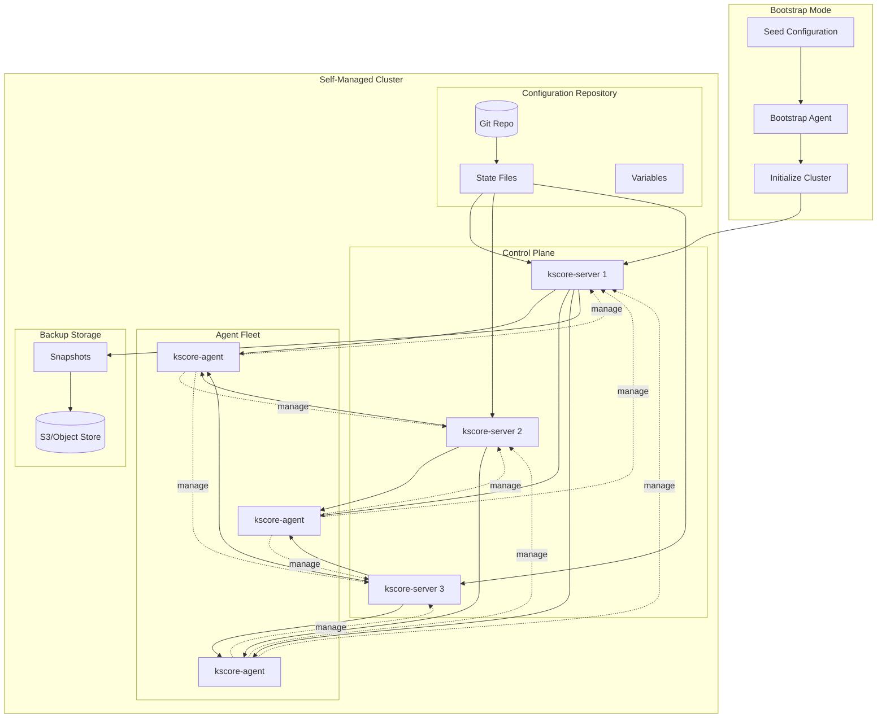
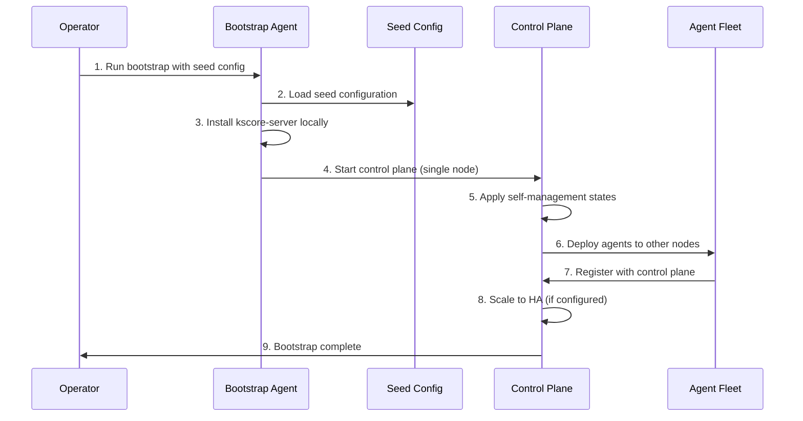
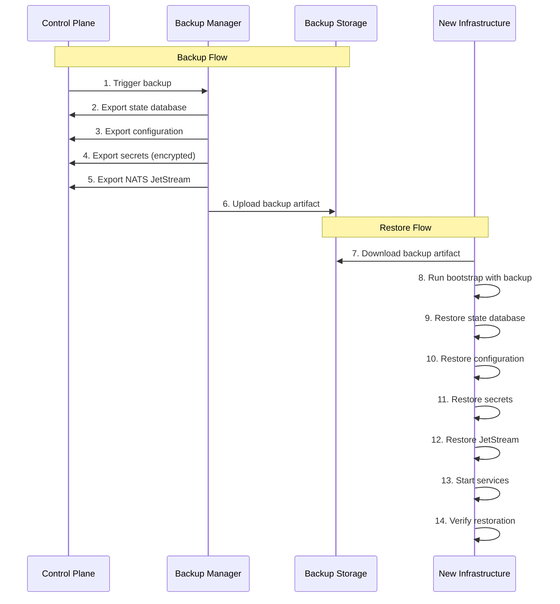

# Epic 23: Self-Management

## Overview

Enable Keystone Core to manage its own infrastructure using the same state management, execution, and automation capabilities it provides for other systems. This includes managing server and agent configurations, performing backups and restores, orchestrating upgrades, and enabling "redeploy from scratch" disaster recovery scenarios.

**Goal**: Keystone Core should be able to fully bootstrap, configure, backup, restore, and upgrade itself using its own primitives, treating its infrastructure as just another managed workload.

**Key Principle**: "Eat your own dog food" - if Keystone Core can't manage itself reliably, it shouldn't be trusted to manage other critical infrastructure.

## Success Criteria

- [ ] All Keystone Core components (server, agents, NATS, PostgreSQL) manageable via state files
- [ ] Complete system backup exportable to a single portable artifact
- [ ] Full system restore from backup to fresh infrastructure in <15 minutes
- [ ] Zero-downtime rolling upgrades for all components
- [ ] Configuration drift detection for Keystone Core infrastructure
- [ ] Bootstrap mode for initial deployment without existing Keystone Core
- [ ] Self-healing for common failure scenarios
- [ ] Disaster recovery tested and documented with RTO <30 minutes, RPO <5 minutes

## Architecture

### Self-Management Architecture



### Bootstrap Flow



### Backup and Restore Flow



## Concepts

### Bootstrap Mode

Bootstrap mode enables deploying Keystone Core to fresh infrastructure without an existing cluster:

1. **Seed Configuration**: Minimal YAML file defining the target architecture
2. **Bootstrap Agent**: Standalone binary that can run without a control plane
3. **Self-Apply**: Bootstrap agent applies states to create the control plane
4. **Handoff**: Once running, control plane takes over management

```yaml
# seed-config.yaml
cluster:
  name: production
  domain: kscore.example.com

control_plane:
  replicas: 3
  nodes:
    - host: cp1.example.com
      role: leader
    - host: cp2.example.com
      role: follower
    - host: cp3.example.com
      role: follower

nats:
  mode: cluster
  nodes:
    - nats1.example.com
    - nats2.example.com
    - nats3.example.com

database:
  type: postgresql
  host: postgres.example.com
  name: kscore

etcd:
  mode: embedded  # or external

initial_agents:
  - host: worker1.example.com
    labels:
      role: worker
      datacenter: us-east-1
```

### Self-Management States

Keystone Core components are managed via standard state files:

```yaml
# states/kscore-server.yaml
kscore_server:
  install:
    pkg.installed:
      - name: kscore-server
      - version: {{ vars.kscore_version }}

  config:
    file.managed:
      - name: /etc/kscore/server.yaml
      - source: kscore://configs/server.yaml
      - template: true
      - require:
          - pkg: kscore_server.install

  service:
    service.running:
      - name: kscore-server
      - enable: true
      - watch:
          - file: kscore_server.config
```

### Backup Artifacts

A backup artifact is a self-contained package for disaster recovery:

```
kscore-backup-2024-01-15T10-30-00Z.tar.gz
├── manifest.yaml           # Backup metadata and checksums
├── state/
│   ├── database.sql.gz     # PostgreSQL/SQLite dump
│   └── schema_version      # Database schema version
├── config/
│   ├── server.yaml         # Server configuration
│   ├── agents/             # Per-agent configurations
│   └── cluster.yaml        # Cluster configuration
├── secrets/
│   └── secrets.enc         # Encrypted secrets (age/sops)
├── nats/
│   └── jetstream/          # JetStream snapshots
├── etcd/
│   └── snapshot.db         # etcd snapshot (if embedded)
├── identity/
│   ├── ca.crt              # CA certificate
│   ├── ca.key.enc          # Encrypted CA key
│   └── trust_bundle.pem    # Trust bundle
└── modules/
    └── cache/              # Cached modules (optional)
```

### Configuration Hierarchy

Self-management uses a layered configuration approach:

```
1. Defaults (compiled into binary)
   ↓
2. Seed Configuration (bootstrap)
   ↓
3. State Files (GitOps)
   ↓
4. Runtime Overrides (environment/flags)
```

### Upgrade Strategies

| Strategy | Description | Downtime | Risk |
|----------|-------------|----------|------|
| **Rolling** | Update one node at a time | None | Low |
| **Blue-Green** | Deploy new cluster, switch traffic | Seconds | Medium |
| **Canary** | Gradual rollout with monitoring | None | Low |
| **In-Place** | Stop, upgrade, start | Yes | High |

## User Stories

### US23.1: Bootstrap Fresh Cluster
**As a** platform operator
**I want to** deploy Keystone Core to fresh infrastructure from a seed configuration
**So that** I can set up new environments without manual intervention

**Acceptance Criteria**:
- Single command bootstrap: `kscore-bootstrap --seed seed-config.yaml`
- Bootstrap agent runs without existing control plane
- Automatically installs and configures all components
- Supports single-node and multi-node clusters
- Generates initial credentials and certificates
- Outputs connection information when complete
- Idempotent (safe to re-run)

### US23.2: Export Full System Backup
**As a** platform operator
**I want to** export a complete backup of the Keystone Core system
**So that** I can restore it in case of disaster

**Acceptance Criteria**:
- Single command: `kscorectl backup create`
- Includes database, configuration, secrets, JetStream, etcd
- Secrets encrypted with configurable key (age, AWS KMS, Vault transit)
- Backup artifact is portable (single file)
- Verification of backup integrity (checksums)
- Configurable retention for automated backups
- Progress reporting for large backups
- Option to exclude large/non-critical data

### US23.3: Restore from Backup
**As a** platform operator
**I want to** restore Keystone Core from a backup artifact
**So that** I can recover from disasters or clone environments

**Acceptance Criteria**:
- Single command: `kscore-bootstrap --restore backup.tar.gz`
- Restores to fresh infrastructure (no existing installation required)
- Decrypts secrets with provided key
- Validates backup integrity before restore
- Handles version differences (with warnings)
- Option for partial restore (config only, data only)
- Agents automatically reconnect after restore
- Verification steps after restore

### US23.4: Scheduled Automated Backups
**As a** platform operator
**I want** backups to run automatically on a schedule
**So that** I have recent recovery points without manual intervention

**Acceptance Criteria**:
- Configurable backup schedule (cron syntax)
- Multiple backup destinations (S3, GCS, Azure, local, SFTP)
- Retention policies (keep last N, keep daily for N days)
- Backup success/failure events and metrics
- Alerting on backup failures
- Incremental backups for large datasets (optional)
- Backup rotation and cleanup

### US23.5: Self-Configuration Management
**As a** platform operator
**I want to** manage Keystone Core configuration via state files
**So that** infrastructure-as-code applies to Keystone Core itself

**Acceptance Criteria**:
- State modules for kscore-server, kscore-agent, NATS, PostgreSQL
- Configuration changes trigger controlled restarts
- Drift detection for Keystone Core components
- GitOps workflow for configuration changes
- Validation before applying (dry-run)
- Rollback on failed configuration changes
- Configuration versioning and history

### US23.6: Rolling Upgrades
**As a** platform operator
**I want to** upgrade Keystone Core components without downtime
**So that** updates don't impact managed infrastructure

**Acceptance Criteria**:
- Rolling upgrade for control plane (one node at a time)
- Agent upgrades in batches with configurable parallelism
- Health checks between upgrade steps
- Automatic rollback on health check failure
- Version compatibility validation before upgrade
- Drain connections before node upgrade
- Progress reporting and ETA
- Upgrade history tracking

### US23.7: Self-Healing
**As a** platform operator
**I want** Keystone Core to automatically recover from common failures
**So that** the system is resilient without manual intervention

**Acceptance Criteria**:
- Automatic restart of failed components
- Automatic leader re-election on control plane failure
- Agent reconnection after network issues
- Database connection recovery
- NATS cluster recovery
- Configurable health check thresholds
- Event emission for self-healing actions
- Escalation to alerts when self-healing fails

### US23.8: Disaster Recovery Testing
**As a** platform operator
**I want to** test disaster recovery procedures automatically
**So that** I'm confident recovery will work when needed

**Acceptance Criteria**:
- DR test mode: restore to isolated environment
- Automated DR test scheduling
- Validation of restored system functionality
- DR test reports with timing and issues
- Non-destructive (doesn't affect production)
- Cleanup of DR test resources
- Integration with compliance reporting

### US23.9: Configuration Drift Detection
**As a** platform operator
**I want to** detect when Keystone Core configuration has drifted
**So that** I can ensure the system matches desired state

**Acceptance Criteria**:
- Periodic drift detection for all components
- Compare running config vs. state file definitions
- Drift severity classification
- Drift remediation (manual or automatic)
- Drift history and trends
- Alerts for critical drift
- Exclusions for expected differences

### US23.10: Multi-Environment Management
**As a** platform operator
**I want to** manage multiple Keystone Core environments from a single place
**So that** I can maintain consistency across dev/staging/prod

**Acceptance Criteria**:
- Environment definitions (dev, staging, prod)
- Shared base configuration with environment overrides
- Promotion workflow between environments
- Environment comparison (diff)
- Environment-specific secrets handling
- Cross-environment backup/restore (with sanitization)

### US23.11: Import Existing Installation
**As a** platform operator
**I want to** import an existing manually-configured Keystone Core installation
**So that** I can bring it under self-management

**Acceptance Criteria**:
- Discovery of existing components
- Export current configuration as state files
- Generate seed configuration from running system
- Gradual transition to self-management
- Validation before takeover
- Rollback option if import fails

### US23.12: Secrets Rotation
**As a** security engineer
**I want to** rotate Keystone Core secrets automatically
**So that** credentials don't become stale or compromised

**Acceptance Criteria**:
- Automatic rotation of internal credentials
- Certificate renewal before expiry
- Database password rotation
- NATS credentials rotation
- API key rotation with grace period
- Rotation without downtime
- Audit logging of rotations
- Integration with external secret managers

## State Modules

### kscore_server Module

```yaml
# Manage kscore-server installation and configuration
kscore_server:
  install:
    kscore_server.installed:
      - version: "1.5.0"
      - channel: stable  # stable, beta, nightly
      - verify_signature: true

  config:
    kscore_server.configured:
      - cluster_id: production
      - nats_urls:
          - nats://nats1:4222
          - nats://nats2:4222
      - database:
          type: postgresql
          host: postgres.example.com
          name: kscore
      - api:
          listen: ":8080"
          tls:
            cert_file: /etc/kscore/tls/server.crt
            key_file: /etc/kscore/tls/server.key

  service:
    kscore_server.running:
      - enable: true
      - require:
          - kscore_server: install
          - kscore_server: config
```

### kscore_agent Module

```yaml
# Manage kscore-agent installation and configuration
kscore_agent:
  install:
    kscore_agent.installed:
      - version: "1.5.0"
      - verify_signature: true

  config:
    kscore_agent.configured:
      - server_urls:
          - nats://nats1:4222
          - nats://nats2:4222
      - agent_id: "{{ grains.id }}"
      - labels:
          role: "{{ vars.role }}"
          datacenter: "{{ vars.datacenter }}"

  service:
    kscore_agent.running:
      - enable: true
```

### kscore_nats Module

```yaml
# Manage NATS server for Keystone Core
kscore_nats:
  install:
    kscore_nats.installed:
      - version: "2.10.0"
      - mode: cluster  # embedded, standalone, cluster

  config:
    kscore_nats.configured:
      - cluster_name: kscore-nats
      - jetstream:
          enabled: true
          store_dir: /var/lib/nats/jetstream
          max_memory: 1GB
          max_file: 10GB
      - cluster:
          routes:
            - nats://nats1:6222
            - nats://nats2:6222
            - nats://nats3:6222
```

### kscore_database Module

```yaml
# Manage database for Keystone Core
kscore_database:
  postgresql:
    kscore_database.postgresql:
      - host: postgres.example.com
      - port: 5432
      - database: kscore
      - user: kscore
      - password_secret: kscore/db/password
      - ensure_schema: true
      - backup_schedule: "0 */6 * * *"
```

### kscore_backup Module

```yaml
# Manage backup configuration
kscore_backup:
  config:
    kscore_backup.configured:
      - schedule: "0 2 * * *"  # Daily at 2 AM
      - destination:
          type: s3
          bucket: kscore-backups
          prefix: production/
      - retention:
          daily: 7
          weekly: 4
          monthly: 12
      - encryption:
          type: age
          recipient: age1...
```

## Configuration

### Bootstrap Configuration

```yaml
# /etc/kscore/bootstrap.yaml
bootstrap:
  mode: seed  # seed, restore, import

  seed:
    config_file: /etc/kscore/seed-config.yaml

  restore:
    backup_file: /path/to/backup.tar.gz
    decryption_key_file: /path/to/key.txt

  import:
    discover: true
    output_dir: /etc/kscore/imported/

  # Post-bootstrap actions
  post_bootstrap:
    - apply_states: true
    - verify_health: true
    - register_agents: true
```

### Backup Configuration

```yaml
# /etc/kscore/backup.yaml
backup:
  # Schedule (cron format)
  schedule: "0 */4 * * *"  # Every 4 hours

  # What to include
  include:
    database: true
    configuration: true
    secrets: true
    jetstream: true
    etcd: true
    modules: false  # Large, can be re-downloaded
    file_cache: false

  # Encryption
  encryption:
    enabled: true
    type: age  # age, aws-kms, gcp-kms, azure-keyvault, vault-transit
    # For age
    recipient: age1xxxxxxxxxxxxxxxxxxxxxxxxxxxxxxxxxxxxxxxxxxxxxxxxxxxxxxxx
    # For AWS KMS
    # kms_key_id: alias/kscore-backup
    # For Vault
    # vault_path: transit/keys/kscore-backup

  # Destinations (multiple supported)
  destinations:
    - name: primary-s3
      type: s3
      bucket: kscore-backups
      region: us-east-1
      prefix: "{{ cluster_id }}/"

    - name: secondary-gcs
      type: gcs
      bucket: kscore-backups-dr
      prefix: "{{ cluster_id }}/"

  # Retention
  retention:
    keep_last: 10
    keep_hourly: 24
    keep_daily: 7
    keep_weekly: 4
    keep_monthly: 12
    keep_yearly: 3

  # Notifications
  notifications:
    on_success: false
    on_failure: true
    webhook: https://hooks.example.com/backup-alerts

  # Verification
  verify:
    enabled: true
    restore_test: weekly  # Run restore test weekly
    test_environment: dr-test
```

### Upgrade Configuration

```yaml
# /etc/kscore/upgrade.yaml
upgrade:
  # Strategy
  strategy: rolling  # rolling, blue-green, canary

  # Rolling upgrade settings
  rolling:
    control_plane:
      max_unavailable: 1
      health_check_interval: 10s
      health_check_timeout: 5m

    agents:
      batch_size: 10
      batch_delay: 30s
      max_failures: 2

  # Canary settings
  canary:
    initial_percentage: 5
    increment: 10
    interval: 5m
    success_threshold: 3

  # Health checks
  health_checks:
    - type: http
      endpoint: /health/ready
      expected_status: 200
    - type: metric
      query: kscore_up
      expected: 1

  # Rollback
  rollback:
    automatic: true
    on_failure_count: 3
    keep_previous_version: true

  # Version constraints
  version:
    # Allow skipping versions
    allow_skip: false
    # Maximum version jump
    max_jump: 2
```

### Self-Management State Repository

```
gitops/kscore/
├── environments/
│   ├── base/
│   │   ├── server.yaml
│   │   ├── agent.yaml
│   │   ├── nats.yaml
│   │   └── backup.yaml
│   ├── dev/
│   │   ├── kustomization.yaml
│   │   └── overrides.yaml
│   ├── staging/
│   │   ├── kustomization.yaml
│   │   └── overrides.yaml
│   └── prod/
│       ├── kustomization.yaml
│       └── overrides.yaml
├── vars/
│   ├── common.yaml
│   ├── dev.yaml
│   ├── staging.yaml
│   └── prod.yaml
└── secrets/
    ├── dev.enc.yaml
    ├── staging.enc.yaml
    └── prod.enc.yaml
```

## Technical Tasks

### Phase 1: Bootstrap Infrastructure (Weeks 1-3) ✅ COMPLETE

**T1.1: Bootstrap Agent** ✅ COMPLETE
- Create `kscore-bootstrap` binary (`cmd/kscore-bootstrap/main.go`)
- Standalone operation without control plane
- Seed configuration parser (`pkg/bootstrap/config.go`)
- Local state application
- Component installation logic (`pkg/bootstrap/installer.go`)

**T1.2: Seed Configuration** ✅ COMPLETE
- Seed configuration schema (`pkg/bootstrap/types.go`)
- Validation and defaults (`pkg/bootstrap/config.go:ValidateSeedConfig`)
- Environment variable substitution (`${VAR}` and `${VAR:-default}` syntax)
- Secret placeholders

**T1.3: Component Installers** ✅ COMPLETE
- kscore-server installer (`pkg/bootstrap/installer.go:ServerInstaller`)
- kscore-agent installer (`pkg/bootstrap/installer.go:AgentInstaller`)
- NATS installer (`pkg/bootstrap/installer.go:NATSInstaller`)
- PostgreSQL client setup (via configuration)
- etcd setup (embedded mode via configuration)

**T1.4: Initial Cluster Formation** ✅ COMPLETE
- Single-node bootstrap (`pkg/bootstrap/cluster.go:FormCluster`)
- Multi-node coordination
- Leader election during bootstrap
- Certificate generation (CA + server certs, RSA 4096/2048)
- Initial user/credential creation

**T1.5: Handoff to Self-Management** ✅ COMPLETE
- Apply self-management states (`pkg/bootstrap/handoff.go:applyInitialStates`)
- Transition from bootstrap to managed (`pkg/bootstrap/handoff.go:enableSelfManagement`)
- Cleanup bootstrap artifacts (`pkg/bootstrap/handoff.go:cleanupBootstrap`)
- Verification checks (`pkg/bootstrap/handoff.go:verifyClusterHealth`)

**Implementation Summary:**
- `pkg/bootstrap/types.go` - Core types and interfaces (BootstrapMode, BootstrapPhase, SeedConfig, etc.)
- `pkg/bootstrap/config.go` - Configuration loading with env var expansion and validation
- `pkg/bootstrap/installer.go` - Component installers with init system and package manager detection
- `pkg/bootstrap/cluster.go` - Cluster formation with certificate generation
- `pkg/bootstrap/handoff.go` - Handoff manager for transition to self-management
- `pkg/bootstrap/bootstrap.go` - Main orchestration with 12-step process
- `cmd/kscore-bootstrap/main.go` - CLI with seed, restore, import, validate, status, cleanup commands
- `pkg/bootstrap/bootstrap_test.go` - 18 comprehensive tests

### Phase 2: Backup System (Weeks 4-6) ✅ COMPLETE

**T2.1: Backup Manager** ✅ COMPLETE
- BackupManager struct (`pkg/backup/manager.go`)
- Backup job scheduling with context support
- Progress tracking via callbacks
- Concurrent backup operations with component executors

**T2.2: Data Exporters** ✅ COMPLETE
- PostgreSQL dump (pg_dump wrapper) (`pkg/backup/exporters.go:PostgreSQLExporter`)
- SQLite backup (`pkg/backup/exporters.go:SQLiteExporter`)
- JetStream snapshot (`pkg/backup/exporters.go:JetStreamExporter`)
- etcd snapshot (`pkg/backup/exporters.go:EtcdExporter`)
- Configuration export (`pkg/backup/exporters.go:ConfigExporter`)
- File collection (`pkg/backup/exporters.go:CertificateExporter`)

**T2.3: Secret Encryption** ✅ COMPLETE
- age encryption integration (`pkg/backup/encryption.go:AgeEncryptor`)
- AWS KMS integration (`pkg/backup/encryption.go:AWSKMSEncryptor`)
- GCP KMS integration (`pkg/backup/encryption.go:GCPKMSEncryptor`)
- Azure Key Vault integration (`pkg/backup/encryption.go:AzureKeyVaultEncryptor`)
- Vault transit integration (`pkg/backup/encryption.go:VaultTransitEncryptor`)
- Factory pattern for encryptor creation (`pkg/backup/encryption.go:NewEncryptor`)

**T2.4: Backup Artifact Builder** ✅ COMPLETE
- Tar/gzip packaging (`pkg/backup/artifact.go:ArtifactBuilder`)
- Manifest generation with component tracking
- SHA-256 checksum calculation
- Artifact verification with integrity checks

**T2.5: Backup Destinations** ✅ COMPLETE
- S3 upload/download (`pkg/backup/destinations.go:S3Destination`)
- GCS upload/download (`pkg/backup/destinations.go:GCSDestination`)
- Azure Blob upload/download (`pkg/backup/destinations.go:AzureBlobDestination`)
- Local filesystem (`pkg/backup/destinations.go:LocalDestination`)
- SFTP (`pkg/backup/destinations.go:SFTPDestination`)
- HTTP destination (`pkg/backup/destinations.go:HTTPDestination`)
- Multi-destination support (`pkg/backup/destinations.go:MultiDestination`)
- Factory pattern for destination creation (`pkg/backup/destinations.go:NewDestination`)

**T2.6: Retention Management** ✅ COMPLETE
- Retention policy engine (`pkg/backup/retention.go:RetentionManager`)
- Backup rotation with daily/weekly/monthly/yearly policies
- Old backup cleanup based on MaxBackups and MaxAge
- Retention preview without deletion
- Scheduled retention runner (`pkg/backup/retention.go:ScheduledRetention`)
- Per-type retention policies (`pkg/backup/retention.go:PerTypeRetentionManager`)

**T2.7: Restore System** ✅ COMPLETE
- RestoreManager struct (`pkg/backup/restore.go:RestoreManager`)
- Restore workflow orchestration with phases
- Validation before restore (integrity, compatibility)
- Progress tracking via callbacks
- Data importers for all component types
- Partial restore support (config-only, data-only, specific components)
- Post-restore verification

**Implementation Summary:**
- `pkg/backup/types.go` - Core types (BackupType, BackupStatus, ComponentType, configs, interfaces)
- `pkg/backup/manager.go` - BackupManager orchestration with concurrent execution
- `pkg/backup/exporters.go` - Data exporters for all component types
- `pkg/backup/encryption.go` - Encryption providers (age, AWS/GCP/Azure KMS, Vault)
- `pkg/backup/artifact.go` - Tar/gzip artifact builder with manifest and checksums
- `pkg/backup/destinations.go` - Storage destinations (S3, GCS, Azure, local, SFTP, HTTP)
- `pkg/backup/retention.go` - Retention policy management with scheduling
- `pkg/backup/restore.go` - RestoreManager with importers and verification
- `pkg/backup/backup_test.go` - 26 comprehensive tests

### Phase 3: Restore System (Weeks 7-9) ✅ COMPLETE

**Note:** Phase 3 was implemented as part of Phase 2 (T2.7: Restore System).

**T3.1: Restore Manager** ✅ COMPLETE
- RestoreManager struct (`pkg/backup/restore.go`)
- Restore workflow orchestration with phases
- Validation before restore (integrity, compatibility)
- Progress tracking via callbacks

**T3.2: Backup Verification** ✅ COMPLETE
- Checksum validation (SHA-256)
- Schema version compatibility checking
- Component version compatibility checking
- Manifest parsing with integrity verification

**T3.3: Data Importers** ✅ COMPLETE
- PostgreSQL restore (`pkg/backup/restore.go:PostgreSQLImporter`)
- SQLite restore (`pkg/backup/restore.go:SQLiteImporter`)
- JetStream restore (`pkg/backup/restore.go:JetStreamImporter`)
- etcd restore (`pkg/backup/restore.go:EtcdImporter`)
- Configuration restore (`pkg/backup/restore.go:ConfigImporter`)

**T3.4: Secret Decryption** ✅ COMPLETE
- Key management via Encryptor interface
- Decryption for all providers (age, AWS/GCP/Azure KMS, Vault)
- Factory pattern for decryptor creation

**T3.5: Post-Restore Verification** ✅ COMPLETE
- Health checks via RestoreManager.verifyRestoration
- Data integrity checks
- Component status verification
- Service availability checks

**T3.6: Partial Restore** ✅ COMPLETE
- Config-only restore (RestoreConfig.ComponentsToRestore)
- Data-only restore (selective component list)
- Selective component restore
- Replace mode (default)

### Phase 4: Self-Management States (Weeks 10-12)

**T4.1: kscore_server Module**
- Installation states
- Configuration management
- Service management
- Version management

**T4.2: kscore_agent Module**
- Installation states
- Configuration management
- Service management
- Label management

**T4.3: kscore_nats Module**
- NATS installation
- Cluster configuration
- JetStream configuration
- Monitoring integration

**T4.4: kscore_database Module**
- PostgreSQL management
- SQLite management
- Schema migrations
- Connection pooling

**T4.5: kscore_backup Module**
- Backup configuration
- Schedule management
- Destination configuration
- Retention configuration

**T4.6: State Validation**
- Pre-apply validation
- Dependency resolution
- Circular dependency detection
- Dry-run support

### Phase 5: Upgrade System (Weeks 13-15)

**T5.1: Upgrade Orchestrator**
- UpgradeManager struct
- Strategy implementation (rolling, blue-green, canary)
- Progress tracking
- State machine for upgrade phases

**T5.2: Version Management**
- Version discovery
- Compatibility checking
- Changelog retrieval
- Signature verification

**T5.3: Rolling Upgrade**
- Node ordering
- Health check integration
- Drain connections
- One-at-a-time updates

**T5.4: Agent Upgrade**
- Batch processing
- Parallel upgrades
- Failure handling
- Version pinning

**T5.5: Rollback System**
- Automatic rollback triggers
- Manual rollback command
- State preservation
- Rollback verification

**T5.6: Upgrade Metrics**
- Upgrade duration
- Success/failure rates
- Rollback frequency
- Version distribution

### Phase 6: Self-Healing (Weeks 16-17)

**T6.1: Health Monitor**
- Component health tracking
- Dependency health
- Resource health (disk, memory, CPU)

**T6.2: Failure Detection**
- Process monitoring
- Connection monitoring
- Response time monitoring
- Error rate monitoring

**T6.3: Recovery Actions**
- Service restart
- Connection retry
- Resource cleanup
- Failover trigger

**T6.4: Escalation**
- Retry limits
- Alert escalation
- Manual intervention triggers
- Incident creation

### Phase 7: CLI and API (Weeks 18-19)

**T7.1: Bootstrap CLI**
```bash
kscore-bootstrap --seed config.yaml
kscore-bootstrap --restore backup.tar.gz --key key.txt
kscore-bootstrap --import --output /etc/kscore/imported/
```

**T7.2: Backup CLI**
```bash
kscorectl backup create [--destination s3://bucket/path]
kscorectl backup list [--destination s3://bucket/path]
kscorectl backup show <backup-id>
kscorectl backup download <backup-id> [--output file.tar.gz]
kscorectl backup verify <backup-id>
kscorectl backup delete <backup-id>
kscorectl backup restore <backup-id> [--dry-run]
```

**T7.3: Upgrade CLI**
```bash
kscorectl upgrade check [--version x.y.z]
kscorectl upgrade plan [--version x.y.z]
kscorectl upgrade apply [--version x.y.z] [--strategy rolling]
kscorectl upgrade status
kscorectl upgrade rollback
kscorectl upgrade history
```

**T7.4: Self-Management CLI**
```bash
kscorectl self status
kscorectl self health
kscorectl self drift
kscorectl self apply [--dry-run]
kscorectl self export [--output seed.yaml]
```

**T7.5: REST API**
- POST /api/v1/backup - Create backup
- GET /api/v1/backup - List backups
- GET /api/v1/backup/{id} - Get backup details
- DELETE /api/v1/backup/{id} - Delete backup
- POST /api/v1/backup/{id}/restore - Restore backup
- GET /api/v1/upgrade/available - Available versions
- POST /api/v1/upgrade - Start upgrade
- GET /api/v1/upgrade/status - Upgrade status
- POST /api/v1/upgrade/rollback - Rollback
- GET /api/v1/self/status - Self-management status
- GET /api/v1/self/drift - Configuration drift
- POST /api/v1/self/apply - Apply self-management states

### Phase 8: Observability (Week 20)

**T8.1: Backup Metrics**
- `kscore_backup_total` - Total backups by status
- `kscore_backup_duration_seconds` - Backup duration
- `kscore_backup_size_bytes` - Backup size
- `kscore_backup_age_seconds` - Time since last backup
- `kscore_backup_retention_count` - Backups in retention

**T8.2: Upgrade Metrics**
- `kscore_upgrade_total` - Upgrades by status
- `kscore_upgrade_duration_seconds` - Upgrade duration
- `kscore_upgrade_rollback_total` - Rollbacks
- `kscore_version_info` - Component versions

**T8.3: Self-Healing Metrics**
- `kscore_selfheal_actions_total` - Self-healing actions
- `kscore_selfheal_failures_total` - Failed self-healing
- `kscore_component_restarts_total` - Component restarts

**T8.4: Grafana Dashboard**
- Backup status and history
- Upgrade progress and history
- Self-healing activity
- Drift detection status
- Component health overview

**T8.5: Alert Rules**
- Backup failed
- Backup overdue
- Upgrade failed
- Upgrade stuck
- Self-healing exhausted
- Critical drift detected

### Phase 9: Documentation and Testing (Weeks 21-22)

**T9.1: Documentation**
- Bootstrap guide
- Backup and restore guide
- Upgrade guide
- Self-management state reference
- Disaster recovery runbook
- Troubleshooting guide

**T9.2: Unit Tests**
- Bootstrap logic
- Backup/restore logic
- Encryption/decryption
- State module tests

**T9.3: Integration Tests**
- End-to-end bootstrap
- Backup and restore cycle
- Rolling upgrade
- Rollback scenarios

**T9.4: Chaos Tests**
- Node failure during upgrade
- Backup destination unavailable
- Restore with corrupted backup
- Network partition during bootstrap

**T9.5: DR Testing**
- Automated DR test framework
- DR test scheduling
- DR test reporting

## Dependencies

- **Epic 1** (Core Infrastructure) - Server, agent, NATS
- **Epic 3** (State Management) - State modules and execution
- **Epic 4** (Event System) - Backup/upgrade events
- **Epic 5** (GitOps) - Self-management state repository
- **Epic 7** (Observability) - Metrics and dashboards
- **Epic 11** (Clustering) - HA control plane
- **Epic 17** (SPIFFE Identity) - Certificate management
- **Epic 22** (File Distribution) - Backup artifact distribution

## Risks & Mitigations

| Risk | Impact | Probability | Mitigation |
|------|--------|-------------|------------|
| Circular dependency (agent manages server that manages agent) | High | Medium | Bootstrap mode breaks cycle, leader-only self-management |
| Backup corruption undetected | Critical | Low | Multiple checksums, restore verification, backup testing |
| Upgrade breaks compatibility | High | Medium | Version compatibility matrix, staged rollouts, automatic rollback |
| Self-healing causes cascade failure | High | Low | Rate limiting, circuit breakers, human escalation |
| Bootstrap fails mid-process | Medium | Medium | Idempotent operations, checkpoint/resume, cleanup on failure |
| Secrets exposed during backup/restore | Critical | Low | Encryption at rest, secure key management, audit logging |
| DR test impacts production | High | Low | Isolated environments, resource tagging, cleanup automation |

## Security Considerations

### Backup Security
- All backups encrypted at rest
- Encryption keys stored separately from backups
- Key rotation support
- Audit logging of backup access

### Bootstrap Security
- Seed configuration can contain secret references (not values)
- Initial credentials generated securely
- Bootstrap credentials rotated after handoff
- mTLS from first connection

### Upgrade Security
- Binary signature verification
- Checksum validation
- Secure download channels
- Rollback preserves security posture

### Self-Management Security
- Self-management requires elevated privileges
- Changes audited
- Approval workflow for production changes
- Drift detection prevents unauthorized changes

## Metrics

| Metric | Type | Description |
|--------|------|-------------|
| `kscore_backup_total` | Counter | Backups by destination, status |
| `kscore_backup_duration_seconds` | Histogram | Backup duration |
| `kscore_backup_size_bytes` | Gauge | Last backup size by destination |
| `kscore_backup_age_seconds` | Gauge | Time since last successful backup |
| `kscore_restore_total` | Counter | Restores by status |
| `kscore_restore_duration_seconds` | Histogram | Restore duration |
| `kscore_upgrade_total` | Counter | Upgrades by strategy, status |
| `kscore_upgrade_duration_seconds` | Histogram | Upgrade duration |
| `kscore_upgrade_rollback_total` | Counter | Rollbacks by reason |
| `kscore_selfheal_total` | Counter | Self-healing actions by type |
| `kscore_drift_detected` | Gauge | Components with drift |
| `kscore_bootstrap_duration_seconds` | Histogram | Bootstrap duration |
| `kscore_component_version` | Gauge | Component version info |

## Testing Strategy

### Unit Tests
- Seed configuration parsing
- Backup artifact creation
- Encryption/decryption
- Restore logic
- Upgrade orchestration
- State module implementations

### Integration Tests
- Full bootstrap flow
- Backup and restore cycle
- Multi-node upgrade
- Agent upgrade batching
- Self-healing triggers

### End-to-End Tests
- Fresh cluster bootstrap
- DR scenario (full restore)
- Rolling upgrade across versions
- Canary upgrade with rollback
- Import existing installation

### Chaos Tests
- Kill leader during upgrade
- Corrupt backup mid-transfer
- Network partition during bootstrap
- Disk full during backup
- Database unavailable during restore

## Definition of Done

- [ ] All user stories completed (US23.1-US23.12)
- [ ] Bootstrap works for single-node and multi-node clusters
- [ ] Backup/restore tested with all encryption providers
- [ ] Rolling upgrade tested with zero downtime
- [ ] Self-healing tested for common failure scenarios
- [ ] DR test successfully restores production-like backup
- [ ] All state modules implemented and tested
- [ ] CLI commands implemented with help text
- [ ] REST API implemented with OpenAPI spec
- [ ] Grafana dashboard for self-management
- [ ] Alert rules for backup, upgrade, and health
- [ ] Documentation complete with runbooks
- [ ] Unit test coverage >80%
- [ ] Integration tests passing
- [ ] Security review completed
