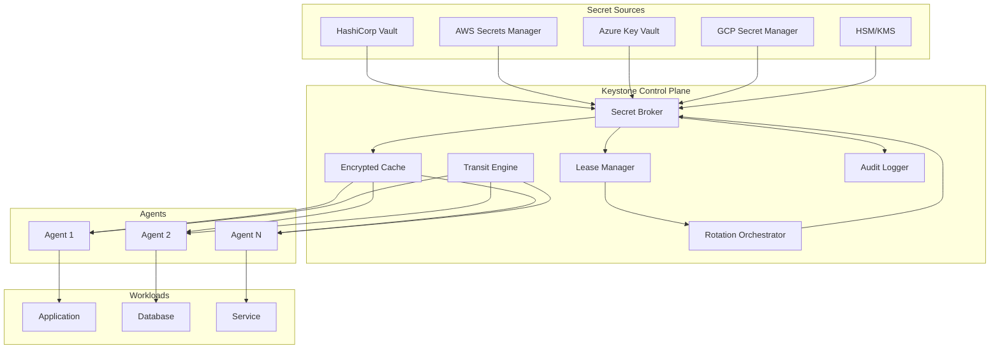
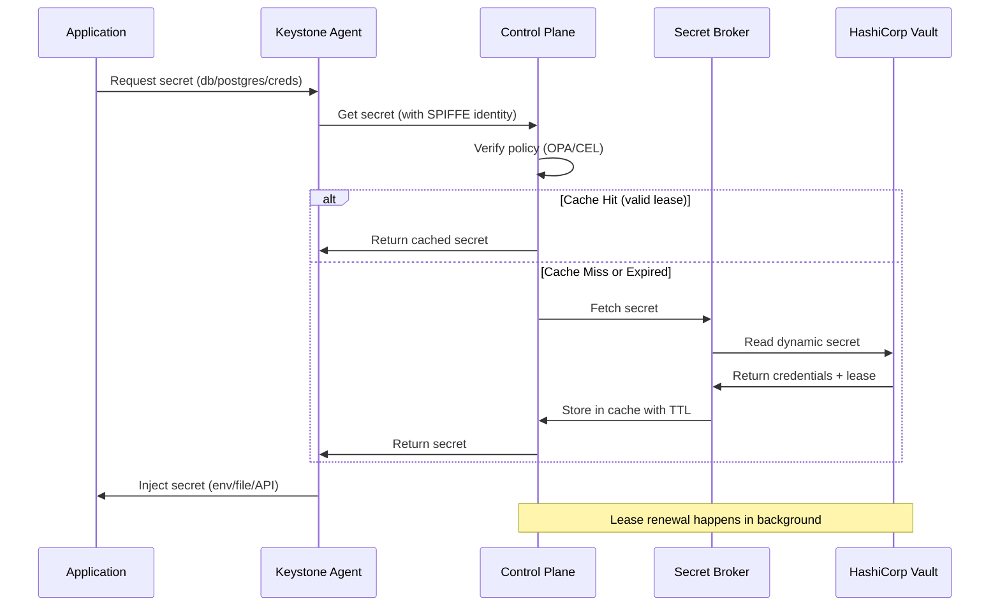
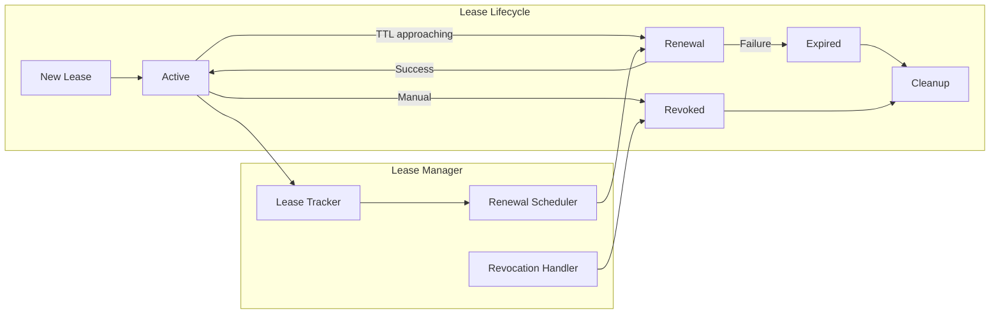
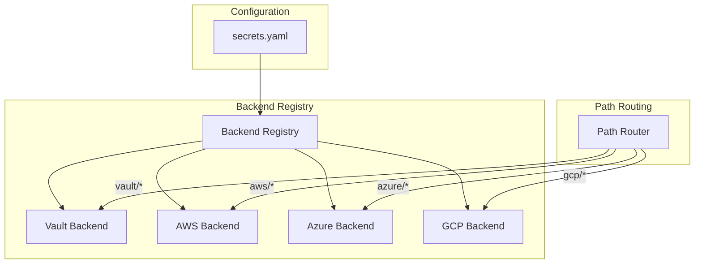
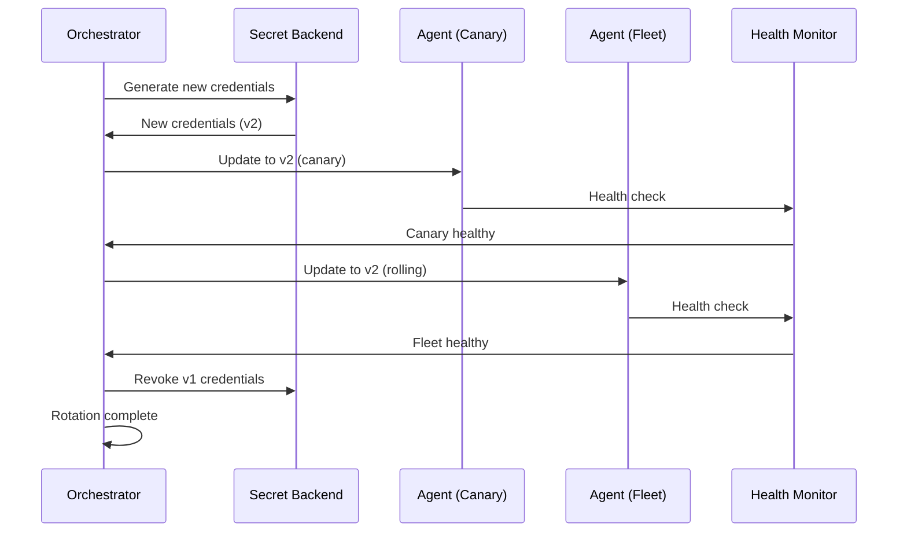

# Epic 36: Deep Secrets Management Integration

## Overview

**Goal**: Integrate Keystone Core with enterprise secret management systems to provide dynamic secrets, automatic rotation, lease management, transit encryption, and credential brokering across hybrid infrastructure.

**Key Principle**: Secrets should never be stored at rest in Keystone Core. Instead, Keystone Core acts as a broker that retrieves secrets on-demand from authoritative sources, manages their lifecycle, and delivers them securely to agents and workloads.

**Current State**: Keystone Core has a credential system (`pkg/credentials/`) with 9 credential types, local encryption (AES-GCM + X25519 ECDH), TTL-based caching, and audit logging. However, it lacks integration with external secret management systems, dynamic secret generation, and enterprise features like HSM backing.

**Target State**: Full integration with HashiCorp Vault, AWS Secrets Manager, Azure Key Vault, and GCP Secret Manager with support for:
- Dynamic secrets (database credentials, cloud IAM, certificates)
- Lease management with automatic renewal and revocation
- Secret rotation orchestration across fleet
- Transit encryption (encryption-as-a-service)
- Credential brokering for agents
- HSM/KMS backing for master keys

## Status

**COMPLETE** - All phases finished

### Completed
- [x] Phase 1, Week 1: Core Secret Broker Architecture
  - SecretBackend, LeaseManager, SecretCache interfaces
  - Path-based routing for multiple backends
  - Encrypted in-memory cache with AES-GCM
  - Comprehensive audit logging
  - Unit tests with 82.8% coverage
- [x] Phase 1, Week 2: HashiCorp Vault Backend - Read Operations
  - Vault client with connection pooling and TLS
  - Token, AppRole, and Kubernetes authentication
  - KV v1 and KV v2 secret engine support
  - Dynamic secrets (database, AWS, PKI, SSH engines)
  - Lease renewal and revocation
  - Namespace support for Vault Enterprise
  - Seal/unseal state handling
  - Unit tests with 66.4% coverage
- [x] Phase 1, Week 3: HashiCorp Vault Backend - Dynamic Secrets
  - Database secret engine integration (PostgreSQL, MySQL, MongoDB)
  - Static and dynamic credential generation
  - Lease tracker with automatic renewal
  - Configurable renewal strategies (eager, lazy, on-demand)
  - Lease callbacks for lifecycle events
  - Bulk revocation by path, agent, or tag
  - Integration tests with 62.9% coverage
- [x] Phase 1, Week 4: Vault Backend - PKI and Transit
  - PKI secret engine for certificate generation
  - Certificate issuance, CSR signing, revocation
  - Role management and certificate listing
  - Transit engine for encryption-as-a-service
  - Encrypt, decrypt, sign, verify, HMAC, hash operations
  - Key versioning support for all operations
  - Batch encryption/decryption for efficiency
  - Data key generation for envelope encryption
  - Convergent encryption support
  - Integration tests with 67.8% coverage
- [x] Phase 2, Week 5: AWS Secrets Manager Integration
  - AWS Secrets Manager client with SDK v2
  - Multiple auth methods (IAM role, instance profile, assume role, web identity)
  - Secret versioning (AWSCURRENT, AWSPREVIOUS, AWSPENDING)
  - Automatic rotation detection and status API
  - Cross-account secret access via STS AssumeRole
  - JSON secret parsing with key extraction
  - SecretBackend interface implementation
  - Unit tests with full coverage
- [x] Phase 2, Week 6: Azure Key Vault Integration
  - Azure Key Vault client with SDK for Go
  - Multiple auth methods (default, managed identity, service principal, CLI, environment, workload identity)
  - Secrets, keys, and certificates support
  - Secret versioning with version listing
  - Soft-delete handling (get, list, recover, purge)
  - Key operations (encrypt, decrypt, sign, verify, wrap, unwrap)
  - Private Link configuration support
  - Multi-tenant access support
  - SecretBackend interface implementation
  - Unit tests with full coverage
- [x] Phase 2, Week 7: GCP Secret Manager Integration
  - GCP Secret Manager client with SDK for Go
  - Multiple auth methods (default, service account, workload identity, impersonation)
  - Secret versioning with enable/disable/destroy operations
  - Version metadata and state tracking
  - Pub/Sub rotation notification support
  - CMEK (customer-managed encryption keys) configuration
  - Cross-project secret access with service account impersonation
  - VPC Service Controls configuration
  - Replication configuration (automatic/user-managed)
  - SecretBackend interface implementation
  - Unit tests with full coverage
- [x] Phase 2, Week 8: Secrets Broker Unification
  - Backend health monitoring with circuit breaker pattern
  - Automatic failover between backend groups
  - Backend-specific retry logic with exponential backoff
  - Unified error translation across all backends (Vault, AWS, Azure, GCP)
  - Backend factory for configuration-driven backend creation
  - Multi-backend routing tests
  - Performance benchmarks (<50ms latency verified, ~22M ops/sec throughput)
  - Unit tests with full coverage
- [x] Phase 3, Week 9: Lease Manager Implementation
  - SQLite-based lease storage with WAL mode
  - Full CRUD operations with filtering (state, backend, path, agent, expiry)
  - Bulk update/delete operations
  - Lease event audit history table
  - PersistentLeaseManager with background renewal scheduler
  - Configurable renewal strategies (eager, lazy, on-demand)
  - Automatic expiration detection and cleanup
  - Bulk renew/revoke operations with concurrency control
  - Callback hooks for lease lifecycle events
  - Stats reporting across backend types
  - Comprehensive tests with 70+ test cases
- [x] Phase 3, Week 10: Rotation Orchestrator - Core
  - ManagedRotation with 7-state machine (Pending, InProgress, Verifying, Completed, Failed, RolledBack, Cancelled)
  - BlueGreenStrategy for atomic all-at-once updates
  - RollingStrategy for batched updates with configurable delay
  - RotationOrchestrator for managing concurrent rotations
  - RotationCallbacks for state change notifications
  - Event publishing for rotation state transitions
  - Health check verification during rotation
  - Automatic rollback on failure (configurable)
  - Cancel support from any active state
  - Comprehensive tests for state machine transitions
- [x] Phase 3, Week 11: Rotation Orchestrator - Advanced
  - CanaryStrategy with configurable percentage and observation window
  - HealthChecker interface with HTTP, TCP, and exec implementations
  - HealthCheckRegistry for managing checker types with retries
  - Integrated health checks in verification phase
  - Enhanced automatic rollback with full strategy execution
  - RotationScheduler with cron expression support
  - Full cron parsing (wildcards, ranges, lists, steps)
  - SlackNotifier for webhook notifications
  - PagerDutyNotifier for alerting integration
  - NotificationManager for multi-notifier dispatch
  - Integration tests for complete rotation workflows

### Completed Recently
- [x] Phase 4, Week 13: Agent Secret Client
  - Agent-side secret client with caching
  - SPIFFE authentication integration
  - Refresh scheduler with configurable intervals
  - Request batcher for efficient backend queries
- [x] Phase 4, Week 14: Secret Injection - Files and Environment
  - File-based secret injection with atomic writes
  - Signal notification (SIGHUP, SIGUSR1)
  - Environment variable injection with sanitization
  - Template injection (consul-template style)
- [x] Phase 4, Week 15: Kubernetes Integration
  - Sidecar injector for continuous secret sync
  - Init container for pre-start secrets
  - Secret synchronization controller
  - CSI driver for secret volumes
  - Mutating admission webhook
  - Comprehensive tests (30+ test cases)
- [x] Phase 4, Week 16: Credential Brokering Polish
  - Connection pooling with min/max, idle/lifetime expiry
  - Rate limiting (token bucket) with global/per-client/per-path limits
  - Prometheus metrics with latency percentiles
  - Health endpoints (liveness, readiness, detailed)
  - Broker wrappers (PooledBackend, RateLimitedBroker, MetricsBroker)
  - Benchmarks and concurrent access tests
- [x] Phase 5, Week 17: HSM/KMS Integration - Cloud KMS
  - AWS KMS provider with key wrapping, data key generation, signing
  - Azure Key Vault HSM provider with wrap/unwrap, encrypt/decrypt
  - GCP Cloud KMS provider with symmetric and asymmetric key support
  - Key hierarchy management with master/DEK structure
  - HKDF-based key derivation for purpose-specific keys
  - KMS-backed secret cache with envelope encryption
  - Multi-tier cache (L1 in-memory + L2 KMS-encrypted)
  - Comprehensive tests (25+ test cases)

### In Progress
- None

### Completed
- [x] Phase 6, Week 21: Documentation
  - Secrets management concept guide with architecture overview
  - Backend setup guides for Vault, AWS, Azure, GCP
  - Rotation strategies documentation (blue-green, rolling, canary)
  - Security considerations guide with threat model and compliance
  - Troubleshooting guide for common issues
  - API reference for broker, lease manager, rotation, transit
- [x] Phase 5, Week 20: Security Hardening and Audit
  - SecureBuffer with automatic memory zeroing
  - Secure constant-time comparison functions
  - LogMasker for sanitizing sensitive data in logs
  - SecureLogger with automatic log masking
  - AuditLogger for security event tracking
  - SecurityAuditor for running security checks
  - AnomalyDetector for access pattern analysis
  - Anomaly types: excessive access, burst, enumeration, off-hours, unusual source
  - ComplianceReporter with multi-framework support (SOC2, PCI-DSS, HIPAA, GDPR, FedRAMP, NIST)
  - Key inventory and rotation tracking
  - PentestSuite with security testing utilities
  - Comprehensive tests and benchmarks
- [x] Phase 5, Week 19: Advanced Transit Features
  - Convergent encryption for searchable encrypted data
  - Batch encrypt/decrypt with parallel processing
  - Data key generation for envelope encryption
  - HMAC operations (SHA-256, SHA-384, SHA-512)
  - Key export/import with optional wrapping
  - Performance benchmarks for all operations
- [x] Phase 5, Week 18: HSM/KMS Integration - Hardware HSM
  - PKCS#11 interface with pure-Go abstraction (no CGO)
  - Thales Luna HSM provider (lunacm CLI + KMIP support)
  - AWS CloudHSM provider with CLI integration
  - HSM session management with pooling and recovery
  - HSM cluster failover with load balancing strategies
  - Circuit breaker pattern for failed nodes
  - Comprehensive HSM tests with mock interface

## Success Criteria

- [x] HashiCorp Vault integration with KV v1/v2, PKI, database, and transit engines
- [x] AWS Secrets Manager integration with automatic rotation support
- [x] Azure Key Vault integration with managed identity support
- [x] GCP Secret Manager integration with workload identity support
- [x] Dynamic secrets with configurable TTL and automatic renewal
- [x] Lease tracking and management with revocation support
- [x] Secret rotation orchestration with zero-downtime rollout
- [x] Transit encryption API for application-level encryption
- [x] Credential brokering that delivers secrets to agents on-demand
- [x] HSM/KMS backing for Keystone Core's master encryption keys
- [x] Secrets injection via environment variables, files, and sidecar patterns
- [x] Comprehensive audit trail for all secret access
- [x] <50ms latency for cached secret retrieval
- [x] >95% test coverage for security-critical paths

## Architecture

### High-Level Secret Flow



### Secret Retrieval Sequence



### Lease Management Architecture



### Multi-Backend Configuration



## Concepts

### Dynamic Secrets

Dynamic secrets are credentials generated on-demand with a limited lifetime. Unlike static secrets that are created once and shared, dynamic secrets are unique per consumer and automatically expire.

**Benefits:**
- **Reduced blast radius**: Compromised credentials expire quickly
- **Audit granularity**: Each credential is traceable to a specific consumer
- **No shared secrets**: Each application instance gets unique credentials
- **Automatic cleanup**: Expired credentials are automatically revoked

**Supported Dynamic Secret Types:**
| Type | Backend | Description |
|------|---------|-------------|
| Database | Vault, AWS | PostgreSQL, MySQL, MongoDB credentials |
| Cloud IAM | Vault, AWS, Azure, GCP | Temporary cloud credentials |
| PKI | Vault | X.509 certificates with custom TTL |
| SSH | Vault | Signed SSH certificates |
| Kubernetes | Vault | Service account tokens |
| API Keys | AWS, Azure, GCP | Temporary API credentials |

**Example Dynamic Database Credential:**
```yaml
# Secret request
path: vault/database/creds/postgres-app
ttl: 1h
renewable: true

# Generated credential (example)
username: v-keystone-postgres-app-abc123
password: <random-32-char>
lease_id: database/creds/postgres-app/lease-xyz
lease_duration: 3600
renewable: true
```

### Lease Management

Leases track the lifecycle of dynamic secrets. Each dynamic secret has an associated lease that defines:

- **Lease ID**: Unique identifier for tracking
- **TTL**: Time-to-live before expiration
- **Renewable**: Whether the lease can be extended
- **Max TTL**: Maximum lifetime even with renewals
- **Revocable**: Whether the lease can be explicitly revoked

**Lease States:**
```
┌─────────┐     ┌────────┐     ┌─────────┐
│ Pending │────▶│ Active │────▶│ Expired │
└─────────┘     └────────┘     └─────────┘
                    │              │
                    ▼              ▼
               ┌─────────┐   ┌─────────┐
               │ Renewed │   │ Revoked │
               └─────────┘   └─────────┘
```

**Renewal Strategy:**
- **Eager renewal**: Renew at 50% of TTL (default)
- **Lazy renewal**: Renew at 90% of TTL (reduces API calls)
- **On-demand**: Renew only when accessed
- **Grace period**: Buffer time for renewal failures

### Secret Rotation Orchestration

Secret rotation coordinates the update of credentials across multiple systems without downtime. The rotation process ensures:

1. **New credential generation**: Create new credentials before revoking old
2. **Staged rollout**: Update consumers incrementally
3. **Verification**: Confirm new credentials work before proceeding
4. **Revocation**: Revoke old credentials only after successful rollout
5. **Rollback**: Revert to old credentials if rotation fails

**Rotation Strategies:**
| Strategy | Description | Use Case |
|----------|-------------|----------|
| Blue-Green | Generate new, switch atomically, revoke old | Databases, APIs |
| Rolling | Update consumers one-by-one | Large fleets |
| Canary | Update subset, verify, then full rollout | Critical systems |
| Immediate | Update all at once (brief downtime acceptable) | Dev/test environments |

**Rotation Workflow:**


### Transit Encryption (Encryption-as-a-Service)

Transit encryption provides encryption and decryption operations without exposing encryption keys. Applications send plaintext to Keystone Core, which encrypts it using keys stored in HSM/KMS and returns ciphertext.

**Benefits:**
- **Key isolation**: Encryption keys never leave HSM/KMS
- **Centralized key management**: Single point for key rotation
- **Audit trail**: All encryption operations logged
- **Algorithm agility**: Change algorithms without application changes

**Operations:**
| Operation | Description |
|-----------|-------------|
| `encrypt` | Encrypt plaintext with named key |
| `decrypt` | Decrypt ciphertext with named key |
| `rewrap` | Re-encrypt with new key version |
| `sign` | Create digital signature |
| `verify` | Verify digital signature |
| `hmac` | Generate HMAC |
| `hash` | Generate cryptographic hash |

**Example:**
```go
// Application code using transit encryption
client := secrets.NewTransitClient(conn)

// Encrypt sensitive data
ciphertext, err := client.Encrypt(ctx, &TransitEncryptRequest{
    KeyName:   "app-data-key",
    Plaintext: []byte("sensitive-data"),
    Context:   []byte("user-123"), // Additional authenticated data
})

// Decrypt when needed
plaintext, err := client.Decrypt(ctx, &TransitDecryptRequest{
    KeyName:    "app-data-key",
    Ciphertext: ciphertext,
    Context:    []byte("user-123"),
})
```

### Credential Brokering

Credential brokering mediates access to secrets between agents and secret backends. The broker:

1. **Authenticates** agents using SPIFFE identities
2. **Authorizes** access using OPA/CEL policies
3. **Retrieves** secrets from configured backends
4. **Caches** secrets with appropriate TTLs
5. **Delivers** secrets to agents securely over NATS
6. **Audits** all access for compliance

**Brokering Flow:**
```
Agent                    Broker                    Backend
  │                        │                         │
  │──── SPIFFE Auth ──────▶│                         │
  │                        │                         │
  │──── Get Secret ───────▶│                         │
  │                        │──── Check Policy ──────▶│
  │                        │◀─── Policy OK ──────────│
  │                        │                         │
  │                        │──── Fetch Secret ──────▶│
  │                        │◀─── Secret + Lease ─────│
  │                        │                         │
  │◀─── Return Secret ─────│                         │
  │                        │                         │
```

### HSM/KMS Integration

Hardware Security Modules (HSM) and Key Management Services (KMS) provide:

- **Tamper-resistant key storage**: Keys never exist in plaintext outside HSM
- **Cryptographic acceleration**: Hardware-accelerated crypto operations
- **Compliance**: FIPS 140-2/3, Common Criteria certifications
- **Key ceremony support**: Multi-party key generation and recovery

**Supported HSM/KMS:**
| Provider | Type | Protocol |
|----------|------|----------|
| AWS KMS | Cloud KMS | AWS SDK |
| Azure Key Vault HSM | Cloud HSM | Azure SDK |
| GCP Cloud HSM | Cloud HSM | GCP SDK |
| HashiCorp Vault HSM | Software + HSM | PKCS#11 |
| Thales Luna | Hardware HSM | PKCS#11 |
| AWS CloudHSM | Cloud HSM | PKCS#11 |

**Master Key Hierarchy:**
```
┌─────────────────────────────────────────┐
│           HSM/KMS Master Key            │
│        (never leaves hardware)          │
└─────────────────┬───────────────────────┘
                  │
                  ▼
┌─────────────────────────────────────────┐
│     Keystone Core Data Encryption Key   │
│       (wrapped by master key)           │
└─────────────────┬───────────────────────┘
                  │
        ┌─────────┼─────────┐
        ▼         ▼         ▼
    ┌───────┐ ┌───────┐ ┌───────┐
    │ Cache │ │ Audit │ │Transit│
    │  Key  │ │  Key  │ │  Keys │
    └───────┘ └───────┘ └───────┘
```

## User Stories

### US36.1: HashiCorp Vault Integration

**As a** platform engineer,
**I want to** integrate Keystone Core with HashiCorp Vault,
**So that** I can leverage existing Vault infrastructure for secrets management.

**Acceptance Criteria:**
- [x] Support Vault authentication methods: Token, AppRole, Kubernetes, AWS IAM, LDAP
- [x] Read secrets from KV v1 and KV v2 secret engines
- [x] Generate dynamic database credentials (PostgreSQL, MySQL, MongoDB)
- [x] Generate dynamic cloud credentials (AWS, Azure, GCP)
- [x] Request and renew PKI certificates
- [x] Use transit engine for encryption operations
- [x] Handle Vault namespaces (Enterprise)
- [x] Support Vault Agent auto-auth for credential refresh

### US36.2: AWS Secrets Manager Integration

**As a** cloud engineer,
**I want to** retrieve secrets from AWS Secrets Manager,
**So that** I can use AWS-native secrets management for AWS workloads.

**Acceptance Criteria:**
- [x] Authenticate using IAM roles, instance profiles, or explicit credentials
- [x] Read secrets by name or ARN
- [x] Support secret versioning (current, previous, staging labels)
- [x] Handle automatic rotation configured in AWS
- [x] Support cross-account secret access
- [x] Cache secrets with configurable TTL
- [x] Handle secrets containing JSON with key extraction

### US36.3: Azure Key Vault Integration

**As a** Azure administrator,
**I want to** retrieve secrets from Azure Key Vault,
**So that** I can use Azure-native secrets management for Azure workloads.

**Acceptance Criteria:**
- [x] Authenticate using managed identity, service principal, or CLI credentials
- [x] Read secrets, keys, and certificates
- [x] Support secret versioning
- [x] Handle soft-deleted secrets
- [x] Support Azure Private Link for network isolation
- [x] Integrate with Azure HSM-backed keys
- [x] Handle multi-tenant scenarios

### US36.4: GCP Secret Manager Integration

**As a** GCP user,
**I want to** retrieve secrets from GCP Secret Manager,
**So that** I can use GCP-native secrets management for GCP workloads.

**Acceptance Criteria:**
- [x] Authenticate using workload identity, service account, or application default credentials
- [x] Read secret versions (latest or specific version)
- [x] Support automatic replication policies
- [x] Handle secret rotation with pub/sub notifications
- [x] Support customer-managed encryption keys (CMEK)
- [x] Integrate with VPC Service Controls

### US36.5: Dynamic Secret Lifecycle

**As a** security engineer,
**I want to** manage the lifecycle of dynamic secrets,
**So that** credentials are automatically renewed and revoked.

**Acceptance Criteria:**
- [x] Track all active leases with metadata
- [x] Automatically renew leases before expiration
- [x] Configure renewal strategy (eager, lazy, on-demand)
- [x] Handle renewal failures with retry and alerting
- [x] Revoke leases on agent disconnect or policy change
- [x] Bulk revoke leases by prefix or tag
- [x] Provide lease dashboard in CLI and API

### US36.6: Secret Rotation Orchestration

**As a** operations engineer,
**I want to** orchestrate secret rotation across my fleet,
**So that** I can rotate credentials without service disruption.

**Acceptance Criteria:**
- [x] Define rotation policies (schedule, triggers, strategy)
- [x] Support rotation strategies: blue-green, rolling, canary
- [x] Coordinate rotation across multiple agents
- [x] Verify application health after rotation
- [x] Automatic rollback on rotation failure
- [x] Audit log of all rotation events
- [x] CLI commands for manual rotation triggers

### US36.7: Transit Encryption Service

**As a** developer,
**I want to** encrypt and decrypt data without managing keys,
**So that** I can protect sensitive data with minimal complexity.

**Acceptance Criteria:**
- [x] Encrypt/decrypt operations via gRPC and REST API
- [x] Support multiple encryption keys with versioning
- [x] Automatic key rotation without re-encryption
- [x] Rewrap ciphertext with new key versions
- [x] Sign and verify operations for data integrity
- [x] HMAC generation for message authentication
- [x] Convergent encryption for searchable encryption
- [x] Batch operations for performance

### US36.8: Agent Credential Brokering

**As a** platform engineer,
**I want** agents to receive credentials on-demand,
**So that** secrets are never stored persistently on managed nodes.

**Acceptance Criteria:**
- [x] Agents authenticate to broker using SPIFFE identity
- [x] Broker validates access using OPA/CEL policies
- [x] Secrets delivered over encrypted NATS connection
- [x] Configurable caching on agents (memory-only, encrypted disk)
- [x] Automatic re-fetch on lease expiration
- [x] Support for secret templates (combining multiple secrets)
- [x] File-based secret injection with atomic updates

### US36.9: HSM/KMS Master Key Protection

**As a** security architect,
**I want** Keystone Core's encryption keys protected by HSM/KMS,
**So that** master keys are never exposed in software.

**Acceptance Criteria:**
- [x] Support AWS KMS for key wrapping
- [x] Support Azure Key Vault HSM
- [x] Support GCP Cloud KMS
- [x] Support HashiCorp Vault as KMS proxy
- [x] PKCS#11 support for hardware HSMs
- [x] Key ceremony workflow for initial setup
- [x] Automatic key rotation with dual-key period
- [x] Disaster recovery with key escrow

### US36.10: Secrets Injection Patterns

**As a** developer,
**I want** multiple ways to consume secrets,
**So that** I can choose the pattern that fits my application.

**Acceptance Criteria:**
- [x] Environment variable injection at process start
- [x] File-based injection with templating (like consul-template)
- [x] Sidecar pattern for Kubernetes workloads
- [x] Direct API access for applications
- [x] Secret references in state files (resolved at apply time)
- [x] Support for binary secrets (certificates, keys)
- [x] Atomic file updates with signal to application

## Configuration

### Backend Configuration

```yaml
# /etc/kscore/secrets.yaml
secrets:
  # Default backend for unqualified paths
  default_backend: vault

  # Encrypted cache configuration
  cache:
    enabled: true
    max_entries: 10000
    default_ttl: 5m
    encryption_key_source: kms  # 'local' or 'kms'

  # Backend configurations
  backends:
    # HashiCorp Vault
    vault:
      type: vault
      address: https://vault.example.com:8200
      namespace: admin  # Enterprise only
      auth:
        method: kubernetes
        role: keystone-core
        # Alternative: AppRole
        # method: approle
        # role_id_file: /etc/kscore/vault-role-id
        # secret_id_file: /etc/kscore/vault-secret-id
      tls:
        ca_cert: /etc/kscore/certs/vault-ca.pem
        skip_verify: false
      lease_renewal:
        strategy: eager  # eager, lazy, on_demand
        threshold: 0.5   # Renew at 50% of TTL

    # AWS Secrets Manager
    aws:
      type: aws_secrets_manager
      region: us-west-2
      # Authentication via IAM role (recommended) or explicit
      # role_arn: arn:aws:iam::123456789012:role/keystone-secrets
      cache_ttl: 5m
      version_stage: AWSCURRENT  # AWSCURRENT, AWSPREVIOUS, or custom

    # Azure Key Vault
    azure:
      type: azure_keyvault
      vault_url: https://mykeyvault.vault.azure.net/
      auth:
        method: managed_identity
        # Alternative: service principal
        # method: service_principal
        # tenant_id: ${AZURE_TENANT_ID}
        # client_id: ${AZURE_CLIENT_ID}
        # client_secret_file: /etc/kscore/azure-client-secret

    # GCP Secret Manager
    gcp:
      type: gcp_secret_manager
      project: my-gcp-project
      auth:
        method: workload_identity
        # Alternative: service account key
        # method: service_account
        # key_file: /etc/kscore/gcp-sa-key.json

  # HSM/KMS for master key protection
  master_key:
    provider: aws_kms
    key_id: alias/keystone-master-key
    region: us-west-2
    # Alternative providers:
    # provider: azure_keyvault
    # vault_url: https://mykeyvault.vault.azure.net/
    # key_name: keystone-master-key
    #
    # provider: gcp_kms
    # key_name: projects/my-project/locations/global/keyRings/keystone/cryptoKeys/master
    #
    # provider: vault_transit
    # address: https://vault.example.com:8200
    # key_name: keystone-master

  # Path routing rules
  routing:
    # Route by path prefix
    - prefix: "vault/"
      backend: vault
    - prefix: "aws/"
      backend: aws
    - prefix: "azure/"
      backend: azure
    - prefix: "gcp/"
      backend: gcp
    # Route by tag
    - tag: "production"
      backend: vault
    - tag: "aws-native"
      backend: aws
```

### Dynamic Secret Configuration

```yaml
# Dynamic database credentials from Vault
secrets:
  backends:
    vault:
      dynamic_secrets:
        postgres_app:
          path: database/creds/postgres-app-role
          ttl: 1h
          max_ttl: 24h
          renewable: true
          # Rotation configuration
          rotation:
            enabled: true
            schedule: "0 0 * * *"  # Daily at midnight
            strategy: rolling
            batch_size: 10
            health_check:
              endpoint: /health
              timeout: 10s
            rollback_on_failure: true

        mysql_reporting:
          path: database/creds/mysql-reporting-role
          ttl: 30m
          renewable: true
```

### Transit Encryption Configuration

```yaml
# Transit encryption (encryption-as-a-service)
secrets:
  transit:
    enabled: true
    backend: vault  # Use Vault's transit engine

    keys:
      # Application data encryption
      app_data:
        vault_path: transit/keys/app-data
        type: aes256-gcm96
        min_decryption_version: 1
        min_encryption_version: 0  # Always use latest
        deletion_allowed: false
        exportable: false
        allow_plaintext_backup: false
        auto_rotate_period: 30d

      # PII encryption with convergent encryption
      pii_data:
        vault_path: transit/keys/pii-data
        type: aes256-gcm96
        convergent_encryption: true  # Same plaintext = same ciphertext
        derived: true

      # Signing key for data integrity
      signing_key:
        vault_path: transit/keys/signing
        type: ecdsa-p256
        auto_rotate_period: 90d
```

### Agent Credential Brokering Configuration

```yaml
# Agent-side configuration
agent:
  secrets:
    broker:
      enabled: true
      # Control plane endpoint (uses NATS)
      control_plane: nats://control-plane.example.com:4222

    cache:
      type: memory  # memory or encrypted_disk
      max_entries: 1000
      # For encrypted_disk:
      # path: /var/lib/kscore/secret-cache
      # encryption_key_source: tpm  # tpm, file, or derived

    injection:
      # Environment variable injection
      env:
        enabled: true
        prefix: KSCORE_SECRET_

      # File-based injection
      files:
        enabled: true
        base_path: /run/secrets/kscore
        mode: 0400
        owner: root
        group: root
        atomic_write: true
        # Signal application on update
        notify:
          signal: SIGHUP
          pid_file: /var/run/myapp.pid

      # Template rendering (like consul-template)
      templates:
        - source: /etc/kscore/templates/db-config.tpl
          destination: /etc/myapp/database.yml
          mode: 0400
          notify:
            command: ["systemctl", "reload", "myapp"]
```

### Secret Injection Template Example

```yaml
# /etc/kscore/templates/db-config.tpl
database:
  host: {{ secret "vault/kv/myapp/db" "host" }}
  port: {{ secret "vault/kv/myapp/db" "port" | default "5432" }}
  name: {{ secret "vault/kv/myapp/db" "database" }}
  {{- with dynamic_secret "vault/database/creds/myapp" }}
  username: {{ .username }}
  password: {{ .password }}
  {{- end }}
  ssl:
    mode: verify-full
    cert: |
      {{- secret "vault/pki/issue/myapp" "certificate" | indent 6 }}
    key: |
      {{- secret "vault/pki/issue/myapp" "private_key" | indent 6 }}
```

### Rotation Policy Configuration

```yaml
# Rotation orchestration configuration
secrets:
  rotation:
    policies:
      database_credentials:
        trigger:
          schedule: "0 2 * * 0"  # Weekly on Sunday at 2am
          # Or event-based:
          # on_event: security.credential_exposed
        strategy: rolling
        targets:
          selector: "role:database-client"
          batch_size: 5
          batch_delay: 30s
        verification:
          health_check:
            type: http
            endpoint: /health
            expected_status: 200
            timeout: 10s
          connection_test:
            enabled: true
            query: "SELECT 1"
        rollback:
          enabled: true
          timeout: 5m
          on_failure_percentage: 10  # Rollback if >10% fail
        notifications:
          - type: slack
            channel: "#platform-alerts"
          - type: pagerduty
            severity: warning

      api_keys:
        trigger:
          schedule: "0 0 1 * *"  # Monthly
        strategy: blue_green
        grace_period: 24h  # Keep old key valid for 24h after rotation
```

### Policy for Secret Access (OPA)

```rego
# /etc/kscore/policies/secrets.rego
package keystone.secrets

# Allow agents to access secrets for their role
allow {
    input.action == "read"
    input.secret_path == concat("/", ["vault/kv", input.agent.role, "config"])
}

# Allow database credentials for tagged agents
allow {
    input.action == "read"
    startswith(input.secret_path, "vault/database/creds/")
    input.agent.tags[_] == "database-client"
}

# Deny access to production secrets from non-production agents
deny {
    contains(input.secret_path, "/prod/")
    not input.agent.environment == "production"
}

# Require MFA for highly sensitive secrets
require_mfa {
    startswith(input.secret_path, "vault/kv/sensitive/")
}

# Audit all access to PII secrets
audit_level = "detailed" {
    contains(input.secret_path, "/pii/")
}
```

## CLI Commands

### Secret Management Commands

```bash
# List configured backends
kscorectl secrets backends list

# Test backend connectivity
kscorectl secrets backends test vault

# Read a secret
kscorectl secrets get vault/kv/myapp/config
kscorectl secrets get aws/myapp/database --version AWSPREVIOUS
kscorectl secrets get azure/mykeyvault/db-password

# Read specific key from JSON secret
kscorectl secrets get vault/kv/myapp/config --key database.password

# Generate dynamic credentials
kscorectl secrets dynamic vault/database/creds/postgres-app --ttl 1h

# List active leases
kscorectl secrets leases list
kscorectl secrets leases list --backend vault --prefix database/

# Renew a lease
kscorectl secrets leases renew <lease-id>
kscorectl secrets leases renew --all --prefix database/

# Revoke a lease
kscorectl secrets leases revoke <lease-id>
kscorectl secrets leases revoke --prefix database/creds/postgres-app/

# Transit encryption operations
kscorectl secrets encrypt --key app-data --plaintext "sensitive data"
kscorectl secrets decrypt --key app-data --ciphertext "vault:v1:..."
kscorectl secrets rewrap --key app-data --ciphertext "vault:v1:..." --min-version 2

# Rotation commands
kscorectl secrets rotate database_credentials --dry-run
kscorectl secrets rotate database_credentials --strategy canary --batch-size 1
kscorectl secrets rotate database_credentials --rollback

# Secret templates
kscorectl secrets template render /etc/kscore/templates/db-config.tpl
kscorectl secrets template validate /etc/kscore/templates/*.tpl
```

### Diagnostic Commands

```bash
# Check secret access policy
kscorectl secrets policy check vault/kv/myapp/config --agent agent-001

# Audit secret access
kscorectl secrets audit --since 24h --path "vault/database/*"
kscorectl secrets audit --agent agent-001 --format json

# Cache statistics
kscorectl secrets cache stats
kscorectl secrets cache clear --backend vault

# Lease health
kscorectl secrets leases health
kscorectl secrets leases expiring --within 1h
```

## State Modules

### Secret File State Module

```yaml
# Deploy secrets as files using the secrets module
- name: Deploy database configuration
  std/secrets.file:
    path: /etc/myapp/database.yml
    source:
      template: |
        host: {{ .Secrets.Get "vault/kv/myapp/db" "host" }}
        port: {{ .Secrets.Get "vault/kv/myapp/db" "port" | default "5432" }}
        username: {{ .DynamicSecret "vault/database/creds/myapp" "username" }}
        password: {{ .DynamicSecret "vault/database/creds/myapp" "password" }}
    mode: "0400"
    owner: myapp
    group: myapp
    notify:
      service: myapp
      action: reload

- name: Deploy TLS certificate
  std/secrets.certificate:
    cert_path: /etc/myapp/tls/server.crt
    key_path: /etc/myapp/tls/server.key
    source:
      pki: vault/pki/issue/myapp
      common_name: myapp.example.com
      alt_names:
        - myapp.internal
      ttl: 720h
    renewal_threshold: 168h  # Renew when 7 days remaining
    notify:
      service: myapp
      action: restart
```

### Environment Secret State Module

```yaml
# Inject secrets as environment variables
- name: Configure application environment
  std/secrets.environment:
    service: myapp
    secrets:
      DATABASE_URL:
        template: "postgres://{{ .username }}:{{ .password }}@db.example.com/myapp"
        dynamic_secret: vault/database/creds/myapp
      API_KEY:
        path: vault/kv/myapp/api-key
        key: value
      AWS_ACCESS_KEY_ID:
        path: aws/myapp/aws-credentials
        key: access_key_id
      AWS_SECRET_ACCESS_KEY:
        path: aws/myapp/aws-credentials
        key: secret_access_key
```

### Transit Encryption State Module

```yaml
# Encrypt sensitive data in configuration
- name: Encrypt sensitive configuration
  std/secrets.transit:
    action: encrypt
    key: app-data
    source_file: /etc/myapp/secrets.json
    destination_file: /etc/myapp/secrets.json.enc

- name: Ensure encrypted at rest
  std/file.managed:
    path: /etc/myapp/secrets.json.enc
    mode: "0400"
    # Original plaintext file should be removed

- name: Remove plaintext
  std/file.absent:
    path: /etc/myapp/secrets.json
```

## Technical Tasks

### Phase 1: Foundation and Vault Integration (Weeks 1-4)

#### Week 1: Core Secret Broker Architecture
- [x] Define secret broker interfaces (`SecretBackend`, `LeaseManager`, `SecretCache`)
- [x] Implement path-based routing for multiple backends
- [x] Create encrypted in-memory cache with TTL support
- [x] Add comprehensive audit logging for all secret operations
- [x] Write unit tests for broker core (82.8% coverage)

#### Week 2: HashiCorp Vault Backend - Read Operations ✅
- [x] Implement Vault client with connection pooling
- [x] Support authentication methods: Token, AppRole, Kubernetes
- [x] Implement KV v1 and KV v2 secret engine readers
- [x] Add namespace support for Vault Enterprise
- [x] Handle Vault seal/unseal states gracefully
- [x] Write integration tests with Vault dev server

#### Week 3: HashiCorp Vault Backend - Dynamic Secrets ✅
- [x] Implement database secret engine integration
- [x] Support PostgreSQL, MySQL, MongoDB credential generation
- [x] Implement lease tracking and storage
- [x] Add automatic lease renewal with configurable strategy
- [x] Handle lease expiration and revocation
- [x] Write integration tests for dynamic credentials

#### Week 4: HashiCorp Vault Backend - PKI and Transit ✅
- [x] Implement PKI secret engine for certificate generation
- [x] Support certificate renewal workflow
- [x] Implement transit engine client (encrypt, decrypt, sign, verify)
- [x] Add key versioning support for transit operations
- [x] Create transit encryption convenience functions
- [x] Write integration tests for PKI and transit

### Phase 2: Cloud Provider Integrations (Weeks 5-8)

#### Week 5: AWS Secrets Manager Integration ✅
- [x] Implement AWS Secrets Manager client
- [x] Support IAM role and instance profile authentication
- [x] Handle secret versioning (AWSCURRENT, AWSPREVIOUS)
- [x] Implement automatic rotation detection
- [x] Support cross-account access
- [x] Write integration tests with LocalStack

#### Week 6: Azure Key Vault Integration ✅
- [x] Implement Azure Key Vault client
- [x] Support managed identity and service principal authentication
- [x] Handle secrets, keys, and certificates
- [x] Implement version management
- [x] Support Azure Private Link configuration
- [x] Write integration tests with Azurite

#### Week 7: GCP Secret Manager Integration ✅
- [x] Implement GCP Secret Manager client
- [x] Support workload identity and service account authentication
- [x] Handle secret versions and aliases
- [x] Implement pub/sub rotation notifications
- [x] Support CMEK (customer-managed encryption keys)
- [x] Write integration tests with GCP emulator

#### Week 8: Multi-Backend Testing and Routing ✅
- [x] Implement backend health checks and failover
- [x] Create unified secret path resolution
- [x] Add backend-specific error handling and retries
- [x] Implement secret caching across backends
- [x] Write end-to-end tests with multiple backends
- [x] Performance benchmarks for secret retrieval

### Phase 3: Lease Management and Rotation (Weeks 9-12)

#### Week 9: Lease Manager Implementation ✅
- [x] Design lease storage schema (SQLite/PostgreSQL)
- [x] Implement lease CRUD operations
- [x] Create lease renewal scheduler
- [x] Add lease expiration handling
- [x] Implement bulk lease operations
- [x] Write unit tests for lease manager

#### Week 10: Rotation Orchestrator - Core
- [x] Design rotation workflow engine
- [x] Implement blue-green rotation strategy
- [x] Implement rolling rotation strategy
- [x] Create rotation state machine
- [x] Add rotation event publishing
- [x] Write unit tests for rotation strategies

#### Week 11: Rotation Orchestrator - Advanced
- [x] Implement canary rotation strategy
- [x] Add health check integration for verification
- [x] Implement automatic rollback on failure
- [x] Create rotation scheduling (cron-like)
- [x] Add rotation notifications (Slack, PagerDuty)
- [x] Write integration tests for rotation workflows

#### Week 12: Rotation CLI and API ✅
- [x] Implement `kscorectl secrets rotate` commands
- [x] Add rotation dry-run mode
- [x] Create rotation status and history views
- [x] Implement manual rollback command
- [x] Add rotation policy management commands
- [x] Write end-to-end rotation tests

### Phase 4: Agent Integration and Brokering (Weeks 13-16)

#### Week 13: Agent Secret Client ✅
- [x] Implement agent-side secret client
- [x] Add SPIFFE-based authentication to broker
- [x] Create agent secret cache (memory and encrypted disk)
- [x] Implement automatic secret refresh on lease expiration
- [x] Add secret request batching for efficiency
- [x] Write unit tests for agent client

#### Week 14: Secret Injection - Files and Environment ✅
- [x] Implement file-based secret injection
- [x] Add atomic file updates with signal notification
- [x] Create environment variable injection
- [x] Support binary secrets (certificates, keys)
- [x] Implement secret templates (consul-template style)
- [x] Write integration tests for injection patterns

#### Week 15: Secret Injection - Kubernetes Integration ✅
- [x] Implement sidecar injector for Kubernetes
- [x] Create init container for pre-start secrets
- [x] Support Kubernetes secrets synchronization
- [x] Add CSI driver for secret volumes
- [x] Implement pod mutation webhook
- [x] Write Kubernetes integration tests

#### Week 16: Credential Brokering Polish ✅
- [x] Add connection pooling for backend connections
- [x] Implement request rate limiting
- [x] Create broker metrics and dashboards
- [x] Add broker health endpoints
- [x] Performance optimization and benchmarking
- [x] Write comprehensive end-to-end tests

### Phase 5: HSM/KMS and Advanced Features (Weeks 17-20)

#### Week 17: HSM/KMS Integration - Cloud KMS
- [x] Implement AWS KMS key wrapping
- [x] Implement Azure Key Vault HSM integration
- [x] Implement GCP Cloud KMS integration
- [x] Create key hierarchy management
- [x] Add KMS-based cache encryption
- [x] Write integration tests for each KMS

#### Week 18: HSM/KMS Integration - Hardware HSM
- [x] Implement PKCS#11 interface
- [x] Support Thales Luna HSM
- [x] Support AWS CloudHSM
- [x] Create HSM session management
- [x] Implement HSM failover and load balancing
- [x] Write HSM integration tests (requires hardware)

#### Week 19: Advanced Transit Features
- [x] Implement convergent encryption
- [x] Add batch encrypt/decrypt operations
- [x] Create data key generation (envelope encryption)
- [x] Implement HMAC operations
- [x] Add key export (for backup, where allowed)
- [x] Write performance benchmarks for transit

#### Week 20: Security Hardening and Audit ✅
- [x] Security audit of all secret handling code
- [x] Implement secret masking in logs
- [x] Add anomaly detection for secret access patterns
- [x] Create compliance reports (secret access, rotation status)
- [x] Penetration testing preparation
- [x] Final documentation review

### Phase 6: Documentation and Release (Weeks 21-22)

#### Week 21: Documentation ✅
- [x] Write user guide for secrets management
- [x] Create backend-specific setup guides
- [x] Document rotation strategies and best practices
- [x] Write security considerations guide
- [x] Create troubleshooting guide
- [x] Add API reference documentation

#### Week 22: Release Preparation
- [x] Performance benchmarking and optimization
- [x] Integration testing with real backends
- [x] Migration guide from current credential system
- [x] Release notes and changelog
- [x] Update AGENTS.md with new capabilities
- [x] Create demo and tutorial materials

## Risks and Mitigations

| Risk | Likelihood | Impact | Mitigation |
|------|------------|--------|------------|
| Vault API changes | Low | Medium | Pin to specific Vault version, maintain compatibility matrix |
| Cloud provider SDK updates | Medium | Low | Use stable SDK versions, automated dependency updates |
| HSM availability for testing | Medium | Medium | Use software HSM emulators, optional HSM test suite |
| Secret leak in logs/errors | Medium | High | Comprehensive secret masking, security audit, fuzzing |
| Performance degradation with encryption | Medium | Medium | Benchmark early, optimize caching, connection pooling |
| Rotation failures causing outages | Medium | High | Dry-run mode, automatic rollback, canary strategy |
| Complex multi-backend configuration | Medium | Medium | Configuration validation, good defaults, examples |

## Testing Strategy

### Unit Tests
- Secret broker routing logic
- Lease lifecycle state machine
- Rotation strategy implementations
- Cache operations and TTL handling
- Template rendering
- Policy evaluation

### Integration Tests
- Vault operations (dev server)
- AWS Secrets Manager (LocalStack)
- Azure Key Vault (Azurite)
- GCP Secret Manager (emulator)
- Multi-backend routing
- Agent credential brokering

### End-to-End Tests
- Full rotation workflow
- Secret injection patterns
- Lease renewal under load
- Backend failover scenarios
- Kubernetes sidecar injection

### Security Tests
- Secret masking verification
- Access policy enforcement
- Audit log completeness
- Encryption verification
- Authentication bypass attempts

### Performance Tests
- Secret retrieval latency (<50ms cached)
- Concurrent secret requests (1000 agents)
- Lease renewal throughput
- Transit encryption throughput
- Cache efficiency under load

## Definition of Done

- [x] All backends implemented and tested (Vault, AWS, Azure, GCP)
- [x] Lease management fully functional with renewal and revocation
- [x] Rotation orchestrator with all strategies implemented
- [x] Transit encryption operational with key versioning
- [x] Agent credential brokering deployed and tested
- [x] HSM/KMS integration for at least one cloud provider
- [x] All injection patterns working (files, env, Kubernetes)
- [x] Comprehensive audit logging
- [x] Performance targets met (<50ms cached retrieval)
- [x] Security audit completed
- [x] Documentation complete
- [x] >95% test coverage on security-critical paths
- [x] Migration guide for existing credential users

## Dependencies

### Required
- Epic 1: Core Infrastructure (NATS messaging)
- Epic 3: State Management (state modules framework)
- Epic 4: Event System (rotation events)
- Epic 6: Policy Enforcement (OPA/CEL for access control)
- Epic 17: SPIFFE Identity (agent authentication)

### Optional Enhancements
- Epic 7: Observability (metrics, tracing)
- Epic 11: Clustering (HA for secret broker)
- Epic 21: Proxy Agents (secret injection for unmanaged devices)

### External Dependencies
- HashiCorp Vault 1.12+ (for all Vault features)
- AWS SDK v2 for Go
- Azure SDK for Go
- GCP SDK for Go
- PKCS#11 libraries for hardware HSM
