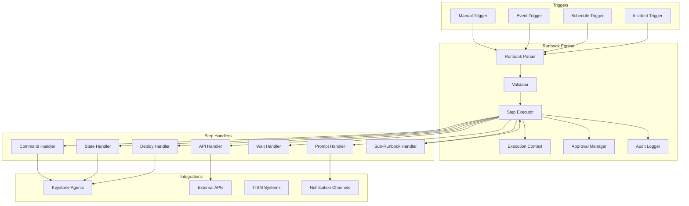
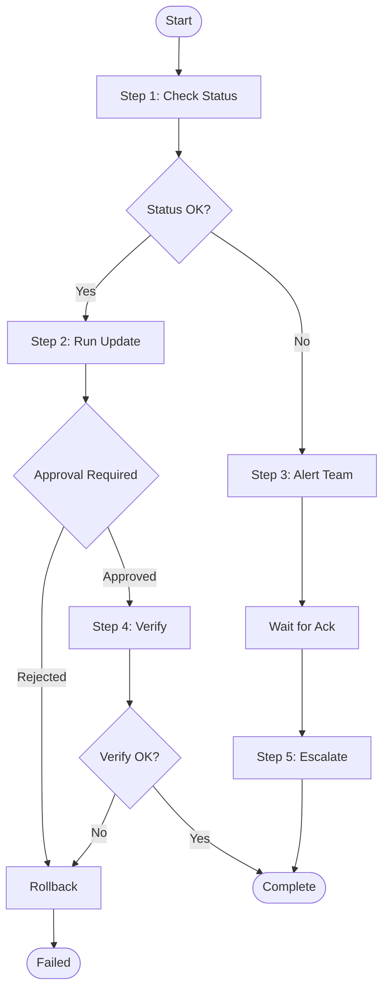
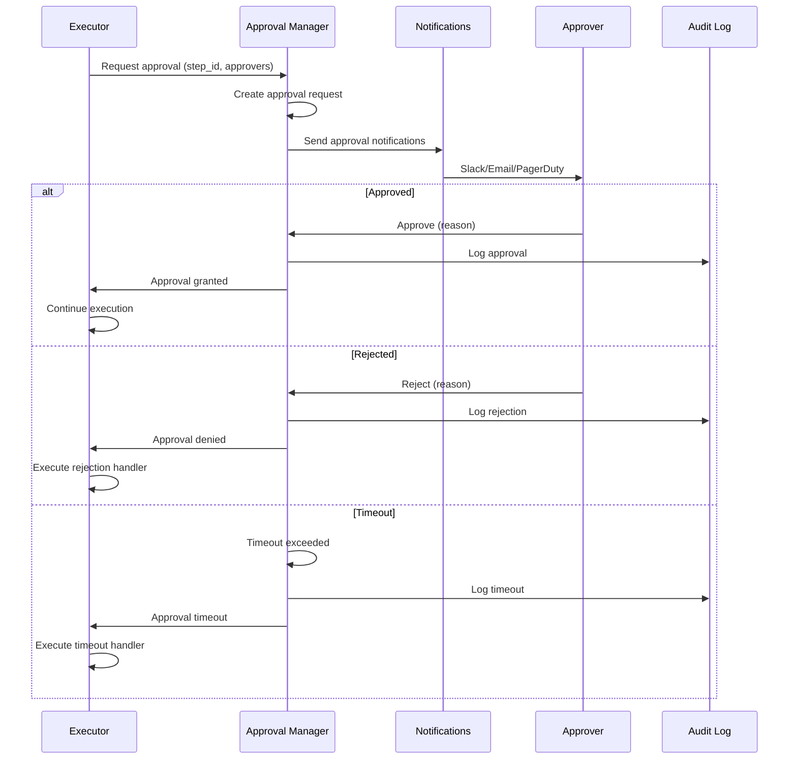

# Epic 37: Enhanced Runbook Automation

## Overview

**Goal**: Extend Keystone Core's orchestration capabilities with a full-featured runbook automation system supporting conditional branching, human-in-the-loop approvals, reusable steps, and integration with incident management.

**Key Principle**: Runbooks should codify operational knowledge into executable, versionable, and auditable workflows that can be triggered manually, on schedule, or in response to events.

**Current State**: Keystone Core has multi-repo orchestration (`pkg/gitops/orchestration/`) with deployment groups, dependencies, parallel/sequential execution, and plan-level approval. However, it lacks:
- Actual runbook definitions with discrete steps
- Conditional branching (if/else, switch, loops)
- Per-step human approvals and manual intervention points
- Step types beyond deployment (commands, API calls, prompts, waits)
- Variable passing and context between steps
- Reusable step templates and libraries
- Integration with incident management systems

**Target State**: A comprehensive runbook engine that enables complex operational workflows with branching logic, approval gates, manual intervention, and full audit trails.

## Success Criteria

- [ ] Runbook definition format with steps, conditions, and approvals
- [ ] Conditional branching: if/else, switch, and loop constructs
- [ ] Human-in-the-loop: per-step approvals with configurable approvers
- [ ] Manual intervention points: pause and wait for operator input
- [ ] 10+ step types: command, API, state, deploy, wait, prompt, approval, notification, script, sub-runbook
- [ ] Variable system with step outputs feeding subsequent steps
- [ ] Reusable step templates and runbook libraries
- [ ] Runbook versioning with rollback to previous versions
- [ ] Dry-run mode for validation without execution
- [ ] Integration with incident management (PagerDuty, Opsgenie, ServiceNow)
- [ ] Event-driven triggers (on alert, on drift, on schedule)
- [ ] Comprehensive audit trail for compliance
- [ ] CLI and API for runbook management and execution
- [ ] <5 second step dispatch latency
- [ ] >90% test coverage for runbook engine

## Architecture

### High-Level Runbook Flow



### Execution Flow with Conditions



### Approval Workflow



### Variable and Context Flow

```mermaid
flowchart LR
    subgraph "Step 1"
        S1[Execute Command]
        S1O[Output: exit_code, stdout]
    end

    subgraph "Context"
        Vars[Variables]
        Secrets[Secrets]
        Facts[Agent Facts]
        Results[Step Results]
    end

    subgraph "Step 2"
        S2C{Condition: step1.exit_code == 0}
        S2[Execute API Call]
        S2O[Output: response, status]
    end

    subgraph "Step 3"
        S3[Template: "Status: {{ step2.response.status }}"]
    end

    S1 --> S1O
    S1O --> Results
    Vars --> S2C
    Results --> S2C
    S2C -->|true| S2
    S2 --> S2O
    S2O --> Results
    Results --> S3
```

## Concepts

### Runbook Definition

A runbook is a YAML document defining an executable workflow:

```yaml
apiVersion: keystone.io/v1
kind: Runbook
metadata:
  name: database-failover
  version: "1.2.0"
  description: Orchestrate database failover to standby
  labels:
    team: platform
    category: disaster-recovery
spec:
  # Global timeout for entire runbook
  timeout: 30m

  # Variables that can be passed at execution time
  inputs:
    - name: primary_host
      type: string
      required: true
      description: Primary database hostname
    - name: standby_host
      type: string
      required: true
    - name: notify_channel
      type: string
      default: "#platform-alerts"
    - name: dry_run
      type: bool
      default: false

  # Steps to execute
  steps:
    - name: check-replication-lag
      type: command
      target: "{{ inputs.standby_host }}"
      command: /opt/scripts/check-replication-lag.sh
      timeout: 30s
      outputs:
        - name: lag_seconds
          from: stdout
          parser: json
          path: .lag_seconds

    - name: verify-lag-acceptable
      type: condition
      if: "{{ steps.check-replication-lag.outputs.lag_seconds }} > 60"
      then:
        - name: abort-high-lag
          type: fail
          message: "Replication lag too high: {{ steps.check-replication-lag.outputs.lag_seconds }}s"
      else:
        - name: continue
          type: noop

    - name: notify-start
      type: notification
      channels:
        - "{{ inputs.notify_channel }}"
      message: |
        :warning: Starting database failover
        Primary: {{ inputs.primary_host }}
        Standby: {{ inputs.standby_host }}
        Replication lag: {{ steps.check-replication-lag.outputs.lag_seconds }}s

    - name: approval-gate
      type: approval
      approvers:
        - "@dba-oncall"
        - "@platform-leads"
      timeout: 10m
      message: "Approve database failover from {{ inputs.primary_host }} to {{ inputs.standby_host }}?"
      on_reject:
        - name: notify-rejected
          type: notification
          channels: ["{{ inputs.notify_channel }}"]
          message: "Failover rejected by {{ approval.rejected_by }}: {{ approval.reason }}"
      on_timeout:
        - name: notify-timeout
          type: notification
          channels: ["{{ inputs.notify_channel }}"]
          message: "Failover approval timed out - aborting"

    - name: stop-primary
      type: command
      skip_if: "{{ inputs.dry_run }}"
      target: "{{ inputs.primary_host }}"
      command: systemctl stop postgresql
      timeout: 2m
      on_failure:
        action: continue

    - name: promote-standby
      type: command
      skip_if: "{{ inputs.dry_run }}"
      target: "{{ inputs.standby_host }}"
      command: /opt/scripts/promote-to-primary.sh
      timeout: 5m
      retries: 2
      retry_delay: 10s

    - name: verify-promotion
      type: command
      target: "{{ inputs.standby_host }}"
      command: /opt/scripts/verify-primary-status.sh
      timeout: 1m
      outputs:
        - name: is_primary
          from: exit_code
          transform: "{{ . == 0 }}"

    - name: check-promotion-success
      type: condition
      if: "{{ not steps.verify-promotion.outputs.is_primary }}"
      then:
        - name: rollback-promotion
          type: sub-runbook
          runbook: database-failover-rollback
          inputs:
            original_primary: "{{ inputs.primary_host }}"
            failed_standby: "{{ inputs.standby_host }}"

    - name: update-dns
      type: api
      skip_if: "{{ inputs.dry_run }}"
      method: POST
      url: "https://dns-api.internal/update"
      headers:
        Authorization: "Bearer {{ secrets.dns_api_token }}"
      body:
        record: "db.example.com"
        target: "{{ inputs.standby_host }}"
        ttl: 60

    - name: notify-complete
      type: notification
      channels: ["{{ inputs.notify_channel }}"]
      message: |
        :white_check_mark: Database failover complete
        New primary: {{ inputs.standby_host }}
        DNS updated: db.example.com → {{ inputs.standby_host }}

  # Cleanup steps run on failure or cancellation
  on_failure:
    - name: notify-failure
      type: notification
      channels: ["{{ inputs.notify_channel }}"]
      message: |
        :x: Database failover FAILED
        Failed step: {{ execution.failed_step }}
        Error: {{ execution.error }}
```

### Step Types

Runbooks support multiple step types for different operations:

| Type | Description | Use Case |
|------|-------------|----------|
| `command` | Execute shell command on agents | Run scripts, system commands |
| `api` | Make HTTP/REST API calls | External service integration |
| `state` | Apply Keystone state | Configuration changes |
| `deploy` | Trigger deployment | GitOps deployments |
| `wait` | Pause for duration or condition | Cooldown, async operations |
| `prompt` | Request input from operator | Dynamic decisions |
| `approval` | Gate requiring approval | Change control |
| `notification` | Send notifications | Alerting, updates |
| `script` | Execute inline script | Complex logic |
| `sub-runbook` | Execute another runbook | Reusable workflows |
| `condition` | Conditional branching | if/else, switch |
| `loop` | Iterate over items | Batch operations |
| `parallel` | Execute steps in parallel | Concurrent operations |
| `noop` | No operation | Placeholder, documentation |
| `fail` | Fail the runbook | Explicit failure |

### Conditional Branching

Runbooks support rich conditional logic:

**If/Else:**
```yaml
- name: check-disk-space
  type: condition
  if: "{{ steps.get-disk.outputs.percent_used }} > 90"
  then:
    - name: alert-critical
      type: notification
      message: "CRITICAL: Disk usage at {{ steps.get-disk.outputs.percent_used }}%"
    - name: cleanup-logs
      type: command
      command: /opt/scripts/cleanup-old-logs.sh
  else:
    - name: log-ok
      type: noop
      message: "Disk usage acceptable"
```

**Switch:**
```yaml
- name: handle-environment
  type: switch
  value: "{{ inputs.environment }}"
  cases:
    production:
      - name: prod-approval
        type: approval
        approvers: ["@prod-approvers"]
    staging:
      - name: staging-notify
        type: notification
        message: "Deploying to staging"
    development:
      - name: dev-deploy
        type: deploy
        skip_approval: true
  default:
    - name: unknown-env
      type: fail
      message: "Unknown environment: {{ inputs.environment }}"
```

**Loops:**
```yaml
- name: restart-services
  type: loop
  items: "{{ inputs.services }}"
  as: service
  max_parallel: 3
  steps:
    - name: restart-{{ loop.item }}
      type: command
      target: "{{ service.host }}"
      command: "systemctl restart {{ service.name }}"
    - name: verify-{{ loop.item }}
      type: command
      target: "{{ service.host }}"
      command: "systemctl is-active {{ service.name }}"
```

### Human-in-the-Loop

Runbooks support multiple ways to involve humans:

**Approval Gates:**
```yaml
- name: production-approval
  type: approval
  approvers:
    - "@release-managers"
    - "@team-leads"
  require: 2  # Require 2 approvals
  timeout: 1h
  reminder_interval: 15m
  escalate_after: 45m
  escalate_to: "@vp-engineering"
  approval_channels:
    - slack: "#release-approvals"
    - email: release-managers@example.com
```

**Manual Prompts:**
```yaml
- name: get-maintenance-window
  type: prompt
  message: "Enter maintenance window duration (minutes):"
  input_type: number
  validation:
    min: 15
    max: 480
  default: 60
  timeout: 5m
  outputs:
    - name: duration_minutes
```

**Manual Intervention Points:**
```yaml
- name: manual-verification
  type: wait
  for: manual
  message: |
    Please manually verify the following:
    1. Application is serving traffic
    2. Logs show no errors
    3. Metrics are within normal range

    Click 'Continue' when verified or 'Abort' to rollback.
  timeout: 30m
  on_timeout:
    action: abort
```

### Variable System

Variables flow through runbook execution:

**Input Variables:**
```yaml
inputs:
  - name: target_hosts
    type: list
    item_type: string
    required: true
  - name: config_version
    type: string
    default: "latest"
  - name: notify
    type: bool
    default: true
```

**Step Outputs:**
```yaml
- name: get-version
  type: command
  command: cat /etc/app-version
  outputs:
    - name: current_version
      from: stdout
      trim: true
    - name: success
      from: exit_code
      transform: "{{ . == 0 }}"
```

**Built-in Variables:**
```yaml
# Available in all steps
{{ runbook.name }}           # Runbook name
{{ runbook.version }}        # Runbook version
{{ execution.id }}           # Execution ID
{{ execution.started_at }}   # Start timestamp
{{ execution.started_by }}   # Who triggered
{{ execution.trigger }}      # Trigger type (manual, event, schedule)

# Step context
{{ steps.<name>.status }}    # completed, failed, skipped
{{ steps.<name>.outputs.* }} # Step outputs
{{ steps.<name>.duration }}  # Step duration

# Loop context (inside loops)
{{ loop.index }}             # 0-based index
{{ loop.iteration }}         # 1-based iteration
{{ loop.item }}              # Current item
{{ loop.first }}             # Is first iteration
{{ loop.last }}              # Is last iteration

# Agent facts (for targeted steps)
{{ agent.id }}               # Agent ID
{{ agent.hostname }}         # Hostname
{{ agent.os }}               # Operating system
{{ agent.tags }}             # Agent tags
```

### Reusable Templates

Create step templates for common operations:

**Template Definition:**
```yaml
apiVersion: keystone.io/v1
kind: RunbookTemplate
metadata:
  name: health-check
  version: "1.0.0"
spec:
  description: Standard health check pattern
  inputs:
    - name: endpoint
      type: string
      required: true
    - name: expected_status
      type: number
      default: 200
    - name: retries
      type: number
      default: 3
  steps:
    - name: check-health
      type: api
      method: GET
      url: "{{ inputs.endpoint }}"
      retries: "{{ inputs.retries }}"
      retry_delay: 5s
      success_codes: ["{{ inputs.expected_status }}"]
      outputs:
        - name: healthy
          from: status_code
          transform: "{{ . == inputs.expected_status }}"
```

**Template Usage:**
```yaml
- name: verify-api-health
  type: template
  template: health-check
  inputs:
    endpoint: "https://api.example.com/health"
    expected_status: 200
    retries: 5
```

## User Stories

### US37.1: Runbook Definition and Management

**As a** platform engineer,
**I want to** define runbooks in YAML with versioning,
**So that** I can codify operational procedures as executable workflows.

**Acceptance Criteria:**
- [ ] YAML-based runbook definition format
- [ ] Runbook validation on save/create
- [ ] Version control with semantic versioning
- [ ] Runbook templates and inheritance
- [ ] Import/export runbooks
- [ ] Runbook library with search and discovery
- [ ] Dry-run validation mode

### US37.2: Conditional Branching

**As a** runbook author,
**I want to** use conditional logic in runbooks,
**So that** workflows can adapt to different situations.

**Acceptance Criteria:**
- [ ] If/else conditions based on step outputs
- [ ] Switch/case for multiple branches
- [ ] Loop constructs with max_parallel
- [ ] Nested conditions
- [ ] Expression language with operators (==, !=, >, <, &&, ||)
- [ ] String matching and regex support
- [ ] Access to agent facts in conditions

### US37.3: Human-in-the-Loop Approvals

**As a** change manager,
**I want to** require approvals at specific steps,
**So that** sensitive operations have proper oversight.

**Acceptance Criteria:**
- [ ] Per-step approval gates
- [ ] Multiple approver requirements (any/all/count)
- [ ] Approval timeouts with escalation
- [ ] Approval via Slack, email, or API
- [ ] Rejection handling with custom steps
- [ ] Approval audit trail
- [ ] Delegation and proxy approval

### US37.4: Manual Intervention Points

**As an** operator,
**I want to** pause runbooks for manual verification,
**So that** I can confirm state before proceeding.

**Acceptance Criteria:**
- [ ] Wait-for-manual step type
- [ ] Operator prompts for input
- [ ] Confirmation dialogs with custom messages
- [ ] Timeout handling (abort, continue, escalate)
- [ ] Resume from intervention point
- [ ] Cancel with rollback option

### US37.5: Step Types and Handlers

**As a** runbook author,
**I want to** use multiple step types,
**So that** I can perform various operations in workflows.

**Acceptance Criteria:**
- [ ] Command execution on agents
- [ ] HTTP/REST API calls
- [ ] State application
- [ ] Deployment triggers
- [ ] Notifications to channels
- [ ] Sub-runbook execution
- [ ] Script execution (inline)
- [ ] Wait/delay steps
- [ ] Custom step handlers (plugins)

### US37.6: Variable and Context System

**As a** runbook author,
**I want to** pass data between steps,
**So that** subsequent steps can use previous results.

**Acceptance Criteria:**
- [ ] Input variables with types and defaults
- [ ] Step outputs captured to context
- [ ] Template expressions in all fields
- [ ] Secret references (not logged)
- [ ] Agent fact access
- [ ] Built-in execution variables
- [ ] Output transformations (JSON path, regex)

### US37.7: Reusable Templates

**As a** platform team lead,
**I want to** create reusable step templates,
**So that** common patterns are standardized.

**Acceptance Criteria:**
- [ ] Template definition format
- [ ] Template parameters with validation
- [ ] Template versioning
- [ ] Template inheritance
- [ ] Organization-wide template library
- [ ] Template usage in runbooks

### US37.8: Triggers and Scheduling

**As an** operator,
**I want to** trigger runbooks automatically,
**So that** responses happen without manual intervention.

**Acceptance Criteria:**
- [ ] Manual trigger via CLI/API
- [ ] Event-driven triggers (on alert, drift, etc.)
- [ ] Schedule-based triggers (cron)
- [ ] Webhook triggers
- [ ] Incident triggers (PagerDuty, Opsgenie)
- [ ] Trigger conditions and filtering
- [ ] Rate limiting and deduplication

### US37.9: Execution Management

**As an** operator,
**I want to** monitor and control runbook execution,
**So that** I can track progress and intervene if needed.

**Acceptance Criteria:**
- [ ] Real-time execution status
- [ ] Step-by-step progress tracking
- [ ] Pause/resume execution
- [ ] Cancel with optional rollback
- [ ] Retry failed steps
- [ ] Skip steps manually
- [ ] Execution history and logs

### US37.10: ITSM Integration

**As a** service manager,
**I want to** integrate runbooks with ITSM systems,
**So that** changes are tracked and audited.

**Acceptance Criteria:**
- [ ] PagerDuty incident integration
- [ ] ServiceNow change request integration
- [ ] Opsgenie alert integration
- [ ] Jira issue linking
- [ ] Automatic incident updates
- [ ] Change ticket creation/closure
- [ ] Audit trail export

## Configuration

### Runbook Engine Configuration

```yaml
# /etc/kscore/runbook.yaml
runbook:
  # Storage for runbook definitions
  storage:
    type: filesystem  # filesystem, database, git
    path: /etc/kscore/runbooks
    # Git storage option:
    # type: git
    # repo: https://github.com/org/runbooks.git
    # branch: main
    # sync_interval: 5m

  # Execution settings
  execution:
    max_concurrent: 10
    default_timeout: 1h
    step_timeout: 10m
    cleanup_after: 30d

  # Approval settings
  approval:
    default_timeout: 1h
    reminder_interval: 15m
    channels:
      slack:
        enabled: true
        webhook_url: ${SLACK_WEBHOOK_URL}
      email:
        enabled: true
        smtp_host: smtp.example.com
      pagerduty:
        enabled: true
        api_key: ${PAGERDUTY_API_KEY}

  # ITSM integration
  itsm:
    servicenow:
      enabled: true
      instance: example.service-now.com
      username: ${SNOW_USERNAME}
      password: ${SNOW_PASSWORD}
      create_change_record: true
    pagerduty:
      enabled: true
      api_key: ${PAGERDUTY_API_KEY}
      service_id: PXXXXXX

  # Audit settings
  audit:
    enabled: true
    include_outputs: true
    mask_secrets: true
    retention: 90d

  # Template library
  templates:
    paths:
      - /etc/kscore/runbook-templates
      - /opt/kscore/builtin-templates
```

### Event-Driven Trigger Configuration

```yaml
# /etc/kscore/runbook-triggers.yaml
triggers:
  - name: auto-remediate-disk-full
    event:
      type: alert
      source: prometheus
      match:
        alertname: DiskSpaceLow
        severity: critical
    runbook: disk-cleanup
    inputs:
      target_host: "{{ event.labels.instance }}"
      threshold: "{{ event.annotations.threshold }}"
    conditions:
      - "{{ event.labels.environment != 'production' }}"
    rate_limit:
      max: 1
      per: 5m
      key: "{{ event.labels.instance }}"

  - name: incident-response
    event:
      type: pagerduty
      event_type: incident.triggered
    runbook: incident-triage
    inputs:
      incident_id: "{{ event.incident.id }}"
      service: "{{ event.incident.service.name }}"
      urgency: "{{ event.incident.urgency }}"
```

## CLI Commands

### Runbook Management

```bash
# List runbooks
kscorectl runbook list
kscorectl runbook list --label team=platform

# Show runbook details
kscorectl runbook show database-failover
kscorectl runbook show database-failover --version 1.1.0

# Create/update runbook
kscorectl runbook apply -f database-failover.yaml
kscorectl runbook apply -f ./runbooks/

# Validate runbook
kscorectl runbook validate -f database-failover.yaml

# Delete runbook
kscorectl runbook delete database-failover

# Version management
kscorectl runbook versions database-failover
kscorectl runbook rollback database-failover --to-version 1.0.0
```

### Execution Management

```bash
# Execute runbook
kscorectl runbook run database-failover \
  --input primary_host=db1.example.com \
  --input standby_host=db2.example.com

# Dry run
kscorectl runbook run database-failover --dry-run --input dry_run=true

# Execute with approval bypass (requires permission)
kscorectl runbook run database-failover --force --reason "Emergency failover"

# List executions
kscorectl runbook executions
kscorectl runbook executions --runbook database-failover --status running

# Show execution details
kscorectl runbook execution show <execution-id>
kscorectl runbook execution logs <execution-id>
kscorectl runbook execution logs <execution-id> --step promote-standby

# Control execution
kscorectl runbook execution pause <execution-id>
kscorectl runbook execution resume <execution-id>
kscorectl runbook execution cancel <execution-id>
kscorectl runbook execution cancel <execution-id> --rollback

# Retry failed step
kscorectl runbook execution retry <execution-id> --step promote-standby

# Skip step
kscorectl runbook execution skip <execution-id> --step notify-complete
```

### Approval Management

```bash
# List pending approvals
kscorectl runbook approvals
kscorectl runbook approvals --mine

# Approve
kscorectl runbook approve <approval-id> --reason "Verified prerequisites"

# Reject
kscorectl runbook reject <approval-id> --reason "Replication lag too high"

# Delegate
kscorectl runbook delegate <approval-id> --to @another-approver
```

### Template Management

```bash
# List templates
kscorectl runbook template list

# Show template
kscorectl runbook template show health-check

# Create template
kscorectl runbook template apply -f health-check.yaml

# Use template in runbook (validation)
kscorectl runbook validate -f my-runbook.yaml --check-templates
```

## Technical Tasks

### Phase 1: Core Runbook Engine (Weeks 1-4) ✅ COMPLETE

#### Week 1: Runbook Definition and Parser ✅
- [x] Define runbook YAML schema with JSON Schema validation
- [x] Implement runbook parser with version support
- [x] Create step type registry and interfaces
- [x] Add input variable validation
- [x] Implement template expression parser
- [x] Write unit tests for parser (>90% coverage)

#### Week 2: Execution Engine Core ✅
- [x] Design execution context and state machine
- [x] Implement step executor framework
- [x] Create execution storage (SQLite/PostgreSQL)
- [x] Add timeout handling per-step and global
- [x] Implement execution lifecycle events
- [x] Write unit tests for executor

#### Week 3: Basic Step Handlers ✅
- [x] Implement command step handler (agent execution)
- [x] Implement API step handler (HTTP calls)
- [x] Implement notification step handler
- [x] Implement wait step handler
- [x] Implement noop and fail step handlers
- [x] Write integration tests for handlers

#### Week 4: Variable System ✅
- [x] Implement variable context with scoping
- [x] Add step output capture
- [x] Create output parsers (JSON, regex, line)
- [x] Implement output transformations
- [x] Add secret reference handling (masked in logs)
- [x] Write tests for variable system

### Phase 2: Conditional Logic and Branching (Weeks 5-8) ✅ COMPLETE

#### Week 5: Expression Language ✅
- [x] Design expression language syntax
- [x] Implement expression parser (based on Go templates or CEL)
- [x] Add comparison operators (==, !=, >, <, >=, <=)
- [x] Add logical operators (&&, ||, !)
- [x] Add string functions (contains, startsWith, regex)
- [x] Write expression language tests

#### Week 6: Conditional Steps ✅
- [x] Implement if/else condition step
- [x] Implement switch/case step
- [x] Add skip_if for all step types
- [x] Implement nested condition support
- [x] Add condition evaluation caching
- [x] Write conditional logic tests

#### Week 7: Loop Constructs ✅
- [x] Implement loop step type
- [x] Add parallel loop execution with max_parallel
- [x] Create loop context variables (index, item, first, last)
- [x] Implement break and continue semantics
- [x] Add loop error handling (stop, continue, fail-fast)
- [x] Write loop execution tests

#### Week 8: Sub-Runbook Execution ✅
- [x] Implement sub-runbook step type
- [x] Add input/output mapping between runbooks
- [x] Handle nested execution context
- [x] Implement recursion detection and limits
- [x] Add sub-runbook execution tracking
- [x] Write sub-runbook tests

### Phase 3: Human-in-the-Loop (Weeks 9-12) ✅ COMPLETE

#### Week 9: Approval System Core ✅
- [x] Design approval request storage
- [x] Implement approval manager
- [x] Create approval step type
- [x] Add multi-approver support (any/all/count)
- [x] Implement approval timeout handling
- [x] Write approval system tests

#### Week 10: Approval Notifications ✅
- [x] Implement Slack approval notifications
- [x] Implement email approval notifications
- [x] Add approval reminder scheduling
- [x] Create approval escalation logic
- [x] Implement approval via API
- [x] Write notification integration tests

#### Week 11: Manual Intervention ✅
- [x] Implement prompt step type
- [x] Create wait-for-manual step type
- [x] Add operator input validation
- [x] Implement intervention timeout handling
- [x] Create intervention UI endpoints
- [x] Write intervention tests

#### Week 12: Approval CLI and API ✅
- [x] Implement approval CLI commands
- [x] Create approval REST API
- [x] Add approval delegation
- [x] Implement approval audit logging (via auditutil integration)
- [x] Create approval dashboard data endpoints
- [x] Write CLI and API tests

### Phase 4: Advanced Features (Weeks 13-16) ✅ COMPLETE

#### Week 13: State and Deploy Steps
- [x] Implement state step type (apply Keystone state)
- [x] Implement deploy step type (GitOps deployment)
- [x] Add rollback step support
- [x] Integrate with existing orchestration system
- [x] Handle deployment verification
- [x] Write state/deploy integration tests

#### Week 14: Script and Custom Steps
- [x] Implement script step type (inline scripts)
- [x] Add script language support (bash, python)
- [x] Create custom step handler plugin interface
- [x] Implement step handler discovery
- [x] Add step handler configuration
- [x] Write script and plugin tests

#### Week 15: Parallel Execution
- [x] Implement parallel step type
- [x] Add parallel execution with concurrency limit
- [x] Create result aggregation for parallel steps
- [x] Implement partial failure handling
- [x] Add parallel step cancellation
- [x] Write parallel execution tests

#### Week 16: Reusable Templates
- [x] Design template definition format
- [x] Implement template parser and validator
- [x] Create template registry
- [x] Add template versioning
- [x] Implement template usage in runbooks
- [x] Write template system tests

### Phase 5: Triggers and Integration (Weeks 17-20)

#### Week 17: Event-Driven Triggers
- [x] Design trigger configuration format
- [x] Implement event matcher
- [x] Create trigger registry
- [x] Add trigger conditions
- [x] Implement rate limiting and deduplication
- [x] Write trigger system tests

#### Week 18: Schedule and Webhook Triggers
- [x] Integrate with existing schedule system
- [x] Implement webhook trigger endpoint
- [x] Add trigger authentication
- [x] Create trigger audit logging
- [x] Implement trigger enable/disable
- [x] Write trigger integration tests

#### Week 19: ITSM Integration - PagerDuty/Opsgenie
- [x] Implement PagerDuty incident trigger
- [x] Add PagerDuty incident updates from runbook
- [x] Implement Opsgenie integration
- [x] Create incident linking
- [x] Add alert acknowledgment
- [x] Write ITSM integration tests

#### Week 20: ITSM Integration - ServiceNow
- [x] Implement ServiceNow change request creation
- [x] Add change record updates
- [x] Create change closure on completion
- [x] Implement CMDB updates
- [x] Add ServiceNow approval integration
- [x] Write ServiceNow tests

### Phase 6: Polish and Documentation (Weeks 21-24)

#### Week 21: Execution Management
- [x] Implement pause/resume functionality
- [x] Add step retry capability
- [x] Create step skip functionality
- [x] Implement execution cancellation with rollback
- [x] Add execution cloning (re-run with same inputs)
- [x] Write execution management tests

#### Week 22: Audit and Compliance ✅
- [x] Implement comprehensive audit logging
- [x] Add execution history with search
- [x] Create compliance reports
- [x] Implement log retention policies
- [x] Add secret masking verification
- [x] Write audit system tests

#### Week 23: Performance and Scale ✅
- [x] Performance benchmarking
- [x] Optimize execution engine
- [x] Add execution metrics
- [x] Implement execution queuing for high load
- [x] Test with 100+ concurrent executions
- [x] Create performance documentation

#### Week 24: Documentation and Release ✅
- [x] Write user guide for runbook authoring
- [x] Create step type reference documentation
- [x] Document expression language
- [x] Write ITSM integration guides
- [x] Create example runbook library
- [x] Update CLI reference documentation

## Risks and Mitigations

| Risk | Likelihood | Impact | Mitigation |
|------|------------|--------|------------|
| Complex expression language bugs | Medium | High | Use proven expression engine (CEL), extensive testing |
| Approval notification failures | Medium | Medium | Multiple channels, retry logic, escalation |
| Long-running execution state loss | Low | High | Persistent execution storage, checkpointing |
| Sub-runbook infinite recursion | Low | Medium | Depth limits, cycle detection |
| Secret exposure in logs | Medium | High | Automatic masking, audit verification |
| ITSM API changes | Medium | Low | Abstraction layer, version pinning |
| Performance under high load | Medium | Medium | Execution queuing, resource limits |

## Testing Strategy

### Unit Tests
- Runbook parser and validator
- Expression language evaluation
- Step handler logic
- Variable context operations
- Condition evaluation
- Approval state machine

### Integration Tests
- Full runbook execution flows
- Step handler integrations (command, API)
- Approval workflows
- Sub-runbook execution
- Event triggers
- ITSM integrations

### End-to-End Tests
- Complete runbook scenarios (database failover, deployment)
- Multi-step workflows with conditions
- Human approval flows
- Error handling and rollback

### Performance Tests
- Execution latency (<5s step dispatch)
- Concurrent execution (100+ runbooks)
- Large runbook parsing
- History query performance

## Definition of Done

- [ ] Runbook YAML format defined and documented
- [ ] All 15 step types implemented and tested
- [ ] Conditional branching (if/else, switch, loop) working
- [ ] Approval system with multi-channel notifications
- [ ] Manual intervention points functional
- [ ] Variable system with step outputs
- [ ] Template system for reusable components
- [ ] Event-driven and scheduled triggers
- [ ] ITSM integration (PagerDuty, ServiceNow)
- [ ] CLI commands for all operations
- [ ] REST API for programmatic access
- [ ] Comprehensive audit logging
- [ ] >90% test coverage on engine
- [ ] User documentation complete
- [ ] Example runbook library created

## Dependencies

### Required
- Epic 1: Core Infrastructure (NATS messaging, agent communication)
- Epic 2: Remote Execution (command execution on agents)
- Epic 3: State Management (state application steps)
- Epic 4: Event System (event-driven triggers)
- Schedule system (`pkg/schedule/`) for scheduled triggers

### Optional Enhancements
- Epic 5: GitOps Integration (deploy steps)
- Epic 7: Observability (execution metrics)
- Epic 36: Deep Secrets Management (secret references)

### External Dependencies
- Expression language library (CEL or similar)
- PagerDuty API client
- ServiceNow API client
- Opsgenie API client
