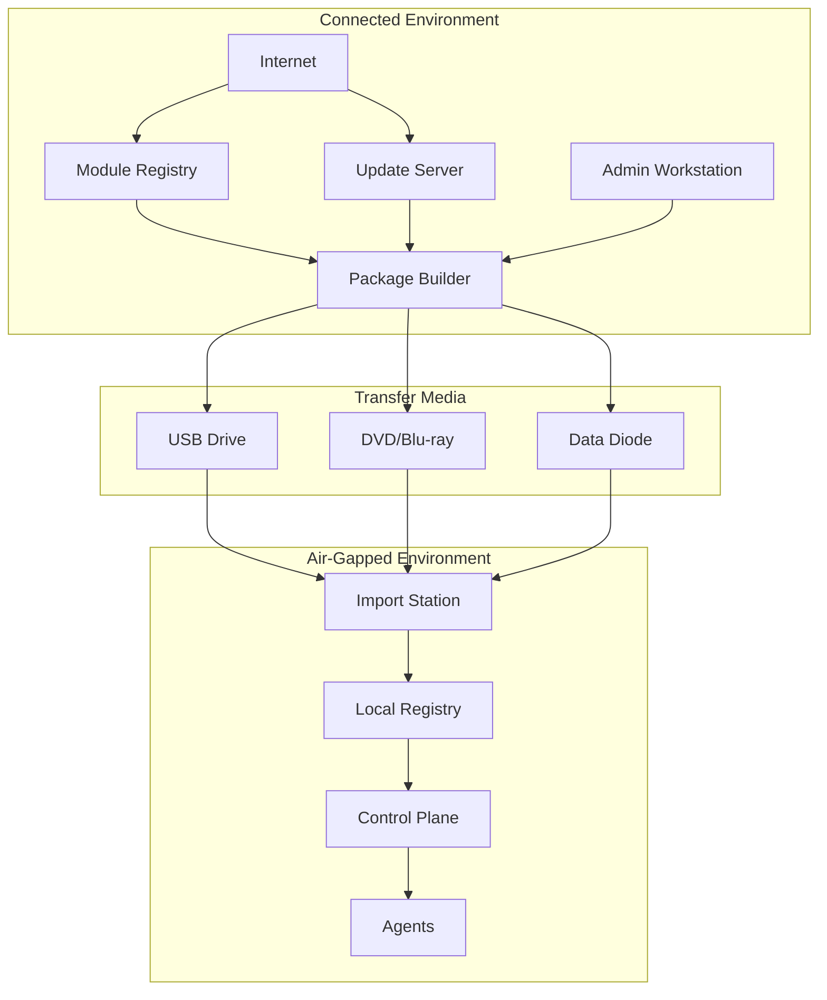
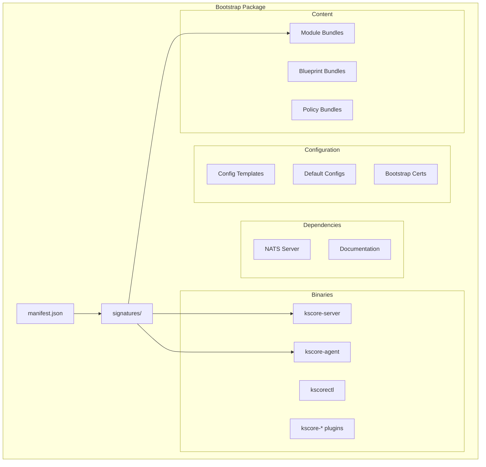
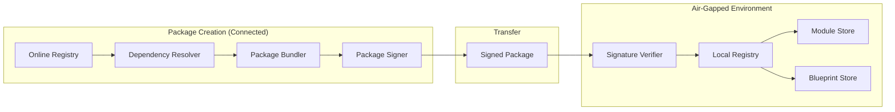
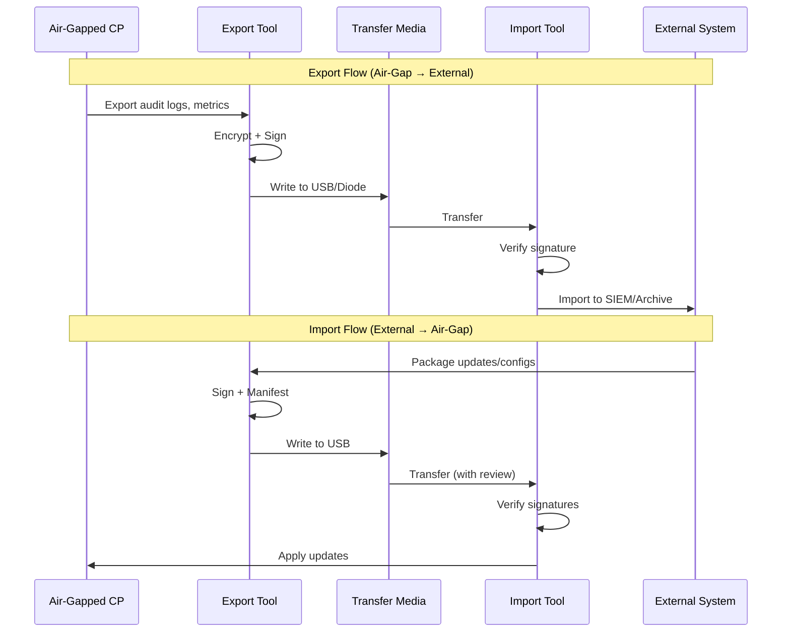
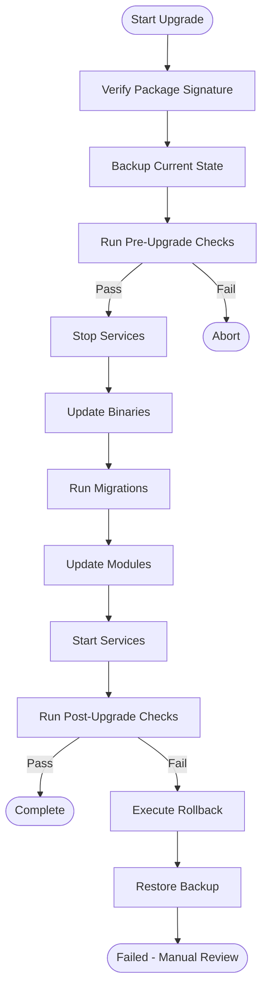

# Epic 38: Air-Gapped Deployment Support

## Overview

**Goal**: Enable full Keystone Core deployment and operation in air-gapped environments with no internet connectivity, supporting government, industrial, and high-security use cases.

**Key Principle**: Air-gapped environments require that all software, configurations, and updates can be transported via physical media (USB, DVD) or one-way data transfers, with cryptographic verification at every step.

**Current State**: Keystone Core already has robust disconnected operation support:
- Edge computing modes (online/offline/lightweight) in `pkg/edge/`
- Message buffering during disconnection (64MB, 10K messages) in `pkg/nats/leaf_buffer.go`
- Graceful degradation with priority-based queuing in `pkg/nats/degradation.go`
- File distribution with local filesystem backend in `pkg/files/`
- Local state/policy caching with TTL

**What's Missing**: The *initial deployment* and *ongoing maintenance* tooling for fully air-gapped environments:
- Offline installation packages (USB bootstrap)
- Local module/blueprint registry mirrors
- Offline upgrade packages with verification
- Data export/import for cross-air-gap transfer
- Air-gap compliance validation tooling

**Target State**: Complete air-gapped lifecycle support from initial deployment through ongoing operations and upgrades, with cryptographic chain of custody.

## Success Criteria

- [ ] Single USB/ISO bootstrap package for offline installation
- [ ] Offline module registry with signature verification
- [ ] Offline blueprint catalog with all dependencies bundled
- [ ] Upgrade packages for air-gapped agent/server updates
- [ ] Export/import tools for state, events, and audit data
- [ ] Scheduled sync windows for bandwidth-constrained links
- [ ] Air-gap validation tooling (verify no external dependencies)
- [ ] Sneakernet workflow documentation and tooling
- [ ] Cryptographic verification at all transfer points
- [ ] Support for one-way data diode transfers
- [ ] Offline documentation bundle
- [ ] <10 minute cold-start deployment from USB
- [ ] Zero internet connectivity required post-deployment

## Architecture

### Air-Gapped Deployment Model



### Package Structure



### Offline Registry Architecture



### Data Export/Import Flow



## Concepts

### Bootstrap Packages

A bootstrap package is a self-contained archive for deploying Keystone Core without network access:

```
keystone-bootstrap-v1.0.0-linux-amd64.tar.gz
├── manifest.json           # Package manifest with checksums
├── signatures/
│   ├── manifest.json.sig   # Detached signature
│   └── cosign.pub          # Public key for verification
├── bin/
│   ├── kscore-server       # Control plane binary
│   ├── kscore-agent        # Agent binary
│   ├── kscorectl           # CLI binary
│   ├── kscore-module       # Module management
│   ├── kscore-state        # State management
│   └── nats-server         # Embedded NATS (optional)
├── config/
│   ├── server.yaml.tmpl    # Server config template
│   ├── agent.yaml.tmpl     # Agent config template
│   └── bootstrap-ca/       # Bootstrap PKI
├── modules/
│   ├── std-core-v1.0.0.tar.gz
│   ├── std-files-v1.0.0.tar.gz
│   └── ...
├── blueprints/
│   ├── base-linux-v1.0.0.tar.gz
│   └── ...
├── docs/
│   └── offline-docs.tar.gz # Complete documentation
└── install.sh              # Installation script
```

**Manifest Format:**
```json
{
  "version": "1.0.0",
  "created": "2024-01-15T10:30:00Z",
  "created_by": "package-builder@example.com",
  "platform": "linux/amd64",
  "components": {
    "kscore-server": {
      "version": "1.0.0",
      "sha256": "abc123...",
      "path": "bin/kscore-server"
    },
    "kscore-agent": {
      "version": "1.0.0",
      "sha256": "def456...",
      "path": "bin/kscore-agent"
    }
  },
  "modules": [
    {
      "name": "std/core",
      "version": "1.0.0",
      "sha256": "789abc...",
      "path": "modules/std-core-v1.0.0.tar.gz"
    }
  ],
  "blueprints": [
    {
      "name": "base-linux",
      "version": "1.0.0",
      "sha256": "xyz789...",
      "path": "blueprints/base-linux-v1.0.0.tar.gz"
    }
  ],
  "signature_algorithm": "cosign",
  "requires_verification": true
}
```

### Offline Module Registry

A local registry serves modules and blueprints without internet:

```yaml
# /etc/keystone-core/registry.yaml
registry:
  mode: offline

  storage:
    type: filesystem
    path: /var/lib/keystone-core/registry

  verification:
    required: true
    trust_root: /etc/keystone-core/trust/root.json
    allowed_signers:
      - keyid: "abc123..."
        name: "Keystone Release Key"
      - keyid: "def456..."
        name: "Organization Signing Key"

  sync:
    # For environments with periodic connectivity
    enabled: false
    # Or for one-way sync via import
    import_path: /mnt/import
    auto_import: true
    import_interval: 1h
```

**Registry Directory Structure:**
```
/var/lib/keystone-core/registry/
├── modules/
│   ├── std/
│   │   ├── core/
│   │   │   ├── 1.0.0/
│   │   │   │   ├── module.tar.gz
│   │   │   │   ├── module.tar.gz.sig
│   │   │   │   └── metadata.json
│   │   │   └── latest -> 1.0.0
│   │   └── files/
│   │       └── ...
│   └── vendor/
│       └── ...
├── blueprints/
│   └── ...
├── policies/
│   └── ...
└── index.json  # Registry index
```

### Upgrade Packages

Upgrade packages contain everything needed to update an air-gapped deployment:

```
keystone-upgrade-v1.0.0-to-v1.1.0.tar.gz
├── manifest.json
├── signatures/
├── pre-upgrade/
│   ├── check-compatibility.sh
│   └── backup-state.sh
├── binaries/
│   ├── kscore-server-v1.1.0
│   ├── kscore-agent-v1.1.0
│   └── ...
├── migrations/
│   ├── 001-schema-update.sql
│   └── 002-config-migration.sh
├── modules/
│   └── ... (updated modules only)
├── post-upgrade/
│   ├── verify-upgrade.sh
│   └── rollback.sh
└── upgrade.sh
```

**Upgrade Workflow:**


### Data Export/Import

Export tools package data for transfer across air gaps:

**Export Types:**
| Type | Contents | Use Case |
|------|----------|----------|
| `audit` | Audit logs, compliance data | SIEM integration, compliance |
| `metrics` | Prometheus metrics snapshots | External monitoring |
| `state` | Current state declarations | Backup, DR |
| `events` | Event history | Analysis, debugging |
| `inventory` | Agent inventory, facts | Asset management |
| `full` | Complete system export | DR, migration |

**Export Format:**
```
keystone-export-audit-20240115.tar.gz.enc
├── manifest.json
├── data/
│   ├── audit-logs-20240115.jsonl.gz
│   ├── policy-decisions-20240115.jsonl.gz
│   └── compliance-reports-20240115.json
├── checksums.sha256
└── signature.sig
```

**Encryption Options:**
- Age encryption with recipient public key
- GPG encryption for traditional workflows
- Hardware token support (YubiKey, etc.)

### Sync Windows

For environments with periodic connectivity (e.g., daily satellite link):

```yaml
# Scheduled sync configuration
sync:
  windows:
    - name: "daily-maintenance"
      schedule: "0 2 * * *"  # 2 AM daily
      duration: 2h
      operations:
        - pull_modules
        - pull_blueprints
        - push_audit_logs
        - push_metrics
      bandwidth_limit: 10Mbps
      priority: high

    - name: "weekly-full-sync"
      schedule: "0 3 * * 0"  # 3 AM Sunday
      duration: 6h
      operations:
        - full_sync
      bandwidth_limit: 50Mbps
```

### Air-Gap Validation

Tooling to verify deployment has no external dependencies:

```bash
# Validate air-gap compliance (check for external dependencies)
kscorectl diagnostics collect --output airgap-report.yaml

# Output:
# Air-Gap Validation Report
# ========================
#
# Binary Analysis:
#   ✓ kscore-server: No external URLs in binary
#   ✓ kscore-agent: No external URLs in binary
#   ✓ kscorectl: No external URLs in binary
#
# Configuration Analysis:
#   ✓ No external registry URLs configured
#   ✓ No external API endpoints configured
#   ✓ Telemetry disabled or pointing to local endpoint
#   ⚠ NTP configured to external server (pool.ntp.org)
#     Recommendation: Use local NTP server
#
# Network Analysis:
#   ✓ No outbound connections detected (24h monitoring)
#   ✓ DNS queries limited to internal domains
#
# Module Analysis:
#   ✓ All modules present in local registry
#   ✓ All module signatures valid
#   ✓ No modules reference external resources
#
# Overall: COMPLIANT (1 warning)
```

## User Stories

### US38.1: Bootstrap Package Creation

**As a** deployment engineer,
**I want to** create a self-contained bootstrap package,
**So that** I can deploy Keystone Core without internet access.

**Acceptance Criteria:**
- [ ] CLI command to create bootstrap package
- [ ] Include all binaries for target platform
- [ ] Bundle specified modules and blueprints with dependencies
- [ ] Generate and sign manifest
- [ ] Support multiple platforms (linux/amd64, linux/arm64, windows/amd64)
- [ ] Include offline documentation
- [ ] Validate package completeness

### US38.2: Offline Installation

**As a** system administrator,
**I want to** install Keystone Core from a USB drive,
**So that** I can deploy in an air-gapped environment.

**Acceptance Criteria:**
- [ ] Single command installation from package
- [ ] Signature verification before installation
- [ ] Interactive and unattended installation modes
- [ ] Generate local PKI during bootstrap
- [ ] Configure embedded NATS mode
- [ ] Initialize local module registry
- [ ] Verify installation success

### US38.3: Offline Module Registry

**As a** platform engineer,
**I want to** run a local module registry,
**So that** agents can install modules without internet.

**Acceptance Criteria:**
- [ ] Filesystem-based registry backend
- [ ] Module signature verification
- [ ] Version resolution and dependency tracking
- [ ] Import modules from packages
- [ ] Registry index generation
- [ ] CLI for registry management

### US38.4: Upgrade Package Creation

**As a** release engineer,
**I want to** create upgrade packages for air-gapped deployments,
**So that** customers can update without internet.

**Acceptance Criteria:**
- [ ] Generate upgrade package between versions
- [ ] Include only changed components (delta)
- [ ] Bundle database migrations
- [ ] Include pre/post upgrade scripts
- [ ] Include rollback capability
- [ ] Sign upgrade package
- [ ] Document breaking changes

### US38.5: Offline Upgrade Execution

**As a** system administrator,
**I want to** upgrade Keystone Core from a package,
**So that** I can update my air-gapped deployment.

**Acceptance Criteria:**
- [ ] Verify upgrade package signature
- [ ] Run pre-upgrade compatibility checks
- [ ] Automatic backup before upgrade
- [ ] Apply binary and configuration updates
- [ ] Run database migrations
- [ ] Update local module registry
- [ ] Verify upgrade success
- [ ] Automatic rollback on failure

### US38.6: Data Export for Compliance

**As a** compliance officer,
**I want to** export audit logs from the air-gapped environment,
**So that** I can transfer them to our SIEM.

**Acceptance Criteria:**
- [ ] Export audit logs with date range
- [ ] Export compliance reports
- [ ] Encrypt exports with recipient key
- [ ] Sign exports for integrity
- [ ] Support incremental exports
- [ ] Multiple output formats (JSON, CSV)

### US38.7: Data Import

**As a** system administrator,
**I want to** import updates and configurations,
**So that** I can update the air-gapped environment.

**Acceptance Criteria:**
- [ ] Verify import package signature
- [ ] Validate import contents
- [ ] Preview changes before applying
- [ ] Apply module/blueprint updates
- [ ] Apply configuration changes
- [ ] Audit log of all imports
- [ ] Reject unsigned or tampered packages

### US38.8: Sync Window Management

**As an** operations engineer,
**I want to** configure scheduled sync windows,
**So that** my bandwidth-constrained environment syncs efficiently.

**Acceptance Criteria:**
- [ ] Define sync windows with schedule
- [ ] Configure bandwidth limits
- [ ] Prioritize sync operations
- [ ] Resume interrupted syncs
- [ ] Report sync status and history
- [ ] Alert on sync failures

### US38.9: Air-Gap Validation

**As a** security engineer,
**I want to** validate my deployment is air-gap compliant,
**So that** I can certify it for classified environments.

**Acceptance Criteria:**
- [ ] Scan binaries for external URLs
- [ ] Analyze configuration for external dependencies
- [ ] Monitor network for outbound connections
- [ ] Validate all modules are local
- [ ] Generate compliance report
- [ ] Identify and report exceptions

### US38.10: One-Way Data Diode Support

**As a** security architect,
**I want to** export data through a one-way data diode,
**So that** I can maintain strict network isolation.

**Acceptance Criteria:**
- [ ] UDP-based export for data diodes
- [ ] Packet sequencing and reassembly
- [ ] Forward error correction
- [ ] Export verification on receiving side
- [ ] Support standard diode protocols
- [ ] Handle packet loss gracefully

## Configuration

### Air-Gap Mode Configuration

```yaml
# /etc/keystone-core/server.yaml
server:
  # Enable air-gap mode
  airgap:
    enabled: true

    # Disable all external connectivity checks
    disable_external_checks: true

    # Local time source (no external NTP)
    time_source: local  # or 'ntp://local-ntp.internal'

    # Disable telemetry upload
    telemetry:
      upload: false
      local_storage: /var/lib/keystone-core/telemetry
      retention: 90d

  # Module registry configuration
  registry:
    mode: offline
    path: /var/lib/keystone-core/registry

  # Embedded NATS for air-gap
  nats:
    mode: embedded
    data_dir: /var/lib/keystone-core/nats

  # Local certificate authority
  pki:
    mode: local
    ca_path: /etc/keystone-core/pki/ca
    auto_rotate: true
    cert_lifetime: 365d
```

### Import Station Configuration

```yaml
# /etc/keystone-core/import-station.yaml
import:
  # Watch directory for new packages
  watch_path: /mnt/import

  # Processed packages moved here
  archive_path: /var/lib/keystone-core/import-archive

  # Rejected packages
  reject_path: /var/lib/keystone-core/import-rejected

  # Verification settings
  verification:
    required: true
    allowed_signers:
      - name: "Release Key"
        keyid: "abc123..."
        public_key: /etc/keystone-core/trust/release.pub
      - name: "Org Key"
        keyid: "def456..."
        public_key: /etc/keystone-core/trust/org.pub

  # Auto-import settings
  auto_import:
    enabled: true
    types:
      - modules
      - blueprints
    # Require manual approval for:
    require_approval:
      - binaries
      - configurations

  # Notifications
  notify:
    on_import: true
    on_reject: true
    channels:
      - local-syslog
```

### Export Configuration

```yaml
# /etc/keystone-core/export.yaml
export:
  # Default encryption
  encryption:
    algorithm: age
    recipients:
      - name: "SIEM Import Key"
        public_key: "age1..."
      - name: "Backup Key"
        public_key: "age1..."

  # Signing
  signing:
    key: /etc/keystone-core/export/signing-key.pem

  # Export schedules
  schedules:
    - name: daily-audit
      type: audit
      schedule: "0 1 * * *"
      destination: /mnt/export/audit
      retention: 30d

    - name: weekly-metrics
      type: metrics
      schedule: "0 2 * * 0"
      destination: /mnt/export/metrics

  # Output settings
  output:
    compress: true
    split_size: 4GB  # For DVD media
    checksum: sha256
```

### Data Diode Configuration

```yaml
# /etc/keystone-core/diode.yaml
diode:
  # Sender configuration (air-gapped side)
  sender:
    enabled: true
    destination: 10.0.0.1:9999
    protocol: udp

    # Forward error correction
    fec:
      enabled: true
      redundancy: 0.2  # 20% redundant packets

    # Packet settings
    packets:
      size: 1400  # MTU-safe
      rate_limit: 10Mbps

    # Data formatting
    format:
      chunking: true
      chunk_size: 1MB
      sequence_numbers: true

  # Receiver configuration (external side)
  receiver:
    enabled: true
    listen: 0.0.0.0:9999
    protocol: udp

    # Reassembly
    reassembly:
      timeout: 5m
      buffer_size: 100MB

    # Output
    output:
      path: /var/lib/keystone-core/diode-received
      verify_checksum: true
```

## CLI Commands

### Package Creation

```bash
# Create bootstrap bundle (blueprint + dependencies)
kscorectl blueprint bundle create ./base-linux \
  --sign

# Create module bundle for offline transfer
kscorectl module mirror --source std/core@1.0.0,std/files@1.0.0 \
  --dest /mnt/export/modules/

# Create upgrade package
kscorectl upgrade plan --target 1.1.0 --save upgrade-plan.yaml
```

### Installation

```bash
# Verify package signatures
kscorectl blueprint verify keystone-bootstrap-bundle.tar.gz

# Install bundle on air-gapped system
kscorectl blueprint bundle install keystone-bootstrap-bundle.tar.gz

# Bootstrap from seed config
kscore-bootstrap seed /path/to/config.yaml
```

### Registry Management

```bash
# Import blueprints to local mirror
kscorectl blueprint mirror import blueprint-export.tar.gz

# Import modules to local registry
kscorectl module mirror --import --registry http://localhost:8080

# Serve local mirror for air-gapped clients
kscorectl blueprint mirror serve --listen :8080
```

### Upgrade

```bash
# Check available upgrade
kscorectl upgrade check --target 1.1.0

# Dry-run upgrade
kscorectl upgrade execute --target 1.1.0 --dry-run

# Apply upgrade
kscorectl upgrade execute --target 1.1.0

# Rollback if needed
kscorectl upgrade rollback
```

### Export/Import

```bash
# Export audit logs
kscorectl audit export --format json --since 2024-01-01

# Export full backup
kscorectl backup create --destination /mnt/export/full-backup.tar.gz

# Import module updates on air-gapped system
kscorectl module mirror --import --registry http://localhost:8080

# Restore from backup
kscorectl backup restore /mnt/import/full-backup.tar.gz
```

### Validation

```bash
# Collect diagnostics to verify air-gap compliance
kscorectl diagnostics collect --output airgap-report.yaml
```

## Technical Tasks

### Phase 1: Bootstrap Packages (Weeks 1-4)

#### Week 1: Package Format and Manifest
- [ ] Define bootstrap package format specification
- [ ] Implement manifest schema with JSON Schema validation
- [ ] Create package builder framework
- [ ] Add checksum generation (SHA256)
- [ ] Implement signature generation (Cosign)
- [ ] Write package format tests

#### Week 2: Binary Bundling
- [ ] Implement binary collection for target platform
- [ ] Add cross-platform support (linux/amd64, linux/arm64, windows)
- [ ] Bundle NATS server binary
- [ ] Include all kscore-* plugin binaries
- [ ] Add binary stripping and compression
- [ ] Write binary bundling tests

#### Week 3: Content Bundling
- [ ] Implement module bundling with dependency resolution
- [ ] Add blueprint bundling with dependencies
- [ ] Bundle default policies
- [ ] Include configuration templates
- [ ] Bundle offline documentation
- [ ] Write content bundling tests

#### Week 4: Package Verification and Installation
- [ ] Implement package signature verification
- [ ] Create package extraction with integrity checks
- [ ] Build installation script generator
- [ ] Add unattended installation mode
- [ ] Implement installation verification
- [ ] Write installation tests

### Phase 2: Offline Registry (Weeks 5-8)

#### Week 5: Registry Storage Backend
- [ ] Implement filesystem-based registry storage
- [ ] Create registry index format
- [ ] Add module storage with versioning
- [ ] Add blueprint storage with versioning
- [ ] Implement storage integrity checks
- [ ] Write storage backend tests

#### Week 6: Registry Operations
- [ ] Implement module import from packages
- [ ] Add blueprint import from packages
- [ ] Create registry index generation
- [ ] Implement dependency resolution for offline
- [ ] Add registry garbage collection
- [ ] Write registry operation tests

#### Week 7: Registry Verification
- [ ] Implement module signature verification
- [ ] Add trust root management
- [ ] Create allowed signers configuration
- [ ] Implement verification caching
- [ ] Add verification audit logging
- [ ] Write verification tests

#### Week 8: Registry CLI
- [ ] Implement registry CLI (blueprint mirror, module mirror)
- [ ] Add registry initialization
- [ ] Create import/export commands
- [ ] Add listing and search
- [ ] Implement integrity verification command
- [ ] Write CLI tests

### Phase 3: Upgrade Packages (Weeks 9-12)

#### Week 9: Upgrade Package Format
- [ ] Define upgrade package format
- [ ] Implement delta calculation between versions
- [ ] Create migration script bundling
- [ ] Add pre/post upgrade script support
- [ ] Implement rollback script generation
- [ ] Write upgrade format tests

#### Week 10: Upgrade Execution Engine
- [ ] Implement upgrade state machine
- [ ] Create backup before upgrade
- [ ] Add binary replacement logic
- [ ] Implement configuration migration
- [ ] Add database migration execution
- [ ] Write upgrade engine tests

#### Week 11: Upgrade Verification and Rollback
- [ ] Implement pre-upgrade compatibility checks
- [ ] Add post-upgrade verification
- [ ] Create automatic rollback on failure
- [ ] Implement manual rollback command
- [ ] Add upgrade audit logging
- [ ] Write verification and rollback tests

#### Week 12: Upgrade CLI and Automation
- [ ] Implement offline upgrade workflow (upgrade execute with local packages)
- [ ] Add dry-run mode
- [ ] Create upgrade scheduling
- [ ] Implement staged rollout for agents
- [ ] Add upgrade notifications
- [ ] Write CLI and automation tests

### Phase 4: Export/Import (Weeks 13-16)

#### Week 13: Export Framework
- [ ] Design export package format
- [ ] Implement audit log export
- [ ] Add metrics export (Prometheus format)
- [ ] Create state export
- [ ] Implement event history export
- [ ] Write export framework tests

#### Week 14: Export Encryption and Signing
- [ ] Implement Age encryption
- [ ] Add GPG encryption support
- [ ] Create package signing
- [ ] Implement recipient key management
- [ ] Add hardware token support (YubiKey)
- [ ] Write encryption tests

#### Week 15: Import Framework
- [ ] Implement import verification
- [ ] Create import preview mode
- [ ] Add selective import
- [ ] Implement import audit logging
- [ ] Create import station watch mode
- [ ] Write import framework tests

#### Week 16: Export/Import CLI
- [ ] Implement export/import workflows (audit export, backup create/restore)
- [ ] Add scheduled export configuration
- [ ] Create export retention management
- [ ] Implement export splitting for media limits
- [ ] Write CLI tests

### Phase 5: Advanced Features (Weeks 17-20)

#### Week 17: Sync Windows
- [ ] Implement sync window scheduler
- [ ] Add bandwidth limiting
- [ ] Create operation prioritization
- [ ] Implement interrupted sync resume
- [ ] Add sync status reporting
- [ ] Write sync window tests

#### Week 18: Data Diode Support
- [ ] Implement UDP sender for diodes
- [ ] Add packet sequencing
- [ ] Create forward error correction
- [ ] Implement receiver and reassembly
- [ ] Add checksum verification
- [ ] Write data diode tests

#### Week 19: Air-Gap Validation
- [ ] Implement binary URL scanning
- [ ] Add configuration analysis
- [ ] Create network connection monitoring
- [ ] Implement module dependency analysis
- [ ] Create compliance report generator
- [ ] Write validation tests

#### Week 20: Integration and Polish
- [ ] Integration testing with full workflow
- [ ] Performance optimization for large packages
- [ ] Add progress reporting for long operations
- [ ] Implement operation logging
- [ ] Create troubleshooting tools
- [ ] Write integration tests

### Phase 6: Documentation and Release (Weeks 21-22)

#### Week 21: Documentation
- [ ] Write air-gap deployment guide
- [ ] Create package creation guide
- [ ] Document upgrade procedures
- [ ] Write export/import workflows
- [ ] Create troubleshooting guide
- [ ] Document compliance requirements

#### Week 22: Release Preparation
- [ ] End-to-end testing in simulated air-gap
- [ ] Security review of signing and encryption
- [ ] Performance benchmarks
- [ ] Create example packages
- [ ] Update AGENTS.md with capabilities
- [ ] Release notes and changelog

## Risks and Mitigations

| Risk | Likelihood | Impact | Mitigation |
|------|------------|--------|------------|
| Package size too large | Medium | Medium | Delta upgrades, compression, split packages |
| Signature verification complexity | Medium | High | Use established tools (Cosign), clear key management |
| Upgrade failures in air-gap | Medium | High | Comprehensive pre-checks, automatic rollback |
| Time drift without NTP | Medium | Medium | Support local NTP, certificate grace periods |
| Media compatibility issues | Low | Medium | Multiple formats (USB, DVD, network share) |
| Key management in air-gap | Medium | High | Hardware tokens, key ceremony documentation |

## Testing Strategy

### Unit Tests
- Package manifest parsing
- Checksum calculation
- Signature verification
- Registry operations
- Export/import logic

### Integration Tests
- Full package creation workflow
- Installation from package
- Upgrade execution
- Export/import roundtrip
- Registry synchronization

### End-to-End Tests
- Air-gapped VM deployment
- USB bootstrap simulation
- Upgrade lifecycle
- Data diode transfer
- Sync window operation

### Compliance Tests
- Air-gap validation accuracy
- No external connection verification
- Signature verification enforcement
- Encryption strength validation

## Definition of Done

- [ ] Bootstrap package creation and installation working
- [ ] Offline module registry operational
- [ ] Upgrade packages with rollback support
- [ ] Export/import for audit and metrics
- [ ] Sync window scheduling functional
- [ ] Data diode support implemented
- [ ] Air-gap validation tooling complete
- [ ] All signatures verified at every step
- [ ] Documentation complete
- [ ] Tested in simulated air-gapped environment
- [ ] Zero internet dependencies verified
- [ ] <10 minute cold-start deployment achieved

## Dependencies

### Required
- Epic 1: Core Infrastructure (NATS, basic operation)
- Epic 9: Plugin System (module format)
- Epic 22: File Distribution (caching infrastructure)
- Epic 23: Self-Management (backup/restore)
- Epic 25: Blueprints (blueprint format)

### Leverages Existing
- `pkg/edge/` - Offline operation modes
- `pkg/nats/leaf_buffer.go` - Message buffering
- `pkg/nats/degradation.go` - Graceful degradation
- `pkg/files/cache/` - File caching

### External Dependencies
- Cosign for signing (can be bundled)
- Age for encryption (can be bundled)
