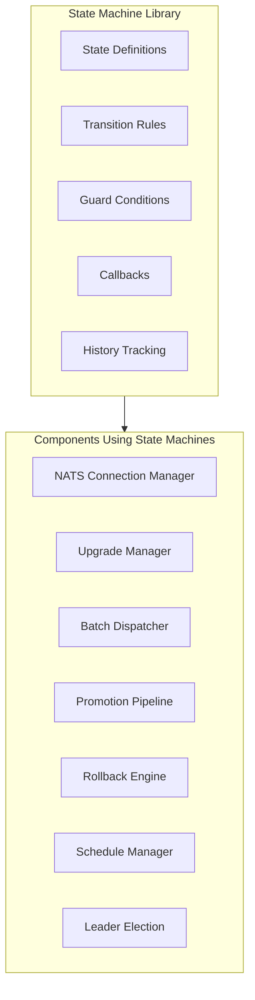

# Epic 39: State Machine Pattern Refactoring

## Overview

Refactor components throughout Keystone Core to use explicit state machine patterns, improving code clarity, correctness, maintainability, and testability. This epic introduces a reusable state machine library and systematically applies it to components that manage complex state transitions.

**Goal**: Replace implicit state management (scattered conditionals, multiple state fields, time-based implicit states) with explicit, validated state machines that document valid states and transitions in code.

## Success Criteria

- [ ] Generic state machine library implemented in `pkg/statemachine`
- [ ] Comprehensive contributor documentation for state machine patterns
- [ ] All high-priority components refactored to use state machines
- [ ] State transition validation prevents invalid transitions at runtime
- [ ] State transition history available for debugging and auditing
- [ ] Event emission integrated with state transitions
- [ ] Test coverage >80% for state machine library
- [ ] No regressions in existing functionality

## Architecture



## Benefits of State Machine Pattern

1. **Clarity** - Valid states and transitions documented in code
2. **Correctness** - Invalid transitions fail fast with clear errors
3. **Testability** - State machines can be exhaustively unit tested
4. **Debugging** - State transition history makes issues traceable
5. **Extensibility** - Adding new states/transitions is localized
6. **Event Integration** - Events emitted as direct outputs of state transitions

---

## Phase 1: Foundation (Weeks 1-2)

### US39.1: State Machine Library Implementation
**As a** developer
**I want to** use a generic state machine library
**So that** I can implement state machines consistently across components

**Acceptance Criteria**:
- Generic `Machine[S, E]` type parameterized by state and event types
- Transition rules defined as `(from_state, event) -> to_state`
- Guard conditions that can block transitions based on context
- OnEnter/OnExit callbacks for states
- OnTransition callbacks for logging/events
- Thread-safe operation with proper locking
- State transition history with configurable depth
- Serializable state for persistence
- Comprehensive error types for invalid transitions

**Technical Tasks**:
1. Create `pkg/statemachine/machine.go` - Core state machine implementation
2. Create `pkg/statemachine/builder.go` - Fluent builder for defining machines
3. Create `pkg/statemachine/history.go` - Transition history tracking
4. Create `pkg/statemachine/errors.go` - Error types
5. Create `pkg/statemachine/doc.go` - Package documentation
6. Write comprehensive tests with >90% coverage

### US39.2: Contributor Documentation
**As a** contributor
**I want to** understand how to implement state machines
**So that** I can apply the pattern correctly in new code

**Acceptance Criteria**:
- Overview of state machine concepts
- When to use state machines (and when not to)
- Step-by-step guide for implementing a state machine
- Best practices and anti-patterns
- Real examples from the codebase
- Testing strategies for state machines

**Technical Tasks**:
1. Create `docs/content/en/docs/contributing/state-machines.md`
2. Add examples directory with sample implementations
3. Update AGENTS.md with state machine guidelines

---

## Phase 2: Connection Management (Weeks 3-4)

### US39.3: NATS Connection Manager State Machine
**As a** developer
**I want to** the NATS connection manager to use explicit state machines
**So that** connection and circuit breaker states are clearly defined

**Current State Tracking**:
```go
type ConnectionState int
const (
    ConnectionStateDisconnected ConnectionState = iota
    ConnectionStateConnecting
    ConnectionStateConnected
    ConnectionStateReconnecting
    ConnectionStateClosed
)
```

**Problems**:
- Circuit breaker state (open/closed/half-open) managed via `CircuitOpen bool` + timing
- State transitions scattered across `connectToEndpoint`, `recordFailure`, `recordSuccess`
- No validation that transitions are valid

**Acceptance Criteria**:
- Connection state machine with validated transitions
- Separate circuit breaker state machine
- State transitions emit events via callbacks
- Invalid transitions return errors instead of silent failures
- Backward-compatible API

**Technical Tasks**:
1. Define connection state machine with transitions
2. Define circuit breaker state machine (Closed, Open, HalfOpen)
3. Refactor `PooledConnectionManager` to use state machines
4. Update callbacks to be triggered by state transitions
5. Add state machine tests
6. Update existing connection manager tests

### US39.4: Control Plane Connection Manager State Machine
**As a** developer
**I want to** agent health tracking to use explicit states
**So that** agent lifecycle is clearly defined

**Current State**:
```go
type AgentInfo struct {
    Status          pb.AgentStatus  // ONLINE, OFFLINE
    HeartbeatMissed int
}
```

**Acceptance Criteria**:
- Agent state machine: Registered → Healthy → Degraded → Offline → Gone
- Clear transition triggers (heartbeat received, missed, timeout)
- Events emitted on state changes
- Backward-compatible with existing proto enum

**Technical Tasks**:
1. Define agent health state machine
2. Refactor `checkAgentHealth` to use state transitions
3. Integrate state change events with existing event system
4. Update tests

---

## Phase 3: Upgrade and Deployment (Weeks 5-6)

### US39.5: Upgrade Manager State Machine
**As a** developer
**I want to** upgrade orchestration to use a unified state machine
**So that** phase and status are always consistent

**Current State**:
```go
type UpgradePhase string  // 10 values
type UpgradeStatus string // 6 values
```

**Problems**:
- Two parallel enums that must stay synchronized
- Strategy-specific phase sequences not enforced
- Rollback paths implicit

**Acceptance Criteria**:
- Single state machine unifying phase and status
- Strategy-specific transition rules (Rolling vs Canary vs BlueGreen)
- Guard conditions enforce valid sequences
- Rollback transitions explicitly defined
- Progress percentage derived from state

**Technical Tasks**:
1. Define upgrade state machine with phases as states
2. Create strategy-specific transition configurations
3. Refactor `UpgradeManager` implementation
4. Add rollback path validation
5. Update upgrade tests

### US39.6: GitOps Promotion Pipeline State Machine
**As a** developer
**I want to** promotion pipelines to use explicit state machines
**So that** multi-stage deployments are correctly orchestrated

**Current State**:
```go
type PromotionStatus string  // 10 values
```

**Problems**:
- Approval workflow embedded in result struct
- Stage-specific thresholds and verification interleaved
- Multiple parallel concerns (approval, execution, verification)

**Acceptance Criteria**:
- Promotion state machine with clear workflow
- Approval sub-state machine that can gate transitions
- Stage tracking integrated with state
- Canary-specific states for gradual rollout

**Technical Tasks**:
1. Define promotion state machine
2. Define approval state machine (composable)
3. Refactor `PromotionEngine`
4. Add stage-aware transitions
5. Update tests

### US39.7: Rollback Engine State Machine
**As a** developer
**I want to** rollback operations to use explicit state machines
**So that** approval and execution workflows are clear

**Acceptance Criteria**:
- Rollback state machine with approval gates
- Clear transition from verification failure to rollback
- State machine composition with approval workflow

**Technical Tasks**:
1. Define rollback state machine
2. Compose with approval state machine
3. Refactor `RollbackEngine`
4. Update tests

---

## Phase 4: Batch and Execution (Weeks 7-8)

### US39.8: Batch Dispatcher State Machine
**As a** developer
**I want to** batch execution to use hierarchical state machines
**So that** job, batch, and agent states are clearly tracked

**Current State**:
```go
type BatchJob struct {
    Status pb.BatchJobStatus  // PENDING, RUNNING, COMPLETED, FAILED
    Total, Completed, Successful, Failed int32
}
```

**Problems**:
- Progress counters separate from status
- Per-agent states not explicitly tracked
- No clear error recovery paths

**Acceptance Criteria**:
- Job state machine: Created → Pending → Starting → Running → Completed/Failed
- Agent result tracking via state
- Progress derived from state counts
- Error recovery paths defined

**Technical Tasks**:
1. Define batch job state machine
2. Define per-agent execution state machine
3. Refactor `BatchDispatcher`
4. Derive progress from state
5. Update tests

### US39.9: Command Executor State Machine
**As a** developer
**I want to** command execution to track retry state explicitly
**So that** execution lifecycle is clear

**Current State**:
- Implicit retry tracking via loop counter
- Running commands tracked in map

**Acceptance Criteria**:
- Execution state machine: Pending → Running → Success/Failed → Retrying → ...
- Timeout as explicit state transition
- Cancellation handling in any state

**Technical Tasks**:
1. Define execution state machine
2. Refactor `Executor`
3. Add timeout transitions
4. Update tests

### US39.10: Pipeline Executor State Machine
**As a** developer
**I want to** pipeline execution to track stage state explicitly
**So that** stage dependencies and error handling are clear

**Acceptance Criteria**:
- Pipeline state machine tracking current stage
- Per-stage state machine
- Error handling modes (stopOnError, continueOnError) as guards

**Technical Tasks**:
1. Define pipeline state machine
2. Define stage state machine
3. Refactor `Pipeline`
4. Update tests

---

## Phase 5: Scheduling and Coordination (Weeks 9-10)

### US39.11: Schedule Manager State Machine
**As a** developer
**I want to** schedules to use explicit state machines
**So that** schedule lifecycle and events are unified

**Current State**:
```go
type ScheduleStatus string  // active, paused, disabled
```

**Acceptance Criteria**:
- Schedule state machine: Created → Active → Executing → Completed/Failed → Active
- Events emitted as state transition outputs
- Pause/resume as explicit transitions

**Technical Tasks**:
1. Define schedule state machine
2. Refactor `ScheduleManager`
3. Unify events with state transitions
4. Update tests

### US39.12: Leader Election State Machine
**As a** developer
**I want to** leader election to use explicit state machines
**So that** leadership transitions are clearly tracked

**Current State**:
```go
type LeaderElector struct {
    isLeader bool
    started  bool
}
```

**Acceptance Criteria**:
- Election state machine: Idle → Initializing → Candidate → Leader/Follower → Shutdown
- Clear transition on campaign success/failure
- State machine notifications drive observer pattern

**Technical Tasks**:
1. Define election state machine
2. Refactor `LeaderElector`
3. Update observer notifications
4. Update tests

### US39.13: Maintenance Window State Machine
**As a** developer
**I want to** maintenance windows to use explicit state machines
**So that** window lifecycle is clear

**Acceptance Criteria**:
- Window state machine: Scheduled → Active → Completed/Cancelled
- Time-based transitions handled correctly
- Guard conditions prevent invalid cancellation

**Technical Tasks**:
1. Define maintenance window state machine
2. Refactor `MaintenanceManager`
3. Update tests

---

## Phase 6: File Distribution and Bootstrap (Weeks 11-12)

### US39.14: Mirror Sync State Machine
**As a** developer
**I want to** file sync operations to use explicit state machines
**So that** sync progress and conflicts are clearly tracked

**Current State**:
```go
type SyncState string   // idle, syncing, error
type SyncStatus string  // pending, in_progress, completed, failed, cancelled
```

**Acceptance Criteria**:
- Sync operation state machine
- Per-file state machine
- Conflict detection as explicit state
- Retry tracking via state

**Technical Tasks**:
1. Define sync operation state machine
2. Define file transfer state machine
3. Refactor sync engine
4. Update tests

### US39.15: Bootstrap Process State Machine
**As a** developer
**I want to** bootstrap to use explicit state machines
**So that** installation phases are clearly tracked

**Current State**:
```go
type BootstrapPhase string  // 13 phases
```

**Acceptance Criteria**:
- Bootstrap state machine with all phases
- Guard conditions for phase prerequisites
- Rollback path for failed phases
- Progress percentage from state

**Technical Tasks**:
1. Define bootstrap state machine
2. Add phase prerequisite guards
3. Refactor bootstrap process
4. Update tests

### US39.16: Hybrid Mode Agent State Machine
**As a** developer
**I want to** hybrid mode to use explicit state machines
**So that** connection role determination is clear

**Current State**:
```go
type HybridModeState int    // 6 values
type ConnectionRole int     // 4 values
type NetworkReachability int // 4 values
```

**Problems**:
- Multiple interdependent state enums
- Role determination logic spread across methods

**Acceptance Criteria**:
- Hybrid mode state machine
- Network reachability as context for guards
- Role selection as state transition outcome

**Technical Tasks**:
1. Define hybrid mode state machine
2. Integrate network reachability as guard context
3. Refactor hybrid mode agent
4. Update tests

---

## Dependencies

### Required Libraries
- None (pure Go implementation)

### Epic Dependencies
- None (independent refactoring epic)

### Internal Dependencies
- Phase 1 must complete before Phases 2-6
- Within each phase, tasks can be parallelized

---

## Risks and Mitigations

| Risk | Impact | Mitigation |
|------|--------|------------|
| API breaking changes | High | Maintain backward-compatible APIs, deprecate old patterns |
| Performance overhead | Medium | Benchmark state machine operations, optimize hot paths |
| Incomplete migration | Medium | Track migration status, prioritize high-value targets |
| Testing gaps | High | Require comprehensive tests for all state machines |

---

## Testing Strategy

### Unit Tests
- State machine library: >90% coverage
- Each refactored component: >80% coverage
- Transition validation tests
- Guard condition tests
- Callback execution tests

### Integration Tests
- End-to-end workflows using state machines
- State persistence and recovery
- Event emission verification

### Property-Based Tests
- Random transition sequences never reach invalid states
- All reachable states have defined exit transitions
- State machine invariants hold across all transitions

---

## Definition of Done

### Per User Story
- [ ] State machine defined with all states and transitions
- [ ] Implementation uses state machine library
- [ ] Unit tests cover all transitions
- [ ] Invalid transitions return appropriate errors
- [ ] Existing tests pass without modification
- [ ] Documentation updated if API changes

### Per Phase
- [ ] All user stories complete
- [ ] Integration tests pass
- [ ] No performance regressions
- [ ] Documentation reviewed

### Epic Complete
- [ ] All phases complete
- [ ] Contributor documentation finalized
- [ ] AGENTS.md updated with state machine guidelines
- [ ] Performance benchmarks documented
