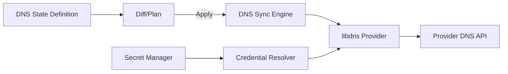

# Epic 41: DNS Provider Record Management

## Overview & Success Criteria

Keystone Core will add **authoritative DNS record management** via provider APIs using the **libdns** interface and its provider ecosystem. This ships as a **state** in the statemgmt system (no separate DNS plugin). This enables users to declaratively manage DNS records across a wide range of services without Keystone-specific provider implementations.

**Success Criteria**
- Users can manage DNS records (A/AAAA/CNAME/TXT/MX/SRV/CAA/NS/ALIAS as supported by providers) through a declarative state.
- Supports **>= 20 providers** out of the box (libdns packages) and an extensible pattern for more.
- All DNS operations are **idempotent**, safe for re-apply, and produce accurate diffs.
- Dry-run produces clear, resource-level change plans.
- Secrets and credentials are handled via existing Keystone secret management and capability controls.
- Comprehensive unit/integration tests with coverage targets met.
- Documentation and CLI references updated with usage examples.

## User Stories

1. **Multi-provider record management**
   - As a platform engineer, I can manage DNS records across Cloudflare, Route53, and DNSMadeEasy with the same Keystone state definition.
   - **Acceptance:** Same state file format for all supported providers; provider-specific auth is the only variation.

2. **Declarative drift remediation**
   - As an operator, I can define desired DNS records and Keystone detects drift and corrects it.
   - **Acceptance:** `check` shows drift, `apply` reconciles, `diff` reports before/after.

3. **Safe change previews**
   - As a reviewer, I can run a dry run that shows intended DNS record changes without modifying providers.
   - **Acceptance:** Dry-run yields structured “create/update/delete/no-op” output.

4. **Scoped provider credentials**
   - As a security engineer, I can scope DNS credentials to the minimum required capabilities.
   - **Acceptance:** Capability-based restrictions enforced; secrets handled via existing secret providers.

5. **Zone-level isolation**
   - As a tenant admin, I can target DNS operations to specific zones only.
   - **Acceptance:** States cannot operate outside configured zones.

## Architecture

### Core Components
- **DNS State Module** (`internal/statemgmt/module_dns.go`)
  - Defines desired DNS records and provider configuration.
  - Supports diff, check, apply, and dry-run.
  - Uses libdns interfaces for CRUD operations.

- **Provider Adapter Registry** (`internal/dns/providers`)
  - Dynamically instantiates libdns providers based on config.
  - Maps config to provider client instances.
  - Supports provider capability discovery (record type support, ALIAS/ANAME support, etc.).

- **Credential Resolution** (`internal/dns/credentials`)
  - Resolves provider credentials from Keystone secret sources.
  - Enforces capability restrictions and zone scoping.

- **State Machine (if needed)**
  - If provider sync logic expands (batching, retries, verification), use `pkg/statemachine` with states: `idle → plan → apply → verify → complete|failed`.

### Mermaid Diagram



## State Definition (Draft)

```yaml
states:
  dns_records:
    - name: manage-zone-records
      provider: cloudflare
      zone: example.com
      credentials:
        secret_ref: secret://dns/cloudflare
      records:
        - type: A
          name: www
          value: 203.0.113.10
          ttl: 300
        - type: CNAME
          name: api
          value: api.internal.example.com.
          ttl: 600
```

## Initial Provider List (Top 10)

Curated for widest coverage, based on authoritative DNS concentration data and common managed DNS usage, with DNSMadeEasy included per requirement. This list is derived from top authoritative providers, excluding NXDOMAIN (not a provider) and Apple (not a managed DNS service), and substituting high-demand managed DNS services with public APIs. All listed providers have libdns implementations or are commonly supported via libdns provider modules.

1. Cloudflare
2. Amazon Route 53
3. Google Cloud DNS
4. Microsoft Azure DNS
5. Akamai Edge DNS
6. Oracle Dyn DNS
7. UltraDNS (Neustar)
8. NS1
9. DigitalOcean DNS
10. DNSMadeEasy

## Technical Tasks

### Week 1–2: Foundations
- Add `internal/dns` package structure and provider registry.
- Implement configuration models and validation (zone scoping, record normalization).
- Implement record diffing logic and change plan output.
- Add dry-run support with structured operations.

### Week 3–4: State Module + Provider Support
- Implement `module_dns.go` for statemgmt.
- Integrate libdns provider instantiation.
- Add initial provider list (top 10) and validate auth/config mappings per provider.
- Add more based on demand and availability in libdns.

### Week 5–6: CLI + Observability
- Add CLI plugin `kscore-dns` or integrate into `kscore-state` (decision required).
- Add metrics for provider operations (latency, error rates, record counts).
- Add audit logging for record changes.

### Week 7–8: Docs + Harden
- Write user docs (reference + how-to + examples).
- Add auth configuration examples for major providers.
- Add compliance and rate-limit guidance.

## Dependencies
- **libdns** core interface: `github.com/libdns/libdns`
- Provider modules from `github.com/libdns/*`
- Existing Keystone secret management and state framework

## Risks & Mitigations

- **Provider API variance**: TTL, record formats, and ALIAS/ANAME support differ.
  - Mitigation: Provider capability discovery + validation per provider.
- **Rate limits**: DNS APIs are often rate-limited.
  - Mitigation: Batching and retry with backoff; expose rate-limit metrics.
- **Eventual consistency**: DNS propagation delays may look like drift.
  - Mitigation: Optional verification delay and provider-specific caching rules.
- **Credential sprawl**: Multiple providers mean more secrets.
  - Mitigation: Centralized secret resolution, policy enforcement, and audit logs.

## Testing Strategy

- **Unit tests**
  - Record normalization, diffing, and planning.
  - Provider capability matching and validation.
  - Secret resolution and auth mapping.
- **Integration tests**
  - Mock provider adapter implementing libdns interfaces.
  - Table-driven tests for create/update/delete flows.
- **End-to-end tests**
  - Optional: gated tests for 2–3 providers with sandbox credentials.

## Definition of Done

- DNS state module supports create/update/delete for common record types.
- Dry-run and diff outputs are stable and tested.
- At least 20 providers configured and documented.
- CLI and docs are updated with examples.
- Test coverage meets package targets.
- Audit logs include DNS record changes.
- Release notes updated.
