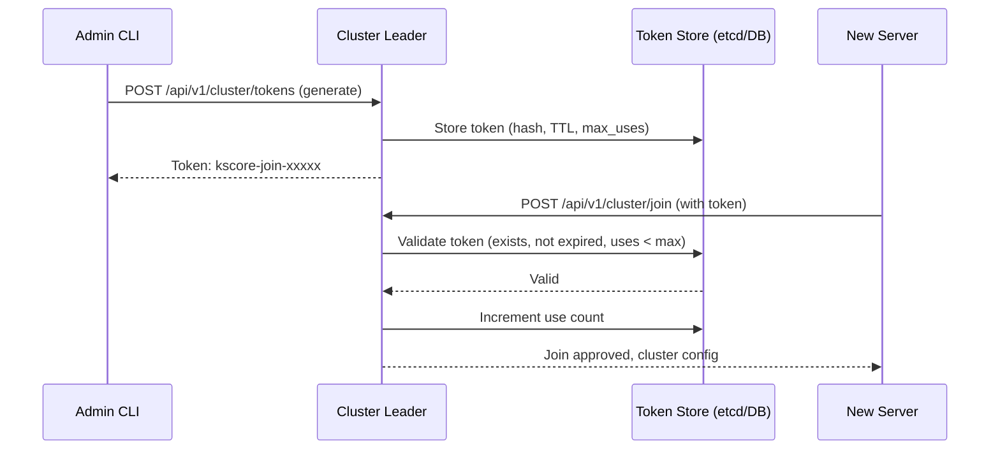

# Epic 44: Cluster Join Token Management

## Overview

Implement a secure join token system for cluster membership. When a new `kscore-server` instance wants to join an existing cluster, it must present a valid join token generated by the cluster leader. Tokens are stored durably in etcd (clustered) or SQLite/PostgreSQL (standalone), have configurable TTL, optional use limits, and are validated on the `cluster join` path.

**Goal**: Secure cluster expansion by requiring pre-authorized join tokens, preventing unauthorized servers from joining the cluster.

## Problem Statement

**Current State:**
- `kscorectl cluster join <address>` connects to a cluster with no authentication
- Runbooks reference `cluster token` commands that don't exist
- Any server that knows the cluster address can join without authorization
- No audit trail of who authorized new members

**Target State:**
- `kscorectl cluster token generate` creates time-limited, optionally use-limited tokens
- `kscorectl cluster join <address> --token <token>` validates the token before joining
- Tokens stored durably in etcd or database (not memory)
- Token lifecycle: generate, list, revoke, auto-expire
- Audit log entries for token creation, use, and revocation

## Success Criteria

- [ ] Token generation with configurable TTL and max-uses
- [ ] Durable token storage in etcd (cluster mode) or SQLite/PostgreSQL (standalone)
- [ ] Token validation on cluster join
- [ ] Token listing and revocation
- [ ] CLI commands: `cluster token generate`, `cluster token list`, `cluster token revoke`
- [ ] REST API endpoints for token management
- [ ] Audit logging for all token operations
- [ ] Tests with >70% coverage
- [ ] Documentation updated

## Architecture



## Technical Design

### Token Format

```
kscore-join-<base62-random-32-chars>
```

Tokens are generated with cryptographically secure random bytes, stored as SHA-256 hashes (never plaintext after generation).

### Token Store Interface

```go
type TokenStore interface {
    Create(ctx context.Context, token *JoinToken) error
    Get(ctx context.Context, tokenHash string) (*JoinToken, error)
    List(ctx context.Context) ([]*JoinToken, error)
    Delete(ctx context.Context, tokenHash string) error
    IncrementUses(ctx context.Context, tokenHash string) error
    DeleteExpired(ctx context.Context) (int, error)
}

type JoinToken struct {
    ID        string    `json:"id"`
    TokenHash string    `json:"token_hash"`
    Label     string    `json:"label,omitempty"`
    CreatedAt time.Time `json:"created_at"`
    ExpiresAt time.Time `json:"expires_at"`
    MaxUses   int       `json:"max_uses"`   // 0 = unlimited
    UsedCount int       `json:"used_count"`
    CreatedBy string    `json:"created_by"`
    Revoked   bool      `json:"revoked"`
}
```

### Storage Backends

- **etcd**: Keys under `/keystone-core/cluster/tokens/<id>`, JSON-encoded. Used when cluster coordination is via etcd.
- **SQLite/PostgreSQL**: `cluster_join_tokens` table. Used for standalone or database-backed deployments.

### API Endpoints

| Method | Path | Description |
|--------|------|-------------|
| POST | `/api/v1/cluster/tokens` | Generate a new join token |
| GET | `/api/v1/cluster/tokens` | List all tokens (hashes redacted) |
| DELETE | `/api/v1/cluster/tokens/{id}` | Revoke a token |
| POST | `/api/v1/cluster/join` | Join cluster (validates token) |

### CLI Commands

```bash
# Generate a token (default TTL: 24h, unlimited uses)
kscorectl cluster token generate

# Generate with options
kscorectl cluster token generate --ttl 1h --max-uses 1 --label "add-server-4"

# List tokens
kscorectl cluster token list

# Revoke a token
kscorectl cluster token revoke <token-id>

# Join using a token
kscorectl cluster join <address> --token kscore-join-xxxxx
```

## Dependencies

- **Epic 11** (Clustering) - etcd integration, cluster membership
- **Epic 1** (Core Infrastructure) - SQLite/PostgreSQL storage

## Implementation Tasks

### Phase 1: Token Store and Generation (Week 1-2)

- **T1.1**: Define `JoinToken` type and `TokenStore` interface in `internal/cluster/token/`
- **T1.2**: Implement etcd token store backend
- **T1.3**: Implement SQLite/PostgreSQL token store backend
- **T1.4**: Token generation with crypto/rand, SHA-256 hashing, TTL, max-uses
- **T1.5**: Expired token cleanup (periodic goroutine)
- **T1.6**: Unit tests for both store backends

### Phase 2: API and Validation (Week 3-4)

- **T2.1**: REST API handlers for token CRUD
- **T2.2**: Token validation middleware on cluster join path
- **T2.3**: Wire token validation into existing `cluster join` flow
- **T2.4**: Audit log integration for token operations
- **T2.5**: Wire API handlers into `kscore-server`
- **T2.6**: Integration tests

### Phase 3: CLI and Documentation (Week 5-6)

- **T3.1**: Add `cluster token generate/list/revoke` commands to `kscore-cluster`
- **T3.2**: Add `--token` flag to `cluster join`
- **T3.3**: Update cluster documentation
- **T3.4**: Update runbooks to use correct token commands
- **T3.5**: End-to-end test: generate token, join with token, verify membership

## Testing Strategy

- Unit tests for token generation, hashing, expiry, use counting
- Unit tests for both storage backends (etcd mock, SQLite in-memory)
- Integration test: full token lifecycle (create, use, expire, revoke)
- Negative tests: expired token, revoked token, max-uses exceeded, invalid token
- Race condition tests for concurrent use counting

## Risks and Mitigations

| Risk | Mitigation |
|------|------------|
| Token leaked in logs | Store only SHA-256 hash; display token only at generation time |
| Race condition on use count | Atomic increment in etcd (CAS) and database (UPDATE ... WHERE used_count < max_uses) |
| Clock skew on TTL | Use server-side time for all expiry checks |
| etcd unavailable | Fall back to database store if configured |

## Definition of Done

- [ ] Token CRUD with durable storage (etcd + SQLite/PostgreSQL)
- [ ] Token validation on cluster join
- [ ] CLI commands working end-to-end
- [ ] REST API endpoints wired into kscore-server
- [ ] Audit logging for all token operations
- [ ] >70% test coverage
- [ ] Documentation and runbooks updated
- [ ] No memory-only storage (all state persisted)
