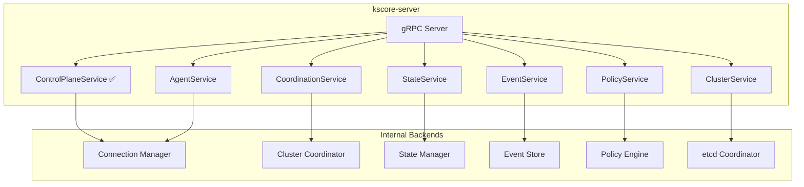

# Epic 46: gRPC Service Implementation

## Overview

Generate Go stubs and implement server handlers for the 4 gRPC services that are defined in proto files and documented in API reference but have no generated code or server implementations: StateService, EventService, PolicyService, and ClusterService. Also register the existing AgentService and CoordinationService stubs in `kscore-server`.

**Goal**: All 7 documented gRPC services are generated, implemented, and registered in the control plane server.

## Problem Statement

**Current State:**
- 7 gRPC services are documented in `docs/content/en/docs/reference/api.md` and defined in `api/proto/*.proto`
- Only 3 have generated Go stubs in `pkg/api/v1/`: AgentService, ControlPlaneService, CoordinationService
- Only 1 is registered in `kscore-server`: ControlPlaneService
- CoordinationService has a separate server in `internal/cluster/coordination_server.go` but is not wired in main
- AgentService has generated stubs but no server implementation and is not registered
- StateService, EventService, PolicyService, ClusterService have proto definitions but no generated code

**Target State:**
- All 7 proto files generate Go stubs via `make proto`
- Each service has a server implementation backed by existing internal packages
- All services are registered in `kscore-server`
- Tests cover each service's RPCs

## Success Criteria

- [x] Proto code generation works for all 7 services (`make proto`)
- [x] StateService server implementation (backed by `internal/state`)
- [x] EventService server implementation (backed by `internal/events`)
- [x] PolicyService server implementation (backed by `internal/policy`)
- [x] ClusterService server implementation (backed by `internal/cluster`)
- [x] AgentService registered in kscore-server
- [ ] CoordinationService registered in kscore-server (deferred — requires cluster mode infrastructure)
- [x] All services registered with auth interceptors
- [x] Tests with >70% coverage per service (76.3% overall)
- [x] API documentation updated with implementation status

## Dependencies

- **Epic 1** (Core Infrastructure) - NATS, agents, control plane
- **Epic 3** (State Management) - State store for StateService
- **Epic 4** (Event System) - Event store for EventService
- **Epic 6** (Policy Enforcement) - Policy engine for PolicyService
- **Epic 11** (Clustering) - etcd coordinator for ClusterService

## Architecture

## Service Status

| Service | Proto | Generated | Server Impl | Registered | RPCs |
|---------|-------|-----------|-------------|------------|------|
| ControlPlaneService | ✅ | ✅ | ✅ | ✅ | 9 |
| SecretsService | ✅ | ✅ | ✅ | ✅ | 12 |
| AgentService | ✅ | ✅ | ✅ | ✅ | 4 |
| CoordinationService | ✅ | ✅ | ✅ | ❌ (needs cluster mode) | 6 |
| StateService | ✅ | ✅ | ✅ | ✅ | 5 |
| EventService | ✅ | ✅ | ✅ | ✅ | 6 |
| PolicyService | ✅ | ✅ | ✅ | ✅ | 12 |
| ClusterService | ✅ | ✅ | ✅ | ✅ | 12 |

## Technical Tasks

### Phase 1: Proto Generation and Registration (Week 1-2)

**T1.1: Generate missing proto stubs**
- Run `make proto` to generate Go code for state, event, policy, cluster protos
- Verify all 7 `*_grpc.pb.go` and `*.pb.go` files exist in `pkg/api/v1/`
- Fix any proto compilation issues

**T1.2: Register existing services**
- Register AgentService in `cmd/kscore-server/main.go`
- Register CoordinationService in `cmd/kscore-server/main.go`
- Both should use existing server implementations

### Phase 2: StateService Implementation (Week 3-4)

**T2.1: Implement StateService server**
- Create `pkg/api/state/grpc_server.go`
- Implement 5 RPCs: ApplyState, CheckState, DetectDrift, GetStateHistory, GetStateStatus
- Backend: `internal/state.Store` and `internal/statemgmt.Executor`

**T2.2: Register and test StateService**
- Register in kscore-server
- Add unit tests for each RPC
- Add integration test with state store

### Phase 3: EventService Implementation (Week 5-6)

**T3.1: Implement EventService server**
- Create `pkg/api/events/grpc_server.go`
- Implement 6 RPCs: ListEvents, GetEvent, EmitEvent, SubscribeEvents, GetEventTypes, GetEventStats
- Backend: `internal/events.Store` and NATS JetStream

**T3.2: Register and test EventService**
- Register in kscore-server
- SubscribeEvents uses server-side streaming
- Add tests

### Phase 4: PolicyService Implementation (Week 7-8)

**T4.1: Implement PolicyService server**
- Create `pkg/api/policy/grpc_server.go`
- Implement 12 RPCs for policy CRUD, evaluation, violations, compliance, audit
- Backend: `internal/policy.Engine`

**T4.2: Register and test PolicyService**
- Register in kscore-server
- Add tests

### Phase 5: ClusterService Implementation (Week 9-10)

**T5.1: Implement ClusterService server**
- Create `pkg/api/cluster/grpc_server.go`
- Implement 12 RPCs for cluster management, backup/restore, membership/leadership watching
- Backend: `internal/cluster.Coordinator` (etcd-backed)
- WatchMembership and WatchLeadership use server-side streaming

**T5.2: Register and test ClusterService**
- Register in kscore-server
- Add tests

### Phase 6: Documentation and Integration (Week 11-12)

**T6.1: Update API documentation**
- Remove "Planned" status annotations from implemented services
- Add client usage examples for each service

**T6.2: Integration testing**
- End-to-end test with all services registered
- Auth interceptor coverage for all services

## Risks and Mitigations

| Risk | Impact | Mitigation |
|------|--------|------------|
| Proto toolchain not available in CI | Build failure | Add protoc + plugins to CI image or use buf |
| Backend dependencies not initialized | Runtime panics | Graceful nil checks; only register services with available backends |
| Proto message changes break existing clients | Compatibility | Follow proto3 additive-only changes; version protos |

## References

- Proto files: `api/proto/*.proto`
- Generated stubs: `pkg/api/v1/`
- Server registration: `cmd/kscore-server/main.go`
- API docs: `docs/content/en/docs/reference/api.md` lines 1671-1881
- Makefile proto target: `make proto`
