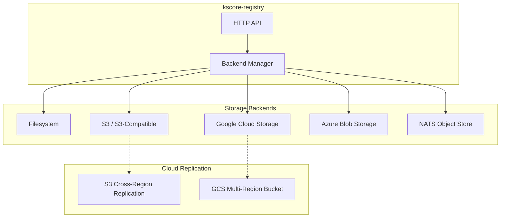

# Epic 47: Registry Storage Backends

## Overview

Add pluggable storage backend support to `kscore-registry`, enabling cloud object storage (S3, GCS, Azure Blob) alongside the existing local filesystem backend. This allows production registries to use scalable, replicated cloud storage instead of requiring shared network filesystems.

**Goal**: The module registry supports multiple storage backends with the same abstraction used by the file distribution system, enabling cloud-native deployment patterns.

## Problem Statement

**Current State:**
- `kscore-registry` stores all module data on a local filesystem directory (`DataDir`)
- All storage operations use direct `os.*` calls (ReadDir, Open, Create, MkdirAll, RemoveAll)
- No storage backend abstraction exists in the registry
- Documentation describes S3, GCS, and Azure Files backends that are not implemented
- Production deployments require shared network filesystems (NFS/EFS) for multi-replica setups

**Target State:**
- Registry uses a pluggable storage backend interface
- Supported backends: filesystem (existing), S3, GCS, Azure Blob Storage, NATS Object Store
- Reuse existing backend implementations from `internal/files/backend/` where possible
- Cloud-native deployment without shared filesystem dependencies
- Cross-region replication via native cloud storage features (S3 CRR, GCS multi-region)

## Success Criteria

- [ ] Storage backend interface defined for registry operations
- [ ] Filesystem backend (wrapping existing behavior)
- [ ] S3 backend implementation
- [ ] GCS backend implementation
- [ ] Azure Blob Storage backend implementation
- [ ] NATS Object Store backend (optional)
- [ ] CLI flags for backend configuration (`--storage-backend`, `--storage-*`)
- [ ] Backend health checks integrated into registry health endpoint
- [ ] Tests with >70% coverage per backend
- [ ] Documentation updated to reflect actual backend support
- [ ] Migration guide for filesystem → cloud storage

## Dependencies

- **Epic 22** (File Distribution) - Existing backend implementations in `internal/files/backend/`
- **Epic 1** (Core Infrastructure) - NATS for object store backend

## Architecture

## Existing Backend Infrastructure

The file distribution system (`internal/files/backend/`) already implements a complete backend abstraction:

| Backend | Package | Interface |
|---------|---------|-----------|
| Filesystem | `internal/files/backend/fs.go` | Get, Put, Delete, Exists, Stat, List |
| S3 | `internal/files/backend/s3.go` | Full S3 SDK integration |
| GCS | `internal/files/backend/gcs.go` | Full GCS SDK integration |
| Azure | `internal/files/backend/azure.go` | Full Azure Blob integration |
| NATS Object Store | `internal/files/backend/nats.go` | JetStream object store |
| Git | `internal/files/backend/git.go` | Git repository storage |

The registry backend interface can either reuse these directly or extract a shared interface.

## Technical Tasks

### Phase 1: Backend Interface and Filesystem Backend (Week 1-2)

**T1.1: Define registry storage interface**
- Create `internal/registry/storage/storage.go` with backend interface
- Operations: Get, Put, Delete, List, Exists, Stat, Health
- Module-aware paths: `{namespace}/{name}/{version}/`

**T1.2: Wrap existing filesystem operations**
- Create `internal/registry/storage/filesystem.go`
- Wrap current `os.*` calls from `cmd/kscore-registry/main.go`
- Refactor registry handlers to use backend interface instead of direct filesystem calls

**T1.3: Add CLI flags and configuration**
- `--storage-backend` (filesystem, s3, gcs, azure, nats)
- Backend-specific flags (`--s3-bucket`, `--s3-region`, `--gcs-bucket`, etc.)
- Environment variable support for credentials

### Phase 2: Cloud Storage Backends (Week 3-6)

**T2.1: S3 backend**
- Create `internal/registry/storage/s3.go`
- Reuse or adapt `internal/files/backend/s3.go` patterns
- Support S3-compatible stores (MinIO, etc.)

**T2.2: GCS backend**
- Create `internal/registry/storage/gcs.go`
- Reuse or adapt `internal/files/backend/gcs.go` patterns

**T2.3: Azure Blob Storage backend**
- Create `internal/registry/storage/azure.go`
- Reuse or adapt `internal/files/backend/azure.go` patterns

**T2.4: NATS Object Store backend (optional)**
- Create `internal/registry/storage/nats.go`
- Useful for environments already running NATS

### Phase 3: Testing, Migration, and Documentation (Week 7-8)

**T3.1: Backend tests**
- Unit tests for each backend
- Integration tests with localstack/emulators
- Health check tests

**T3.2: Migration tooling**
- `kscore-registry migrate-storage` command
- Copy modules from one backend to another
- Verify integrity after migration

**T3.3: Documentation updates**
- Update `docs/content/en/docs/operations/registry.md` to document actual backend support
- Remove aspirational references, replace with implementation docs
- Add deployment examples for each cloud provider
- Add migration guide

## Risks and Mitigations

| Risk | Impact | Mitigation |
|------|--------|------------|
| Backend interface mismatch with file distribution | Code duplication | Extract shared interface or reuse directly |
| Cloud SDK dependencies increase binary size | Larger binary | Build tags for optional backends |
| Credential management complexity | Security risk | Reuse existing credential patterns from file distribution |
| Migration data loss | Data integrity | Verify checksums, support dry-run mode |

## References

- Registry server: `cmd/kscore-registry/main.go`
- File distribution backends: `internal/files/backend/`
- Registry operations docs: `docs/content/en/docs/operations/registry.md`
- Module registry client: `pkg/module/registry/`
