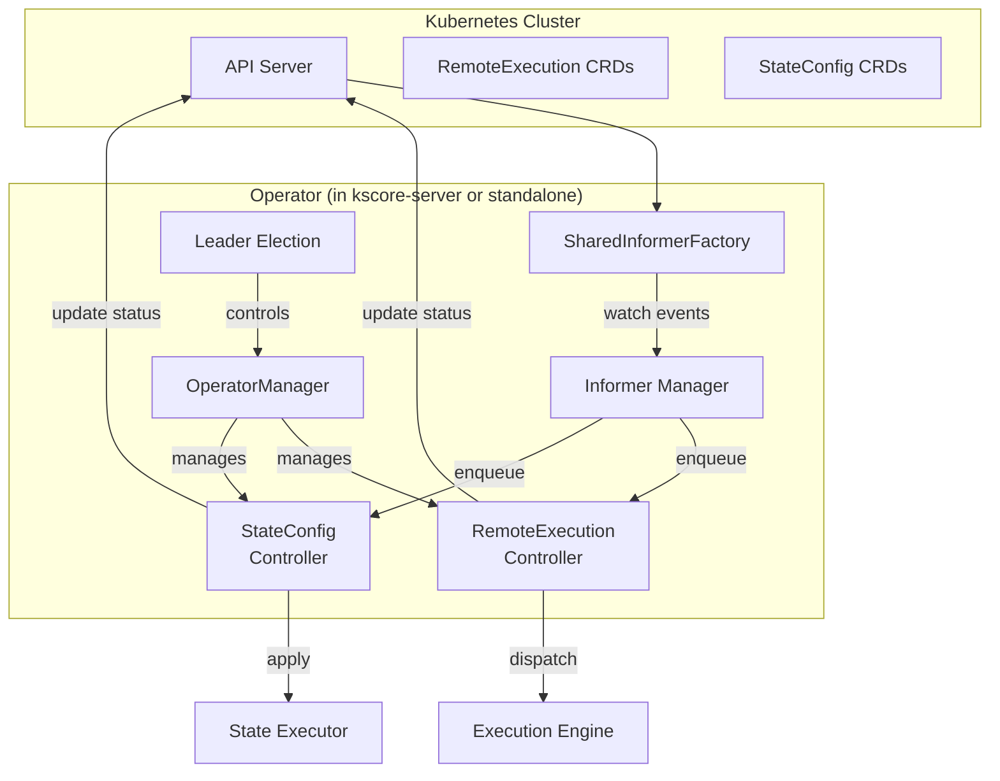

# Epic 48: Kubernetes Operator Implementation

## Overview

Implement full Kubernetes operator functionality for the RemoteExecution and StateConfig CRDs. The scaffolding exists in `internal/k8s/controller.go` (work queues, worker goroutines, `OperatorManager`) but the `reconcile()` methods are no-ops and there are no informers watching CRD resources.

**Goal**: Working Kubernetes operator that watches CRDs via informers, reconciles resources, updates status, detects drift, and can be deployed as part of `kscore-server` or as a standalone operator binary.

## Problem Statement

**Current State:**
- CRD Go types defined in `internal/k8s/crds.go` and `internal/k8s/types.go` with kubebuilder markers
- CRD YAML manifests defined as string constants in `crds.go` (not generated via controller-gen)
- `RemoteExecutionController` and `StateConfigController` have work queue scaffolding
- `reconcile()` methods return nil immediately (no-op)
- `periodicReconcile()` ticks but does nothing ("actual would use informers")
- `ExecuteRemoteExecution()` is directly callable and has real logic
- No informers, no shared informer factory, no cache
- No CRD status updates written back to the API server
- No leader election integration
- No deployment manifests (Helm charts, Kustomize bases)
- Documentation describes controllers as functional

**Target State:**
- Informer-based watching of RemoteExecution and StateConfig resources
- Real reconciliation: fetch CRD, execute/apply, update status
- Drift detection for StateConfig resources
- Leader election for HA deployments
- CRD manifests generated via controller-gen
- Deployment as embedded mode in `kscore-server` or standalone `kscore-operator`
- Helm chart and Kustomize manifests for installation
- Comprehensive tests

## Success Criteria

- [x] Informers watch RemoteExecution and StateConfig CRDs
- [x] RemoteExecutionController reconcile fetches CRD, dispatches execution, updates status
- [x] StateConfigController reconcile fetches CRD, applies state, updates status
- [x] Drift detection for StateConfig resources on configurable interval
- [x] Leader election for multi-replica deployments
- [ ] CRD manifests generated via controller-gen (not hand-written strings) — deferred; standalone YAML files at `deploy/kubernetes/crds/`
- [x] Operator runs embedded in kscore-server (standalone binary deferred)
- [x] Helm chart with CRD RBAC (ClusterRole for keystonecore.io resources, pods, pods/exec, leases)
- [ ] Kustomize base manifests — deferred to future release readiness epic
- [x] >70% test coverage for controller logic
- [x] Documentation updated to reflect implemented status

## Dependencies

- **Epic 1** (Core Infrastructure) - Control plane, NATS
- **Epic 2** (Remote Execution) - Execution engine for RemoteExecution reconciliation
- **Epic 3** (State Management) - State executor for StateConfig reconciliation
- **Epic 8** (Multi-Environment) - Kubernetes client wrapper
- **Epic 11** (Clustering) - Leader election patterns

## Architecture

## Technical Tasks

### Phase 1: Informers and Client Infrastructure (Week 1-2)

**T1.1: Add typed client and informer infrastructure**
- Add `runtime.Object` interface implementations to CRD types (DeepCopyObject)
- Create typed client for RemoteExecution and StateConfig resources using dynamic client or code-gen
- Set up `SharedInformerFactory` with event handlers that enqueue work items
- Replace `periodicReconcile()` ticker with informer-based event delivery

**T1.2: Generate CRD manifests with controller-gen**
- Add controller-gen to Makefile tooling
- Generate CRD YAML from kubebuilder markers on Go types
- Replace hand-written CRD string constants with generated manifests
- Add `make manifests` target

### Phase 2: RemoteExecution Reconciliation (Week 3-4)

**T2.1: Implement RemoteExecutionController.reconcile()**
- Fetch RemoteExecution resource from API server by key
- Check phase: skip if already Succeeded/Failed
- For pending resources: call `ExecuteRemoteExecution()` (already implemented)
- Write updated status back to API server via status subresource
- Handle schedule-based execution (cron)

**T2.2: Add retry and error handling**
- Use `workqueue.RateLimitingInterface` backoff for transient failures
- Set status to Failed after max retries
- Add event recording for execution lifecycle

### Phase 3: StateConfig Reconciliation (Week 5-6)

**T3.1: Implement StateConfigController.reconcile()**
- Fetch StateConfig resource from API server by key
- Parse state declarations from spec
- Apply states via `internal/statemgmt.Executor`
- Update status with per-pod results and phase

**T3.2: Implement drift detection**
- Periodic check of applied StateConfig resources
- Compare current state against declared state using `Check()`
- Set `DriftDetected` status field
- Emit events on drift detection
- Configurable detection interval from CRD spec

### Phase 4: Leader Election and OperatorManager (Week 7-8)

**T4.1: Integrate leader election**
- Use `client-go/tools/leaderelection` with configurable lease
- Only the leader runs controllers
- Graceful leader transition on shutdown
- Wire into existing `OperatorConfig.LeaderElection` fields

**T4.2: Enhanced OperatorManager**
- Health check endpoint (`/healthz`, `/readyz`)
- Metrics endpoint for controller queue depth, reconcile latency, errors
- Graceful shutdown with drain timeout
- Configurable concurrency per controller

### Phase 5: Deployment Artifacts (Week 9-10)

**T5.1: Operator binary or embedded mode**
- Option A: Embed operator in `kscore-server` with `--enable-operator` flag
- Option B: Standalone `kscore-operator` binary
- Decision: support both — embedded by default, standalone for dedicated operator deployments
- Add operator start/stop to kscore-server lifecycle

**T5.2: Helm chart**
- Chart for kscore-server with operator enabled
- CRD installation via `crds/` directory
- RBAC: ClusterRole, ClusterRoleBinding, ServiceAccount
- Configuration values for leader election, concurrency, reconcile interval
- Optional: separate chart for standalone operator

**T5.3: Kustomize base**
- Base manifests: Deployment, Service, ServiceAccount, RBAC
- CRD manifests in `deploy/kubernetes/crds/`
- Overlays for dev/staging/production

### Phase 6: Testing and Documentation (Week 11-12)

**T6.1: Unit tests**
- Test reconcile logic with mock Kubernetes client
- Test informer event handling
- Test status update logic
- Test drift detection
- Test leader election transitions
- Target: >70% coverage

**T6.2: Integration tests**
- Use envtest (controller-runtime test framework) for real API server
- End-to-end: create CRD → reconcile → check status
- Drift detection: apply → modify → detect → report

**T6.3: Documentation updates**
- Update `docs/content/en/docs/concepts/kubernetes.md` to remove "planned" callouts
- Add operator deployment guide
- Add CRD reference documentation
- Update architecture diagrams

## Risks and Mitigations

| Risk | Impact | Mitigation |
|------|--------|------------|
| controller-runtime dependency adds weight | Binary size, complexity | Use client-go directly without full controller-runtime if simpler |
| envtest requires etcd+apiserver binaries | CI complexity | Use setup-envtest tool in CI, skip in unit tests |
| CRD schema drift from Go types | Runtime errors | Generate CRDs from Go types via controller-gen, don't hand-write |
| Leader election flapping | Duplicate reconciles | Use configurable lease duration, test failover scenarios |
| State executor requires local agent | Can't run in-cluster easily | Support remote execution via NATS for in-cluster state application |

## Architectural Decisions

### controller-runtime vs raw client-go
- **Option A**: Use `sigs.k8s.io/controller-runtime` — batteries-included framework (manager, reconciler interface, envtest)
- **Option B**: Use raw `client-go` informers — lighter weight, more control, already partially used
- **Recommendation**: Start with raw client-go since scaffolding already uses it. Migrate to controller-runtime if complexity warrants it.

### Embedded vs Standalone
- Both modes supported via shared controller code
- Embedded: `kscore-server --enable-operator` (default for small deployments)
- Standalone: `kscore-operator` binary (for dedicated operator deployments or when kscore-server doesn't run in-cluster)

## References

- Controller scaffolding: `internal/k8s/controller.go`
- CRD types: `internal/k8s/crds.go`, `internal/k8s/types.go`
- Client wrapper: `internal/k8s/client.go`
- Concept docs: `docs/content/en/docs/concepts/kubernetes.md`
- State executor: `internal/statemgmt/executor.go`
- Execution engine: `internal/exec/`
