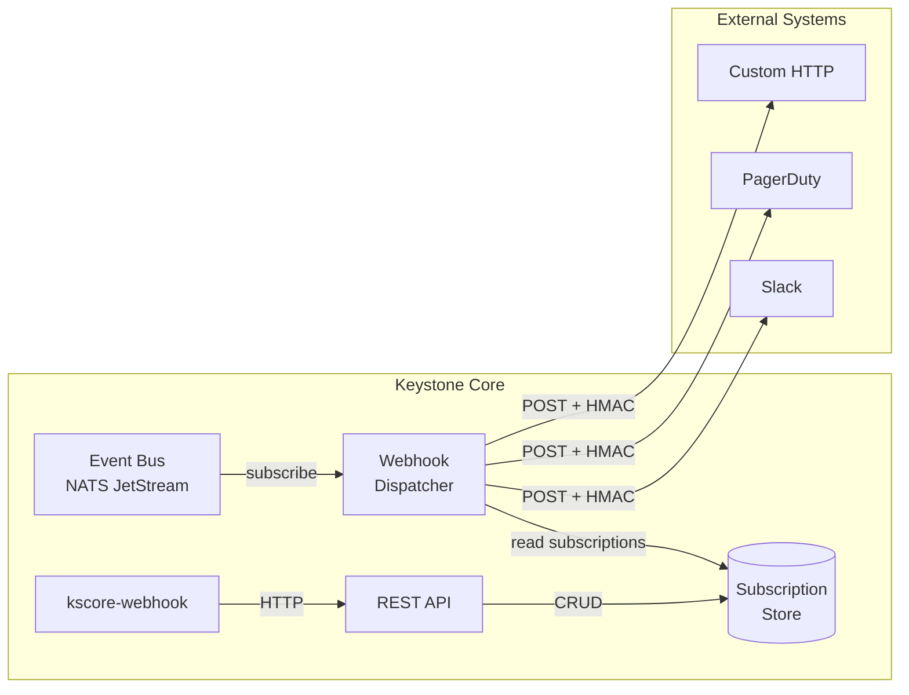
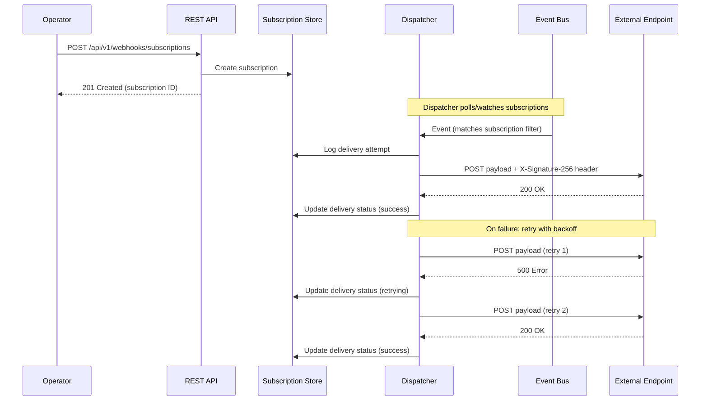

# Epic 50: Outbound Webhook Subscriptions

## Overview

Implement a persistent outbound webhook subscription system that delivers internal Keystone Core events to external HTTP endpoints. Currently only inbound webhooks (receiving from ArgoCD/GitHub/etc.) are supported. This epic adds the complementary outbound path: subscribing external systems to Keystone Core events with managed delivery, retry logic, and HMAC signing.

**Goal**: External systems can register webhook subscriptions via REST API or CLI, receive filtered Keystone Core events as signed HTTP POST payloads, and operators can monitor delivery status and history.

## Problem Statement

**Current State:**
- Inbound webhooks are fully implemented: `webhook.Receiver`, `HandlerRegistry`, typed parsers (ArgoCD, Flux, GitHub, GitLab), REST API, CLI
- Outbound webhooks exist only as ad-hoc reactor actions (`WebhookAction` in `internal/events/actions.go`) — one-off HTTP POSTs with no persistence, no management API, no retry tracking, no signing
- No way to create/manage outbound webhook subscriptions via API or CLI
- No delivery history or retry management
- No HMAC signing for outbound payloads
- No configuration section for outbound webhooks

**Target State:**
- Persistent webhook subscriptions stored in SQLite/PostgreSQL
- REST API for CRUD operations on subscriptions + delivery history
- Event dispatcher that subscribes to internal NATS events and fans out to webhook endpoints
- HMAC-SHA256 signing of outbound payloads (compatible with GitHub webhook signature format)
- Delivery tracking with configurable retry/backoff
- CLI commands for managing outbound subscriptions
- Configuration section for outbound webhook settings

## Success Criteria

- [ ] Subscription CRUD via REST API (create, list, get, update, delete)
- [ ] Persistent storage of subscriptions (SQLite and PostgreSQL)
- [ ] Event dispatcher subscribing to NATS and delivering to webhook URLs
- [ ] HMAC-SHA256 payload signing with per-subscription secrets
- [ ] Delivery history with status tracking (success, failed, retrying)
- [ ] Configurable retry with exponential backoff
- [ ] CLI commands: `webhook outbound list`, `create`, `show`, `delete`, `history`, `test`
- [ ] Configuration section for outbound webhook defaults
- [ ] Tests with >70% coverage
- [ ] Documentation updated

## Architecture





## Technical Design

### Data Models

```go
// Subscription represents an outbound webhook subscription.
type Subscription struct {
    ID          string    `json:"id"`
    Name        string    `json:"name"`
    URL         string    `json:"url"`
    Secret      string    `json:"secret,omitempty"`      // HMAC signing secret
    Events      []string  `json:"events"`                // Event type filters (e.g., "agent.*", "state.drift")
    Enabled     bool      `json:"enabled"`
    Headers     map[string]string `json:"headers,omitempty"` // Custom headers
    MaxRetries  int       `json:"max_retries"`           // Default: 3
    TimeoutSecs int       `json:"timeout_secs"`          // Default: 10
    CreatedAt   time.Time `json:"created_at"`
    UpdatedAt   time.Time `json:"updated_at"`
}

// DeliveryEvent records a single delivery attempt.
type DeliveryEvent struct {
    ID             string    `json:"id"`
    SubscriptionID string    `json:"subscription_id"`
    EventType      string    `json:"event_type"`
    EventID        string    `json:"event_id"`
    Status         string    `json:"status"`    // pending, success, failed, retrying
    StatusCode     int       `json:"status_code,omitempty"`
    Attempt        int       `json:"attempt"`
    Error          string    `json:"error,omitempty"`
    DeliveredAt    time.Time `json:"delivered_at"`
}
```

### Storage Interface

```go
type SubscriptionStore interface {
    Create(ctx context.Context, sub *Subscription) error
    Get(ctx context.Context, id string) (*Subscription, error)
    List(ctx context.Context) ([]*Subscription, error)
    Update(ctx context.Context, sub *Subscription) error
    Delete(ctx context.Context, id string) error
    ListEnabled(ctx context.Context) ([]*Subscription, error)

    RecordDelivery(ctx context.Context, event *DeliveryEvent) error
    ListDeliveries(ctx context.Context, subscriptionID string, limit int) ([]*DeliveryEvent, error)
}
```

### HMAC Signing

Outbound payloads are signed using HMAC-SHA256 with the subscription's secret, following the GitHub webhook signature convention:

```
X-Signature-256: sha256=<hex-encoded HMAC>
X-Webhook-ID: <delivery event ID>
X-Webhook-Timestamp: <unix timestamp>
Content-Type: application/json
```

### REST API Endpoints

```
GET    /api/v1/webhooks/subscriptions              - List subscriptions
POST   /api/v1/webhooks/subscriptions              - Create subscription
GET    /api/v1/webhooks/subscriptions/{id}         - Get subscription
PATCH  /api/v1/webhooks/subscriptions/{id}         - Update subscription
DELETE /api/v1/webhooks/subscriptions/{id}         - Delete subscription
POST   /api/v1/webhooks/subscriptions/{id}/test    - Send test event
GET    /api/v1/webhooks/subscriptions/{id}/deliveries - Delivery history
```

### Configuration

```yaml
webhook:
  outbound:
    enabled: true
    max_retries: 3              # Default retry count
    retry_backoff: "1s"         # Initial backoff (exponential)
    timeout: "10s"              # HTTP timeout per delivery
    max_payload_size: 1048576   # 1MB max payload
    delivery_retention: "7d"    # How long to keep delivery history
```

## Implementation Phases

### Phase 1: Core Subscription System (Week 1-2)

**Task 1.1: Data models and storage**
- Define `Subscription` and `DeliveryEvent` types in `internal/webhook/outbound/types.go`
- Implement `SubscriptionStore` interface
- SQLite storage backend with schema migration
- Files: `internal/webhook/outbound/types.go`, `internal/webhook/outbound/store.go`, `internal/webhook/outbound/store_sqlite.go`

**Task 1.2: HMAC signing**
- Sign function: `Sign(secret, payload []byte) string`
- Verify function for testing: `Verify(secret, payload []byte, signature string) bool`
- GitHub-compatible `sha256=<hex>` format
- Files: `internal/webhook/outbound/signing.go`

**Task 1.3: HTTP dispatcher**
- `Dispatcher` struct that delivers payloads to subscription URLs
- Configurable timeout, custom headers, HMAC signing
- Returns delivery result (status code, error)
- Files: `internal/webhook/outbound/dispatcher.go`

### Phase 2: Event Integration and Retry (Week 3-4)

**Task 2.1: Event subscriber**
- `Manager` that subscribes to NATS event bus
- Matches incoming events against subscription filters (glob patterns on event type)
- Fans out to dispatcher for each matching subscription
- Files: `internal/webhook/outbound/manager.go`

**Task 2.2: Retry logic**
- Exponential backoff with jitter using `pkg/wait`
- Configurable max retries per subscription
- Records each attempt in delivery history
- Dead-letter after max retries exhausted
- Files: `internal/webhook/outbound/retry.go`

**Task 2.3: Configuration**
- Add `OutboundWebhookConfig` to `internal/config/config.go`
- Wire into server startup
- Files: `internal/config/config.go`, `cmd/kscore-server/main.go`

### Phase 3: REST API and CLI (Week 5-6)

**Task 3.1: REST API handlers**
- CRUD endpoints for subscriptions
- Delivery history endpoint
- Test endpoint (sends a test event to verify connectivity)
- Files: `pkg/api/webhooks/outbound_handlers.go`

**Task 3.2: CLI commands**
- `kscore-webhook outbound list` — list subscriptions
- `kscore-webhook outbound create` — create subscription
- `kscore-webhook outbound show <id>` — show subscription details
- `kscore-webhook outbound delete <id>` — delete subscription
- `kscore-webhook outbound history <id>` — delivery history
- `kscore-webhook outbound test <id>` — send test event
- Files: `cmd/kscore-webhook/main.go`

### Phase 4: Testing and Documentation (Week 7-8)

**Task 4.1: Tests**
- Unit tests for storage, signing, dispatcher, manager, retry
- API handler tests
- CLI tests
- Integration test: event → subscription match → delivery → history

**Task 4.2: Documentation**
- User guide for outbound webhooks
- API reference for subscription endpoints
- Configuration reference
- CLI reference updates
- Files: `docs/content/en/docs/reference/cli.md`, `docs/content/en/docs/reference/cli-quick-reference.md`, `docs/content/en/docs/guides/outbound-webhooks.md`

## Dependencies

- **Epic 1** (Core Infrastructure) — NATS event bus
- **Epic 4** (Event System) — event types, publisher/subscriber interfaces
- **Epic 13** (CGO Removal) — pure Go SQLite for subscription storage

## Risks and Mitigations

| Risk | Mitigation |
|------|-----------|
| High-volume events overwhelming dispatcher | Rate limiting per subscription, configurable concurrency |
| Slow/unresponsive endpoints blocking dispatcher | Per-delivery timeouts, async delivery with goroutine pool |
| Secret leakage in API responses | Never return secret in GET responses, hash-only display |
| Subscription filter matching performance | Pre-compile glob patterns, cache compiled matchers |
| Database growth from delivery history | Configurable retention with automatic pruning |

## Testing Strategy

- **Unit tests**: Storage CRUD, signing, dispatcher HTTP, filter matching, retry logic
- **Integration tests**: End-to-end event → delivery flow with httptest server
- **CLI tests**: Command flags, output formatting, error handling
- **Performance tests**: Throughput benchmark for fan-out to N subscriptions

## Definition of Done

- [ ] Subscription CRUD REST API functional
- [ ] Event dispatcher delivering to webhook URLs
- [ ] HMAC-SHA256 signing on all outbound payloads
- [ ] Retry with exponential backoff
- [ ] Delivery history tracked and queryable
- [ ] CLI commands working
- [ ] Configuration section documented
- [ ] >70% test coverage
- [ ] All existing tests still passing
