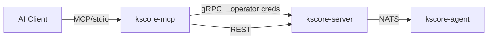

# Epic 60: MCP Server for AI-Assisted Operations

**Status**: COMPLETE

## Overview

`kscore-mcp` is a Model Context Protocol (MCP) server binary that exposes Keystone Core operations to AI clients (Claude Desktop, Claude Code, Cursor). It acts as a thin translation layer between MCP JSON-RPC (over stdio) and the existing gRPC/REST APIs.

## Architecture



### Key Design Decisions

1. **Credential pass-through** — MCP server uses the operator's own API key/JWT/mTLS certs. No service accounts.
2. **Server-side RBAC is authoritative** — client-side profiles are defense-in-depth, not authorization.
3. **MCP metadata via gRPC headers** — no proto changes needed. Headers are whitelisted and captured into `Principal.Metadata` for audit attribution.
4. **Single gRPC connection** per MCP server instance — stdio is single-user, no pooling needed.
5. **Stdio transport only** — HTTP transport for multi-user deferred to future phase.
6. **Official MCP Go SDK** — `github.com/modelcontextprotocol/go-sdk` v1.3.0.

## Implementation

### Files Created

```
cmd/kscore-mcp/main.go                    -- Cobra CLI, config loading, MCP server startup

internal/mcp/
  config.go                  -- MCPConfig struct, YAML loading, validation
  config_test.go
  server.go                  -- MCP server construction, tool/resource registration
  server_test.go
  grpcclient.go              -- gRPC client wrapper with credential pass-through + metadata injection
  grpcclient_test.go
  profile.go                 -- Capability profiles (read_only, ops_safe, ops_admin)
  profile_test.go
  metadata.go                -- gRPC metadata constants and injection helper
  metadata_test.go
  tools/
    tools.go                 -- RegisterAll combining all tool registrars
    tools_test.go
    mock_test.go             -- Shared mock infrastructure for tool tests
    agents.go                -- agent_list, agent_show, agent_health
    agents_test.go
    exec.go                  -- exec_run, exec_status, exec_history
    exec_test.go
    cluster.go               -- cluster_status
    cluster_test.go
    state.go                 -- state_check, state_drift, state_history, state_apply
    state_test.go
    events.go                -- event_query, event_stats
    events_test.go
    runbooks.go              -- runbook_list, runbook_execute, runbook_status (REST)
    runbooks_test.go
  resources/
    resources.go             -- keystone://agents, keystone://events/recent, keystone://cluster/status
    resources_test.go
```

### Files Modified

- `pkg/api/auth/interceptors.go` — `captureMCPMetadata()` captures whitelisted MCP headers into `Principal.Metadata`
- `pkg/api/auth/interceptors_test.go` — tests for `captureMCPMetadata`
- `cmd/kscore-server/main.go` — audit callback logs MCP metadata fields when present
- `Makefile` — added `kscore-mcp` to BINARIES
- `go.mod` / `go.sum` — added `github.com/modelcontextprotocol/go-sdk v1.3.0`

### Tools (16 total)

| Tool | Backend | Profile |
|------|---------|---------|
| `agent_list` | ControlPlaneService.ListAgents | read_only+ |
| `agent_show` | ControlPlaneService.GetAgent | read_only+ |
| `agent_health` | ControlPlaneService.GetServerStatus | read_only+ |
| `exec_run` | ControlPlaneService.BatchExecuteCommand (streaming) | ops_safe+ |
| `exec_status` | ControlPlaneService.GetBatchJobStatus | read_only+ |
| `exec_history` | ControlPlaneService.ListCommands | read_only+ |
| `state_check` | StateService.CheckState | read_only+ |
| `state_drift` | StateService.DetectDrift | read_only+ |
| `state_history` | StateService.GetStateHistory | read_only+ |
| `state_apply` | StateService.ApplyState (streaming) | ops_admin |
| `event_query` | EventService.ListEvents | read_only+ |
| `event_stats` | EventService.GetEventStats | read_only+ |
| `runbook_list` | REST /api/v1/runbooks | read_only+ |
| `runbook_execute` | REST /api/v1/runbooks/{id}/execute | ops_safe+ |
| `runbook_status` | REST /api/v1/runbooks/{id}/executions/{eid} | read_only+ |
| `cluster_status` | ControlPlaneService.GetServerStatus | read_only+ |

### Resources (3)

| URI | Description |
|-----|-------------|
| `keystone://agents` | Current agent inventory |
| `keystone://cluster/status` | Cluster health overview |
| `keystone://events/recent` | Last 50 events |

### Capability Profiles

| Profile | Tools | Use Case |
|---------|-------|----------|
| `read_only` | 13 read-only tools | Monitoring, investigation |
| `ops_safe` | + exec_run, runbook_execute | Day-to-day operations |
| `ops_admin` | + state_apply | Full access |

### Audit Attribution

MCP metadata headers injected on every gRPC call:
- `x-kscore-client-type: mcp`
- `x-kscore-mcp-tool: <tool_name>`
- `x-kscore-mcp-session: <uuid>`
- `x-kscore-mcp-ai-client: <client_id>`

Audit log output: `principal=alice role=operator client_type=mcp mcp_tool=exec_run mcp_session=abc123`

## Tests

116 tests across all MCP packages:
- `internal/mcp/` — 18 tests (config, server, gRPC client, metadata, profiles)
- `internal/mcp/tools/` — 42 tests (all 16 tools with success, error, missing fields, defaults, streaming)
- `internal/mcp/resources/` — 4 tests (all 3 resources)
- `pkg/api/auth/` — 5 tests for `captureMCPMetadata`

Tool tests use MCP SDK `InMemoryTransport` for end-to-end invocation through the protocol layer.

## Future Work

- HTTP+SSE transport for multi-user deployments
- Blueprint tools (list, apply, status)
- Event subscription streaming
- Policy engine gating (CEL/OPA) for tool invocations
- Approval workflows for high-risk operations
- Command allowlist/denylist enforcement
