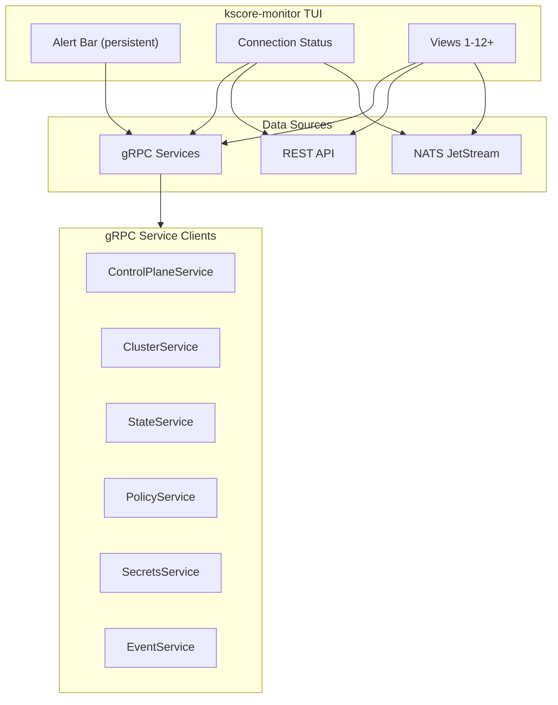

# Epic 61: Monitor TUI Enhancements

**Status**: COMPLETE

## Overview

The `kscore-monitor` TUI has 8 views but several are stubs (State Drift, Policy Violations return no data), major subsystems have zero visibility (cluster, secrets, schedules, runbooks, webhooks), and the tool is entirely read-only with no drill-down or action capabilities. This epic wires existing stubs, adds views for critical operational subsystems, and implements the interaction patterns specified in Epic 7.

**Goal**: Make `kscore-monitor` a single-pane-of-glass for operating Keystone Core — an operator should be able to detect, investigate, and respond to operational issues without leaving the TUI.

## Success Criteria

- [x] State Drift and Policy Violations views wired to real gRPC data
- [x] Dashboard rates computed from live data (not hardcoded to 0)
- [x] Cluster Health view showing members, leader, quorum, shard distribution
- [x] Secrets & Leases view showing rotation status and expiring leases
- [x] Schedules & Maintenance view showing active windows and job status
- [x] Runbook view showing executions and pending approvals
- [x] Persistent alert bar visible from all views
- [x] Connection health indicator for gRPC/NATS
- [x] Drill-down detail views (agent detail, job output, event correlation)
- [x] Vim-style navigation (Tab/Shift+Tab cycling) and updated help overlay
- [x] Additional gRPC service clients wired (Cluster, State, Policy, Secrets, Event)
- [x] Webhook delivery status view
- [x] Per-view refresh rates

## Architecture

## Phases

### Phase 1: Wire Existing Stubs and Fix Dashboard

Wire the State Drift, Policy Violations views, and dashboard stats to real data. These are the lowest-hanging fruit — the views exist, the APIs exist, only the plumbing is missing.

**User Stories:**

#### US61.1: Wire State Drift View
**As an** operator
**I want** the State Drift view to show real drift detection results
**So that** I can see which resources have drifted from their declared state

**Changes:**
- Add `StateServiceClient` to monitor client (`client/client.go`)
- Implement `StateDriftModel.Fetch()` to call `StateService.GetStateStatus` and `StateService.GetStateHistory`
- Render drift results in a table: Resource, Agent, Status (in-sync/drifted), Last Checked, Severity
- Color-code severity (green=in-sync, yellow=minor, red=critical)
- Show drift detail on Enter (expected vs actual values)

#### US61.2: Wire Policy Violations View
**As an** operator
**I want** the Policy Violations view to show real violations and compliance scores
**So that** I can track compliance across the fleet

**Changes:**
- Add `PolicyServiceClient` to monitor client
- Implement `PolicyViolationsModel.Fetch()` to call `PolicyService.ListViolations` and compliance report
- Render violations in a table: Policy, Resource, Severity, Status, Detected At
- Show real compliance score in header
- Color-code by severity (critical=red, high=orange, medium=yellow, low=blue)

#### US61.3: Fix Dashboard Hardcoded Rates
**As an** operator
**I want** the dashboard to show real event and API request rates
**So that** I have accurate throughput visibility

**Changes:**
- Compute event rate client-side by counting events received from the NATS subscription over a sliding window (e.g., last 60 seconds)
- Add a rate tracker to the event subscriber that maintains a per-second rolling counter
- Feed computed rates into the dashboard `SystemStats` struct
- Remove the `// requires metrics aggregation` comment and hardcoded zeros

**Tests:**
- Unit tests for rate tracker with simulated event bursts
- Table-driven tests for State/Policy client methods (success, error, empty results)
- View model tests for state drift and policy violation rendering

---

### Phase 2: Cluster Health View

Add a dedicated view for cluster operations. For an HA system with leader election and sharding, this is the most critical missing view.

**User Stories:**

#### US61.4: Cluster Health View
**As an** operator
**I want** a cluster health view showing members, leader, quorum, and shard distribution
**So that** I can detect cluster issues before they cause outages

**Changes:**
- Add `ClusterServiceClient` to monitor client
- Create `ClusterModel` in `ui/view_cluster.go`
- Display:
  - Cluster status summary: health (healthy/degraded/critical), member count, quorum status
  - Leader: current leader ID, election term, last election timestamp
  - Members table: ID, Address, Role, Status (healthy/unhealthy/suspect), Last Heartbeat
  - Shard distribution: Shard ID, Owner, Key Range, Status
  - Recent cluster events (leader changes, member joins/leaves, rebalances)
- Color-code member health (green/yellow/red)
- Show quorum warning when member count is at minimum

#### US61.5: Cluster View in Dashboard Summary
**As an** operator
**I want** cluster health summarized on the dashboard
**So that** I can see cluster issues at a glance

**Changes:**
- Add a "Cluster" info box to the dashboard alongside existing System/Agents/Jobs/State/Policy boxes
- Show: Health status, member count, leader ID, quorum status
- Color the box border based on cluster health

**Tests:**
- ClusterModel tests with mock ClusterServiceClient
- Test rendering for various cluster states (healthy, degraded, no quorum, leader failover in progress)

---

### Phase 3: Alert Bar and Connection Health

Add persistent operational indicators visible from every view.

**User Stories:**

#### US61.6: Persistent Alert Bar
**As an** operator
**I want** a persistent status bar showing critical counts across all views
**So that** I never miss important issues while focused on a single view

**Changes:**
- Add an `AlertBar` component rendered at the top of every view (below the view tabs)
- Aggregate counts from all data sources:
  - Offline agents count (red if >0)
  - Failed jobs count (red if >0)
  - Active drift count (yellow if >0)
  - Policy violations count (by severity)
  - Pending approvals count (orange if >0)
  - Expiring leases count (yellow if >0)
- Compact format: `▲2 agents offline | ▲1 failed jobs | ▲3 drift | ▲0 violations | ▲1 pending approval`
- Clicking/selecting a count navigates to the relevant view
- Hide when all counts are zero (or show a green "All clear")

#### US61.7: Connection Health Indicator
**As an** operator
**I want** to see the connection status of gRPC, NATS, and REST
**So that** I know when the monitor is operating with incomplete data

**Changes:**
- Add connection status to the header/footer bar: `gRPC:● NATS:● REST:●`
- Green dot = connected, red dot = disconnected, yellow dot = reconnecting
- Track gRPC connection state changes
- Track NATS connection/reconnection events (already has handlers in subscriber)
- Track REST endpoint reachability (already falls back on failure)
- When a connection is down, show a warning in affected views: "⚠ Data may be stale — gRPC disconnected"

**Tests:**
- AlertBar aggregation tests with various count combinations
- Connection health state machine tests (connected → disconnected → reconnecting → connected)

---

### Phase 4: Secrets, Schedules, and Runbook Views

Add views for the three most operationally critical subsystems that currently have no TUI visibility.

**User Stories:**

#### US61.8: Secrets & Leases View
**As an** operator
**I want** to see secret rotation status and expiring leases
**So that** I can prevent credential-related outages

**Changes:**
- Create `SecretsModel` in `ui/view_secrets.go`
- Add `SecretsServiceClient` to monitor client (or use REST endpoints from secrets API)
- Display:
  - Rotation status summary: Active rotations, pending, failed, overdue
  - Expiring leases table: Secret Path, Backend, Expires In, Lease ID — sorted by expiry (soonest first)
  - Backend health: Backend Name, Type, Status (healthy/degraded/unreachable)
  - Recent rotation events: Secret, Backend, Status, Timestamp
- Color-code: red for failed rotations and leases expiring within 1 hour, yellow for expiring within 24 hours

#### US61.9: Schedules & Maintenance View
**As an** operator
**I want** to see active schedules and maintenance windows
**So that** I know what's running, what's upcoming, and whether maintenance mode is blocking operations

**Changes:**
- Create `ScheduleModel` in `ui/view_schedules.go`
- Use Schedule REST API client
- Display:
  - Active maintenance windows: Name, Start, End, Remaining, Scope
  - Maintenance mode indicator (prominent if global maintenance is active)
  - Schedule table: Name, Cron Expression, Status (active/paused), Last Run, Next Run, Last Status
  - Upcoming executions (next 10 scheduled runs across all schedules)
  - Window conflicts (if any detected)

#### US61.10: Runbook Executions View
**As an** operator
**I want** to see running runbook executions and pending approvals
**So that** I can approve or intervene when automation is blocked

**Changes:**
- Create `RunbookModel` in `ui/view_runbooks.go`
- Use Runbook REST API client
- Display:
  - Pending approvals (prominent, at top): Runbook, Requested By, Requested At, Waiting Duration
  - Running executions: Runbook, Step, Progress, Started At, Duration
  - Recent completions: Runbook, Status (success/failed/cancelled), Duration, Completed At
  - Execution success rate (last 24h)

**Tests:**
- View model tests for each new view with mock data
- REST client tests using httptest
- Edge case tests: no data, connection failure, partial data

---

### Phase 5: Drill-Down and Interaction

Add the ability to drill into details and take basic actions from the TUI.

**User Stories:**

#### US61.11: Agent Detail Drill-Down
**As an** operator
**I want** to press Enter on an agent to see its details
**So that** I can investigate agent-specific issues without switching tools

**Changes:**
- Add detail pane to `AgentsModel` triggered by Enter key
- Detail view shows:
  - Full agent metadata (OS, arch, version, IP addresses, tags, capabilities)
  - Recent commands executed on this agent (last 20)
  - State run history for this agent
  - Agent-specific events
- Esc returns to agent list

#### US61.12: Job Output Viewer
**As an** operator
**I want** to press Enter on a job to see its output
**So that** I can diagnose failures without running separate CLI commands

**Changes:**
- Add detail pane to `JobsModel` triggered by Enter key
- Fetch command output via `GetCommandStatus` (already available in client)
- Display: stdout, stderr, exit code, timing, target agent
- For batch jobs: show per-agent results in a sub-table
- Scrollable output with viewport

#### US61.13: Event Correlation View
**As an** operator
**I want** to view correlated events grouped by correlation ID
**So that** I can trace the full sequence of an operational workflow

**Changes:**
- Add `Enter` on an event to filter by its correlation ID
- Show all events with the same correlation ID in chronological order
- Display correlation chain: event count, time span, involved sources
- Esc returns to full event stream

**Tests:**
- Drill-down navigation tests (enter detail, esc back)
- Job output rendering tests with various output sizes
- Correlation grouping tests

---

### Phase 6: Navigation and UX Polish

Implement the interaction patterns from the Epic 7 specification that are not yet in the code.

**User Stories:**

#### US61.14: Vim-Style Navigation
**As an** operator
**I want** vim keybindings for efficient navigation
**So that** I can operate the TUI without reaching for arrow keys

**Changes:**
- Add `j`/`k` for up/down in all table and list views
- Add `gg` (double-g) for jump to top, `G` for jump to bottom
- Add `Ctrl+d`/`Ctrl+u` for page down/up
- Add `Tab`/`Shift+Tab` for cycling between views

#### US61.15: Help Overlay
**As an** operator
**I want** to press `?` for a help overlay showing all keybindings
**So that** I can discover available actions

**Changes:**
- Create help overlay model rendered on top of current view
- Show all keybindings grouped by category (navigation, view switching, actions, filtering)
- Show view-specific keys when in a specific view
- Dismiss with `?` or `Esc`

#### US61.16: Per-View Refresh Rates
**As an** operator
**I want** different views to refresh at appropriate intervals
**So that** real-time views update fast while expensive queries don't overload the server

**Changes:**
- Read per-view refresh intervals from config (already defined in Epic 7 spec):
  - Dashboard: 2s, Agents: 5s, Events: realtime, State: 10s, Policy: 10s, Jobs: 3s, Logs: realtime, Metrics: 5s
  - New views: Cluster: 5s, Secrets: 10s, Schedules: 10s, Runbooks: 5s
- Replace the single global tick with per-view tick commands
- Only tick the active view (don't poll inactive views)

#### US61.17: Webhook Delivery Status View
**As an** operator
**I want** to see outbound webhook delivery status
**So that** I can detect when downstream integrations are failing

**Changes:**
- Create `WebhookModel` in `ui/view_webhooks.go`
- Use outbound webhook REST API
- Display:
  - Subscription table: Name, URL, Event Types, Status (active/paused), Success Rate
  - Failed deliveries: Subscription, Event, Failure Reason, Retry Count, Next Retry
  - Delivery stats: Total sent, success rate, avg latency

**Tests:**
- Vim navigation tests (key sequences produce correct cursor movement)
- Help overlay render tests
- Per-view tick isolation tests

---

## View Numbering (Updated)

After this epic, the monitor will have up to 13 views:

| Key | View | Status |
|-----|------|--------|
| 1 | Dashboard | Existing (enhanced with cluster box, real rates) |
| 2 | Agents | Existing (enhanced with drill-down) |
| 3 | Events | Existing (enhanced with correlation) |
| 4 | State Drift | Existing stub → wired |
| 5 | Policy Violations | Existing stub → wired |
| 6 | Jobs | Existing (enhanced with output viewer) |
| 7 | Logs | Existing (no changes) |
| 8 | Metrics | Existing (no changes) |
| 9 | Cluster | New |
| 10 | Secrets & Leases | New |
| 11 | Schedules & Maintenance | New |
| 12 | Runbooks | New |
| 13 | Webhooks | New |

With 13 views, number keys 1-9 plus letter shortcuts (0, s, m, r, w) or a view-picker menu will be needed.

## Client Expansion

The monitor client currently only uses `ControlPlaneServiceClient`. This epic adds:

| Service | Client Package | Views Using It |
|---------|---------------|----------------|
| `ClusterService` | `pkg/api/v1` | Cluster, Dashboard |
| `StateService` | `pkg/api/v1` | State Drift, Dashboard |
| `PolicyService` | `pkg/api/v1` | Policy Violations, Dashboard |
| `SecretsService` | `pkg/api/v1` | Secrets & Leases |
| `EventService` | `pkg/api/v1` | Events (for stats/correlation) |
| Schedule REST | `internal/schedule/` handlers | Schedules & Maintenance |
| Runbook REST | `internal/runbook/` handlers | Runbooks |
| Webhook REST | `internal/webhook/outbound/` handlers | Webhooks |

## Dependencies

- gRPC proto definitions already exist for all services (`pkg/api/v1/*.proto`)
- REST endpoints already exist for schedules, runbooks, and webhooks
- NATS event subscription already implemented in `events/subscriber.go`
- Bubble Tea, lipgloss, bubbles already in `go.mod`

## Risks

- **View count scaling**: 13 views requires rethinking the number-key navigation. A view picker or category grouping may be needed.
- **Connection overhead**: Adding 5+ gRPC service clients increases connection count. Consider multiplexing over a single `grpc.ClientConn`.
- **Alert bar polling**: Aggregating counts across all subsystems on every tick could be expensive. Use cached counts with staggered refresh.
- **TLS**: Client currently uses `insecure.NewCredentials()`. Real deployments need TLS support for all new service clients.
