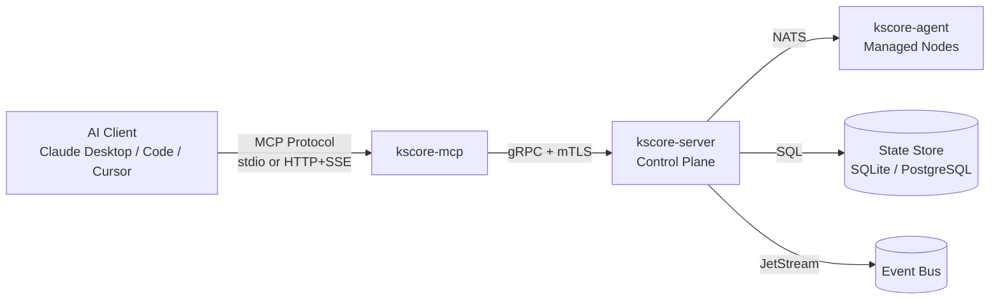
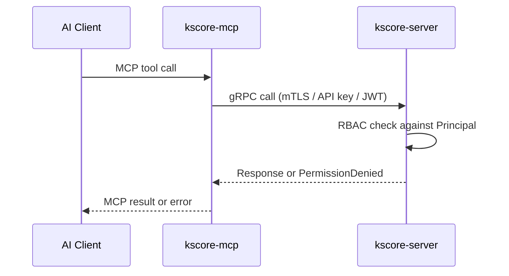

# Epic: MCP Server for AI-Assisted Operations

## Overview & Success Criteria

Add an MCP (Model Context Protocol) server as a new plugin binary (`kscore-mcp`) that exposes Keystone Core operations to AI clients such as Claude Desktop, Claude Code, Cursor, and other MCP-compatible tools. This enables operators to manage infrastructure conversationally through their preferred AI assistant.

The MCP server acts as a thin translation layer between the MCP JSON-RPC protocol and Keystone Core's existing gRPC/REST APIs. It authenticates to the control plane the same way other CLI plugins do and inherits the operator's RBAC permissions.

**Success Criteria**

- Operators can connect any MCP-compatible AI client to a running Keystone Core deployment.
- All core operations are exposed: agent management, remote execution, state management, event querying, runbook execution, and blueprint deployment.
- Authentication inherits existing RBAC — the AI can only do what the operator is authorized to do.
- Streaming operations (batch execution, state apply) provide real-time progress to the AI client.
- Read-only resources provide context without requiring tool invocations.
- Comprehensive tests with coverage targets met.
- Documentation covers setup, configuration, and usage examples.

## User Stories

1. **Conversational agent management**
   - As an operator, I can ask my AI assistant "show me all agents that haven't checked in for 10 minutes" and get a formatted response.
   - **Acceptance:** `agent_list` tool supports filtering by status, tags, OS, and last-seen threshold.

2. **AI-assisted remote execution**
   - As an operator, I can say "run `df -h` on all Linux web servers" and the AI executes it through the MCP server.
   - **Acceptance:** `exec_run` tool supports target expressions and returns structured output per agent.

3. **Conversational state management**
   - As an operator, I can ask "what's drifted on the production database nodes?" and get a clear drift report.
   - **Acceptance:** `state_check` and `state_drift` tools return structured change summaries.

4. **Guided runbook execution**
   - As an operator, I can say "execute the deploy-rollback runbook for api-gateway" and the AI walks me through approval steps.
   - **Acceptance:** `runbook_execute` tool handles approval workflows interactively.

5. **Event investigation**
   - As an operator, I can ask "show me the last 20 error events from the reactor system" to investigate incidents.
   - **Acceptance:** `event_query` tool supports filtering by type, severity, source, time range, and tags.

6. **Secure by default**
   - As a security engineer, I can ensure the MCP server only exposes operations the authenticated operator is permitted to perform.
   - **Acceptance:** All tool calls pass through existing RBAC. Unauthorized operations return clear permission errors.

## Architecture

### Component Overview



### Binary: `kscore-mcp`

A new `cmd/kscore-mcp/` binary following the existing `kscore-*` plugin pattern. It:

1. Connects to `kscore-server` via gRPC using the same auth as other CLI plugins
2. Speaks MCP protocol (JSON-RPC over stdio or HTTP+SSE) to AI clients
3. Translates MCP tool calls into gRPC service calls
4. Translates gRPC streaming responses into MCP progress notifications
5. Exposes read-only MCP resources for contextual data

### Authentication Flow



The MCP server inherits credentials from its configuration (TLS certs, API key, or JWT). The operator configures these once when setting up the MCP server, and all AI interactions are bounded by that principal's permissions.

### Transport Modes

| Mode | Use Case | Configuration |
|------|----------|---------------|
| **stdio** | Claude Desktop, Claude Code, Cursor | Default. Binary launched as subprocess. |
| **HTTP+SSE** | Remote AI clients, shared team server | `--transport http --port 8090`. Requires additional auth layer. |

## MCP Tools (Actions)

### Agent Management

| Tool | gRPC Call | Description |
|------|-----------|-------------|
| `agent_list` | `ControlPlaneService.ListAgents` | List agents with filtering (tags, status, OS, role, last-seen) |
| `agent_show` | `ControlPlaneService.GetAgent` | Get detailed info for a specific agent |
| `agent_health` | `ControlPlaneService.GetServerStatus` | Cluster-wide agent health summary |

### Remote Execution

| Tool | gRPC Call | Description |
|------|-----------|-------------|
| `exec_run` | `ControlPlaneService.BatchExecuteCommand` | Execute command on targeted agents. Returns structured output per agent. |
| `exec_status` | `ControlPlaneService.GetBatchJobStatus` | Check status of a running batch job |
| `exec_history` | `ControlPlaneService.ListCommands` | Recent command execution history |

### State Management

| Tool | gRPC Call | Description |
|------|-----------|-------------|
| `state_apply` | `StateService.ApplyState` | Apply state declarations to targets |
| `state_check` | `StateService.CheckState` | Dry-run: show what would change |
| `state_drift` | `StateService.DetectDrift` | Detect configuration drift from desired state |
| `state_history` | `StateService.GetStateHistory` | State apply history with pagination |

### Events

| Tool | gRPC Call | Description |
|------|-----------|-------------|
| `event_query` | `EventService.ListEvents` | Query events with filters (type, severity, source, time range, tags) |
| `event_subscribe` | `EventService.SubscribeEvents` | Subscribe to real-time event stream (streaming) |
| `event_stats` | `EventService.GetEventStats` | Event statistics and counts |

### Runbooks

| Tool | gRPC Call | Description |
|------|-----------|-------------|
| `runbook_list` | REST `/api/v1/runbooks` | List available runbooks |
| `runbook_execute` | REST `/api/v1/runbooks/{id}/execute` | Trigger a runbook execution |
| `runbook_status` | REST `/api/v1/runbooks/{id}/executions/{eid}` | Check execution status |
| `runbook_approve` | REST `/api/v1/approvals/{id}/respond` | Approve/reject a pending approval |

### Blueprints

| Tool | gRPC Call | Description |
|------|-----------|-------------|
| `blueprint_list` | REST `/api/v1/blueprints` | List available blueprints |
| `blueprint_apply` | REST `/api/v1/blueprints/{id}/apply` | Deploy a blueprint to targets |
| `blueprint_status` | REST `/api/v1/blueprints/{id}/status` | Check blueprint deployment status |

### Cluster

| Tool | gRPC Call | Description |
|------|-----------|-------------|
| `cluster_status` | `ControlPlaneService.GetServerStatus` | Cluster health, node count, uptime |

## MCP Resources (Read-Only Context)

Resources provide data that AI clients can read for context without invoking tools.

| Resource URI | Description |
|-------------|-------------|
| `keystone://agents` | Current agent inventory (ID, status, OS, tags, last-seen) |
| `keystone://agents/{id}` | Detailed agent info |
| `keystone://events/recent` | Last 50 events |
| `keystone://state/drift` | Current drift summary across all targets |
| `keystone://runbooks` | Available runbook definitions |
| `keystone://blueprints` | Available blueprint catalog |
| `keystone://cluster/status` | Cluster health overview |

## Configuration

### MCP Server Config File

```yaml
# ~/.config/kscore/mcp.yaml
server:
  address: "localhost:9443"
  transport: stdio  # or "http"
  http_port: 8090   # only if transport=http

auth:
  method: mtls      # mtls, apikey, or jwt
  tls_ca_cert: /etc/kscore/ca.pem
  tls_cert: /etc/kscore/operator.pem
  tls_key: /etc/kscore/operator-key.pem
  # api_key: "..."  # if method=apikey

features:
  exec_enabled: true      # allow remote execution
  state_write: true       # allow state apply (not just check)
  runbook_approve: true   # allow approval responses
  max_target_count: 100   # safety limit on batch operations
```

### Claude Desktop Integration

```json
{
  "mcpServers": {
    "keystone": {
      "command": "kscore-mcp",
      "args": ["--config", "/etc/kscore/mcp.yaml"]
    }
  }
}
```

### Claude Code Integration

```json
{
  "mcpServers": {
    "keystone": {
      "command": "kscore-mcp",
      "args": ["--config", "/etc/kscore/mcp.yaml"]
    }
  }
}
```

## Technical Tasks

### Week 1-2: Core MCP Framework

- Create `cmd/kscore-mcp/` binary with CLI flags (config, transport, server address, auth).
- Implement MCP protocol handler (JSON-RPC over stdio).
- Implement gRPC client connection with TLS/auth configuration.
- Add configuration file loading and validation.
- Implement tool registration framework with input/output schema generation.
- Add first tool: `agent_list` as proof of concept end-to-end.

### Week 3-4: Agent and Execution Tools

- Implement `agent_show`, `agent_health` tools.
- Implement `exec_run` with target expression support and streaming output.
- Implement `exec_status` and `exec_history` tools.
- Add safety guardrails: confirmation prompts for destructive operations, target count limits.
- Add structured error handling (permission denied, not found, timeout).

### Week 5-6: State and Event Tools

- Implement `state_apply`, `state_check`, `state_drift`, `state_history` tools.
- Implement `event_query`, `event_subscribe`, `event_stats` tools.
- Add streaming support for long-running operations (state apply progress, event subscriptions).
- Implement MCP resources for read-only context.

### Week 7-8: Runbooks, Blueprints, and Cluster Tools

- Implement `runbook_list`, `runbook_execute`, `runbook_status`, `runbook_approve` tools.
- Implement `blueprint_list`, `blueprint_apply`, `blueprint_status` tools.
- Implement `cluster_status` tool.
- Add HTTP+SSE transport mode for remote/shared deployments.

### Week 9-10: Polish, Security, and Documentation

- Security audit: verify RBAC enforcement on all tool paths.
- Add rate limiting for AI-initiated operations.
- Add audit logging for all MCP tool invocations.
- Write user documentation: setup guide, configuration reference, usage examples.
- Write operator guide: security considerations, RBAC configuration for AI access.
- Update AGENTS.md, CLI reference docs, and architecture diagrams.

## Dependencies

- **MCP Go SDK**: Go library for implementing MCP servers (JSON-RPC, tool/resource registration)
- **Existing gRPC client stubs**: `pkg/api/v1/` proto-generated code
- **Existing auth package**: `pkg/api/auth/` for TLS/JWT/API key handling
- **Existing REST handlers**: `pkg/api/` for runbook/blueprint operations

## Risks & Mitigations

- **Unbounded AI operations**: An AI could issue expensive batch commands to thousands of agents.
  - Mitigation: Configurable `max_target_count` limit, confirmation prompts for large operations, rate limiting.

- **Credential exposure**: MCP server holds control plane credentials.
  - Mitigation: Use least-privilege RBAC principal. Support read-only mode. Credentials stored with filesystem permissions.

- **Prompt injection via agent output**: Command output from agents could contain text that manipulates the AI.
  - Mitigation: Mark all agent output as untrusted in tool responses. Document this risk for operators.

- **Streaming complexity**: gRPC streaming (batch exec, state apply, event subscribe) must map cleanly to MCP protocol.
  - Mitigation: Use MCP progress notifications for streaming. Fall back to polling if streaming is unsupported by client.

- **MCP protocol evolution**: MCP is relatively new and may change.
  - Mitigation: Depend on a stable MCP SDK version. Abstract protocol details behind internal interfaces.

## Testing Strategy

- **Unit tests**
  - Tool input validation and parameter parsing.
  - gRPC response to MCP result translation.
  - Configuration loading and validation.
  - Auth credential handling.
  - Resource URI parsing and data formatting.

- **Integration tests**
  - Mock gRPC server with canned responses.
  - End-to-end tool invocations through the MCP protocol layer.
  - Streaming operation handling (progress, cancellation).
  - Error propagation (permission denied, not found, timeout).

- **Security tests**
  - RBAC enforcement: verify tools respect principal permissions.
  - Invalid/expired credentials handling.
  - Rate limit enforcement.

## Definition of Done

- `kscore-mcp` binary builds and runs as stdio MCP server.
- All core tools implemented: agent, exec, state, event, runbook, blueprint, cluster.
- MCP resources provide read-only context for AI clients.
- HTTP+SSE transport available for remote deployments.
- RBAC enforced on all operations.
- Safety guardrails configured (target limits, rate limits, confirmation prompts).
- Audit logging covers all MCP tool invocations.
- Documentation covers setup, configuration, security, and usage examples.
- Test coverage meets package targets (>70% for core, >40% for CLI).
- Works with Claude Desktop, Claude Code, and Cursor.
