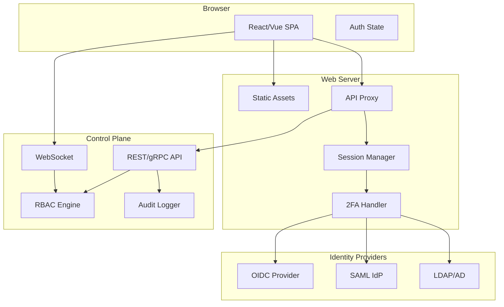
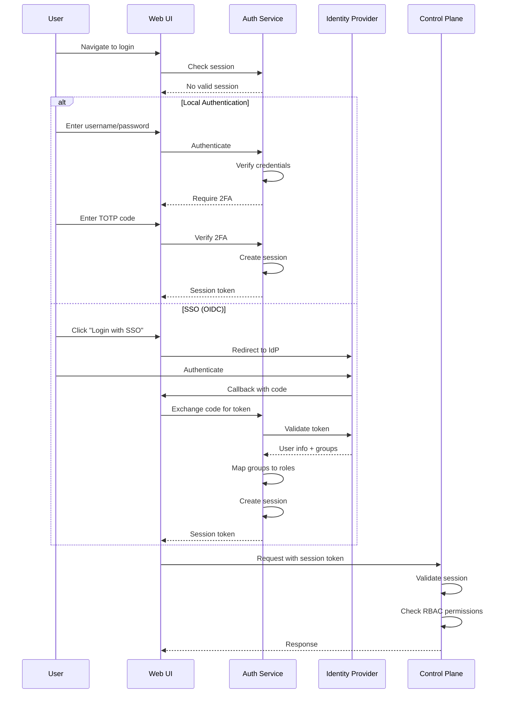
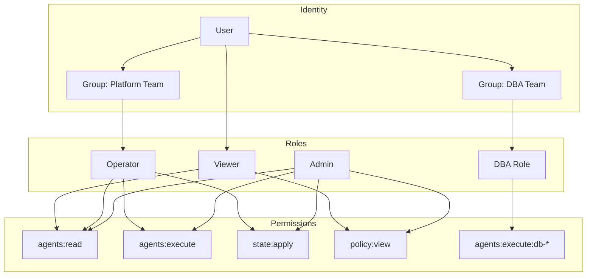

# Future Epic: Web UI & Management Console

> **Status**: Future (Not Yet Scheduled)
> **Priority**: Medium-High
> **Estimated Effort**: 28-32 weeks
> **Prerequisites**: Epics 1-31 complete, Epic 37 (Runbooks) recommended

## Overview

**Goal**: Provide a modern, secure web-based management console for Keystone Core with enterprise-grade authentication, authorization, and user management.

**Key Principle**: The Web UI should be optional - all functionality remains available via CLI and API. The UI provides accessibility for operators who prefer graphical interfaces and enables approval workflows that benefit from visual interaction.

**Current State**:
- Backend APIs are 80% ready (REST, gRPC, WebSocket)
- TUI monitor exists (`kscore-monitor`) with 8 views
- Visualization infrastructure in `pkg/visualization/`
- RBAC system in `pkg/policy/rbac.go`
- Auth methods: API Key, JWT, mTLS in `pkg/api/auth/`

**Target State**: A production-ready web console with:
- Full operational visibility and control
- Enterprise authentication (SSO, 2FA/MFA)
- Fine-grained permissions with groups
- Audit trail for all UI actions
- Responsive design for desktop and tablet

## Success Criteria

### Core Functionality
- [ ] Dashboard with fleet health, metrics, and alerts
- [ ] Agent management (list, detail, search, filter)
- [ ] Remote execution with targeting and results
- [ ] State management with drift visualization
- [ ] Blueprint browsing and deployment
- [ ] Event stream with real-time updates
- [ ] Job/schedule management
- [ ] Runbook execution with approval workflows
- [ ] Policy and compliance dashboards
- [ ] Topology visualization (tree and graph views)

### Enterprise Authentication
- [ ] Local username/password with secure storage
- [ ] Two-factor authentication (TOTP, WebAuthn/FIDO2)
- [ ] SSO via SAML 2.0
- [ ] SSO via OIDC/OAuth 2.0
- [ ] LDAP/Active Directory integration
- [ ] Session management with configurable timeouts
- [ ] "Remember this device" with device trust
- [ ] Forced re-authentication for sensitive operations

### Authorization & User Management
- [ ] Role-based access control (RBAC) integration
- [ ] User management (create, update, disable, delete)
- [ ] Group/team management
- [ ] Role assignment (user and group level)
- [ ] Permission inheritance (group → user)
- [ ] Custom role creation
- [ ] Resource-level permissions (specific agents, states)
- [ ] API key management per user

### Audit & Compliance
- [ ] Comprehensive UI action audit logging
- [ ] Session audit trail
- [ ] Login history with IP and device info
- [ ] Failed login tracking and alerting
- [ ] Audit log export
- [ ] Compliance reports from UI

### Operational
- [ ] Responsive design (desktop, tablet)
- [ ] Dark/light theme support
- [ ] Customizable dashboard widgets
- [ ] Notification preferences
- [ ] Keyboard shortcuts
- [ ] Accessibility (WCAG 2.1 AA)

## Architecture

### High-Level Architecture



### Authentication Flow



### Permission Model



## UI Components

### 1. Dashboard

**Purpose**: At-a-glance fleet health and recent activity

**Widgets**:
- Agent status summary (healthy/degraded/offline)
- Active jobs and recent completions
- Drift detection alerts
- Policy compliance score
- Event activity chart (24h)
- System metrics (API latency, event rate)
- Quick actions (run command, apply state)

**Permissions**: `dashboard:view`

### 2. Agents

**Purpose**: Manage and monitor all agents

**Views**:
- List view with sorting, filtering, pagination
- Detail view with facts, history, applied states
- Bulk selection for operations

**Actions**:
| Action | Permission |
|--------|------------|
| View agents | `agents:read` |
| View agent detail | `agents:read` |
| Run command | `agents:execute` |
| Apply state | `state:apply` |
| Delete agent | `agents:delete` |

### 3. Remote Execution

**Purpose**: Run commands across fleet

**Features**:
- Target selector (glob, tags, roles)
- Command input with history
- Batch configuration
- Real-time result streaming
- Result export

**Actions**:
| Action | Permission |
|--------|------------|
| Execute command | `execution:create` |
| View results | `execution:read` |
| Cancel execution | `execution:cancel` |

### 4. State Management

**Purpose**: Manage declarative states

**Features**:
- State list with drift indicators
- State detail with YAML viewer
- Drift diff visualization
- Apply/remediate actions
- History per state and agent

**Actions**:
| Action | Permission |
|--------|------------|
| View states | `state:read` |
| Apply state | `state:apply` |
| Create state | `state:create` |
| Delete state | `state:delete` |

### 5. Blueprints

**Purpose**: Browse and deploy blueprints

**Features**:
- Blueprint catalog with search
- Blueprint detail with parameters
- Deploy wizard
- Deployment history

**Actions**:
| Action | Permission |
|--------|------------|
| View blueprints | `blueprints:read` |
| Deploy blueprint | `blueprints:deploy` |
| Create blueprint | `blueprints:create` |

### 6. Events

**Purpose**: Real-time event stream

**Features**:
- Live streaming with pause
- Filtering by type, severity, source
- Event detail modal
- Export capability

**Permissions**: `events:read`

### 7. Jobs & Schedules

**Purpose**: Manage scheduled operations

**Features**:
- Active jobs with progress
- Schedule management
- Job history
- Maintenance windows

**Actions**:
| Action | Permission |
|--------|------------|
| View jobs | `jobs:read` |
| Create schedule | `schedules:create` |
| Cancel job | `jobs:cancel` |
| Manage maintenance | `maintenance:manage` |

### 8. Runbooks

**Purpose**: Execute and monitor runbooks

**Features**:
- Runbook library with search
- Execution wizard with inputs
- Real-time step progress
- Approval interface
- Execution history

**Actions**:
| Action | Permission |
|--------|------------|
| View runbooks | `runbooks:read` |
| Execute runbook | `runbooks:execute` |
| Approve step | `runbooks:approve` |
| Cancel execution | `runbooks:cancel` |

### 9. Policy & Compliance

**Purpose**: View compliance status

**Features**:
- Compliance score dashboard
- Framework breakdown (CIS, SOC2, etc.)
- Violation list with details
- Remediation suggestions
- Report generation

**Actions**:
| Action | Permission |
|--------|------------|
| View compliance | `compliance:read` |
| Export reports | `compliance:export` |
| Manage policies | `policies:manage` |

### 10. Topology

**Purpose**: Visualize infrastructure

**Features**:
- Tree view (datacenter → env → role)
- Graph view with relationships
- Status overlay
- Drill-down navigation
- Bulk selection

**Permissions**: `topology:view`

### 11. Settings & Administration

**Purpose**: System configuration and user management

**Sections**:

**User Management** (`users:manage`):
- User list with status
- Create/edit user
- Password reset
- 2FA enrollment/reset
- API key management

**Group Management** (`groups:manage`):
- Group list
- Create/edit group
- Member management
- Role assignment

**Role Management** (`roles:manage`):
- Role list with permissions
- Create custom role
- Permission assignment

**System Settings** (`system:configure`):
- Authentication providers
- Session settings
- Audit configuration
- Notification settings

**Audit Logs** (`audit:view`):
- Action history
- Login history
- Export capability

## Enterprise Authentication

### Two-Factor Authentication (2FA)

**Supported Methods**:
| Method | Description | Security Level |
|--------|-------------|----------------|
| TOTP | Time-based codes (Google Auth, Authy) | Good |
| WebAuthn | Hardware keys (YubiKey, etc.) | Excellent |
| SMS | Text message codes (fallback only) | Basic |
| Email | Email codes (fallback only) | Basic |

**Configuration**:
```yaml
auth:
  two_factor:
    enabled: true
    required: true  # Enforce for all users
    methods:
      - totp
      - webauthn
    grace_period: 7d  # Time to enroll after account creation
    remember_device: true
    remember_duration: 30d
```

**Enrollment Flow**:
1. User logs in with password
2. System prompts for 2FA enrollment
3. User scans QR code or registers security key
4. User enters verification code
5. Backup codes generated and displayed
6. 2FA enabled on account

### SSO - OIDC Integration

**Supported Providers**:
- Okta
- Azure AD / Entra ID
- Google Workspace
- Auth0
- Keycloak
- Any OIDC-compliant provider

**Configuration**:
```yaml
auth:
  oidc:
    enabled: true
    providers:
      - name: okta
        display_name: "Login with Okta"
        issuer: https://example.okta.com
        client_id: ${OIDC_CLIENT_ID}
        client_secret: ${OIDC_CLIENT_SECRET}
        scopes:
          - openid
          - profile
          - email
          - groups
        # Map OIDC claims to Keystone
        claims_mapping:
          username: preferred_username
          email: email
          groups: groups
        # Map OIDC groups to Keystone roles
        group_mapping:
          "Platform Admins": admin
          "Platform Operators": operator
          "Everyone": viewer
```

### SSO - SAML 2.0 Integration

**Configuration**:
```yaml
auth:
  saml:
    enabled: true
    providers:
      - name: corporate
        display_name: "Corporate SSO"
        idp_metadata_url: https://idp.example.com/metadata
        sp_entity_id: keystone-core
        sp_acs_url: https://keystone.example.com/auth/saml/callback
        # Attribute mapping
        attributes:
          username: uid
          email: mail
          groups: memberOf
        # Group to role mapping
        group_mapping:
          "CN=Keystone Admins,OU=Groups,DC=example,DC=com": admin
          "CN=Keystone Operators,OU=Groups,DC=example,DC=com": operator
```

### LDAP/Active Directory

**Configuration**:
```yaml
auth:
  ldap:
    enabled: true
    servers:
      - url: ldaps://ldap.example.com:636
        bind_dn: cn=keystone,ou=service,dc=example,dc=com
        bind_password: ${LDAP_BIND_PASSWORD}
    user_search:
      base_dn: ou=users,dc=example,dc=com
      filter: "(sAMAccountName={username})"
      attributes:
        username: sAMAccountName
        email: mail
        display_name: displayName
    group_search:
      base_dn: ou=groups,dc=example,dc=com
      filter: "(member={user_dn})"
      attribute: cn
    group_mapping:
      "Keystone-Admins": admin
      "Keystone-Operators": operator
      "Domain Users": viewer
```

### Session Management

**Features**:
- Configurable session timeout (idle and absolute)
- Concurrent session limits
- Session listing and revocation
- Device tracking
- Geographic anomaly detection

**Configuration**:
```yaml
auth:
  sessions:
    idle_timeout: 30m
    absolute_timeout: 8h
    max_concurrent: 3
    extend_on_activity: true
    cookie:
      name: kscore_session
      secure: true
      http_only: true
      same_site: strict
    # Force re-auth for sensitive operations
    reauthenticate_for:
      - users:delete
      - roles:manage
      - system:configure
```

## User & Group Management

### User Model

```yaml
user:
  id: uuid
  username: string (unique)
  email: string (unique)
  display_name: string
  status: active | disabled | locked | pending_2fa

  # Authentication
  password_hash: string (bcrypt)
  password_changed_at: timestamp
  two_factor:
    enabled: boolean
    methods: [totp, webauthn]
    backup_codes_remaining: int

  # Authorization
  roles: [role_id]
  groups: [group_id]

  # Metadata
  created_at: timestamp
  created_by: user_id
  updated_at: timestamp
  last_login: timestamp
  failed_login_count: int
  locked_until: timestamp
```

### Group Model

```yaml
group:
  id: uuid
  name: string (unique)
  description: string

  # Members
  members: [user_id]

  # Authorization
  roles: [role_id]

  # Sync (for LDAP/OIDC groups)
  external_id: string
  sync_source: ldap | oidc | saml
  auto_sync: boolean

  # Metadata
  created_at: timestamp
  created_by: user_id
```

### Role Model

```yaml
role:
  id: uuid
  name: string (unique)
  description: string

  # Permissions
  permissions:
    - resource: agents
      actions: [read, execute]
      constraints:
        tags: ["env:production"]
    - resource: state
      actions: [read, apply]
    - resource: "*"
      actions: [read]  # Wildcard

  # Inheritance
  inherits: [role_id]

  # Built-in flag
  system: boolean

  # Metadata
  created_at: timestamp
  created_by: user_id
```

### Built-in Roles

| Role | Description | Key Permissions |
|------|-------------|-----------------|
| `admin` | Full system access | `*:*` |
| `operator` | Day-to-day operations | `agents:*`, `state:*`, `execution:*`, `runbooks:*` |
| `viewer` | Read-only access | `*:read` |
| `auditor` | Compliance and audit | `audit:*`, `compliance:*`, `events:read` |
| `runbook-approver` | Approve runbook steps | `runbooks:read`, `runbooks:approve` |

## Audit Logging

### Audit Events

All UI actions generate audit events:

```json
{
  "id": "evt_abc123",
  "timestamp": "2024-01-15T10:30:00Z",
  "action": "agent.command.execute",
  "actor": {
    "user_id": "usr_xyz",
    "username": "jsmith",
    "ip_address": "10.0.0.50",
    "user_agent": "Mozilla/5.0...",
    "session_id": "sess_123"
  },
  "resource": {
    "type": "agent",
    "id": "web-01",
    "name": "web-01.example.com"
  },
  "details": {
    "command": "systemctl status nginx",
    "target_count": 14,
    "batch_id": "batch_456"
  },
  "result": "success",
  "metadata": {
    "source": "web_ui",
    "request_id": "req_789"
  }
}
```

### Audited Actions

| Category | Actions |
|----------|---------|
| Authentication | login, logout, login_failed, 2fa_enrolled, password_changed |
| Users | user_created, user_updated, user_disabled, user_deleted |
| Groups | group_created, group_updated, member_added, member_removed |
| Roles | role_created, role_updated, role_assigned, role_revoked |
| Agents | command_executed, state_applied, agent_deleted |
| Runbooks | runbook_started, step_approved, step_rejected, runbook_cancelled |
| System | settings_changed, provider_configured |

## Technical Implementation

### Technology Stack

**Frontend**:
| Component | Technology | Rationale |
|-----------|------------|-----------|
| Framework | React 18+ or Vue 3+ | Modern, well-supported |
| State | Redux/Zustand or Pinia | Predictable state management |
| Styling | Tailwind CSS | Utility-first, customizable |
| Charts | Recharts or Chart.js | Lightweight, flexible |
| Topology | Cytoscape.js or D3.js | Graph visualization |
| WebSocket | Native + reconnection | Real-time updates |
| Build | Vite | Fast builds |

**Backend Additions**:
| Component | Technology | Purpose |
|-----------|------------|---------|
| Session store | Redis or PostgreSQL | Session management |
| Static server | Embedded in Go binary | Serve SPA |
| OIDC library | go-oidc | SSO integration |
| SAML library | saml2 | SAML integration |
| TOTP library | pquerna/otp | 2FA |
| WebAuthn | go-webauthn | Hardware keys |

### API Additions

New endpoints for UI:

```
# Authentication
POST   /api/v1/auth/login
POST   /api/v1/auth/logout
POST   /api/v1/auth/refresh
POST   /api/v1/auth/2fa/verify
POST   /api/v1/auth/2fa/enroll
GET    /api/v1/auth/oidc/{provider}/login
POST   /api/v1/auth/oidc/{provider}/callback
GET    /api/v1/auth/saml/{provider}/login
POST   /api/v1/auth/saml/{provider}/callback

# Users
GET    /api/v1/users
POST   /api/v1/users
GET    /api/v1/users/{id}
PUT    /api/v1/users/{id}
DELETE /api/v1/users/{id}
POST   /api/v1/users/{id}/reset-password
POST   /api/v1/users/{id}/reset-2fa
GET    /api/v1/users/{id}/sessions
DELETE /api/v1/users/{id}/sessions/{session_id}

# Groups
GET    /api/v1/groups
POST   /api/v1/groups
GET    /api/v1/groups/{id}
PUT    /api/v1/groups/{id}
DELETE /api/v1/groups/{id}
POST   /api/v1/groups/{id}/members
DELETE /api/v1/groups/{id}/members/{user_id}

# Roles
GET    /api/v1/roles
POST   /api/v1/roles
GET    /api/v1/roles/{id}
PUT    /api/v1/roles/{id}
DELETE /api/v1/roles/{id}

# Sessions (current user)
GET    /api/v1/me
GET    /api/v1/me/sessions
DELETE /api/v1/me/sessions/{session_id}
PUT    /api/v1/me/password
GET    /api/v1/me/api-keys
POST   /api/v1/me/api-keys
DELETE /api/v1/me/api-keys/{id}

# Audit
GET    /api/v1/audit/events
GET    /api/v1/audit/logins
```

### Deployment Options

**Option 1: Embedded (Recommended)**
```yaml
# Single binary with embedded UI
server:
  web_ui:
    enabled: true
    path: /ui
    # Static assets embedded in binary
```

**Option 2: Separate**
```yaml
# UI served separately (CDN, nginx)
server:
  web_ui:
    enabled: false
  cors:
    allowed_origins:
      - https://ui.keystone.example.com
```

## Configuration

### Full Web UI Configuration

```yaml
# /etc/kscore/server.yaml
server:
  web_ui:
    enabled: true
    path: /ui

    # Branding
    branding:
      title: "Keystone Core"
      logo_url: /assets/logo.png
      favicon_url: /assets/favicon.ico
      support_url: https://support.example.com

    # Features
    features:
      topology_view: true
      runbook_approvals: true
      compliance_reports: true

  auth:
    # Session configuration
    sessions:
      store: redis  # redis, postgres, memory
      redis_url: redis://localhost:6379/0
      idle_timeout: 30m
      absolute_timeout: 8h
      max_concurrent: 3
      cookie:
        secure: true
        same_site: strict

    # Password policy
    password_policy:
      min_length: 12
      require_uppercase: true
      require_lowercase: true
      require_numbers: true
      require_special: true
      max_age: 90d
      history_count: 5

    # Account lockout
    lockout:
      enabled: true
      threshold: 5
      duration: 15m
      reset_after: 1h

    # Two-factor authentication
    two_factor:
      enabled: true
      required: false  # Set true to enforce
      methods:
        - totp
        - webauthn
      issuer: "Keystone Core"
      grace_period: 7d
      remember_device: true
      remember_duration: 30d

    # OIDC providers
    oidc:
      providers:
        - name: okta
          display_name: "Login with Okta"
          issuer: https://example.okta.com
          client_id: ${OIDC_CLIENT_ID}
          client_secret: ${OIDC_CLIENT_SECRET}
          scopes: [openid, profile, email, groups]
          group_claim: groups
          group_mapping:
            "Keystone Admins": admin
            "Keystone Operators": operator

    # SAML providers
    saml:
      providers:
        - name: corporate
          display_name: "Corporate SSO"
          idp_metadata_url: https://idp.example.com/metadata
          group_mapping:
            "CN=Admins,DC=example,DC=com": admin

    # LDAP
    ldap:
      enabled: true
      servers:
        - url: ldaps://ldap.example.com:636
          bind_dn: cn=keystone,ou=service,dc=example,dc=com
          bind_password: ${LDAP_BIND_PASSWORD}
      user_base_dn: ou=users,dc=example,dc=com
      group_base_dn: ou=groups,dc=example,dc=com

  audit:
    enabled: true
    include_request_body: false  # Privacy
    retention: 365d
    export:
      enabled: true
      formats: [json, csv]
```

## CLI Commands

### User Management

```bash
# List users
kscorectl users list
kscorectl users list --status active --format table

# Create user
kscorectl users create jsmith \
  --email jsmith@example.com \
  --display-name "John Smith" \
  --roles operator \
  --groups platform-team

# Update user
kscorectl users update jsmith --add-role admin
kscorectl users update jsmith --remove-group old-team

# Disable/enable user
kscorectl users disable jsmith --reason "Left company"
kscorectl users enable jsmith

# Reset password
kscorectl users reset-password jsmith

# Reset 2FA
kscorectl users reset-2fa jsmith

# List sessions
kscorectl users sessions jsmith
kscorectl users sessions jsmith --revoke-all
```

### Group Management

```bash
# List groups
kscorectl groups list

# Create group
kscorectl groups create platform-team \
  --description "Platform engineering team" \
  --roles operator

# Manage members
kscorectl groups add-member platform-team jsmith
kscorectl groups remove-member platform-team jsmith

# Assign roles
kscorectl groups add-role platform-team runbook-approver
```

### Role Management

```bash
# List roles
kscorectl roles list
kscorectl roles show operator

# Create custom role
kscorectl roles create dba-role \
  --description "Database administrators" \
  --permission "agents:read" \
  --permission "agents:execute:db-*" \
  --permission "state:read"
```

## Technical Tasks

### Phase 1: Authentication Foundation (Weeks 1-6)

#### Weeks 1-2: Session Management
- [ ] Design session storage schema
- [ ] Implement session manager (create, validate, revoke)
- [ ] Add Redis session store
- [ ] Add PostgreSQL session store fallback
- [ ] Implement session middleware
- [ ] Add session API endpoints
- [ ] Write session management tests

#### Weeks 3-4: Local Authentication
- [ ] Implement password hashing (bcrypt)
- [ ] Create login/logout endpoints
- [ ] Add password policy enforcement
- [ ] Implement account lockout
- [ ] Add password reset flow
- [ ] Create password change endpoint
- [ ] Write authentication tests

#### Weeks 5-6: Two-Factor Authentication
- [ ] Implement TOTP enrollment
- [ ] Add TOTP verification
- [ ] Implement WebAuthn registration
- [ ] Add WebAuthn authentication
- [ ] Create backup codes system
- [ ] Add 2FA management endpoints
- [ ] Write 2FA tests

### Phase 2: SSO Integration (Weeks 7-10)

#### Weeks 7-8: OIDC Integration
- [ ] Implement OIDC discovery
- [ ] Create OIDC login flow
- [ ] Add callback handling
- [ ] Implement token validation
- [ ] Add group claim extraction
- [ ] Create group-to-role mapping
- [ ] Write OIDC integration tests

#### Weeks 9-10: SAML & LDAP
- [ ] Implement SAML SP metadata
- [ ] Create SAML login flow
- [ ] Add SAML assertion parsing
- [ ] Implement LDAP bind and search
- [ ] Add LDAP group resolution
- [ ] Create LDAP sync mechanism
- [ ] Write SAML and LDAP tests

### Phase 3: User & Group Management (Weeks 11-14)

#### Weeks 11-12: User Management
- [ ] Design user database schema
- [ ] Implement user CRUD operations
- [ ] Add user status management
- [ ] Create user search and filtering
- [ ] Implement user audit logging
- [ ] Add CLI commands for users
- [ ] Write user management tests

#### Weeks 13-14: Group & Role Management
- [ ] Design group database schema
- [ ] Implement group CRUD operations
- [ ] Add membership management
- [ ] Create custom role support
- [ ] Implement permission inheritance
- [ ] Add CLI commands for groups/roles
- [ ] Write group/role tests

### Phase 4: Frontend Foundation (Weeks 15-18)

#### Weeks 15-16: Project Setup & Layout
- [ ] Initialize React/Vue project
- [ ] Set up build pipeline (Vite)
- [ ] Create component library foundation
- [ ] Implement responsive layout shell
- [ ] Add navigation and routing
- [ ] Create authentication pages
- [ ] Implement 2FA enrollment UI

#### Weeks 17-18: Dashboard & Agents
- [ ] Build dashboard with widgets
- [ ] Create agent list view
- [ ] Implement agent detail view
- [ ] Add filtering and search
- [ ] Create bulk selection UI
- [ ] Implement WebSocket updates
- [ ] Write frontend component tests

### Phase 5: Operational Views (Weeks 19-24)

#### Weeks 19-20: Execution & State
- [ ] Build command execution UI
- [ ] Create target selector component
- [ ] Implement result streaming
- [ ] Build state management views
- [ ] Create drift visualization
- [ ] Add apply/remediate actions

#### Weeks 21-22: Events & Topology
- [ ] Build event stream UI
- [ ] Implement real-time updates
- [ ] Create filtering interface
- [ ] Build topology tree view
- [ ] Implement graph visualization
- [ ] Add drill-down navigation

#### Weeks 23-24: Runbooks & Jobs
- [ ] Build runbook library view
- [ ] Create execution wizard
- [ ] Implement step progress UI
- [ ] Build approval interface
- [ ] Create job management views
- [ ] Add schedule management

### Phase 6: Administration & Polish (Weeks 25-28)

#### Weeks 25-26: Admin Interface
- [ ] Build user management UI
- [ ] Create group management UI
- [ ] Implement role management UI
- [ ] Add system settings UI
- [ ] Create audit log viewer
- [ ] Implement login history

#### Weeks 27-28: Polish & Testing
- [ ] Implement dark/light themes
- [ ] Add keyboard shortcuts
- [ ] Accessibility audit (WCAG 2.1)
- [ ] Performance optimization
- [ ] End-to-end testing
- [ ] Documentation

### Phase 7: Compliance & Documentation (Weeks 29-32)

#### Weeks 29-30: Compliance Features
- [ ] Build compliance dashboard
- [ ] Create report generation
- [ ] Implement export functions
- [ ] Add policy management UI

#### Weeks 31-32: Documentation & Release
- [ ] Write admin guide
- [ ] Create user guide
- [ ] Document SSO configuration
- [ ] Security hardening guide
- [ ] Release preparation

## Risks and Mitigations

| Risk | Likelihood | Impact | Mitigation |
|------|------------|--------|------------|
| SSO integration complexity | Medium | High | Start with OIDC (simpler), add SAML later |
| Session security vulnerabilities | Medium | Critical | Security audit, use proven libraries |
| Frontend performance | Medium | Medium | Virtualization, pagination, lazy loading |
| 2FA user friction | Medium | Low | Good UX, remember device option |
| LDAP compatibility issues | Medium | Medium | Test with AD, OpenLDAP, FreeIPA |
| Accessibility compliance | Medium | Medium | Use accessible component library |

## Testing Strategy

### Backend Tests
- Authentication flows (unit, integration)
- Session management
- RBAC permission checks
- SSO provider integration (mock IdP)
- Audit logging completeness

### Frontend Tests
- Component unit tests (Jest/Vitest)
- Integration tests (Testing Library)
- E2E tests (Playwright/Cypress)
- Visual regression tests
- Accessibility tests (axe-core)

### Security Tests
- Authentication bypass attempts
- Session hijacking prevention
- XSS prevention
- CSRF protection
- Permission escalation

## Definition of Done

- [ ] All 10 core views implemented and functional
- [ ] Local auth with 2FA working
- [ ] At least one SSO provider (OIDC) integrated
- [ ] User, group, role management complete
- [ ] Comprehensive audit logging
- [ ] Dark/light theme support
- [ ] Responsive design (desktop, tablet)
- [ ] WCAG 2.1 AA accessibility
- [ ] >80% frontend test coverage
- [ ] Security audit passed
- [ ] Admin and user documentation
- [ ] Performance benchmarks met

## Dependencies

### Required
- Epic 1: Core Infrastructure (APIs)
- Epic 6: Policy Enforcement (RBAC foundation)
- Existing `pkg/visualization/` infrastructure
- Existing `pkg/api/auth/` methods

### Recommended
- Epic 37: Enhanced Runbooks (for runbook UI)
- Epic 36: Deep Secrets Management (for secret references in UI)

### External
- React or Vue framework
- Tailwind CSS
- Cytoscape.js or D3.js
- Redis (for session storage)
- OIDC/SAML libraries
